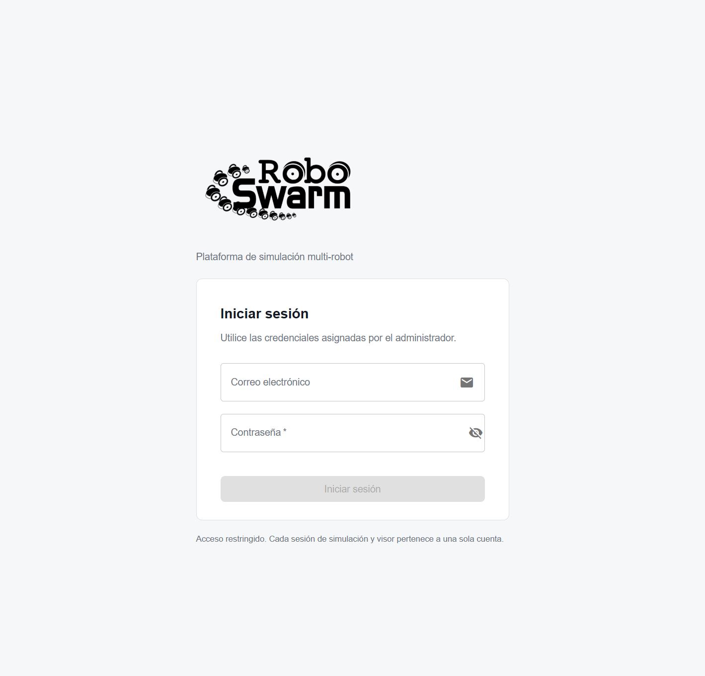
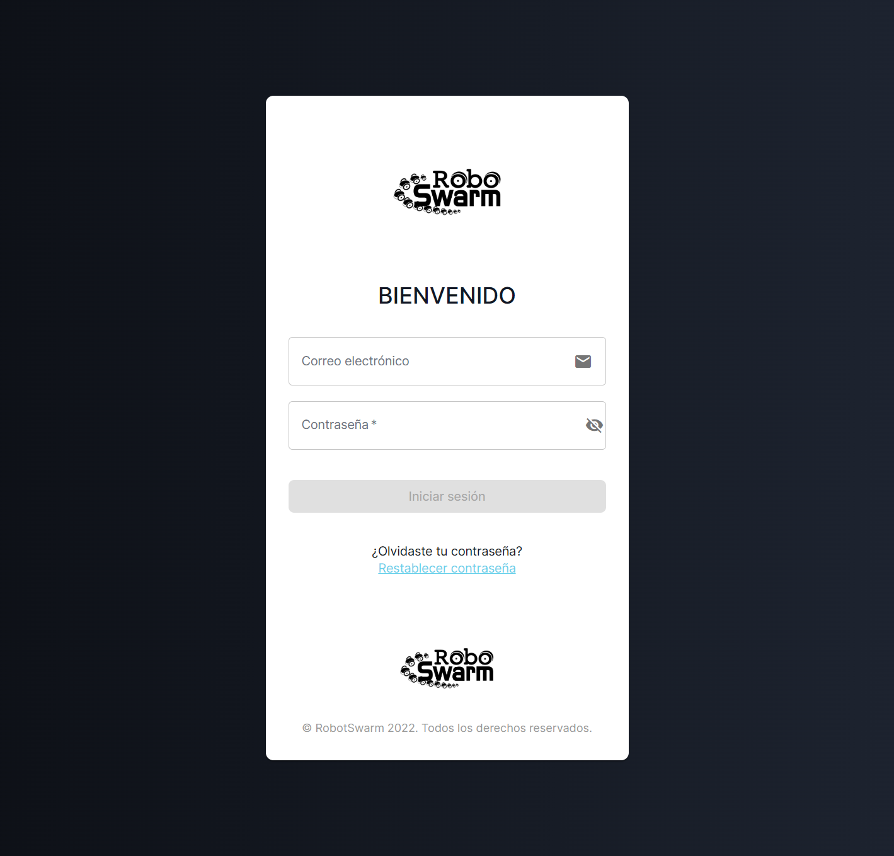

# Evidencia saneada de I-149 e I-150

Este registro reúne dos hallazgos de la comprobación final del 24 de julio de
2026. Se preparan en una sola entrega porque ambos afectan la experiencia web
y no cambian la dinámica de los algoritmos ROS. Los resultados completos
permanecen fuera del repositorio con permisos `0600`; aquí se conservan
únicamente métricas sin correos, tokens, identificadores de sesión ni rutas
personales.

## I-149: vencimiento del visor durante una tarea válida

La repetición productiva de transporte con un robot terminó físicamente de
forma correcta: el comportamiento llegó a `DONE`, desplazó la caja 0,5003 m,
mantuvo RTF 2,9963, no registró colisiones y retiró todos sus recursos. El
robot realizó la búsqueda completa, encontró la carga y contribuyó al empuje.
Gazebo produjo 58,847 FPS y el primer muestreo HLS obtuvo 30,016 FPS.

El ensayo se rechazó después de ROS, cuando intentó comprobar por segunda vez
el video. La tarea había consumido 264,8944 s de pared, además del
aprovisionamiento y del arranque gráfico, por lo que el lease privado de cinco
minutos ya había vencido. El mensaje resultante fue «Timed out waiting for an
interactive HLS viewer with decoded FPS». El reporte saneado tiene SHA-256
`669b3de00e6951df45ee5165889dba92cba66e43f42e2ba7351c30c8273a0b13`.

La causa no fue una caída de Gazebo, MediaMTX, ROS ni la GPU. El frontend
renovaba la autorización de control interactivo, pero el lease de lectura del
video conservaba un TTL independiente y deliberadamente no renovable. La
corrección eleva su valor productivo predeterminado a quince minutos:

```text
Viewer__LeaseMinutes=${VIEWER_LEASE_MINUTES:-15}
```

El límite continúa acotado por el backend al intervalo de 1–30 minutos; un
lease nuevo revoca los anteriores de la misma cuenta y la parada de sesión o
el botón de cierre lo invalidan inmediatamente. Por tanto, el ajuste añade
margen a los casos verificados de larga duración sin convertir la vista en un
enlace permanente ni compartirla entre usuarios.

## I-150: función aparente «sin asignar» y acceso visual

El monitor de la sesión mostraba literalmente `robot.role || "sin asignar"`.
El contrato del worker admite un rol específico, pero ese campo puede ser nulo
antes de que exista una asignación persistida. La frase sugería erróneamente
que el robot no pertenecía a la tarea, aun cuando su estado era `Active` y ROS
lo estaba controlando.

La interfaz conserva ahora el rol explícito cuando llega y traduce los nombres
técnicos conocidos. Cuando todavía no existe, deriva una función prudente a
partir de la tarea activa:

- líder o seguidor en `FollowLeader`;
- miembro de formación en `Figure`;
- búsqueda y transporte en `CollaborativeTransport`; y
- disponible cuando no existe una tarea no terminal.

No se inventa una asignación física concreta: por ejemplo, «empuje directo» o
«empuje de apoyo» solo aparecen si el worker publica esos roles. Las pruebas
unitarias cubren la prioridad del rol real, las tres familias de tarea y el
estado disponible.

El login también recupera la composición visual histórica solicitada:
gradiente azul, tarjeta compacta animada, PNG original, rótulo
«BIENVENIDO» y acceso a recuperación de contraseña. Se conserva el formulario
JWT actual y no se reabre el registro público. La captura posterior y el
resultado productivo de I-149 se incorporarán después de desplegar y observar
el mismo SHA; hasta entonces, esta evidencia describe el diagnóstico y el
candidato, no el cierre.

### Comparación visual previa al despliegue

La captura «antes» se tomó desde una ventana Chrome visible contra
`rs.zerav.la`, con el formulario vacío. Su SHA-256 es
`b94274c5f697aff74f33ee721095aef7e44bddb3bf8390c52c8139961a18ec96`.



La captura del candidato se obtuvo desde el build optimizado local, también en
Chrome visible y después de terminar la animación de entrada. Su SHA-256 es
`ce6b96569516c335b2ffb4c4ce2224776a32e723393b7f0c0474703c0f5fb29f`.
No se presenta como evidencia productiva: sirve para rechazar problemas de
composición antes del único ciclo de CI.



Después del despliegue se añadirá una tercera captura con el SHA servido por
Cloudflare. La comparación final no reutilizará la imagen local como si fuera
producción.
