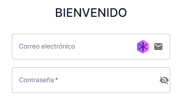
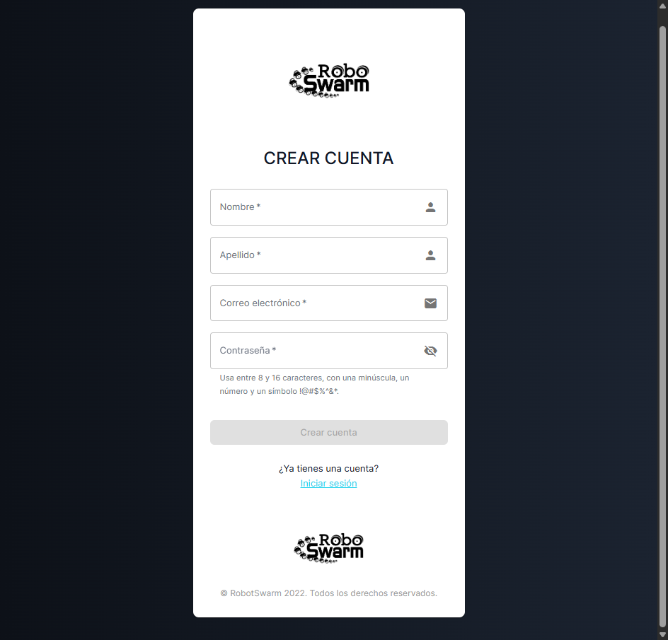
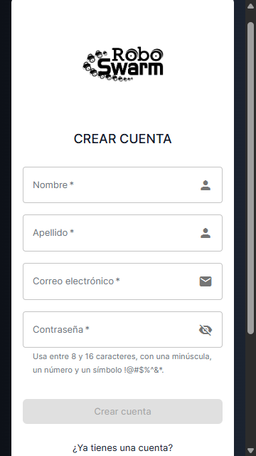
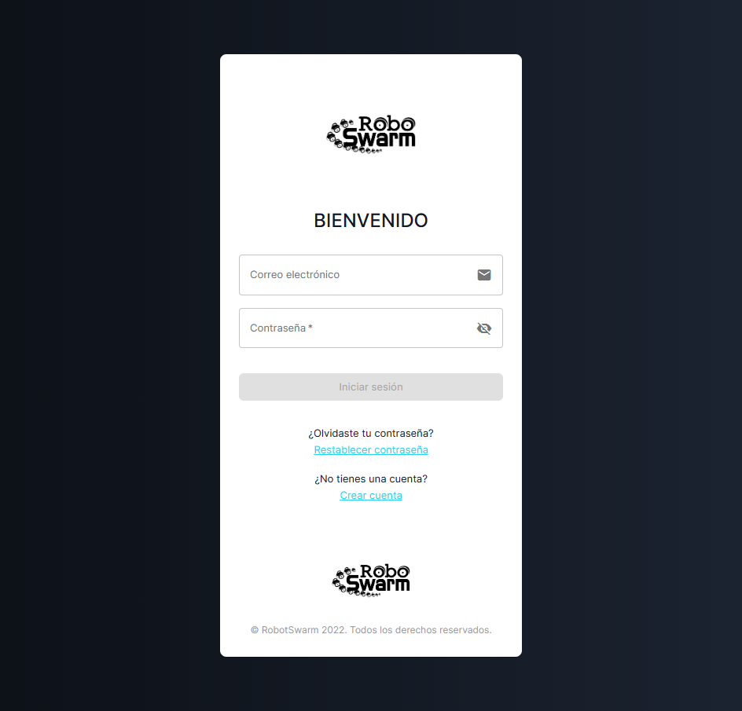
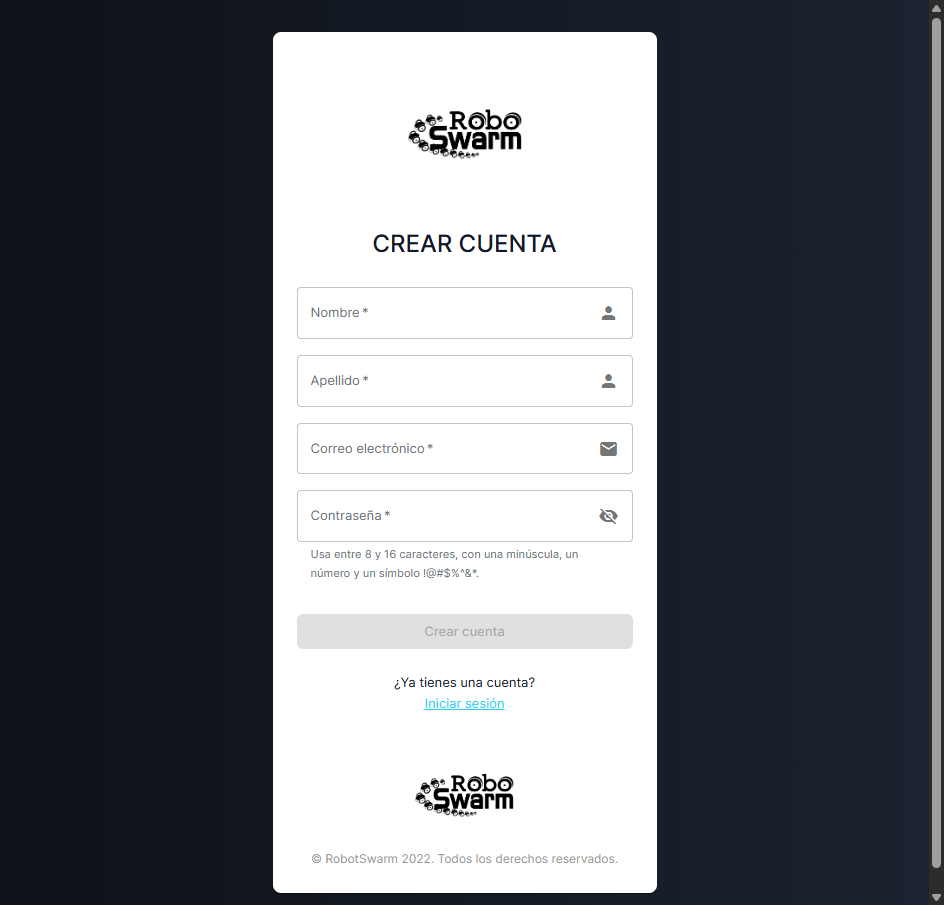

# Evidencia saneada de I-160

Este corte documenta la corrección del acceso de 29 de julio de 2026. La
captura recibida mostraba dos problemas distintos: el botón para revelar la
contraseña sobresalía del borde derecho y el login no ofrecía acceso al
registro. Las imágenes no contienen correos, contraseñas, tokens ni datos de
una cuenta real.

## Diagnóstico

El ojo había recibido `edge="end"` en un cambio posterior al diseño histórico.
Material UI traduce esa propiedad en un margen derecho negativo de 12 px. El
campo conservaba además el padding propio del proyecto; la combinación movía
el botón aproximadamente 7,46 px fuera del contorno y dejaba su centro unos
9 px a la derecha del icono de correo.

El registro no estaba solamente oculto. Se encontraba desactivado en tres
fronteras: no existía enlace en el login, `/register` redirigía de vuelta a
`/login` y el backend usaba
`Accounts:PublicRegistrationEnabled=false`. Restaurar únicamente el enlace
habría producido un formulario visible que siempre respondiera 403.

## Tratamiento

El botón volvió a la composición histórica: se retiró solo `edge="end"` y se
conservaron el padding, el área de 44 px, `type="button"` y las etiquetas
accesibles. El login añadió un enlace secundario de 24 px de altura y la ruta
`/register` vuelve a renderizar una página coherente con la tarjeta original.

El formulario de alta valida nombre, apellido, correo y contraseña antes del
POST. El contrato coincide con el servidor: nombres recortados de hasta 100
caracteres, correo ASCII con dominio punteado y contraseña de 8–16 caracteres
con minúscula, número y uno de los símbolos permitidos. La interfaz impide el
doble envío, anuncia errores, distingue 403 y 429 y devuelve al login con una
confirmación al terminar.

El backend continúa asignando exclusivamente el rol `User`, aplica la cuota
existente de tres altas por IP y hora, y queda cerrado si la bandera falta o
no contiene `true` o `false`. El workflow recibe ahora la variable protegida
`PUBLIC_REGISTRATION_ENABLED`; su valor predeterminado sigue siendo `false`.
La activación productiva debe ocurrir antes del único despliegue y comprobarse
con una cuenta temporal que se desactive al finalizar.

No se incorporó CAPTCHA, verificación por correo ni una cuota distribuida.
Esas medidas requieren claves y decisiones operacionales nuevas, por lo que
se mantienen como endurecimiento posterior y no se simulan en este ajuste.

## Verificación previa al despliegue

- frontend completo: 32 suites y 191 pruebas aprobadas;
- backend completo: 276 pruebas aprobadas y 8 pruebas PostgreSQL opt-in
  omitidas; el subconjunto de validación y abuso aprobó 35/35;
- lint de los archivos modificados, contratos de workflow, Compose y build
  optimizado: aprobados;
- Chrome visible: tres clics físicos confiables, cambio
  `password → text → password`, cuatro campos y navegación a `/register`;
- escritorio: centro del ojo y centro del adorno de correo en `x=616`; borde
  del ojo en `x=638` y borde del campo en `x=640`;
- 360×640: ancho de documento y cliente de 345 px, sin desbordamiento
  horizontal.

El primer intento de repetición usó por error un perfil bajo `/tmp` de WSL.
Chrome para Windows cerró ese perfil UNC y el canal CDP se reinició. Se
descartó esa ejecución, se comprobó que no dejara perfil ni puerto, y se
repitió con un directorio efímero nativo en `%TEMP%`. La corrida siguiente
aprobó y cerró el navegador, el puerto y el perfil que poseía.

## Capturas

La imagen «antes», aportada por el usuario, tiene SHA-256
`bbcd0b64a266c84de7bdfacb15ca96a4aacf8d5740bd18e992e5f4b848e077df`.
Permite observar el desplazamiento del ojo y la ausencia del acceso al
registro.

La captura del login corregido procede del build optimizado local, después de
terminar la animación de entrada. Su SHA-256 es
`c7dae6077796c7dc935b6b83744717b3afc99cc6d5ab54d29a8dd53bc513e5bd`.

La página de registro de escritorio tiene SHA-256
`1b68ebb20a21f206a99ed59df40cdf6d0be7255bf081657a72f2459b0634cc39`.

La misma página a 360×640 tiene SHA-256
`7a392a1efd4d06f906723e91baca7f15d3e997c6072e0e99deee0ec18b281403`.

Estas tres capturas son evidencia previa al despliegue. No se presentan como
si procedieran de `rs.zerav.la`.

## Cierre productivo

La única ejecución de CI de `main`, #30466968296, aprobó frontend, backend y
ROS. Cloudflare Pages publicó el mismo commit y el workflow automático
#30467358747 desplegó
`swarmbackend:f60efc1f6a15a4a3f3cb244c7a396da852c15783`. No se despachó el
workflow GPU. El contenedor quedó `running/healthy`, `/health` respondió
`Healthy` y la inspección limitada confirmó
`Accounts__PublicRegistrationEnabled=true`.

Después se repitió el recorrido en Chrome visible contra `rs.zerav.la`. El ojo
y el icono de correo coincidieron en `x=616`, el enlace conservó 24 px de alto,
`/register` mostró cuatro campos y no hubo desbordamiento horizontal. Se creó
una sola cuenta temporal mediante un clic físico confiable, el backend forzó
el rol `User` y el login terminó con una sesión JWT válida. La propia sesión
desactivó la cuenta con HTTP 200; el mismo token recibió 401 inmediatamente
después. Una lectura PostgreSQL `READ ONLY` confirmó `Enabled=false` y cero
refresh tokens activos. El perfil Chrome y el puerto CDP se retiraron.

El [resumen estructurado](postdeploy-summary.json) conserva únicamente estados
y métricas; no incluye correo, contraseña, token, nombre personal ni
identificador de la cuenta temporal.

La captura productiva del login tiene SHA-256
`0b8281326c214fcb0b977506ee0b7c9cab2421c2d4cba1bd2b48c38434fb9a11`.

La captura productiva del formulario de registro tiene SHA-256
`2edac2551c684cdb710a60a03bad7a97bdf86218e1706d3e272c20e56fa9fc34`.

