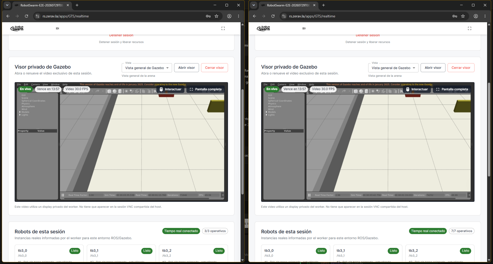
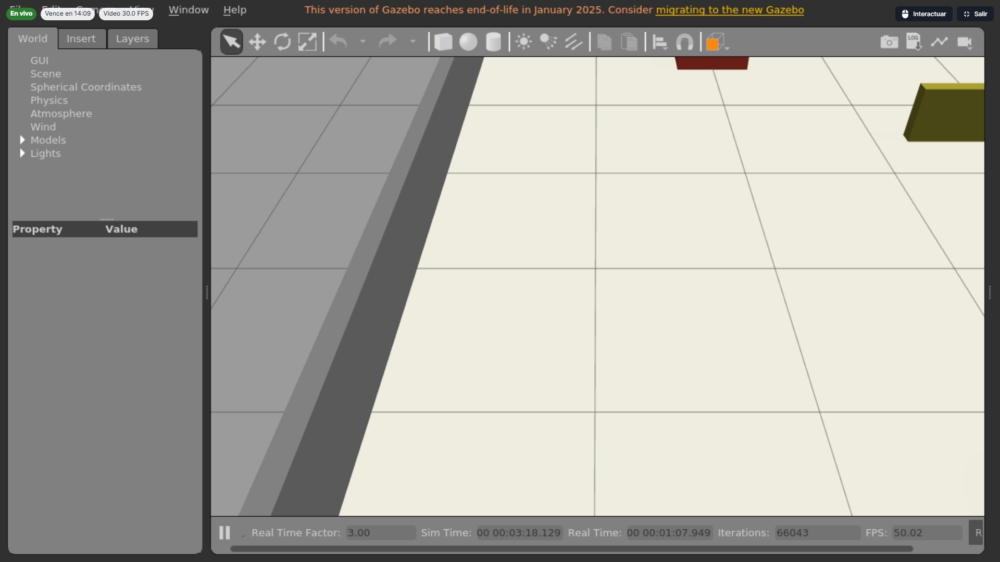
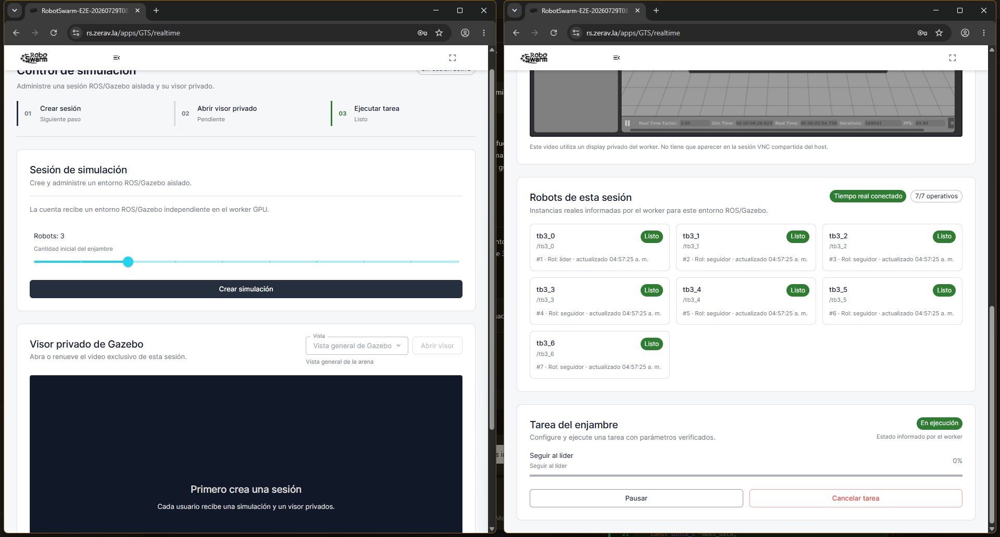
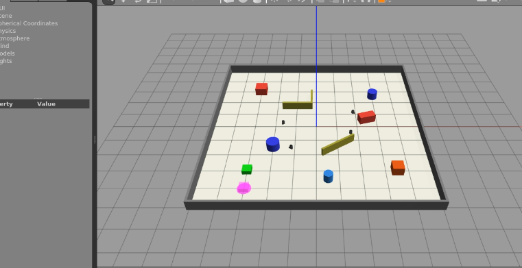
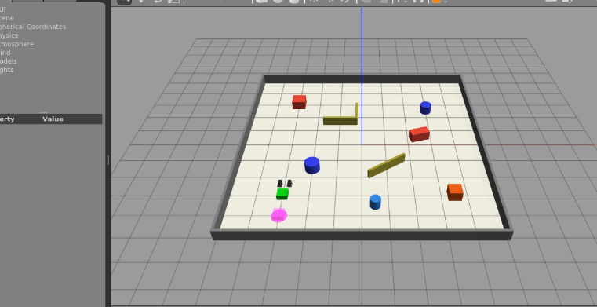

# Evidencia productiva del corte `8c643a3`

Esta selección documenta la aceptación realizada el 29 de julio de 2026 sobre
`8c643a345012126faf7ef0e1c209eaad2855d40e`. Los reportes estructurados
originales permanecen con permisos `0600` bajo:

```text
/tmp/robotswarm-acceptance/postdeploy-8c643a3-20260729T0845Z
```

Las capturas aquí versionadas se inspeccionaron visualmente antes de copiarlas.
No contienen correos, contraseñas, JWT, UUID de sesión, nombres del worker ni
direcciones privadas. Los títulos de Chrome fueron generados por el arnés y no
identifican a usuarios reales.

## Dos usuarios y visor privado

| Evidencia | Resultado observado | SHA-256 |
| --- | --- | --- |
| `dos-usuarios-visores-privados.png` | Dos Chrome normales, rosters 3/3 y 7/7 y displays diferentes; Gazebo 49,99 FPS y RTF 3,00/2,98 | `0e8040cf4042c068181e294f92da26140e2818abe2778254fb266c8135e6d63e` |
| `visor-pantalla-completa.png` | Visor 1920×1080, control interactivo disponible, RTF 3,00 y Gazebo 50,02 FPS | `4b5f1f0a25687d9f8e82e973d88406a45a0943de4ee6926e0ac34f2d62fce063` |
| `dos-tareas-concurrentes.png` | Formación A terminada y seguimiento en figura de ocho todavía ejecutándose | `346a6f944c769ed3d0f8ae6007ff7aae574e562a98ff64a71f3ec12b1ac67b74` |
| `aislamiento-a-detenido-b-activo.png` | La sesión A ya está liberada mientras B conserva siete robots, HLS y la tarea activa | `14e79922308c766d427149ce695c1d7ffbb1c441708759b1709666fe067eec92` |







El reporte visual completo tiene SHA-256
`ab4e715ccb32e29bc68ffde653ff58264d4524d039628eaba656ff572d085f79`.
Midió 30,006 FPS en A y 30,082 FPS en B después de detener A, sin frames
descartados. También comprobó clic, arrastre, rueda, teclado, cierre y
reapertura del visor, pantalla completa, privacidad y limpieza.

## Transporte iniciado desde la interfaz

| Evidencia | Resultado observado | SHA-256 |
| --- | --- | --- |
| `transporte-n4-busqueda.png` | Los cuatro robots se desplazan durante `SEARCH` antes del aviso | `1671b2e3999fbbf1732ebfeeb75e7768baae3aa8978994980b57a0e4ae61e77a` |
| `transporte-n4-empuje.png` | La flota reunida empuja la misma carga, incluidos compañeros cuando no existe superficie directa | `db71461acaf85cbeff2a3a7811be41a7e6a686066cbac03fc10b20194911b5fb` |





El reporte tiene SHA-256
`b957a6e10c0e8f4ce2f1767f2506f04090ea0f11e21e8f2be2422e779f34adf9`.
La secuencia estricta fue `SEARCH → APPROACH → PUSH → DONE`: cuatro buscadores,
un descubridor, aviso a tres compañeros, cuatro contribuidores útiles, cero
colisiones inesperadas, HLS 30,076 FPS y limpieza completa.

## Matriz y resultado rechazado

El primer reporte de matriz tiene SHA-256
`bb1f063a80ea5a7e0a6d42affdd5516d153b33a0aad5ebc1a64876779522bf55`.
Aprobó seis formaciones, tres seguimientos y transporte N=1/N=3. N=2 se
conservó como fallo I-159 por el watchdog de −0,001 s, aunque búsqueda, aviso,
reunión, RTF y seguridad habían aprobado. Una interrupción externa alcanzó N=4
durante el arranque y el `finally` retiró todos sus recursos.

La continuación N=4/N=10 tiene SHA-256
`a68ea6cf2c8585a97a330ffc8a820edf0a542975149a7523a30e9db436b119d5`.
Ambos casos aprobaron con todos los robots buscando y contribuyendo, cero
colisiones, RTF 2,996/2,973, Gazebo 46,727/45,988 FPS y HLS
30,025/30,069 FPS. Estos resultados no sustituyen la repetición N=2 posterior
a la corrección.

Los reportes posteriores al arreglo I-159 se conservarán fuera del repositorio
en la misma primera pasada. Así se evita gastar otro ciclo completo de CI y
despliegue solamente para añadir documentación.
