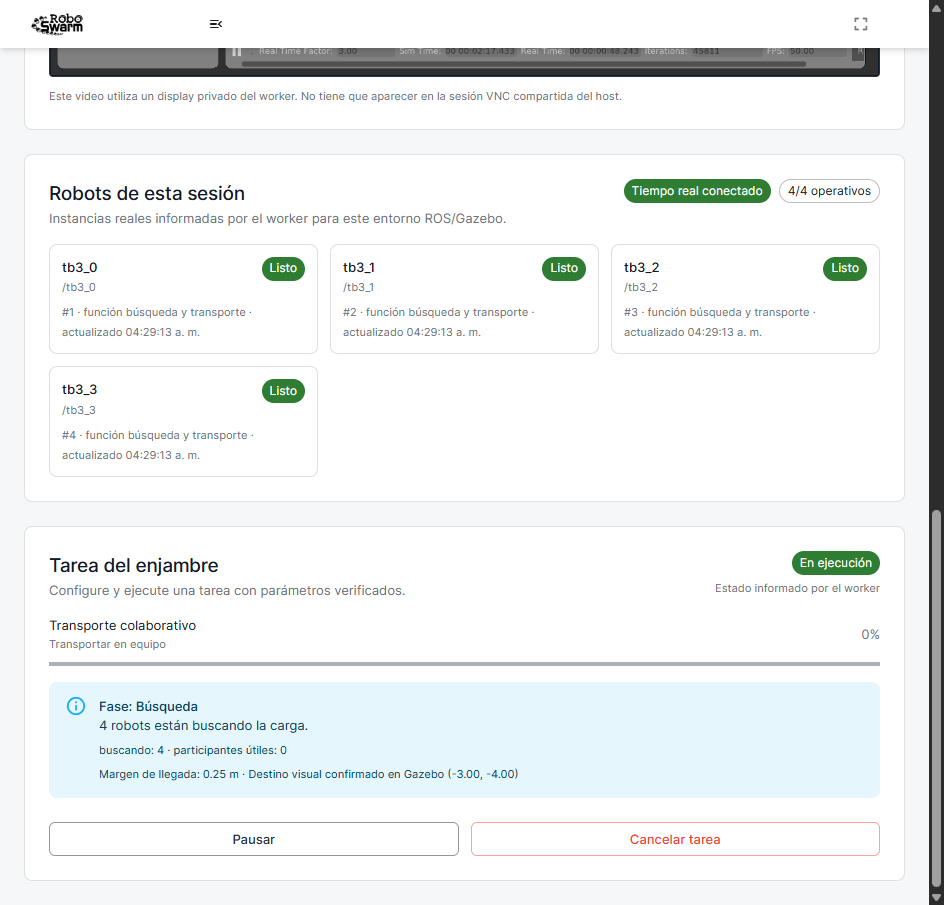
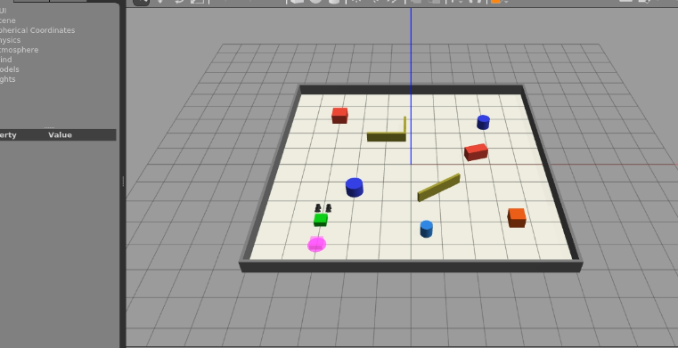
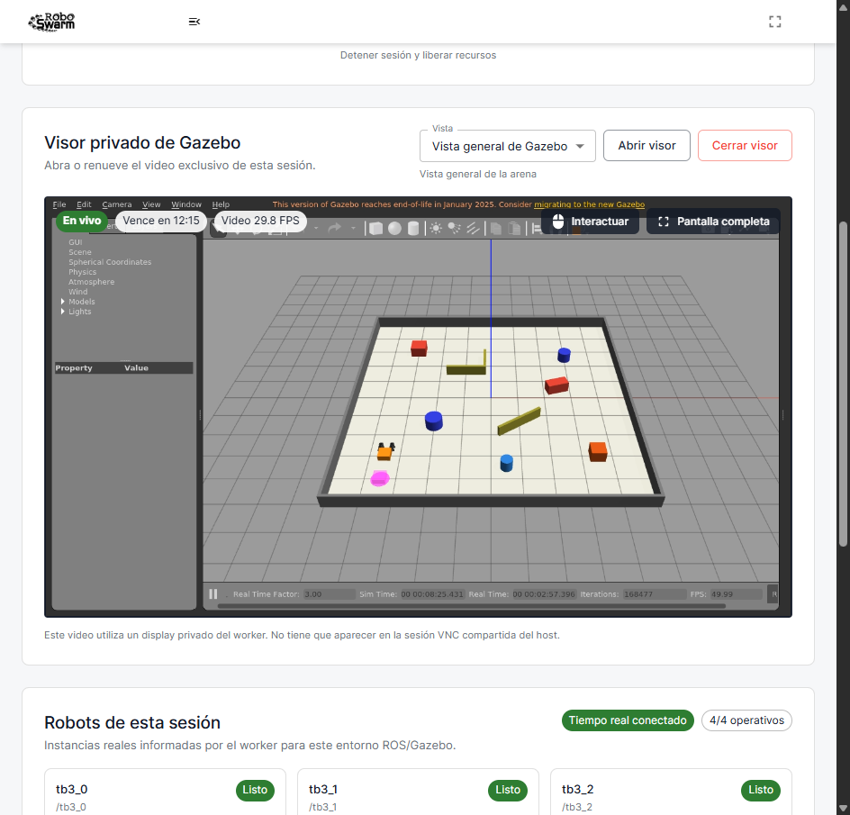
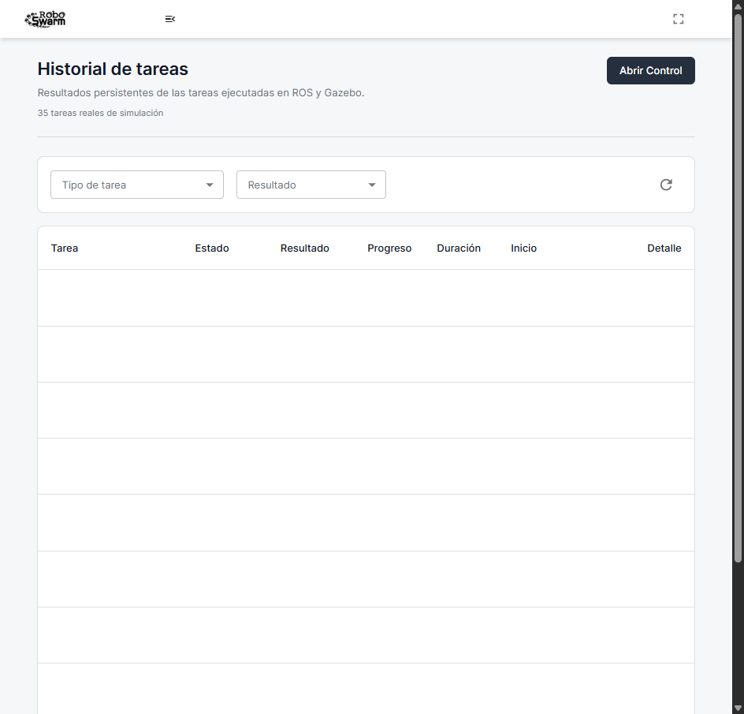
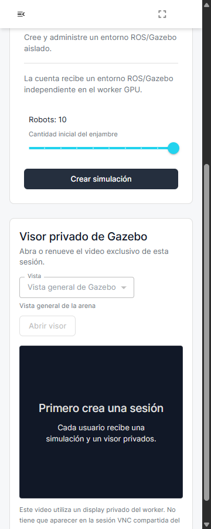
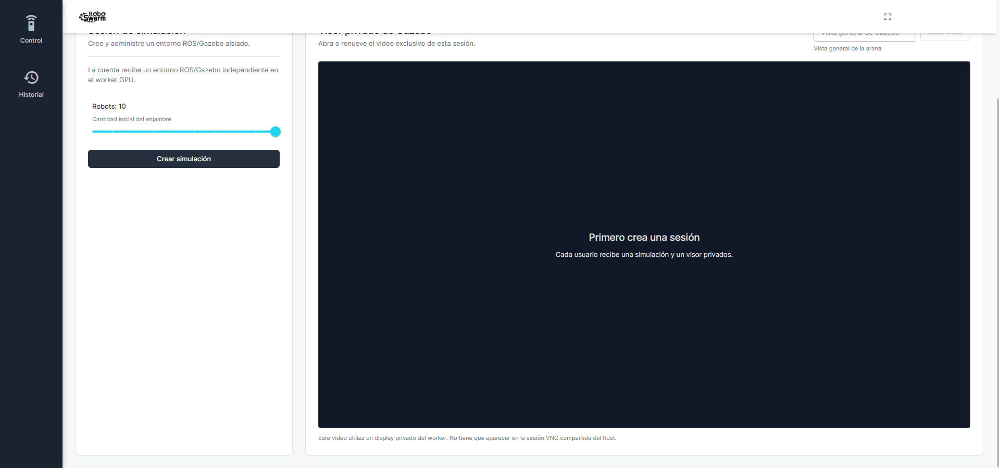

# Cierre productivo de `c3866d5`

Este directorio conserva la evidencia saneada del cierre realizado el 24 de
julio de 2026. El SHA completo observado en frontend, backend y worker GPU fue
`c3866d553015463e561b636f27860a2b8472b7fe`. Los reportes no contienen correo,
contraseña, token, UUID, IP privada ni nombre del worker.

## Contrato UTC y despliegue

La PR #116 integró I-151 después de que una tarea válida llegara desde
PostgreSQL con `createdAt` sin zona. Los cuatro checks del PR y los cinco gates
de `main` aprobaron en el primer intento. El backend productivo quedó sano,
sin reinicios y con la imagen `swarmbackend:c3866d5…`; una lectura autenticada
comprobó 184/184 fechas operativas terminadas en `Z`.

El workflow GPU se despachó una sola vez. El run `30078293319` publicó la
imagen inmutable de revisión `c3866d5`, SHA-256
`a2859ad62dcc8a6f87b2f0242fb321bb26c96027934658e17b78224d19c1aa9f`.
El servicio terminó activo, con cero reinicios, sobre una RTX 3080 y driver
595.97.

## Transporte iniciado desde React

El ensayo N=4 usó un Chrome visible, un clic primario confiable y exactamente
un `TaskRun` y un comando `StartTask`. La secuencia persistida fue
`Queued → Accepted → Running → Completed`; el autómata ROS observado de forma
privada fue `SEARCH → APPROACH → PUSH → DONE`.

Durante SEARCH se observó movimiento físico superior a 0,015 m en los cuatro
robots. El descubridor emitió `payload_found`, notificó a los otros tres y el
roster permaneció 4/4. Durante PUSH se observaron veinte muestras consecutivas
con los cuatro robots como empujadores útiles, 5,379 s de ventana y ganancia de
progreso 0,352. HLS presentó 153 fotogramas a 30,094 FPS, sin descartes. La
tarea terminó `Succeeded`, sin error ni contacto inesperado, y todos los
recursos fueron retirados.

El reporte versionado es
[`transporte-ui-n4-reporte.json`](transporte-ui-n4-reporte.json), SHA-256
`11dcc494080482141796f9ce89991ce423e76053b17e36d5788a9a1aa6dac9e8`.

## I-152: crecimiento del observador privado

El primer transporte de esta serie completó físicamente y pasó todos los gates
de API/UI, pero su observador privado rechazó el cierre con «The private ROS
observer exceeded its evidence bound». Su reporte temporal tiene SHA-256
`da23269abe2ec36f56c38c8166b9dcc063cf8252001c3cb820b06aeea44550f5`.

La causa fue instrumental: `/transport/status` publicaba con una frecuencia
mucho mayor que la necesaria y el arnés conservaba cada documento hasta llegar
al límite de 8 MiB. Se aplicó muestreo a 4 Hz, sin demorar cambios de fase ni
estados `DONE/FAILED`, y se retiraron campos duplicados que no participaban en
la prueba. Con el timeout ordinario de 600 s, el límite teórico queda por
debajo de 6.000 documentos y 8 MiB.

Una primera comprobación del cambio falló antes del clic porque el wrapper no
reenviaba el quinto argumento del intervalo. No se creó tarea ni se movieron
robots; la limpieza fue completa. Su reporte temporal tiene SHA-256
`e0c762ae4aa7e901d02a62ff1262f907065e0ec0a93a42c3b54f730f6e0e7ca0`.
El cableado quedó cubierto por regresión y la corrida final aprobó. Se
conservan los hashes de ambos intentos rechazados para no presentarlos como
resultados válidos.

## Carga física de 0,75 kg

El gate cargado mantuvo masa 0,75 kg y fricción 0,25. La sonda de capacidad
midió 0,0072 m con un robot, 0,0332 m con dos raíces y 1,0604 m con la flota
completa. GRF alcanzó 0,4999 m de progreso hacia la meta, eficiencia 0,9902,
RTF 2,9960, cuatro buscadores simultáneos, aviso al roster completo y cuatro
empujadores útiles.

Durante carga, Gazebo obtuvo 58,419 FPS de cámara y 62,508 eventos de
posrenderizado por segundo con `D3D12 (NVIDIA GeForce RTX 3080)`. HLS midió
30,019 FPS durante el preflight y 29,8–30,2 FPS durante PUSH. El lease siguió
vivo al terminar, con 9:47 restantes. La limpieza eliminó sesión, caja de
prueba, robots, visor, publicador, red, contenedor, perfil y procesos hijos.

El reporte versionado es
[`carga-n4-reporte.json`](carga-n4-reporte.json), SHA-256
`c3d83ebec846b63a7fa6c2774f7047c93b1f31aada4f7db0e302321918e38a8b`.

## Superficie web

La cuenta `User` vio Control e Historial. Historial cargó diez filas y abrió su
diálogo; Plantillas, Robots, Grupos y Usuarios no aparecieron y sus endpoints
administrativos devolvieron 403. No se creó una cuenta, no se cambió un rol y
no se simuló acceso administrativo. La ausencia de credencial Admin se
mantiene como limitación explícita, no como un fallo de la cuenta User.

La página Control aprobó 360, 768, 1366 y 1920 píxeles, sin overflow
horizontal y con el panel dentro del viewport. Los reportes
[`secciones-user-reporte.json`](secciones-user-reporte.json) y
[`responsive-reporte.json`](responsive-reporte.json) tienen SHA-256
`ac80550ae8985269e42ea59fb294bcc3f97378f224a7bd61272ecd4f457e67c8` y
`60437f0931333c2e78bf0fb9dfddb79286157e3b9b44cf5a12362b5aed35610c`.

