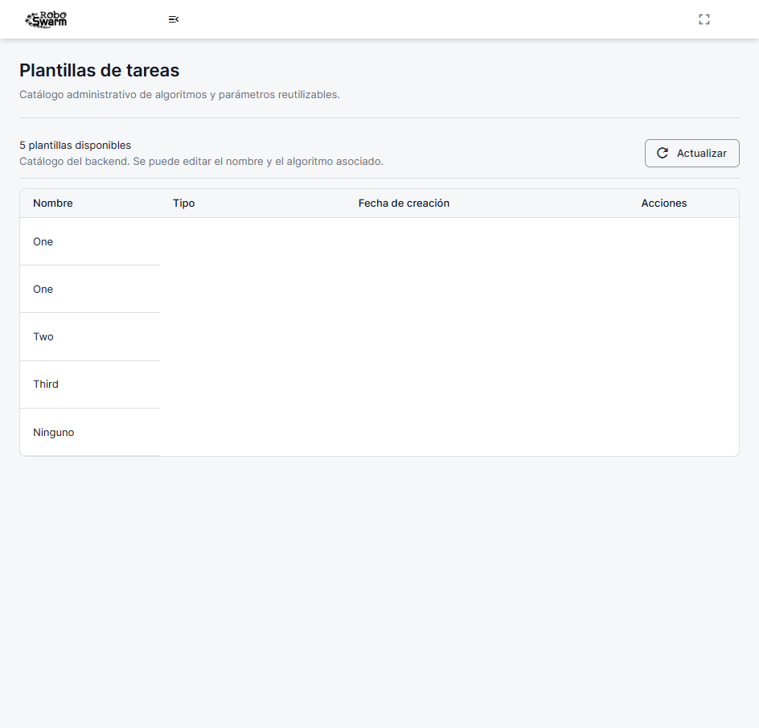
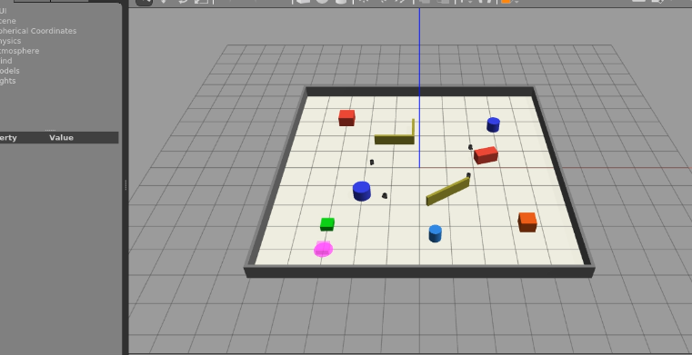
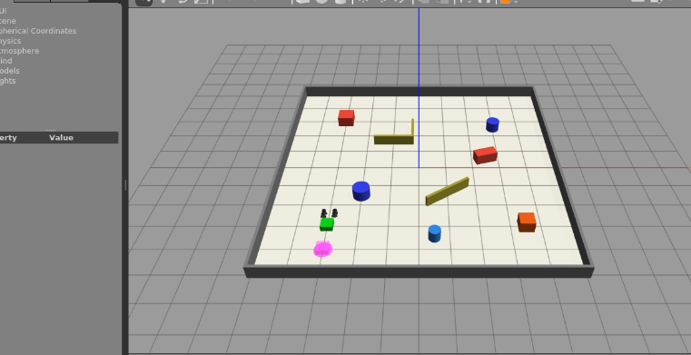
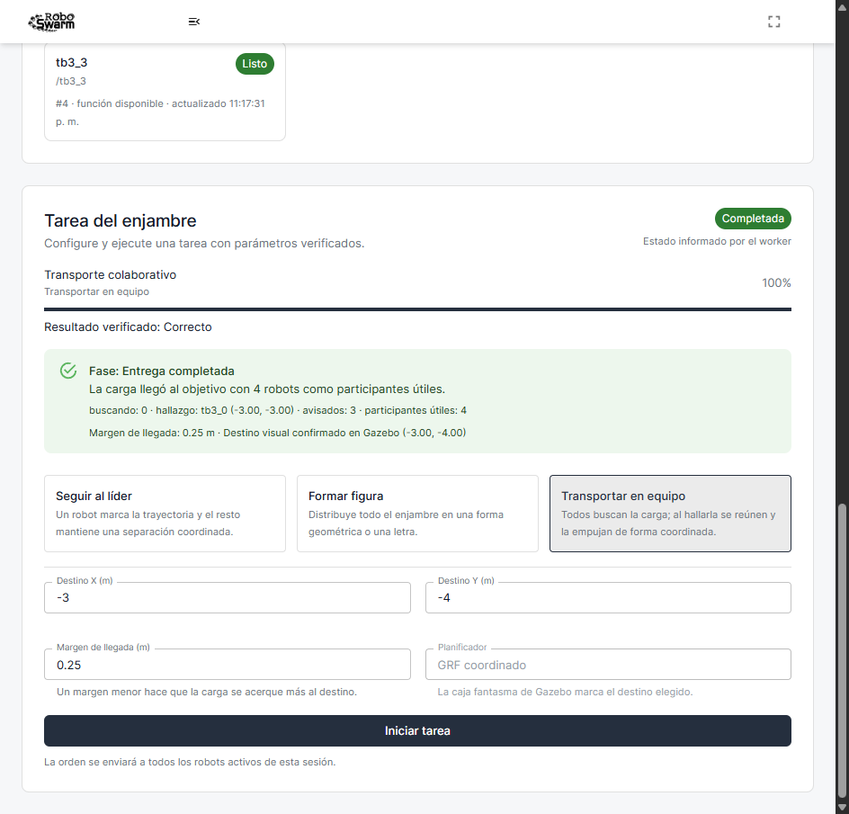

# Incidente de arranque del backend después de un reinicio

## 1. Resumen

Durante la verificación integral del 28 de julio de 2026 se comprobó que el
frontend público continuaba disponible, pero el backend, Swagger y el visor no
respondían. La base de datos permanecía sana. La causa no fue un despliegue
defectuoso: Docker intentó publicar los puertos del backend y de MediaMTX sobre
`10.0.0.126` antes de que DHCP asignara esa dirección a la interfaz cableada.

La recuperación inmediata no requirió GitHub Actions ni reconstrucción de
imágenes. Se iniciaron los contenedores existentes cuando la IPv4 ya estaba
presente. Como prevención se hicieron dos cambios complementarios:

1. el perfil de NetworkManager dejó de considerar opcional la configuración
   IPv4; y
2. se instaló una unidad `systemd` que espera explícitamente las direcciones
   publicadas por los contenedores y recupera únicamente el stack existente.

## 2. Síntomas observados

La verificación externa produjo resultados distintos según la capa:

| Componente | Resultado inicial |
| --- | --- |
| `https://rs.zerav.la/` | HTTP 200; HTML, JavaScript, CSS, logo y manifest disponibles |
| `https://robot.zerav.la/health` | TLS establecido, pero sin respuesta HTTP antes del timeout |
| Nginx Proxy Manager | Disponible; esperaba un upstream que no respondía |
| `db_prod` | `running` y `healthy` |
| `media_prod` | `Exited (255)` |
| `backend_prod` | `Exited (255)` |
| Worker GPU | En línea, sin sesiones; modo seguro por pérdida del backend |

La separación de resultados fue importante. El HTTP 200 del frontend sólo
demostraba que Cloudflare servía el sitio estático; no demostraba que la
aplicación completa estuviera operativa.

## 3. Método de diagnóstico

Se siguió una secuencia de menor a mayor proximidad al proceso:

1. solicitud pública a los dos dominios;
2. validación de DNS, TCP y TLS;
3. comprobación del proxy en la LAN;
4. inspección de estados y errores de Docker;
5. revisión del journal del arranque;
6. comparación entre el instante de `network-online`, el inicio de Docker y
   la asignación DHCP; y
7. revisión de la política de reinicio y de los bindings de puertos.

Los errores conservados por Docker fueron equivalentes a:

```text
failed to bind host port for 10.0.0.126:44336: cannot assign requested address
failed to bind host port for 10.0.0.126:8554: cannot assign requested address
```

La cronología del arranque confirmó la carrera:

| Evento | Hora local aproximada |
| --- | --- |
| `network-online.target` alcanzado sólo con IPv6 | 21:41:45 |
| Inicio de Docker | 21:41:46 |
| Asignación DHCP de `10.0.0.126` | 21:42:04 |

En arranques anteriores DHCP había tardado entre 36,9 y 74,7 segundos. Por
ello, cambiar únicamente `ipv4.may-fail` no era suficiente: el
`NetworkManager-wait-online` del host conserva un timeout de 30 segundos.

## 4. Recuperación inmediata

Antes de iniciar procesos se verificaron:

- estado sano de PostgreSQL;
- presencia de `10.0.0.126/24` en `ens18`;
- disponibilidad de TCP 8554, TCP 8889, TCP 44336 y UDP 8189; y
- identidad de los contenedores existentes.

Se inició MediaMTX antes del backend. Después de la recuperación:

```text
db_prod      running  healthy  restarts=0
media_prod   running  healthy  restarts=0
backend_prod running  healthy  restarts=0
```

La ruta LAN y la ruta pública devolvieron `Healthy`, el endpoint RTSP quedó
escuchando en la dirección prevista y no aparecieron nuevos errores de bind,
`fatal` o `panic`.

## 5. Prevención permanente

### 5.1 NetworkManager

El perfil activo de `ens18`, denominado `Wired connection 1`, cambió de
`ipv4.may-fail=yes` a `ipv4.may-fail=no`. La conexión no se bajó ni se
reactivó durante la sesión SSH.

### 5.2 Recuperación administrada por systemd

Se añadieron al repositorio:

- `deploy/backend/recover-production-startup.sh`;
- `deploy/backend/robotswarm-production-startup-recovery.service`;
- `deploy/backend/test-recover-production-startup.py`; y
- `deploy/backend/README.md`.

El script no usa `docker compose up`, no recrea recursos y no lee archivos de
entorno ni secretos. Sólo admite tres parámetros operativos de tiempo de
espera y sondeo mediante variables `ROBOTSWARM_*`. Sus decisiones están
limitadas por las siguientes comprobaciones:

1. los tres nombres de contenedor deben existir;
2. los labels de proyecto y servicio deben coincidir;
3. la IPv4 se deriva de los bindings ya guardados por Docker;
4. la dirección debe ser una IPv4 unicast, no loopback;
5. sólo se inician estados `created` o `exited`; y
6. si existe un healthcheck, el contenedor debe llegar a `healthy`.

El orden es `db_prod → media_prod → backend_prod`. Un fallo transitorio
devuelve 75 y permite reintento; una configuración inesperada devuelve 78 y
evita un ciclo ciego. La unidad quedó habilitada y su verificación produjo:

```text
Result=success
ExecMainStatus=0
ActiveState=active
SubState=exited
```

Los hashes SHA-256 de los archivos instalados coincidieron con los archivos
versionados.

### 5.3 Reintentos de Docker que no deben confundirse con configuración inválida

La primera versión del recuperador consultaba la identidad del contenedor con
`docker inspect`. Si esa llamada fallaba y `docker info` todavía respondía, el
script asumía que el contenedor no existía y devolvía 78. Esa clasificación era
demasiado fuerte: un fallo transitorio de `inspect` con el daemon vivo habría
detenido los reintentos de `systemd`.

La decisión final utiliza una segunda consulta acotada:

```text
inspect correcto                         → validar labels y continuar
inspect falla + daemon no disponible     → 75, reintentar
inspect falla + listado confirma ausencia → 78, detener por configuración
inspect falla + listado falla o lo encuentra → 75, reintentar
```

Se añadieron regresiones para las cuatro ramas. La versión instalada y
ejecutada en la VM tiene SHA-256
`f91f98580c515adbe39bd0da15becf288a80e7855adbbc593781d84b4998d215`;
la unidad tiene
`47429a2d3e1d36d9926f00be06b7a6290cdb4984e4557be3cc894e4535550db1`.
Después de sustituir el script se volvió a ejecutar la unidad sin reiniciar el
host. Terminó con `ExecMainStatus=0` y los tres contenedores continuaron sanos.

### 5.4 Reconexión del worker y presupuesto de parada segura

La repetición de transporte N=1 reveló un segundo problema, independiente del
arranque de la VM. El worker perdió temporalmente el canal SignalR y el backend
rechazó una reconexión porque todavía conservaba el `connectionId` anterior. El
mensaje observado fue equivalente a:

```text
This compute worker already has an active connection.
```

La asociación anterior distinguía al worker, pero no la encarnación concreta
del proceso. Además, una desconexión tardía podía competir con la conexión
nueva. La solución candidata añade un identificador aleatorio estable durante
la vida del proceso. Una reconexión del mismo proceso sustituye y aborta
atómicamente su canal obsoleto; otro proceso y los clientes heredados no pueden
desplazar al propietario actual. La desconexión tardía sólo libera el
`connectionId` exacto que todavía posea el registro.

La rotación o revocación de la credencial elimina y aborta la conexión vigente.
Como la autenticación y `OnConnectedAsync` no forman una transacción única, el
hub vuelve a comprobar en la base de datos la versión y vigencia de la
credencial después de reclamar el registro y antes de incorporarse al grupo.
También vuelve a verificar la propiedad exacta para cerrar una invalidación
concurrente. Esta secuencia sigue el ciclo de vida previsto por SignalR: el alta
y la baja pertenecen a `OnConnectedAsync` y `OnDisconnectedAsync`, y la
pertenencia a grupos se asocia a la conexión, como describe la
[documentación oficial de hubs de ASP.NET Core SignalR](https://learn.microsoft.com/en-us/aspnet/core/signalr/hubs).

El contrato de seguridad usa un vencimiento monotónico absoluto y conserva un
margen de admisión:

```text
14 s de lease desde la última llamada confirmada al backend
- 0,25 s de margen antes de admitir la publicación
+ 10 s del watchdog de ROS
+ 0,5 s de su periodo de comprobación
= 24,25 s <= 30 s máximos declarados antes de la parada
```

El establecimiento del transporte no cuenta como contacto exitoso, porque
puede completarse antes de que el servidor acepte el hub. Un proceso recién
creado inicia su último contacto en `UnixEpoch`, no en la hora actual. Así, si
reconcilia una sesión durante una caída del backend, no publica pulsos de
control ni obtiene una nueva gracia ficticia: activa inmediatamente la ruta
fail-closed. El ciclo de dos segundos no amplía el peor caso porque el lease se
vuelve a comprobar después del discovery Docker y justo antes de iniciar cada
publicación. Esta comprobación usa `/proc/uptime`, compartido entre host y
contenedor, y no la resta entre dos relojes UTC. El deadline original viaja
como `std_msgs/Float64`: el shell lo valida antes de ejecutar `rostopic` y ROS
rechaza valores no finitos, vencidos o adelantados más de 15 s. Por ello, un
`docker exec` que empiece tarde no crea un lease nuevo. La ruta de heartbeat
emplea una sola lista de contenedores activos, acotada a 1 s, y conserva su
último resultado válido si Docker se retrasa; no ejecuta los `inspect`
secuenciales de reconciliación. El proceso interior completo termina
forzosamente a los 5 s, por lo que cerrar el cliente `docker exec` no es la
única barrera. Además, la desigualdad saludable
`2 + 1 + 5 = 8 < 10 s` incluye intervalo, discovery y publicación antes del
límite exacto (`>=`) del watchdog. Si nunca llega el primer pulso, una gracia
de 15 s enclava el mismo paro; `StartTask` exige un pulso fresco al registrar y
al publicar la tarea.

## 6. Verificación funcional posterior

La recuperación se sometió a cuatro niveles de comprobación:

1. salud HTTP pública y LAN;
2. aceptación visual de las secciones administrativas;
3. transporte colaborativo visible con cuatro robots; y
4. matriz ROS/Gazebo con distintos algoritmos y cantidades de robots.

La aceptación administrativa validó Control, Historial, Plantillas, Robots,
Grupos y Usuarios. También abrió y canceló sus formularios y eliminó el grupo
temporal creado por la prueba.

El transporte colaborativo confirmó:

- cuatro robots moviéndose durante la búsqueda;
- un único evento `payload_found`;
- aviso a los otros tres integrantes;
- cuatro contribuidores útiles durante el empuje;
- resultado terminal `DONE`;
- ausencia de colisiones inesperadas;
- visor HLS a 30,14 FPS, sin frames descartados; y
- eliminación de sesión, red, contenedor, publicador y perfil de Chrome.

La Figura 1 corresponde a Plantillas después de recuperar el backend. La
evidencia oculta correos, UUID, direcciones privadas y celdas personales.



**Figura 1.** Catálogo de Plantillas cargado desde el backend productivo.

La Figura 2 conserva la escena de búsqueda. Los cuatro robots estaban en
movimiento antes de que uno publicara el hallazgo.



**Figura 2.** Fase de búsqueda visible en Gazebo sobre la RTX 3080.

La Figura 3 corresponde a la fase de empuje. La captura no se usa por sí sola
para afirmar contribución: el reporte correlacionado confirmó el roster exacto,
19 muestras sostenidas y 5,538 segundos de empuje útil.



**Figura 3.** Robots reunidos alrededor de la carga durante `PUSH`.

La Figura 4 muestra el resultado comunicado al usuario. La interfaz conserva
la cantidad de participantes, el robot que encontró la carga, los avisos y el
destino visual.



**Figura 4.** Resultado `Completada` después de `SEARCH → APPROACH → PUSH → DONE`.

### 6.1 Pruebas locales y contratos

Antes de consumir minutos de GitHub Actions se ejecutaron las suites desde el
árbol de trabajo y con dependencias ya almacenadas. PostgreSQL 17 se levantó en
una red Docker desechable; el SDK .NET 8 se ejecutó sin red.

| Alcance | Resultado |
| --- | ---: |
| Backend sin fixture PostgreSQL | 275 aprobadas; 8 omitidas de forma declarada |
| Carreras sobre PostgreSQL 17 real | 8/8 |
| Worker GPU | 146/146 |
| ROS, planificación, watchdog y física | 667/667; incluye el foco 258/258 |
| Contratos de aceptación web/ROS | 268/268 |
| Recuperación de arranque | 17/17 |

Las pruebas nuevas incluyen reconexiones concurrentes, desconexión tardía,
rotación y revocación de credencial, invalidación antes de pertenecer al grupo,
un worker reiniciado con una sesión reconciliada y ausencia total de backend.
En este último caso no apareció `/swarm/control_heartbeat` y la sesión tomó la
ruta de parada segura.

### 6.2 Ciclo de vida del visor y administración recuperable

La revisión conjunta del frontend y del backend encontró dos problemas de
operación que no explicaban el reinicio, pero sí afectaban la recuperación
posterior de un usuario.

Primero, una respuesta tardía de «Abrir visor» podía pertenecer a una sesión,
fuente o cantidad de robots que ya habían cambiado. El cierre también dependía
demasiado de que SignalR respondiera antes de detener la conexión. El espacio de
simulación captura ahora el contexto y la conexión que originaron cada lease,
invalida solicitudes antiguas y deduplica el cierre explícito, el desmontaje y
los cambios de sesión. Antes de cerrar por REST intenta enviar
`releaseAll`; el intento no puede impedir la revocación si SignalR está
bloqueado. Un lease antiguo tampoco puede retirar el visor que lo sustituyó.

Segundo, desactivar una cuenta o un robot era prácticamente irreversible desde
la página. Se añadieron acciones explícitas de reactivación para el
administrador. Reactivar una cuenta no revive JWT, refresh tokens, sesiones,
tareas ni visores anteriores; el usuario debe autenticarse de nuevo. El
inventario de robots puede incluir los inactivos sólo cuando lo consulta un
administrador y reutiliza la actualización autorizada para devolverlos al
estado `Idle`.

La interfaz también separa los errores de una acción de los errores del sondeo,
añade filtro por estado al historial y sustituye la etiqueta ambigua
«disponible» por «Rol: sin tarea asignada». Durante una tarea se mantienen los
roles derivados o publicados —líder, seguidor, formación o transporte—.

Las pruebas integradas del frontend aprobaron 31 suites y 182/182 casos; el
lint de todos los archivos modificados y el build de producción terminaron sin
errores. El aviso heredado de Browserslist y CRACO no alteró el artefacto.

### 6.3 Intentos instrumentales y criterio de rechazo

La primera matriz visible ejecutó los catorce casos sobre el worker desplegado.
Ocho aprobaron de forma integral. Seis se rechazaron sin reinterpretar el
resultado:

- un seek de HLS dejó de avanzar en el primer triángulo;
- dos figuras terminaron antes de que el padre conservara su protocolo;
- dos casos N=10 no sostuvieron el RTF mínimo bajo carga concurrente del host;
  y
- N=1 perdió el heartbeat durante la carrera SignalR descrita arriba.

El triángulo N=3 y la letra A con siete robots aprobaron al repetirlos
aisladamente: error máximo de formación de 0,0921 m, cero colisiones, RTF de
2,9955 y 2,9855, HLS cercano a 30 FPS y `gzclient` limitado a 50 FPS. En otra
repetición S/N=10 se detectó una compilación ESP-IDF ajena a este proyecto. En
vez de matar procesos de otra tarea o aceptar una medición contaminada, se
envió `SIGINT` únicamente al arnés propio. El reporte quedó como
`interrupted`, retornó 130 y demostró limpieza completa.

Un intento posterior de S/N=10 tampoco se atribuyó al algoritmo: el worker
publicó la escena, pero la pestaña propia de Chrome quedó en estado `hidden`;
no hubo una sola solicitud HLS y el video permaneció en `readyState=0`. El
arnés sólo reactivaba la pestaña al hacer clic y confundía la presencia en el
layout (`offsetParent`) con visibilidad real del documento. La corrección
restaura una ventana propia minimizada, trae al frente únicamente su target CDP
ya atestado y exige a la vez
`document.visibilityState === "visible"` y un frame decodificado. No emula el
ciclo de vida del navegador y conserva Chrome normal, visible y con GPU.

La matriz solicita ahora el visor, identifica y guarda el directorio privado
del lease y sólo después espera el frame, todo bajo un único plazo monotónico.
Así, un fallo temprano conserva una identidad suficiente para limpiar el
publicador. Las regresiones aprobaron 50/50 contratos visibles y 78/78 de
matriz; el conjunto de los siete arneses aprobó 268/268.

Un smoke adicional utilizó Chrome normal de Windows sin autenticarse ni crear
una sesión. Antes de la acción informó `visible` y foco; al minimizar su propia
ventana informó `hidden` y perdió el foco; la rutina correctiva la devolvió a
`visible` con foco. Después se cerraron por identidad exacta el navegador, el
puerto CDP y el perfil temporal. Este smoke verifica el mecanismo del
instrumento, no sustituye la repetición física con Gazebo.

Los resultados detallados definitivos se incorporan al cerrar las repeticiones
aisladas restantes. Una prueba sólo se considera aprobada cuando conserva
actividad ROS correlacionada durante la medición visible, RTF no menor de 2,90,
renderizado NVIDIA, HLS no menor de 27 FPS y limpieza completa.

La repetición siguiente de S/N=10 superó ya el gate gráfico: HLS decodificó
aproximadamente 31 FPS, `gzclient` promedió 49,332 FPS y el render posterior
alcanzó 50,071 FPS mediante D3D12/RTX 3080. ROS mantuvo RTF 2,9687 y no registró
colisiones, pero la formación terminó después de agotar dos replans. Siete
robots se habían asentado cerca de 0,177 m entre el snapshot inicial y el
commit. Se conservó el resultado como rechazado y no se relajó el límite de
5 mm.

La corrección local separa dos plazos. La primera odometría de la tarea dispone
de una gracia propia de 10 s, incluido el instante exacto `t = 10,000 s`; sólo
después de tener muestras frescas de toda la flota se fija el ancla y comienza
el timeout de estabilidad de 5 s. Dentro de él se exigen 0,5 s de quietud
acumulativa respecto del ancla, con tolerancias de 0,01 m y 0,03 rad. El
temporizador de control de 20 Hz mantiene la observación aun cuando la tarea
está pausada o el worker continúa ocupado con una generación anterior. Un
`ready_at` alcanzado antes del deadline se conserva para el worker tardío
únicamente mientras la flota permanezca dentro de la misma ancla. La
validación final y el snapshot del solver se capturan bajo el mismo lock.

El reinicio de una tarea activa exige un stop `task_restart` confirmado antes
de activar la nueva. Una reducción de flota publica un solo cero en cada
endpoint anterior. En ampliaciones y reemplazos se detienen primero los
endpoints anteriores, antes del setup potencialmente bloqueante, y luego
únicamente los endpoints nuevos; así cada endpoint recibe un cero durante el
cambio normal. Un aprovisionamiento parcial cancela la asignación, detiene los
endpoints instalados y termina en `FAILED`. El diagnóstico queda en un
historial acotado de tres intentos y el arnés termina al observar un estado
terminal correlacionado, sin agotar inútilmente toda la ventana visible. La
suite focal de formación aprobó 130/130 y la regresión ROS completa 653/653
antes de usar CI. Estas son verificaciones locales; todavía no constituyen una
repetición postdeploy.

## 7. Limitaciones y decisiones

No se reinició nuevamente la VM para provocar el fallo de forma deliberada:
esa acción habría interrumpido las pruebas y otros posibles usuarios. La
unidad se probó sobre el estado productivo real y mediante diecisiete pruebas
offline con dobles de `docker` e `ip`. En el próximo reinicio normal, el
journal de la unidad debe revisarse como comprobación adicional.

Tampoco se ejecutó un workflow para recuperar el servicio. Los minutos de
GitHub se reservaron para una única validación consolidada después de integrar
el código y la documentación.

## 8. Reversión

La recuperación inmediata no reemplazó imágenes ni modificó volúmenes. La
unidad puede retirarse con:

```bash
sudo systemctl disable --now robotswarm-production-startup-recovery.service
sudo rm -f \
  /etc/systemd/system/robotswarm-production-startup-recovery.service \
  /usr/local/sbin/robotswarm-recover-production-startup
sudo systemctl daemon-reload
```

La opción de NetworkManager puede devolverse a su valor anterior mediante:

```bash
sudo nmcli connection modify "Wired connection 1" ipv4.may-fail yes
```

No debe reactivarse la conexión durante una sesión SSH sólo para aplicar ese
valor.
