# Informe técnico de comisionamiento final de RobotSwarm

**Proyecto:** Plataforma web para el control de enjambres TurtleBot3 Burger

**Fecha de inicio de la intervención:** 19 de julio de 2026

**Entorno estudiado:** frontend en Cloudflare Workers, backend en una máquina virtual de la red local y cómputo ROS/Gazebo en Windows Subsystem for Linux (WSL) con una NVIDIA GeForce RTX 3080

## Resumen

Este documento registra el proceso de cierre técnico del proyecto RobotSwarm.
Los PR #100–#105 incorporaron el visor privado, el endurecimiento de aceptación,
la alineación de las secciones web, el drenaje compatible con Python 3.8 y la
restauración del logotipo PNG histórico. La PR #106 publicó después el control
escalable y el marcador visual de destino como
`1448a31bbbbfd77588bada109947098cc95d9dda`. CI, Cloudflare, backend y un único
despliegue GPU aprobaron; el worker ejecuta la imagen inmutable
`robotswarm/ros-noetic:git-1448a31bbbbfd77588bada109947098cc95d9dda-29893535071-1`.
Sobre ese SHA aprobaron la API concurrente N=3/N=7, dos navegadores visibles y
privados, interacción, pantalla completa, HLS cercano a 30 FPS, las cuatro
anchuras responsive, seguimiento N=3/N=6/N=10 y transporte normal
N=2/N=3/N=4/N=10. El escenario N=10 desplazó la caja 0,5036 m con 10/10 robots
útiles, RTF 2,9672 y cero colisiones. La comparación visual versionada confirma
además que el espectador ya ve la meta magenta.

La primera aceptación postdeploy rechazó seis formaciones antes de la ventana
activa y rechazó formalmente transporte N=1 porque el informe gráfico se
recogía demasiado tarde, aunque ROS, física y HLS habían aprobado. El
diagnóstico local no ocultó esos resultados: localizó un cálculo de rutas
ejecutado dentro del callback de odometría, una envolvente angular distinta en
evasión y una instantánea de poses que podía cambiar hasta 0,139 m durante el
solver. La corrección utiliza un worker coalescente, odometría confirmada para
cada tarea, límites TurtleBot3 comunes, correlación posición/yaw y hasta dos
replanificaciones con velocidad cero; el churn persistente continúa fallando
cerrado. I-140 añadió lanes de seguridad prearrancados, confirmación de la
publicación cero real, fan-out de emergencia y tombstones acotados para impedir
que un `start` tardío reviva una tarea ya detenida.

El freeze posterior a I-143 aprobó 625/625 pruebas ROS y 253/253 contratos; las suites
focales terminaron formación 103/103, ciclo de vida 235/235 y seguimiento 47/47.
Una revisión independiente cerró sin P0 ni P1. La imagen local
`sha256:6f1af927…4cb5`, construida sin montajes de fuentes, aprobó Gazebo visible
N=3 y N=10 durante 75 s activos: error independiente máximo 0,0921/0,0974 m,
frente a 0,0925/0,0981 m informados por el comportamiento, RTF del algoritmo
2,9965/2,9875, 58,493/57,507 FPS NVIDIA y cero colisiones. La sonda gráfica
midió RTF 2,996/2,984. El primer intento `llvmpipe` a 6,03 FPS fue rechazado y
repetido con acceso D3D12 correcto.

Una última reproducción secuencial detectó I-141: el solver de diez robots podía
superar el heartbeat normal mientras toda la flota seguía a velocidad cero, y
el asentamiento de pocos centímetros de Gazebo provocaba replans innecesarios.
La versión corregida publica primero `forming`, usa una gracia de planificación
acotada y conserva el timeout corto desde la primera asignación. La imagen local
`sha256:3394046…b5f48` aprobó después la S N=10 durante 75,0004 s activos, con
error máximo 0,0952 m, RTF 2,9851 y cero colisiones.

El cierre web I-142 corrigió tres falsos negativos del instrumento: una figura
de prueba que ya coincidía con el spawn, un seek hacia atrás del borde vivo HLS
y la transición de React al salir de fullscreen. La repetición pública final
aprobó cuatro anchuras y dos Chrome visibles con entrada real, fullscreen,
tareas concurrentes, cierre/reapertura del visor B, video cercano a 30 FPS y
continuidad de B después de detener A.

La corrección del arnés conserva el reporte gráfico antes de esperar ROS,
sondea la transición de cierre y renueva el visor solamente cuando la UI
demuestra que el lease anterior ya no está montado. La repetición productiva
N=1 con ese arnés terminó `DONE`, avanzó 0,5013 m a RTF 2,9962, mantuvo utilidad
1/1 y cero colisiones; la sonda activa midió 58,711 FPS, HLS 30,164 FPS y la
limpieza fue completa. El lease no necesitó renovarse en esa corrida, por lo que
la observación física prueba la conservación temprana; las rutas de renovación
y sus fallos intermedios permanecen cubiertas por contratos. Falta todavía una
única entrega correctiva, su despliegue exacto y la repetición postdeploy de las
formaciones y del gate cargado; por ello el informe no declara terminado el
release antes de esa evidencia.

La última reconstrucción exacta encontró I-143 antes de publicar. En el primer
intento S/N=10, un robot quedó a 0,1246 m del slot: dentro de la histéresis
segura de 0,14 m, pero fuera de la llegada estricta de 0,09 m. El secuenciador
retuvo por ello cuatro robots de lotes posteriores hasta el timeout. La memoria
no estaba agotada y Gazebo continuaba a RTF 2,986; el defecto estaba en la
condición de liberación. Después de separar ambos criterios, la imagen exacta
`4caa2ea…91e9` aprobó con error máximo 0,0936 m, separación mínima 0,4013 m,
despeje 0,2498 m, RTF 2,9912 y cero colisiones. La convergencia y el gate final
de 0,12 m no se relajaron.

Al iniciar esta etapa, el sistema de control ya permitía crear sesiones aisladas, cambiar el número de robots y ejecutar las tareas de formación, seguimiento de líder y transporte colaborativo. Sin embargo, el visor privado todavía no estaba habilitado en producción, el despliegue del trabajador GPU requería una confirmación manual y existía evidencia contradictoria para la prueba de transporte con diez robots. Por ese motivo, el proyecto no se consideró terminado.

El primer SHA publicado del candidato descrito en las incidencias I-031 a I-052 fue `f3929bb8da7601264be51b84bf706babe86b7940`, dentro del PR #99. La ejecución CI #31 se rechazó por la dependencia ambiental de I-051; `23b280ecd434647ccff2f179432d5650761a1f5f` corrigió esa dependencia y aprobó CI #32. Después se reconstruyó el historial limpio en `9c0dc0598cd225278e71f924cf30fc1748697370`: CI #33 y GitGuardian aprobaron esa revisión, el PR #99 produjo el merge `bbc7c4611d6d3284c08da1fd2b713afafe641f40` y CI #34 aprobó sobre `main`. Cloudflare publicó el frontend del merge. El despliegue autohospedado que había quedado en espera por I-053 terminó correctamente con esa misma base, y `/health` volvió a comprobarse sano. En aquel corte, el trabajador GPU todavía conservaba el release `62a136a08b4955ea45a58447a87b6518301418fe`; esta diferencia histórica explica por qué las pruebas de esa etapa no se atribuyeron al candidato integrado.

Después de integrar el PR #99 se auditó el resto de la navegación solicitada por el usuario. Esa revisión encontró que Historial, Plantillas, Robots y Grupos todavía mezclaban entidades heredadas con el plano de control ROS, y que el visor no podía cerrarse sin detener toda la sesión. Las incidencias I-055 a I-062 documentan el delta correctivo y su auditoría. El commit candidato `efdec9786fd4d5d4825704188e3eece4fc551250` aprobó el único CI del PR #100; su squash produjo `baba2c1fb4bc73dcd96254a7ab63a16175e6bce9`. El hotfix I-063 se integró después mediante el PR #101 como `538ba066`. I-064–I-091 se integraron mediante los PR #102 y #103, el parser de drenaje llegó con el PR #104 y I-093–I-105 quedaron integradas mediante el PR #105. Esta secuencia explica por qué varias incidencias conservan a `538ba066`, `1182dec`, `fbef23e` o `9f49e17` como evidencia histórica, aunque el corte productivo actual sea `1448a31`.

## 1. Objetivos

1. Repetir la prueba visible de transporte colaborativo con diez robots y conservar un resultado verificable.
2. Garantizar que todos los robots busquen el objeto, compartan su posición y colaboren en el empuje.
3. Añadir supervisión del resultado de las tareas y un drenaje seguro de sesiones antes de desplegar el trabajador GPU.
4. Habilitar un visor privado por sesión mediante H.264 y MediaMTX, utilizando el transporte web que resulte viable en la red disponible.
5. Comprobar el aislamiento con usuarios concurrentes y evitar el uso de un escritorio VNC compartido como visor público.
6. Reducir la exposición de servicios administrativos y revisar la configuración sensible de la máquina virtual.
7. Desplegar los cambios por CI/CD y verificar frontend, backend, ROS, GPU y servicios públicos.
8. Alinear Historial, Plantillas, Robots, Grupos y Usuarios con las entidades, rutas y permisos que realmente existen, sin presentar una operación administrativa como si ejecutara ROS.
9. Permitir cerrar solamente el visor, supervisar el roster runtime y hacer recuperable el canal SignalR sin sacrificar la confirmación de acciones destructivas.

## 2. Metodología

Se utiliza una metodología incremental con los siguientes criterios:

- cada corrección parte de una revisión conocida y dispone de un punto de reversión;
- primero se reproduce el problema y luego se modifica el código;
- las pruebas automáticas no sustituyen la observación de Gazebo cuando se evalúan movimiento, FPS o factor de tiempo real;
- las afirmaciones sobre concurrencia requieren por lo menos dos sesiones simultáneas;
- las carreras de transacciones se repiten contra PostgreSQL real, tanto en condiciones normales como con conflictos inducidos; una prueba basada únicamente en dobles de memoria no acepta este riesgo;
- el diagnóstico del visor sigue la cadena completa X11→FFmpeg→MediaMTX→HLS, porque un lease emitido o un contenedor sano no demuestran que se estén produciendo fotogramas;
- una tarea se acepta únicamente si existe evidencia de su terminación, no solo un `heartbeat` del proceso;
- una corrección aplicada como hotfix no se denomina release hasta que su contenido quede asociado a un commit y apruebe CI;
- los ensayos rechazados se conservan como antecedente y nunca se transforman retrospectivamente en resultados aprobados;
- los secretos nunca se copian a este informe ni a la salida de una prueba.

La revisión inicial de producción fue `3fcc80abb2736f850a32cd2d897b438b1e44108e`. Antes de editar el repositorio se creó la etiqueta remota:

```text
rollback/pre-final-commissioning-3fcc80a
```

## 3. Estado inicial («antes»)

| Elemento | Observación inicial | Estado |
| --- | --- | --- |
| Frontend | `https://rs.zerav.la` respondía HTTP 200 | Operativo |
| Backend | `https://robot.zerav.la/health` respondía `Healthy` | Operativo |
| Trabajador GPU | Servicio activo, registrado y sin reinicios | Operativo |
| Capacidad | Tres sesiones concurrentes y diez robots por sesión | Limitada por configuración |
| Gazebo visible | 54.015 FPS medios, 55.185 eventos de renderizado por segundo y RTF 2.996 en la medición conservada | Aceptado previamente |
| Visor privado | Backend y trabajador tenían la publicación deshabilitada | No comisionado |
| Ruta pública del visor | El nombre `stream.rs.zerav.la` no resolvía y WHEP/ICE solo escuchaban en loopback | No disponible |
| VNC heredado | Escritorio compartido servido por websockify | No cumple aislamiento por usuario |
| Transporte N=10 | El documento indicaba aprobación, pero el registro crudo más reciente indicaba fallo | Evidencia contradictoria |
| Despliegue GPU | Protegido y verificable, pero manual | Parcial |

### 3.1 Evidencia visual inicial

Las capturas de esta sección se toman antes de habilitar el visor. Se conservan en `docs/assets/commissioning-2026-07/`.

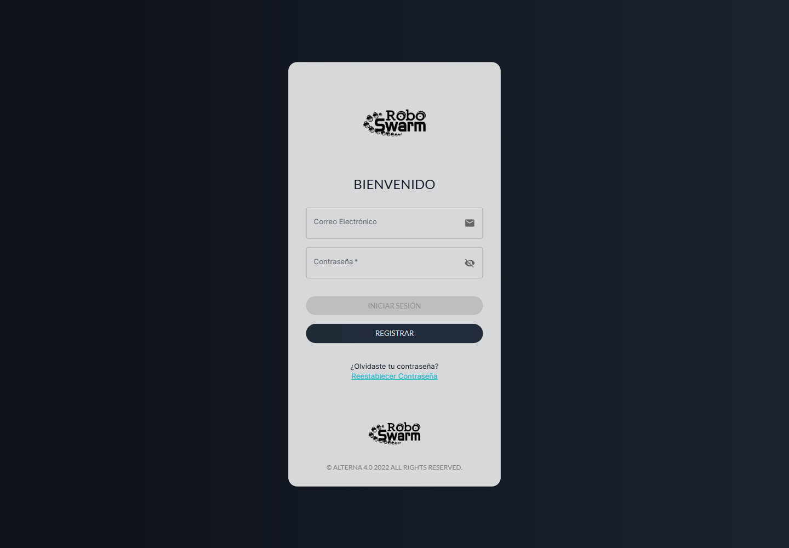

**Figura 1.** Estado inicial del frontend público.

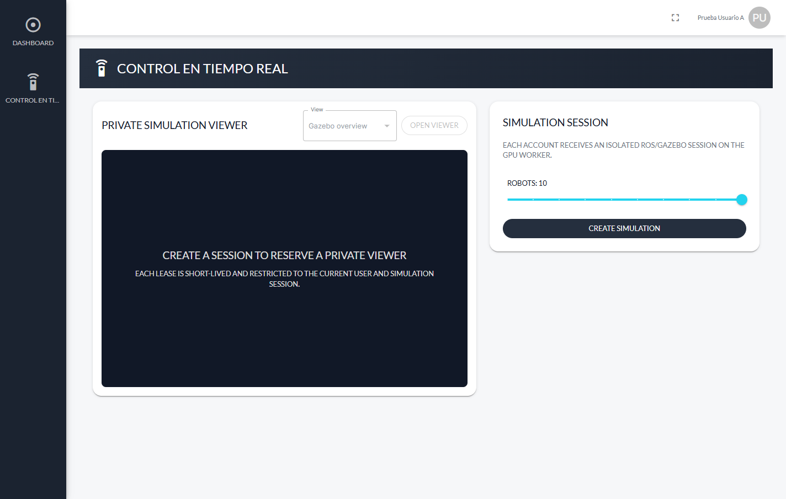

**Figura 2.** Espacio de control autenticado antes de crear una sesión. El visor está reservado por cuenta, pero aún no existe una ruta de video operativa.

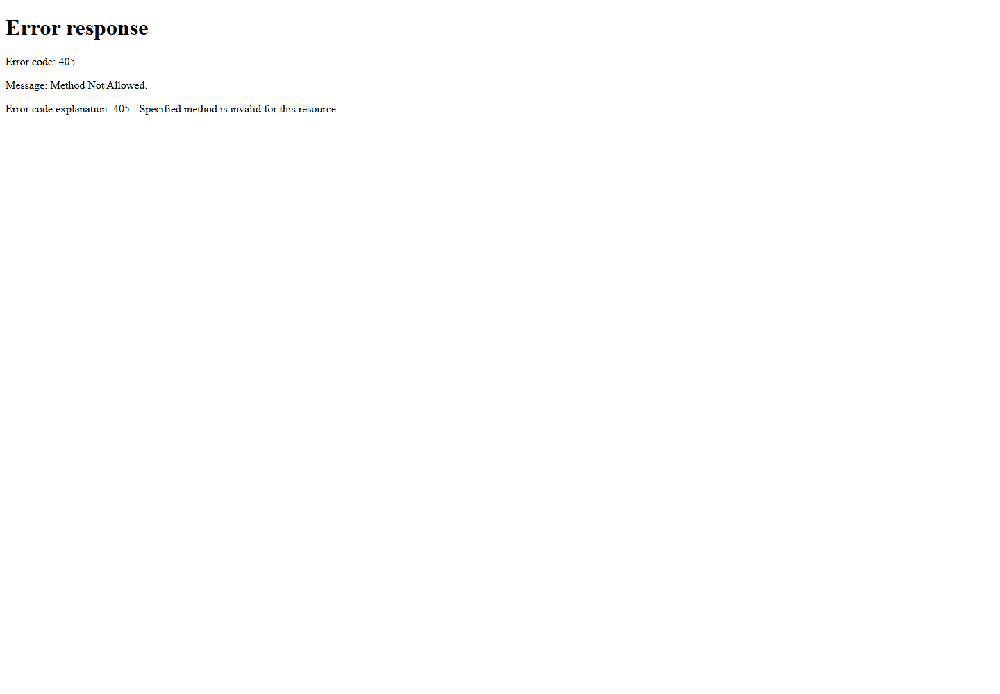

**Figura 3.** Una solicitud directa desde la LAN a `http://10.0.0.126:6080` alcanzó el websockify heredado. La respuesta HTTP 405 no elimina el riesgo: confirma que el servicio administrativo aceptaba tráfico externo antes del cambio.

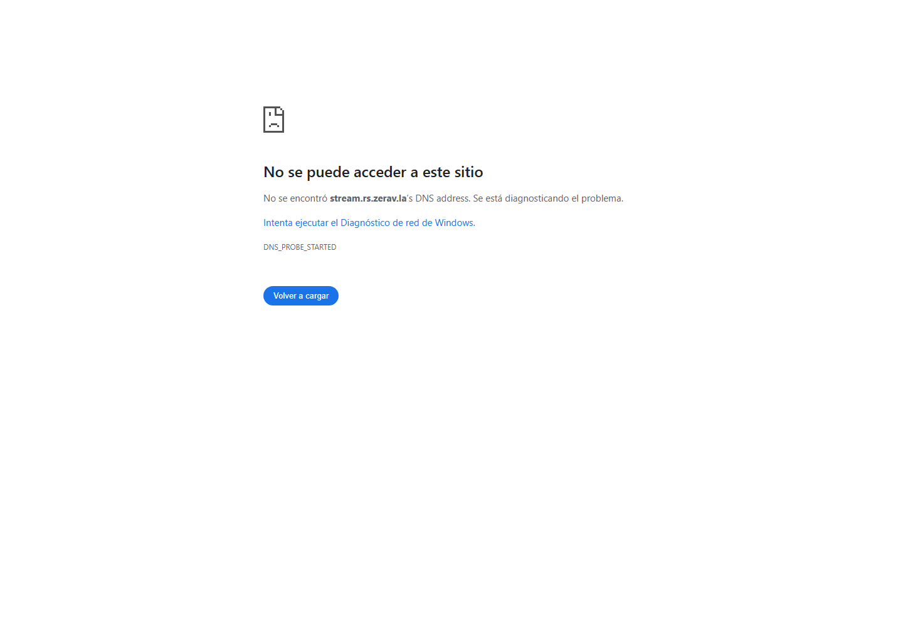

**Figura 4.** Estado inicial de `stream.rs.zerav.la`; el navegador no podía resolver el nombre.

La captura de correo utilizada durante el diagnóstico inicial se clasifica como antecedente histórico y no como prueba del estado actual. Cualquier versión que se incorpore al paquete final debe estar recortada o sanitizada: no puede mostrar contraseñas, tokens, UUID de sesiones ni direcciones URL internas. Esta misma regla se aplica a todas las capturas autenticadas.

## 4. Bitácora de incidencias

### I-001. El flujo denominado «ROS deployment» fallaba antes de ejecutar ROS

**Síntoma.** GitHub mostraba el flujo de despliegue GPU en rojo y el nombre del flujo hacía pensar que el error pertenecía a ROS.

**Localización.** La inspección de los pasos reveló que la ejecución se detuvo en `Test GPU worker`: 94 de 95 pruebas aprobaron. Todos los pasos de ROS, construcción de imagen, prueba NVIDIA y despliegue quedaron omitidos.

**Causa.** Un proceso hijo conservaba abierto el descriptor de `stderr` después de morir su padre. El trabajador intentaba leer ese flujo antes de terminar el grupo de procesos, por lo que la recuperación se retrasaba. Además, la prueba esperaba que el intérprete `dash` ejecutara siempre una trampa de `SIGTERM`, comportamiento que no es uniforme en WSL.

**Solución aplicada.** Se cambió el orden: primero se termina el grupo de procesos y después se leen los diagnósticos. La prueba ahora verifica el PID real del proceso huérfano. La corrección aprobó 30 repeticiones de la prueba específica, las 95 pruebas del trabajador y el despliegue GPU completo.

### I-002. La herramienta de control visual de Windows no pudo inicializarse

**Síntoma.** El cliente de automatización terminó antes de abrir una aplicación.

**Mensaje observado.** `sandboxCwd is not a local file URI` para la ruta WSL del repositorio.

**Diagnóstico.** El fallo ocurre en la validación de metadatos del entorno, antes de enviar acciones de teclado o ratón. Por tanto, no corresponde a Chrome, Gazebo ni al sitio web.

**Tratamiento.** Se conserva el error en esta bitácora y se utilizan capturas reproducibles mediante automatización del navegador y herramientas de captura del host. No se presenta una imagen generada como si fuera evidencia real.

### I-003. GitHub CLI no estaba instalado en WSL

**Síntoma.** `gh --version` respondió `command not found`.

**Localización y solución.** Se consultó la versión oficial más reciente, se descargó el binario Linux AMD64 en un directorio temporal y se comprobó su SHA-256 antes de ejecutarlo. La autenticación se obtuvo del almacén de credenciales ya configurado, sin imprimir el token. Git continuó usando la credencial de Windows como vía de respaldo.

### I-004. La primera captura del frontend mostró solamente la pantalla de carga

**Síntoma.** La imagen se tomó antes de que React terminara de montar la aplicación.

**Causa.** El modo de captura finalizó después de recibir el documento HTML, sin esperar las solicitudes y temporizadores de la aplicación de una sola página.

**Solución aplicada.** Se añadió un presupuesto de tiempo virtual de diez segundos y se exigió que el compositor terminara sus etapas antes de guardar la imagen. La Figura 1 muestra el resultado corregido.

### I-005. La captura autenticada agotó el tiempo de espera aunque la página sí había cargado

**Síntoma.** La automatización esperaba el texto `Private simulation viewer` y terminó por tiempo, pero la URL ya correspondía al espacio de control.

**Causa.** La interfaz transforma los encabezados a mayúsculas mediante estilos; la comparación distinguía mayúsculas y minúsculas.

**Solución aplicada.** Se inspeccionó el texto real del documento y se cambió la condición por una verificación independiente de capitalización. La sesión autenticada no se descartó y se obtuvo la Figura 2.

### I-006. Una redirección de Windows creó accidentalmente un archivo llamado `NUL`

**Síntoma.** `git status` mostró un archivo no rastreado que no pertenecía al proyecto.

**Causa.** La expresión `2>NUL`, válida dentro de `cmd.exe`, fue interpretada primero por Bash desde el directorio del repositorio. En lugar de descartar la salida, Bash creó un archivo llamado `NUL` con un diagnóstico de Windows.

**Solución aplicada.** Se comprobó que el archivo contenía solamente la salida generada por esa orden. `apply_patch` no pudo leerlo porque el texto utilizaba una codificación no UTF-8, por lo que se eliminó exclusivamente ese archivo no rastreado. Las llamadas posteriores a programas de Windows se ejecutaron desde `/mnt/c` y sin redirecciones ambiguas.

### I-007. No fue posible crear usuarios de prueba con la cuenta de arranque

**Síntoma.** La autenticación administrativa respondió HTTP 400 y los intentos siguientes recibieron HTTP 401.

**Localización.** La inspección mostró que las variables `BootstrapAdmin__Email` y `BootstrapAdmin__Password` existían en el contenedor, pero sus valores tenían longitud cero. Este comportamiento es correcto después del aprovisionamiento: producción no conserva una contraseña administrativa de arranque.

**Solución aplicada.** Se generaron dos contraseñas aleatorias fuera del repositorio, se calcularon hashes BCrypt compatibles con el backend y se insertaron dos cuentas de usuario temporales directamente en PostgreSQL. El archivo local de credenciales se creó con modo `0600`; su contenido no se imprimió. Las cuentas se eliminarán junto con sus sesiones al terminar la aceptación.

### I-008. La captura directa de X11 produjo una imagen negra de Gazebo

**Síntoma.** `ffmpeg -f x11grab` generó una imagen completamente negra aunque `gzclient` era visible en WSLg.

**Localización.** Se comprobó que Gazebo seguía renderizando y que el fallo se limitaba a la captura de la ventana raíz. WSLg compone algunas superficies aceleradas de una forma que no queda representada correctamente al leer esa superficie mediante `x11grab`.

**Solución aplicada.** Se localizó el identificador X11 de la ventana titulada `Gazebo` con `xwininfo`, se extrajo esa ventana mediante `xwd` y luego se convirtió el archivo XWD a PNG. Las Figuras 5–7, 9 y 10 provienen de esa ruta y fueron inspeccionadas antes de incorporarlas al informe.

### I-009. La primera escena de búsqueda distante no permitía completar el empuje N=10

**Síntoma.** La fase `SEARCH` cumplió la comunicación entre robots, pero la ejecución terminó al iniciar `APPROACH`.

**Datos observados.** Se obtuvieron 345 muestras de búsqueda; los diez robots recibieron movimiento, `tb3_7` emitió un único aviso y los otros nueve lo confirmaron. Sin embargo, la combinación objeto `(3.5, 3.5)` y meta `(-0.8, -3.0)` no dejaba espacio suficiente para organizar dos cadenas de cinco robots. Además, `tb3_0` quedó inicialmente junto a un cilindro y registró un contacto.

**Criterio adoptado.** No se modificó el algoritmo para ocultar una entrada geométricamente inviable. El fallo se registró como prueba negativa en la bitácora de trabajo, aunque su JSON crudo no forma parte del paquete retenido. Se repitió el ensayo con un objeto distante, una meta factible y separación segura respecto de los obstáculos. La segunda ejecución aprobó sin colisiones y sí conserva sus datos estructurados.

### I-010. El entorno local no pudo instalar la misma versión de NumPy utilizada por CI

**Síntoma.** La creación de un entorno virtual local rechazó `numpy==1.26.4` indicando que no existía una distribución compatible.

**Causa.** La distribución WSL de trabajo utiliza Python 3.8.10; NumPy 1.26 requiere una versión posterior de Python. GitHub Actions ejecuta la suite en un Ubuntu más reciente, por lo que el archivo de CI no era el origen del error.

**Tratamiento.** La validación local se ejecutó con NumPy 1.24.4 y PyYAML 5.3.1, ya instalados y compatibles con Python 3.8. La verificación exacta con NumPy 1.26.4 se deja a la ejecución reproducible de GitHub Actions; ambas rutas deben aprobar antes del despliegue.

### I-011. MediaMTX iniciaba correctamente, pero el proxy HLS no podía obtener la primera lista

**Síntoma.** La comprobación inicial solo verificaba que el contenedor MediaMTX 1.18.2 permaneciera activo. Al publicar después una señal H.264 real, la solicitud de `index.m3u8` respondió HTTP 302 y añadió `cookieCheck=1`.

**Cómo se localizó.** Se creó una red Docker temporal, se publicó un patrón de video con FFmpeg y se registraron las solicitudes de autenticación recibidas por MediaMTX. El token de publicación llegó correctamente, pero no apareció ninguna lectura: la redirección ocurrió antes. La revisión del código fuente etiquetado `v1.18.2` confirmó que las versiones recientes crean una sesión HLS mediante cookie o parámetro de consulta. Esto era incompatible con el proxy deliberadamente estricto, que no sigue redirecciones, no conserva cookies y no reenvía parámetros desconocidos.

**Solución aplicada.** Se configuró `hlsCDNSecret` como una credencial interna diferente del lease del usuario. El backend sigue validando el lease y la ruta exacta en la base de datos, pero usa esa credencial solamente en el salto privado hacia MediaMTX. En modo CDN, MediaMTX no necesita la cookie del navegador. La aplicación falla cerrada si el secreto falta o no cumple el formato base64url esperado. El secreto no aparece en URL, lista, respuesta ni registro de prueba.

### I-012. La primera prueba HLS completa reveló dos valores válidos en YAML, pero inválidos al crear el muxer

**Síntoma.** Después de resolver la redirección, la solicitud respondió primero `maximum reader count reached` y luego `Low-Latency HLS requires at least 7 segments`.

**Diagnóstico.** Ambos errores solo aparecen cuando existe un publicador y MediaMTX intenta crear el muxer; por eso no fueron detectados por una comprobación que se limitaba al arranque del contenedor. La ruta admitía un lector, pero LL-HLS utiliza un lector para el muxer y otro para su sesión CDN. Además, la configuración indicaba cinco segmentos aunque la variante de baja latencia exige siete como mínimo.

**Solución aplicada.** `maxReaders` pasó de 1 a 3: dos plazas son el mínimo de LL-HLS y la tercera permite el solapamiento breve de un fallback WHEP mientras cierra el muxer. `hlsSegmentCount` pasó de 5 a 7. La validación de CI ahora publica video H.264, solicita la lista principal, sigue con la lista de video y descarga una parte MP4 mediante el mismo binario fijado de MediaMTX. La repetición local produjo HTTP 200 sin `Location` ni `Set-Cookie` y conservó nombres canónicos `.m3u8` y `.mp4` compatibles con el proxy.

La sonda conserva además `authMethod: http`, tal como se ejecuta en producción. Para no depender de una base de datos durante CI, levanta un fixture HTTP mínimo en la dirección esperada por MediaMTX. Este fixture acepta solamente la combinación correcta de acción (`publish` o `read`), ruta canónica y token de prueba; también registra los rechazos sin guardar el valor de los tokens. La prueba exige una publicación y una lectura RTSP autorizadas, rechaza un token utilizado para la acción equivocada y una lectura dirigida a otra sesión, y finalmente confirma que las listas y partes HLS usan exclusivamente `hlsCDNSecret` en el salto privado.

### I-013. Un comando obsoleto podía sobrevivir a una cancelación rápida

**Síntoma potencial.** Al detener y volver a iniciar una sesión en poco tiempo, dos instancias del trabajador podían leer el mismo comando pendiente. La comprobación del estado y el cambio a `Acknowledged` ocurrían en operaciones distintas. Una respuesta HTTP exitosa tampoco demostraba por sí sola que ROS ya hubiese terminado la tarea cancelada.

**Cómo se localizó.** Se escribieron pruebas con dos contextos relacionales independientes para reproducir la carrera real de base de datos. Las pruebas de memoria no eran suficientes porque no aplican del mismo modo los tokens de concurrencia. También se simuló una cancelación mientras el puente ROS continuaba reportando una tarea activa.

**Solución aplicada.** Los estados del comando y de la tarea se marcaron como tokens de concurrencia. El trabajador debe ganar una transición atómica antes de ejecutar el manejador; si otro proceso la ganó, descarta el sobre obsoleto. Para cancelar, el trabajador envía la orden a ROS y consulta el estado correlacionado hasta observar el terminal esperado. El monitor del backend ignora resultados que pertenezcan a otra tarea o a una revisión anterior.

### I-014. Los contadores agregados podían aceptar una colaboración incompleta

**Síntoma potencial.** Un resultado podía declarar diez robots mediante un contador y, sin embargo, repetir un identificador, omitir un compañero o acreditar como útil a un robot fuera de la sesión.

**Localización.** Se construyeron resultados sintéticos con el mismo total numérico, pero con conjuntos de identificadores diferentes. La política anterior no comparaba el roster autorizado con cada conjunto de evidencia.

**Solución aplicada.** La aceptación de transporte ahora utiliza igualdad de conjuntos: el descubridor debe pertenecer al roster, los notificados deben ser exactamente todos los compañeros y los contribuidores útiles deben coincidir con todos los robots asignados. El requisito se protege mediante `Tasks__RequireCollaborativeTransportEvidence`; su activación se planificó en dos etapas para no rechazar tareas mientras un trabajador antiguo siguiera registrado.

### I-015. Un `heartbeat` podía competir con el drenaje del trabajador GPU

**Síntoma potencial.** El despliegue necesitaba impedir nuevas sesiones, pero un registro o latido simultáneo podía volver a presentar al trabajador como disponible. Separar el bloqueo en GitHub de la decisión del scheduler no eliminaba esta ventana.

**Cómo se localizó.** Se ejecutaron dos contextos de base de datos contra la misma fila: uno adquirió el drenaje y el otro intentó actualizar el trabajador. Después se forzó al scheduler a consultar un estado desactualizado.

**Solución aplicada.** El lease de drenaje tiene identificador, revisión objetivo, caducidad y token de concurrencia. El scheduler excluye cualquier trabajador con un lease vigente aunque su campo de estado todavía no refleje `Draining`. Los registros y latidos reintentan las colisiones sin borrar el lease. El workflow adquiere el lease autenticado, espera cero sesiones tanto en backend como en el reporte del trabajador, lo verifica otra vez antes de desplegar y solo reanuda la planificación tras una puesta en servicio correcta.

### I-016. Los dos despliegues podían modificar producción con revisiones distintas

**Riesgo encontrado.** Backend y trabajador GPU utilizaban grupos de concurrencia distintos. Además, el backend decidía si debía desplegar comparando únicamente `HEAD^`; en un `push` con varios commits podía omitir archivos relevantes. El rollback de MediaMTX dependía de un nombre de imagen mutable.

**Tratamiento.** Ambos workflows comparten el grupo `production-robotswarm`. El backend despliega toda ejecución exitosa de CI sobre `main`, y los dos flujos vuelven a consultar el SHA actual inmediatamente antes de su primera modificación. MediaMTX quedó fijado por digest y el rollback conserva el identificador inmutable de la imagen y la configuración que estaban activos. Las consultas de drenaje y salud tienen límites explícitos de conexión y duración, de modo que una red interrumpida no deja el job bloqueado indefinidamente.

### I-017. La topología del proxy y la publicación multimedia no estaba expresada como una condición verificable

**Observación.** Nginx Proxy Manager llega al backend desde `10.0.0.2`, mientras que el backend y MediaMTX se publican en `10.0.0.126`. Si estas variables quedan vacías, en loopback o contienen otra interfaz, la aplicación puede atribuir la limitación de peticiones al proxy completo o publicar RTSP en un socket distinto del previsto.

**Cómo se comprobó.** La dirección del proxy se obtuvo de las conexiones activas del host, y las direcciones de publicación se contrastaron con los sockets Docker. No se dedujeron a partir del nombre DNS público.

**Solución aplicada.** El workflow exige direcciones IPv4 unicast y no loopback para el proxy y el backend; cuando se habilita la publicación, aplica la misma regla a MediaMTX y compara el resultado real de `docker port media_prod 8554/tcp` con `10.0.0.126:8554`. El backend solo confía en el proxy declarado para interpretar encabezados reenviados.

### I-018. Una instalación local reutilizada produjo un fallo de frontend que no existía en el repositorio

**Síntoma.** La primera verificación de frontend falló dentro de Babel usando el directorio `node_modules` que ya existía en WSL.

**Diagnóstico.** El árbol instalado no correspondía de forma limpia con `package-lock.json`; por tanto, repetir órdenes sobre él no permitía separar un defecto del cambio de un residuo local.

**Solución aplicada.** Se creó una copia limpia, se utilizó Node 18 y se ejecutó `npm ci` exclusivamente desde el lockfile. En ese entorno aprobaron 4 suites con 21 pruebas, el lint dirigido y la construcción de producción. `npm audit` conserva 99 avisos que ya estaban presentes en la revisión base (17 bajos, 30 moderados, 47 altos y 5 críticos); `hls.js` no añadió un aviso nuevo. Esta deuda no se declara resuelta y se incluye en las limitaciones.

### I-019. El archivo de hashes conservaba nombres de evidencias que ya habían sido renombradas

**Síntoma.** La comprobación completa de `checksums.sha256` informó siete archivos ausentes. Cinco capturas sí estaban en el repositorio, pero con los nombres finales `figura-05` a `figura-10`; otros dos archivos voluminosos se habían excluido deliberadamente.

**Causa.** El manifiesto se generó antes de seleccionar y renombrar la evidencia del informe. La instrucción `--ignore-missing` ocultaba esa diferencia, pero no demostraba que el paquete entregado estuviese íntegro.

**Solución aplicada.** Se preservó `manifest.txt` como inventario histórico y se regeneró el archivo de hashes para referir únicamente los datos retenidos y sus figuras derivadas. La comprobación actual no ignora ausencias:

```bash
cd docs/assets/commissioning-2026-07/datos-transporte-n10
sha256sum -c checksums.sha256
```

El resultado fue 16 de 16 entradas correctas.

### I-020. Una interrupción durante el cuerpo HLS no se traducía a un error controlado

**Síntoma reproducido.** La ruta devolvía 502 cuando no podía conectar con MediaMTX, pero una desconexión después de recibir las cabeceras podía lanzar `IOException` al copiar el cuerpo y cerrar la respuesta de forma abrupta.

**Solución aplicada.** El proxy trata tanto los fallos de solicitud como los de lectura del cuerpo como indisponibilidad del upstream. Se añadió una regresión que interrumpe el contenido después de las cabeceras y comprueba la respuesta 502. Los límites de tamaño y tiempo, la validación exacta de ruta y lease, y los cupos globales y por sesión permanecen activos.

### I-021. La repetición final no encontró `dotnet` en el `PATH` del shell

**Síntoma.** La orden de prueba terminó inmediatamente con `dotnet: command not found`.

**Diagnóstico y tratamiento.** El SDK 8.0.422 sí estaba instalado en `/tmp/robotswarm-dotnet-8.0.422`, pero el shell no interactivo de esa ejecución no heredó su directorio en `PATH`. Se repitieron las suites con la ruta absoluta del mismo SDK: backend aprobó 124/124, trabajador 99/99 y ROS 351/351. Este incidente pertenece al entorno local y no se atribuyó al código ni se corrigió alterando el proyecto.

### I-022. La publicación necesitó utilizar el almacén de credenciales de Windows

**Síntomas.** El `push` desde WSL respondió `could not read Username`; el conector de GitHub pudo leer el PR, pero recibió HTTP 403 al intentar crearlo. Git para Windows sí tenía una credencial válida, aunque su primera ejecución rechazó el directorio WSL por `dubious ownership`.

**Tratamiento.** Se invocó Git para Windows con una excepción `safe.directory` limitada a esa orden. El PR se creó con GitHub CLI obteniendo la credencial del almacén existente y manteniéndola solo en una variable de proceso. No se escribió ni mostró el token. No se cambió la configuración global de Git.

### I-023. El runner remoto ya no incluía FFmpeg

**Síntoma.** En el PR 94, backend, pruebas y migración aprobaron, pero `Validate pinned MediaMTX configuration` terminó justo después de los cinco segundos de arranque del contenedor y antes de iniciar la publicación H.264.

**Cómo se localizó.** El log completo de Actions confirmó MediaMTX 1.18.2 activo y no mostró ninguna conexión del publicador. Entre ese punto y la primera publicación, el único chequeo sin diagnóstico era `ffmpeg -encoders | grep libx264` bajo `set -o pipefail`. Primero se eliminó esa tubería para descartar un `SIGPIPE` por salida temprana y para añadir mensajes a cada prerrequisito. La segunda ejecución produjo entonces el diagnóstico inequívoco: `The CI runner does not provide FFmpeg`.

**Solución aplicada.** CI instala `ffmpeg` explícitamente antes de la sonda y deja de depender del inventario cambiante de `ubuntu-latest`. La versión de MediaMTX se captura y compara; la lista completa de encoders se guarda primero en un archivo temporal y después se inspecciona. Cada prerrequisito devuelve ahora un mensaje propio. La sonda exacta, extraída del YAML corregido, aprobó localmente con publicación/lectura RTSP, dos rechazos de autenticación y entrega LL-HLS completa.

### I-024. La verificación final del drenaje comparó una fecha sin zona con UTC

**Síntoma.** El primer despliegue GPU del SHA `0fd6043` aprobó pruebas, imagen ROS y sonda NVIDIA, pero se detuvo antes de reemplazar el servicio con `TypeError: can't compare offset-naive and offset-aware datetimes`. El paso de salida liberó correctamente el lease y el trabajador anterior continuó activo.

**Causa.** Las columnas históricas de fecha utilizan `timestamp without time zone`. Aunque se escriben con `DateTime.UtcNow`, PostgreSQL las devuelve con `DateTimeKind.Unspecified`; el JSON de `expiresAt` no añadió `Z`. El workflow sí construyó `datetime.now(timezone.utc)`, por lo que Python 3.8 rechazó la comparación entre ambos tipos.

**Solución aplicada.** La respuesta de mantenimiento marca explícitamente como UTC `requestedAt`, `expiresAt` y `activeSessionsReportedAt`. El workflow también interpreta como UTC una fecha sin sufijo para conservar compatibilidad durante el orden backend→worker. Una regresión construye fechas `Unspecified` como las recuperadas de PostgreSQL y exige que las tres salgan con `DateTimeKind.Utc`.

### I-025. El cierre del publicador se ejecutó dos veces y dejó el servicio en estado fallido

**Síntoma.** El segundo despliegue GPU, ejecución `29690942535`, superó CI, el drenaje, las pruebas del trabajador, las 351 pruebas ROS, la construcción inmutable y la sonda NVIDIA. Al detener el release anterior, `systemd` registró un `ObjectDisposedException` sobre `SemaphoreSlim` en `ExternalViewerPublisher.DisposeAsync`. El proceso terminó con `ABRT`; el despliegue interpretó el estado `failed` como un cierre incompleto y restauró correctamente `3fcc80a`.

**Cómo se encontró.** El resumen de Actions solo indicaba `the current worker service did not become inactive`. Se comparó ese mensaje con el estado de `systemd`, el enlace `current` y el diario delimitado al intervalo del cambio. El diario mostró dos llamadas de disposición sobre la misma instancia: la segunda intentó esperar en un semáforo que la primera ya había destruido. El registro de dependencias exponía el publicador como tipo concreto y como interfaz mediante una fábrica; ambas descripciones conservaban la misma instancia descartable. Se revisó el resto del contenedor y se encontró el mismo riesgo en la conexión SignalR.

**Riesgo secundario y contención.** El paso `Resume scheduling` exigía que el despliegue hubiera aprobado o sido omitido. Por ello no se ejecutó tras el fallo y dejó un lease con vigencia de dos horas. Se obtuvo su identificador desde la base de datos sin exponer credenciales, se liberó mediante `DELETE` en la ruta autenticada de mantenimiento y se comprobó `remaining_drain_leases=0`. El trabajador restaurado quedó activo, sin reinicios adicionales ni sesiones administradas.

**Solución aplicada.** El publicador se registra una sola vez y su cierre, al igual que el de SignalR, es idempotente. El instalador acepta `failed` únicamente cuando `MainPID=0`; sigue bloqueando el cambio si queda un proceso. Antes del switch se conservan el destino del enlace y los hashes del release y de la unidad. Ante fallo, el paso final solo resuelve el drenaje si esos tres valores fueron restaurados exactamente, el servicio conserva un PID estable y un `heartbeat` posterior confirma cero sesiones; cualquier discrepancia mantiene el drenaje. Las regresiones llaman dos veces a ambos métodos de disposición y cubren tanto `failed` sin proceso como `failed` con un PID vivo. La validación local terminó con 101/101 pruebas del trabajador, la prueba de rollback y la sonda del publicador aprobadas.

**Cierre en el host real.** La ejecución GPU `29692887445` instaló el release `62a136a08b4955ea45a58447a87b6518301418fe` y la imagen ROS `sha256:8005ae446fa925d961120ce3470ff0c459075fae9749e498e879f77d0a25905a`. En el diario de `systemd --user`, el PID anterior, `2172068`, terminó con `Application is shutting down` y la unidad pasó por `Succeeded`; no reaparecieron `ObjectDisposedException`, `ABRT` ni un proceso residual. El nuevo PID, `2209000`, quedó `active (running)`, con `NRestarts=0`, y publicó las capacidades de escena H.264. Esta repetición cierra I-025 porque ejercitó en el host real el mismo apagado que había fallado.

### I-026. Una consulta de drenaje terminó ante un fallo DNS transitorio

**Síntoma.** La ejecución de repetición `29692426789` adquirió el lease y obtuvo un primer estado válido con cero sesiones. Diez segundos después, el segundo GET terminó con código 28: `Resolving timed out after 5000 milliseconds`. No se ejecutó el switch. El cleanup reforzado comprobó el worker activo, un PID estable y un heartbeat vacío posterior; entonces liberó el lease correctamente.

**Diagnóstico.** El primer GET y el DELETE posterior aprobaron contra el mismo endpoint. Por tanto, no se atribuyó el incidente a la ruta del backend ni a las credenciales. La pérdida fue puntual en el resolvedor de WSL. La espera tenía un plazo total de quince minutos, pero la asignación de `curl` estaba bajo `set -e` y un solo error de transporte terminaba el paso.

**Solución aplicada.** El GET de estado continúa siendo autenticado, acotado a veinte segundos y sin imprimir la credencial, pero un fallo de red ya no abandona el ciclo: elimina la credencial de la variable de proceso, espera diez segundos y reintenta mientras quede tiempo del plazo global. Si el endpoint permanece inaccesible durante quince minutos, el despliegue falla y el cleanup conserva o resuelve el drenaje según las comprobaciones de restauración descritas en I-025. La corrección se integró mediante el PR 97 y el squash `62a136a08b4955ea45a58447a87b6518301418fe`.

**Cierre.** La ejecución posterior `29692887445` completó sus 39 pasos, incluidos adquisición y comprobación del drenaje, pruebas, sonda NVIDIA, cambio de release, verificación de disponibilidad y reanudación del scheduler. No volvió a producirse el código 28. El contraste entre el primer GET válido, el DELETE válido y la repetición completa confirma que `29692426789` fue un fallo transitorio de resolución DNS y que la espera ya lo tolera sin convertir una interrupción puntual en un despliegue fallido.

### I-027. Dos creaciones simultáneas de sesión provocaron una cancelación serializable

**Síntoma.** La primera aceptación concurrente de producción inició dos solicitudes de creación al mismo tiempo, desde cuentas distintas y con la cola limpia. La solicitud A recibió HTTP 202, pero la solicitud B recibió HTTP 409. El artefacto sanitizado de esa ejecución se conserva como evidencia rechazada, con SHA-256 `ec59796e7a9fc29c0b92fcda55790f7745a68c80b163f8fccd46592dfb13a72d`; no se utiliza para afirmar que el aislamiento multiusuario fue aprobado.

**Cómo se localizó.** Las dos transacciones `Serializable` leyeron el mismo contador global de sesiones antes de insertar. PostgreSQL detectó la dependencia de lectura y escritura entre ambas y, mediante Serializable Snapshot Isolation (SSI), canceló una de ellas para conservar la serialización. La ruta convertía esa cancelación válida de concurrencia directamente en HTTP 409, aunque todavía existía capacidad para ambas cuentas.

**Solución aplicada.** El commit `b7d2806` añadió hasta tres intentos internos para los fallos de serialización. Cada intento abre una transacción nueva, limpia el estado rastreado por Entity Framework y vuelve a evaluar tanto el límite por cuenta como el cupo global; las esperas de 25 y 50 ms respetan la cancelación de la solicitud. También se agregaron regresiones para éxito tras un conflicto sintético, agotamiento de reintentos con HTTP 409 y propagación de cancelación. Backend aprobó 128/128 pruebas. El PR 98 aprobó CI en `29693955661`; su squash produjo `d33eed4351a0f407527536c2a62165cd3cfc13b5`, cuyo CI de `main` aprobó en `29694125778`. El despliegue de backend `29694250759` dejó `swarmbackend:d33eed4351a0f407527536c2a62165cd3cfc13b5` sano y con cero reinicios.

**Cierre acotado.** La repetición posterior en producción no volvió a detenerse en la creación simultánea y alcanzó la apertura concurrente de los visores. Esto cierra el defecto específico A=202/B=409 de I-027. El ensayo completo siguió rechazado por un problema diferente en la fase de video, documentado en I-028–I-030; por tanto, cerrar esta carrera no equivale a aceptar todavía el aislamiento multiusuario, los leases ni las tareas.

### I-028. La creación concurrente de leases del visor también podía recibir SQLSTATE 40001

**Síntoma.** Después de superar la creación simultánea de sesiones, dos aperturas concurrentes del visor podían competir al revocar el lease anterior, insertar el nuevo lease y encolar el comando de publicación. PostgreSQL protegía la transacción `Serializable` mediante SQLSTATE `40001`, pero la ruta trataba el error como un conflicto de comando y devolvía HTTP 409 sin repetir la operación válida.

**Cómo se localizó.** Se separó la creación de sesión de la creación del lease y se ejecutó esta última contra PostgreSQL real. Además, se observó que el `PostgresException` no siempre era la excepción exterior: podía llegar envuelto en más de un `DbUpdateException` o en otra excepción de infraestructura. La comprobación anterior solo reconocía el error directo o un único nivel de envoltura.

**Solución aplicada.** La creación del lease dispone ahora de hasta tres intentos. Después de un `40001`, se abandona la transacción fallida, se limpia el `ChangeTracker`, se respeta cualquier cancelación del cliente y se abre una transacción nueva tras una espera breve. La búsqueda de SQLSTATE recorre toda la cadena de `InnerException`; los conflictos que no son de serialización conservan su tratamiento anterior y no se reintentan de manera indiscriminada.

**Verificación.** Se ejecutaron diez rondas normales y tres rondas con conflictos inducidos. En cada ronda, las dos solicitudes concurrentes terminaron con HTTP 201 Created: 20/20 solicitudes en las rondas normales y 6/6 en las inducidas. En estas últimas se registraron 19 cancelaciones serializables internas, todas observadas por la ruta de reintento. La consulta final encontró 26 leases y 26 comandos persistidos, todos únicos. Las cinco pruebas unitarias focalizadas aprobaron; en esa etapa el backend cerró 134/134 y el trabajador 101/101. Las regresiones cubren éxito después de dos fallos, agotamiento con HTTP 409, cancelación y un `40001` anidado; una violación de unicidad anidada se rechaza para comprobar que el detector no confunda códigos PostgreSQL. La corrección se instaló entonces como hotfix para continuar el diagnóstico. Más tarde quedó incluida en `9c0dc05`, aprobó CI #33 y se integró mediante el PR #99. La ejecución original descrita en I-053 terminó correctamente cuando GitHub renovó el certificado, por lo que la base `bbc7c46` ya contiene esta corrección en el backend público.

### I-029. El formato de fecha de .NET excedía la precisión aceptada por Python 3.8

**Síntoma.** El backend envió la caducidad del lease con el formato de ida y vuelta `O` de .NET, que utiliza siete dígitos fraccionarios. El publicador se ejecuta con Python 3.8 y `datetime.fromisoformat` no aceptó esa representación en el entorno utilizado. El comando de publicación podía fallar antes de iniciar FFmpeg aunque la fecha fuese válida.

**Diagnóstico.** La zona horaria estaba presente y el instante era correcto; la diferencia se limitaba a precisión. El séptimo dígito representa ticks de 100 ns, mientras que `datetime` conserva microsegundos, es decir, seis dígitos. Cambiar la fecha en el backend habría creado una dependencia innecesaria con un consumidor específico.

**Solución aplicada.** El publicador valida el texto completo mediante una expresión regular, exige `Z` o un desplazamiento UTC, admite de uno a nueve dígitos fraccionarios y normaliza la fracción a seis antes de llamar a `fromisoformat`. La pérdida del séptimo dígito queda por debajo de la precisión de Python y no adelanta materialmente la caducidad. Las regresiones cubren siete dígitos con `Z`, siete con desplazamiento, una fracción corta y el rechazo de fechas sin zona o de texto inválido.

### I-030. El visor observado por el usuario recibía un lease, pero no una lista HLS

**Síntoma.** La interfaz mostraba que la sesión y el lease existían, pero el visor terminaba por tiempo de espera. La reproducción del caso confirmó `session_ready=true` y `viewer_lease_issued=true`, mientras `playlist_ready=false`. Por tanto, renovar la página no podía resolver el problema.

**Cómo se localizó.** MediaMTX estaba sano y aceptaba al publicador, pero no recibía un flujo sostenido. FFmpeg capturaba tres fotogramas y después quedaba detenido. El diagnóstico de X11 señaló la extensión MIT-SHM, cuyo opcode mayor era 130. FFmpeg se conectaba por TCP a un Xvfb del host; ese transporte no permite utilizar la memoria compartida local como si ambos procesos estuvieran en el mismo espacio X11.

**Intentos descartados.** Se amplió el tiempo de espera, se emitieron leases nuevos y se repitió la sonda para descartar una inicialización lenta. También se probaron variantes que mantenían la captura de FFmpeg por TCP o deshabilitaban MIT-SHM. Esos cambios no restablecieron una secuencia continua de segmentos y se descartaron en vez de ocultar el fallo con más reintentos del navegador. Tampoco se modificó MediaMTX, ya que el estancamiento ocurría antes de que este recibiera video suficiente.

**Solución aplicada.** Xvfb conserva dos accesos al mismo display privado. `gzclient`, que vive dentro del contenedor ROS, utiliza TCP con autenticación X11; `xwininfo` y FFmpeg, que se ejecutan en el host, capturan mediante el socket X11 local, incluido el socket abstracto disponible en Linux, usando `DISPLAY=:N.0`. De esta forma, la captura host conserva MIT-SHM donde sí es válida y no se expone ni se reutiliza el escritorio VNC del usuario.

**Verificación posterior.** La sonda individual pasó con `playlist_ready=true` y limpieza completa. Después, una prueba de estabilidad mantuvo el visor durante 35 segundos y comprobó 16 listas distintas y 16 segmentos reproducibles. La salida se mantuvo en 30 FPS y el trabajador continuó con cero reinicios. Este resultado acepta el conducto técnico X11→HLS del hotfix; todavía no acepta la matriz final de movimientos ROS ni sustituye las dos ventanas visibles requeridas en la sección 7.

**Evolución posterior.** Ese hotfix todavía ejecutaba `gzclient` dentro del contenedor y usaba X11 por TCP. La arquitectura final sustituye esa ruta por un cliente del host aislado con `bubblewrap` y un Xvfb privado accesible únicamente por el socket Unix abstracto. El cambio y su comprobación física se describen en I-047; por tanto, el mecanismo de esta incidencia se conserva como antecedente y no como descripción del despliegue final.

### I-031. La interfaz no guiaba con claridad el flujo sesión→visor→tarea

**Observación.** El formulario de inicio de sesión, la administración de cuentas y el espacio de simulación conservaban rótulos heredados, mensajes técnicos o acciones difíciles de distinguir. Durante el fallo del visor, la página tampoco explicaba si debía esperarse al worker, renovar el acceso o crear otra sesión.

**Mejoras aplicadas.** El inicio de sesión muestra estado ocupado, conserva el error de la API en español, permite mostrar u ocultar la contraseña y explica que el acceso depende de una cuenta administrada. La sección de cuentas permite crear, editar y desactivar, distingue estados activo e inactivo, añade filtros y evita que un administrador desactive accidentalmente su propia cuenta. El espacio de simulación presenta tres etapas numeradas —crear sesión, abrir visor y ejecutar tarea—, interpreta respuestas Problem Details de la API y separa los controles de flota, video y algoritmo.

El visor añade estado de conexión, cuenta regresiva del lease, medición de FPS decodificados, pantalla completa y un reintento que no crea una sesión adicional. El panel de tareas valida parámetros antes de enviar la orden y resume en lenguaje legible la búsqueda, el aviso y el empuje coordinado del transporte. Estas mejoras aprobaron CI #33 y #34 y el bundle público de Cloudflare contiene los controles nuevos. Su captura comparativa y su operación real con dos usuarios continúan pendientes; por ello se distinguen todavía de una aceptación visual concluida.

### I-032. Las cuentas temporales acumuladas dificultaban una prueba repetible

**Síntoma.** Varias rondas de concurrencia dejaron cuentas creadas exclusivamente para pruebas. Además de saturar la lista administrativa, conservarlas aumentaba el riesgo de reutilizar por error una identidad de una ejecución anterior.

**Tratamiento.** Se realizó una purga controlada de 21 cuentas de prueba. La selección y el recuento se verificaron antes de ejecutar la eliminación y no se copiaron correos, contraseñas ni identificadores al informe. Las cuentas operativas quedaron fuera del conjunto. La limpieza de cuentas creadas por las próximas pruebas sigue formando parte del criterio final de la sección 7.

### I-033. Gazebo podía morir durante el aprovisionamiento y la sesión quedaba falsamente «Ready»

**Síntoma.** Al pulsar «Open viewer», el navegador terminó mostrando `The worker has not published this view yet`. La sesión indicaba diez robots y estado `Ready`, pero el publicador no podía crear una ventana de Gazebo. La renovación del lease no reparaba la vista.

**Cómo se localizó.** Se creó una sesión desechable con diez TurtleBot y se comprobó por separado el roster, `/gazebo/model_states`, `/clock` y los procesos del contenedor. El roster llegaba a publicar los diez identificadores; poco después, `gzserver` terminaba mientras cargaba `tb3_7`. El registro contenía `boost::thread_resource_error: Resource temporarily unavailable`. Docker aplicaba `--pids-limit 512`, y en este límite también cuenta cada hilo: la simulación alcanzaba aproximadamente quinientas tareas y necesitaba ráfagas superiores durante la creación de la flota. Como el trabajador solo esperaba el roster latched, aceptaba información anterior a la caída y completaba `ProvisionSession`.

**Solución aplicada.** El límite pasa a 1024 y la inspección de Docker conserva el valor real de `HostConfig.PidsLimit`; un contenedor antiguo con 512 ya no puede reutilizarse como si cumpliera la especificación actual. Después de `ProvisionSession` y `UpdateFleet`, el trabajador crea un suscriptor nuevo, exige una muestra de `/gazebo/model_states` que incluya todo el roster y comprueba dos muestras de `/clock` con avance. Si cualquiera de esas condiciones falla, el comando utiliza el manejo fatal existente: limpia el contenedor parcial y reporta la sesión como `Failed` en vez de `Ready`.

**Verificación y alcance.** Una sesión nueva N=10 con el límite 1024 conservó `gzserver`, publicó `tb3_0` a `tb3_9` y llegó a unas 599 tareas sin alcanzar el nuevo techo. La suite del trabajador terminó con 105/105 pruebas y compilación sin advertencias; una revisión independiente no encontró defectos altos ni medios. La variable operacional de producción ya utiliza 1024 para sesiones nuevas y el código aprobó CI dentro del merge. El backend base terminó desplegado después de la recuperación de I-053, mientras el worker GPU conserva el release anterior y deberá saltar directamente al SHA definitivo después del delta. Esta corrección evita la falsa disponibilidad durante aprovisionamiento o cambio de flota. No afirma autocuración si `gzserver` muere después de que la sesión ya estaba `Ready`: esa supervisión periódica debe coordinarse con el ejecutor de comandos para no competir con una tarea o una detención legítima.

### I-034. Una matriz completa reutilizada en la misma sesión agotó su memoria

**Síntoma.** La primera repetición de todas las formaciones, seguimientos y transportes dentro de un único contenedor avanzó por doce escenarios, pero al preparar transporte N=4 desaparecieron `/gazebo/set_model_state` y `gzserver`. Docker marcó `OOMKilled=true`; el proceso terminó con código 137 y el registro indicó `Killed`.

**Diagnóstico.** El contenedor tenía un máximo de 3 GiB. La prueba había creado y eliminado sucesivamente flotas N=3, 5, 7, 8, 9, 10, 3, 6, 10, 1 y 3, además de mantener un `gzclient` privado y la codificación del visor. Antes de la terminación se habían observado aproximadamente 2.8 GiB. Esta carga de *churn* no equivale al uso normal de una tarea sobre una flota fija y no permite atribuir el fallo a uno de los tres algoritmos; tampoco permite convertir los escenarios anteriores en una aceptación integral del release.

**Tratamiento.** La ejecución se detuvo en cuanto se confirmó que no existía `gzserver`; solo se retiraron la sesión, el lease y el visor desechables del ensayo. La sesión ajena que ya existía en el host no se modificó. La matriz se repetirá por lotes aislados o sesiones frescas, conservando un visor visible durante cada lote y liberando los recursos entre cantidades de robots. El nuevo control de I-033 también convierte una muerte durante `UpdateFleet` en fallo explícito y limpieza, en lugar de continuar con un estado operativo ficticio. No se elevó de forma arbitraria el límite de memoria: antes debe medirse el consumo estable y la concurrencia real de usuarios.

### I-035. La prueba desde un navegador visible debía separar el fallo de una sesión antigua del conducto HLS

**Síntoma.** El usuario seguía recibiendo «The worker has not published this view yet» al pulsar `Open viewer`. Dos primeros intentos automatizados con una ventana normal de Chrome permanecieron en `/login`, aunque la misma cuenta de prueba obtuvo HTTP 200 contra `Accounts/authenticate`. El mensaje del visor, por tanto, no podía aceptarse ni descartarse mediante una llamada directa a la API.

**Cómo se localizó.** Se abrió un perfil nuevo de Chrome de Windows, sin `--headless` y sin `--disable-gpu`, se rellenó el formulario real y se pulsó el control visible. El tercer intento autenticó y abrió el lease de una sesión N=10 creada después del hotfix. Se midieron los fotogramas decodificados mediante `requestVideoFrameCallback` y se tomaron dos capturas separadas. La sesión antigua del usuario no se modificó: había sido creada con el límite de 512 tareas descrito en I-033 y no sirve como prueba del runtime corregido.

**Resultado.** El navegador reprodujo durante 20.02 s a 30.02 FPS decodificados y 30.02 callbacks/s; las dos imágenes tuvieron hashes diferentes. La captura final mostró Gazebo, diez robots y RTF 3.00. Esto acepta el conducto Chrome→backend HLS→MediaMTX→publicador→Xvfb para una sesión nueva. No convierte en sana una sesión previamente dañada y todavía debe repetirse después del despliegue final con la interfaz nueva y dos usuarios concurrentes.

### I-036. El publicador podía declarar disponibilidad sin probar la continuidad RTP

**Riesgo.** La existencia de Xvfb, `gzclient`, FFmpeg y una conexión RTSP no demuestra que MediaMTX haya aceptado la publicación ni que sigan avanzando paquetes de video. Un marcador `READY` prematuro deja al backend en `Completed` mientras el navegador solo recibe 404.

**Corrección aplicada.** El protocolo del helper exige respuestas 2xx correlacionadas por `CSeq` para `ANNOUNCE`, `SETUP` y `RECORD`, confirma transporte `RTP/AVP/TCP` intercalado y observa al menos tres paquetes RTP con secuencia progresiva durante una ventana estable. Después de `READY`, un watchdog termina el helper si no llega tráfico o si se detiene durante cinco segundos; el worker conserva tres reinicios acotados. Se añadieron regresiones para rechazo de `RECORD`, ausencia de RTP y RTP detenido. El token de publicación continúa fuera de argumentos, entorno y diagnósticos.

### I-037. HLS permitía observar Gazebo, pero no interactuar con su ventana

**Necesidad.** HLS es un transporte de video unidireccional. Además, el visor heredado ocupaba una porción pequeña de la pantalla y dejaba espacio sin uso, lo que dificultaba inspeccionar y manipular la escena.

**Diseño aplicado.** El área normal conserva 16:9 y ocupa nueve de doce columnas en pantallas anchas, en vez de producir una franja baja con bordes negros. El video mantiene `object-fit: contain` y ofrece pantalla completa real; `Esc` restaura el estado de la interfaz. Para la interacción no se abrió un VNC compartido ni un puerto nuevo. La conexión SignalR ya autenticada solicita una autorización de treinta segundos, renovada antes de vencer y ligada a cuenta, sesión, lease y worker. El backend normaliza una lista cerrada de eventos de ratón, rueda y teclado, limita la frecuencia por conexión y los reenvía al grupo del worker. El protocolo 2 del publicador recibe JSON por líneas después del token inicial y usa XTest contra el Xvfb privado de ese lease. El fallback WHEP conserva pantalla completa, pero se identifica de manera explícita como modo de solo video; el control se habilita únicamente en la ruta HLS validada.

**Estado de verificación.** Las validaciones unitarias cubren coordenadas con bandas negras, teclas permitidas, campos inesperados, rangos, vencimiento, denegación cruzada, límite de frecuencia, lease activo, fullscreen estándar/WebKit y la degradación WHEP. Las tres suites focalizadas del frontend aprobaron 37/37 casos, el lint terminó sin errores y el build de producción compiló. CI #33 y #34 aprobaron el mismo código y Cloudflare publicó sus controles. La prueba visual de clic, arrastre, rueda, teclado y pantalla completa se realizará cuando backend y worker coincidan con el SHA del merge; hasta entonces no se presenta como aceptación operacional. La liberación fail-safe se documenta por separado en I-048.

### I-038. Una medición funcional N=10 no era una medición aislada de rendimiento

**Ejecución rechazada como gate de rendimiento.** El transporte llegó a `DONE/completed` en 214.75 s, informó diez contribuyentes útiles de diez, fracción simultánea 0.6034, avance 0.9091 m, eficiencia 0.9992 y cero colisiones. Sin embargo, el RTF fue 2.6014, por debajo de 2.90.

**Causa experimental.** Durante la misma ventana coexistían otra simulación N=10, dos visores con codificación por software y procesos de compilación .NET/Roslyn. La simulación adicional consumía aproximadamente 282 % de CPU, su visor alrededor de 250 % y la compilación más de 400 % en algunos intervalos. El resultado es válido para funcionalidad coordinada bajo carga, pero no para atribuir el RTF al algoritmo o a una sola sesión. Se liberó únicamente la sesión temporal propia y se preparó una repetición fresca cuando el sistema quedó aproximadamente 87 % ocioso; la sesión ajena se mantuvo intacta.

### I-039. El consumo mostrado por Windows incluía caché reclamable de WSL

**Observación.** Windows mostraba cerca del límite de memoria y alrededor de 12 GiB asociados a WSL. Dentro de Linux, `free` separó 5.8 GiB usados por procesos de 8.0 GiB de `buff/cache`, con 9.3 GiB todavía disponibles. Los principales residentes eran el entorno de desarrollo, Gazebo, `gzclient`, el worker y FFmpeg.

**Tratamiento.** Se ejecutó `sync` y se vació únicamente la caché del kernel desde `root` de la misma distribución, sin `wsl --shutdown` y sin detener Docker, ROS ni el ensayo. La caché bajó a aproximadamente 1.0 GiB y la memoria libre subió de 1.7 a 8.2 GiB. El crecimiento posterior de caché es normal y no equivale por sí solo a una fuga; debe evaluarse junto con `available` y el RSS de procesos.

### I-040. Un robot podía quedar girando durante el rendezvous sin activar la recuperación

**Síntoma.** La repetición N=10 en un entorno ya aislado no llegó a completar el transporte dentro de 220.35 s. Los diez robots fueron asignados, se aproximaron y terminaron participando en la preparación, pero el primer empuje apareció demasiado tarde y la carga avanzó solamente 0.055 m antes del plazo. El RTF medio, 2.8025, agravó el tiempo de pared, pero no explicaba los aproximadamente 610 s simulados consumidos en la aproximación.

**Cómo se localizó.** Se correlacionaron los cambios de fase con las velocidades posteriores a la evitación. El mecanismo de recuperación solo se activaba cuando tanto la velocidad lineal como la angular eran cero. La evitación puede rechazar por completo la traslación y conservar un giro; en ese caso el robot continuaba girando sin cumplir la condición que debía sacarlo del bloqueo. Aumentar velocidades, tolerancias o el plazo habría ocultado este defecto y no se utilizó como solución.

**Corrección aplicada.** La recuperación se considera cuando existía una traslación solicitada y la evitación la redujo a cero, aunque se conserve velocidad angular. Para no confundir una pared con otro robot, el candidato debe estar delante de la dirección solicitada, dentro del corredor configurado y dentro de la distancia máxima existente. Si no hay un compañero con esa geometría, se conserva el giro de evitación y no se inventa un desvío. Las regresiones cubren bloqueo frontal, vecino más próximo detrás o a un lado y obstáculo estático sin candidato. La aceptación física definitiva exige repetir una búsqueda distante N=10 con la imagen reconstruida.

### I-041. Los FPS del video no representaban necesariamente los FPS de Gazebo

**Síntoma.** Chrome decodificaba 30.02 FPS y FFmpeg emitía 30 FPS, pero estos valores podían contener fotogramas repetidos. La primera sonda cargada dentro del `gzclient` lateral midió solo 3.684 FPS de cámara y 3.690 eventos de posrenderizado, mientras el proceso consumía aproximadamente 264 % de CPU.

**Cómo se localizó.** Se añadió una sonda al cliente gráfico que consulta `Camera::AvgFPS`, cuenta eventos `PostRender`, obtiene el renderer OpenGL y calcula el RTF a partir de `WorldStatistics`. El resultado identificó `llvmpipe`; por tanto, `nvidia-smi` global y los 30 FPS codificados no demostraban aceleración de esa ventana concreta.

**Tratamiento y resultado provisional.** Se ejecutó `gzclient` directamente en WSL contra la dirección privada del contenedor, conservando un Xvfb distinto por lease. La sonda identificó `D3D12 (NVIDIA GeForce RTX 3080)` y midió 62.371 FPS sin límite. Para reducir la competencia con física se aplicó un límite explícito mediante el evento de GUI de Gazebo. Con 50 FPS configurados, una medición de 30.004 s después de 20 s de calentamiento obtuvo 49.964 FPS de cámara, 49.960 eventos/s y RTF 2.939. Estos valores satisfacen los umbrales locales de más de 45 FPS y RTF mínimo 2.90; todavía deben repetirse desde el release desplegado.

### I-042. El cliente GPU del host no encontraba inicialmente las mallas de TurtleBot3

**Síntoma.** La primera captura acelerada mostraba el mundo, los obstáculos y los marcadores de estado, pero no la geometría de los diez robots. El registro buscaba recursos bajo `/opt/ros/noetic/share/turtlebot3_description`, ruta presente en la imagen ROS y ausente en el host.

**Diagnóstico y tratamiento.** `gzserver` serializa la ruta absoluta del recurso, de modo que añadir solamente `ROS_PACKAGE_PATH` no era suficiente. Se extrajeron 31.2 MiB de `turtlebot3_description` y `turtlebot3_gazebo` desde la misma imagen inmutable. Un espacio de nombres sin privilegios creado con `bubblewrap` presenta esos recursos, en modo de solo lectura, en la ruta esperada únicamente para ese `gzclient`; no modifica `/opt` ni requiere una instalación global. Una variante inicial reemplazó `/dev` y volvió accidentalmente a `llvmpipe`; se corrigió por un enlace de dispositivos que conserva `/dev/dxg`. La repetición limpia mostró los diez TurtleBot, identificó D3D12/RTX 3080 y obtuvo 49.961 FPS y RTF 2.968 durante 30.011 s, con una sola ventana y un viewport de 990×588. La solución queda aprobada localmente; falta verificar el mismo empaquetado desde el release desplegado.

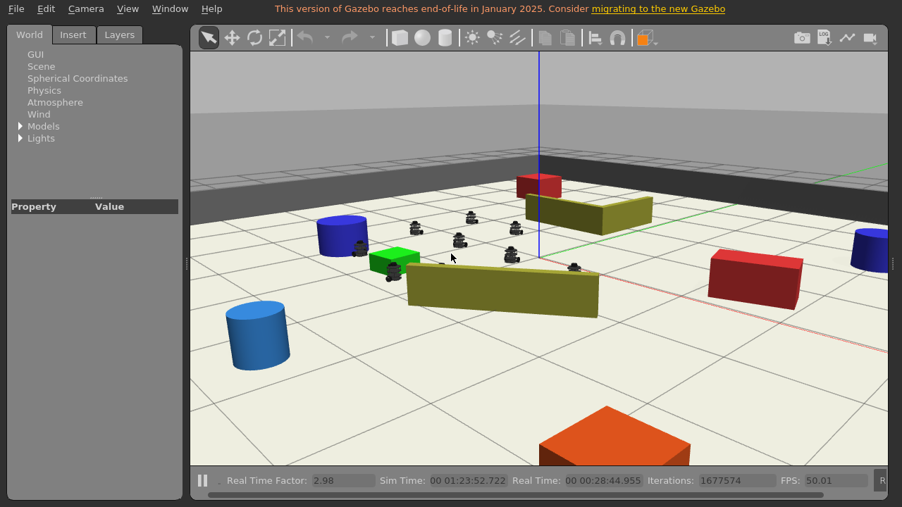

**Evidencia local del renderer.** La captura corresponde al mismo intervalo que `sonda-render-gpu-local-n10.json`: una ventana 1280×720, diez mallas TurtleBot visibles y la escena completa. Se conserva como diagnóstico previo al despliegue, no como sustituto de la captura pública final.

### I-043. Las primeras escenas «distantes» no satisfacían a la vez búsqueda y validación

**Ejecución descartada.** El objeto de la primera repetición final se colocó en (-0.8, -2.0). El controlador usa un alcance de sensado de 2.0 m y `tb3_1` lo encontró inmediatamente a 1.1 m. Aunque el ensayo habría podido continuar hasta el empuje, no demostraba el comportamiento solicitado de búsqueda distribuida y se detuvo antes de consumir el plazo de aceptación.

**Segundo intento descartado.** Se desplazó el inicio del objeto a (-0.8, -3.2) y su destino a (-0.8, -4.2). El objeto sí quedaba fuera del alcance inicial y dentro de los muros, pero el contrato del backend limita las coordenadas objetivo al intervalo [-4, 4]. La orden fue rechazada en 0.10 s, sin movimiento ni colisiones; este resultado verificó la validación de entrada, no el algoritmo.

**Corrección experimental.** La tercera geometría usa objeto (-3.5, -3.0) y destino (-3.5, -4.0). Mantiene más de 3 m respecto de la flota inicial, dispone de un carril despejado al oeste y al sur y cumple el límite de la API. El escenario se reconstruyó y ejecutó desde cero. Los dos intentos descartados se conservan como diagnóstico, pero no se agregan a resultados positivos.

### I-044. Una tarea completada no alcanzó un umbral fijo incompatible con la ruta corta

**Resultado rechazado por el harness.** La tercera geometría sí ejercitó el algoritmo completo: 986 muestras de búsqueda con 10/10 robots en movimiento, un hallazgo, nueve avisos y acuses, primer lote útil 10/10 en 148.51 s, 86 lotes GRF, fracción simultánea útil 0.6047, RTF 2.9666 y cero colisiones. ROS devolvió `completed/DONE`, todos los robots quedaron físicamente vinculados y la carga avanzó 0.5254 m con eficiencia 0.9997.

**Causa del falso negativo.** La ruta medía 1.0 m y la tolerancia de finalización era 0.5 m. Por contrato, la tarea puede terminar correctamente después de algo más de 0.5 m; el harness exigía de forma fija 0.55 m. La diferencia observada, 0.0246 m, no indicaba retroceso, deriva ni falta de participación, pero impedía usar la corrida como aprobación integral.

**Corrección del instrumento.** El umbral se hizo explícitamente dependiente del contrato de llegada, no del resultado observado. Para recorridos largos se conserva el mínimo configurado de 0.55 m. Para recorridos cortos se exige el menor valor entre ese mínimo y la distancia inicial a la meta menos la tolerancia de llegada; un épsilon positivo evita aprobar un caso degenerado sin avance. En esta geometría el gate correcto es 0.50 m. Las pruebas comprueban los tres casos por separado: ruta corta (0.50 m), ruta larga (0.55 m) y distancia inicial menor que la tolerancia. El objeto y el destino permanecieron en (-3.5, -3.0) y (-3.5, -4.0); no se alteró la escena para favorecer la repetición.

### I-045. El criterio fijo de aporte anulaba el contacto sincronizado durante la desaceleración final

**Síntoma.** La cuarta repetición conservó la búsqueda distribuida y la misma geometría. Los diez robots se movieron durante la búsqueda, el primero informó el hallazgo, los nueve restantes respondieron y todos llegaron a empujar. La carga avanzó 0.6755 m, quedó a 0.325 m del destino y no se observaron contactos inesperados. A pesar de ello, la tarea terminó como `FAILED` con el mensaje de que la carga había llegado pero la flota completa no pudo cerrar un contacto sincronizado seguro. El resultado mostraba los diez vínculos físicos activos, pero `all_pushers_confirmed=false`.

**Cómo se localizó.** Se comparó la referencia coordinada con la velocidad publicada por cada enlace cerca de la meta. La referencia había bajado a aproximadamente 0.018 m/s y la cadena completa avanzaba alrededor de 0.011 m/s. El criterio de aporte seguía exigiendo 0.015 m/s a cada robot. Por ello clasificaba como inactivo un empuje físicamente conectado, alineado y coherente con la desaceleración solicitada por el propio controlador.

**Corrección aplicada y comprobación física.** El umbral permanece en 0.015 m/s durante la marcha normal. Solo cuando la referencia coordinada es menor se utiliza el 50 % de esa referencia, con un piso absoluto de 0.003 m/s. No se modificaron la tolerancia de llegada, los plazos, la velocidad solicitada ni los gates del harness. Se añadió una regresión de cadena completa a 0.011 m/s con referencia de 0.018 m/s; aprobaron 150 pruebas de ciclo de vida, 20 de métricas y 8 de preflight. En la quinta repetición, la tarea terminó `DONE` con `all_pushers_confirmed=true`, diez contribuyentes, comandos finales de 0.017996–0.018 m/s y umbral interno efectivo de 0.009 m/s. Esto cierra el defecto de finalización, aunque la corrida todavía fue rechazada por dos incoherencias distintas del instrumento descritas en I-046.

### I-046. Dos magnitudes del harness no usaban la misma referencia que el contrato

**Resultado de la quinta repetición.** La búsqueda reunió 984 muestras, los diez robots se movieron, `tb3_0` informó el hallazgo y los otros nueve acusaron el aviso. La tarea terminó `completed/DONE`; la sonda obtuvo 49.882 FPS y RTF 2.9789, y no hubo contactos inesperados. El harness, sin embargo, informó 0.4998 m frente a un mínimo de 0.5000 m después del enganche y 41 de 90 lotes (45.56 %) con aporte simultáneo frente al gate de 50 %. Las dos raíces quedaron en 49.28 % de avance útil. No se redondearon los datos ni se redujeron los gates para aprobarla.

**Primera incoherencia: origen del progreso.** El mínimo de 0.50 m se derivaba de la distancia inicial de la escena, pero se comparaba con el avance contado solamente desde el inicio de `PUSH`. Durante el acople seguro la carga ya se había desplazado 0.0022 m; por eso el denominador contractual y el numerador partían de instantes distintos. El reporte ahora incluye la distancia a la meta al comienzo efectivo de `PUSH` y calcula `min(mínimo configurado, distancia en PUSH − tolerancia de llegada)`. Aplicado a la evidencia preservada, la distancia era aproximadamente 0.9973 m, el requisito coherente 0.4973 m y el avance posterior 0.4998 m. El gate configurado sigue siendo 0.55 m y la tolerancia sigue siendo 0.5 m.

**Segunda incoherencia: referencia de velocidad de las raíces.** El clasificador calculaba el umbral adaptativo desde la velocidad física instantánea del objeto o del robot padre. En algunos lotes el objeto alcanzó 0.0248 m/s mientras la referencia coordinada y los comandos estaban limitados a 0.018 m/s; el umbral resultante, 0.0186 m/s, era superior al comando que el propio algoritmo permitía. Ahora se conserva la medición física, pero la referencia usada para decidir aporte se acota por `push_reference_speed`. En ese caso el umbral correcto es 0.0135 m/s. Una regresión reproduce 0.0248/0.018 y exige seis de seis lotes útiles para una raíz y su compañero. Las suites quedaron en 150/150 de ciclo de vida, 22/22 de métricas y 8/8 de preflight.

**Cierre físico.** Se construyó una imagen nueva con ambas correcciones y se realizó una sola repetición desde una sesión limpia, sin reintento. Los diez robots aparecieron en las 977 muestras de búsqueda; `tb3_0` informó el hallazgo y los otros nueve recibieron y acusaron el aviso. La tarea terminó `completed/DONE`, con los diez identificadores en la lista vigente de empujadores útiles y `all_pushers_confirmed=true`. Hubo 55 de 93 lotes con aporte útil de la flota completa (59.14 %, frente al mínimo de 50 %) y el 53.63 % del progreso ocurrió con los diez aportando. Desde el comienzo real de `PUSH`, la distancia a la meta era 0.9992 m, el mínimo contractual 0.4992 m y el avance medido 0.5044 m. El objeto terminó a 0.4945 m del objetivo, dentro de la tolerancia sin redondear el resultado.

La repetición mantuvo RTF 2.9672; la sonda independiente registró RTF 2.979 y 49.960 FPS con D3D12/RTX 3080 y límite 50. No hubo contactos inesperados. El campo histórico `expected_docking_contact_count=1` correspondió al acople declarado medido por geometría; I-088 separa expresamente ese dato del contador de seguridad filtrado. El harness devolvió `passed=true` y lista de fallos vacía. Después aprobaron nuevamente 150/150 pruebas de ciclo de vida, 22/22 de métricas, 8/8 de preflight, compilación Python y `git diff --check`. La limpieza dejó cero procesos, contenedores o redes de la ejecución. Se conserva un [resumen sanitizado de la repetición final](assets/commissioning-2026-07/transporte-n10-final-v6.json), ligado por hash al [manifiesto original de la evidencia cruda](assets/commissioning-2026-07/transporte-n10-final-v6-manifest.sha256). El manifiesto queda versionado; los logs completos que enumera permanecen bajo custodia local fuera del repositorio y no se confunde su disponibilidad con la del resumen público. Con esta evidencia se cierran las dos incoherencias instrumentales y se acepta localmente el transporte N=10; la aceptación del mismo artefacto después del despliegue continúa separada en la sección 7.

### I-047. El cliente gráfico del host publicaba video sin estar unido de forma fiable a la escena

**Síntoma y riesgo.** El primer smoke del publicador nuevo podía abrir una ventana y producir H.264, pero eso no demostraba que Gazebo hubiese cargado la escena del contenedor. En WSL, el cliente anunció inicialmente `10.255.255.254`, dirección que la red Docker interna de la sesión no podía alcanzar. Aceptar solamente ventanas o paquetes RTP habría permitido publicar fotogramas repetidos de una escena vacía.

**Diagnóstico por capas.** La reproducción descubrió varios defectos independientes. `gzclient --version` mostraba Gazebo 11 y devolvía 255; el verificador confundía ese código poco habitual con una versión inválida. El entorno de WSL heredaba `TEMP` y `TMP` bajo `/mnt/c`, ruta deliberadamente oculta en el sandbox. X11 presentaba una ventana principal, un splash persistente y un propietario de selección de 3×3 píxeles; elegir por título podía enfocar la ventana equivocada. Finalmente, exportar `GZ_IP` no cambió el anuncio de Gazebo Classic: la inspección de `Connection.cc` y de la biblioteca instalada confirmó que esta versión consume `GAZEBO_IP`. Cada intento fallido se detuvo, se limpió y se utilizó para añadir una regresión antes de repetir el smoke.

**Corrección aplicada.** El publicador exige una única red interna, un único bloque IPAM, un único endpoint y etiquetas coincidentes de sesión y worker. Extrae el gateway de esa red, comprueba que la dirección pertenece realmente al host y entrega a `gzclient` tanto `GZ_IP` como `GAZEBO_IP` con el mismo valor validado. El cliente se ejecuta en `bubblewrap`, sin el árbol `/mnt`, con temporales privados y modelos tomados de la misma imagen ROS inmutable. Xvfb escucha únicamente por Unix; la selección de ventana exige que sea hija directa de la raíz, `NORMAL`, visible, no transitoria y estable en tres muestras. La ventana elegida debe ocupar 1280×720 en (0,0). El estado `READY` solo aparece después de validar renderer, viewport, FPS, PID, reporte atómico, tráfico RTP sostenido y ausencia de errores de recursos gráficos.

**Resultado físico.** El smoke limpio alcanzó `READY` con el plugin original, sin el fallback experimental de `PostRender`. El proceso anunció `172.23.0.1`, coincidente con las dos variables comprobadas en `/proc`. El renderer efectivo fue `D3D12 (NVIDIA GeForce RTX 3080)`; la cámara informó 46.124 FPS medios, el callback de render 49.785 FPS con límite 50 y la física RTF 2.975. El viewport fue 990×588 dentro de una ventana 1280×720. RTSP decodificó H.264, 1280×720, `yuv420p`, a 30 FPS. El roster contenía exactamente `tb3_0`–`tb3_9`, la captura mostró los diez TurtleBot y no hubo errores de mallas.

**Interacción y limpieza.** Cinco eventos del protocolo 2 incluyeron movimiento, botón y tecla con sus correspondientes liberaciones; el puntero pasó de (640,360) a (1023,144) y terminó sin botones activos. Después se mató deliberadamente el grupo del helper. Desaparecieron el helper, Xvfb, los dos procesos `bubblewrap`, `gzclient` y FFmpeg; también desaparecieron lock, socket, directorio de ejecución y proceso que mantenía la entrada. La auditoría final encontró cero contenedores, redes, relays o procesos pertenecientes al smoke. El [resumen sanitizado del publicador](assets/commissioning-2026-07/smoke-publicador-gpu-local.json) incluye el hash del [manifiesto original de la evidencia cruda](assets/commissioning-2026-07/smoke-publicador-gpu-local-manifest.sha256). El manifiesto se versiona sin los identificadores del resumen operativo; los archivos completos que enumera permanecen custodiados fuera del repositorio. Este resultado aprueba el conducto privado GPU→H.264 y su recuperación local. No reemplaza la aceptación autenticada de dos usuarios en Chrome ni demuestra todavía la interacción desde la página pública; esos gates permanecen en la sección 7.

### I-048. Una pérdida de foco, autorización o conexión podía dejar una entrada activa en XTest

**Riesgo localizado durante la revisión.** El navegador enviaba `keyDown` y `pointerDown` por separado de sus liberaciones. Si el usuario mantenía una tecla y después pulsaba el botón de pantalla completa, el foco pasaba del video al botón y el `keyUp` podía no llegar al componente. También era posible que una ráfaga de rueda agotara el límite de 120 eventos por segundo o que la autorización venciera justo antes de enviar los `keyUp` y `pointerUp`. Desactivar la interfaz después del error no liberaba por sí solo el estado que XTest ya había aplicado.

**Corrección en el cliente.** Los eventos atraviesan una cola a intervalos de 10 ms, con un ritmo nominal de 100/s por debajo del techo de 120/s. Solo existe una invocación reconocida en vuelo; la cola conserva como máximo 64 transiciones, sustituye el movimiento por el más reciente y acumula la rueda dentro de sus límites. Un timeout o desbordamiento descarta las presiones pendientes y da prioridad a un único objeto exacto `{ "type": "releaseAll" }`. La misma cola se conserva si React cambia el callback, de modo que dos generaciones no envían a la vez. Después de un rechazo, el botón «Interactuar» puede rearmarla realmente; antes solo cambiaba el aspecto del botón y las teclas nuevas se descartaban en silencio. Activarlo únicamente arma el canal y enfoca el video: no fabrica una entrada para Gazebo. Desactivarlo emite exactamente una liberación global.

**Endurecimiento P2 de fullscreen.** La revisión final consideró el caso en que el navegador usa `Escape` para salir de fullscreen y no entrega el `keyup` al video. Un latch que esperase obligatoriamente esa liberación podría confundir el siguiente Escape físico con la repetición de la pulsación anterior. La corrección reserva Escape al navegador mientras abandona fullscreen, consume solamente los `keydown` cuyo `event.repeat` es verdadero y acepta una pulsación nueva no repetida aunque se haya perdido el `keyup` anterior. El evento `fullscreenchange` también libera una sola vez todas las entradas retenidas si el navegador sale por su cuenta. De esta forma, una tecla W sostenida no queda aplicada en XTest y Escape no se reenvía a Gazebo.

**Corrección en el worker.** Una desconexión o sustitución de grant utiliza el mensaje interno `ViewerInputRelease`, que el navegador no puede construir. Si el canal Worker Hub entra en `Reconnecting` o `Closed`, ambos avisos se agrupan en un solo intento de liberación global; un fallo inmediato o tardío permite un reintento, pero nunca dos ejecuciones concurrentes. Cada publicador dispone de su propio gate de entrada. Un error de `stdin`, incluido `ObjectDisposedException`, marca y separa la instancia exacta mientras todavía posee el gate, por lo que una segunda escritura no puede colarse después del fallo ni bloquear otra sesión. Si el proceso padre termina durante `StopSession`, expiración o recuperación, el grupo se recolecta con un plazo independiente de la cancelación del lease. La unidad declara además `KillMode=control-group` como última barrera operacional.

**Cómo se comprobaron las carreras.** La segunda revisión no se limitó al camino nominal. Se bloquearon artificialmente dos escrituras de sesiones distintas, se hizo fallar el pipe mientras otra escritura esperaba, se mató el padre mientras `StopSession` competía con la recuperación y se cambiaron callbacks con una invocación pendiente. El worker aprobó 21/21 pruebas focalizadas y 119/119 en la suite completa; `HlsViewer` aprobó 32/32 casos focalizados y el frontend 79/79 en total. El publicador, el despliegue/rollback, `py_compile`, el lint de los 27 archivos modificados y el build de producción también aprobaron. La interacción visible desde el sitio público continúa separada en la sección 7.

### I-049. Un mismo lease admitía varios controladores y conservaba autorizaciones revocadas

**Localización independiente.** Una auditoría de concurrencia observó que el límite de 120 eventos/s pertenecía al `connectionId`. Dos pestañas del mismo usuario podían autorizar el mismo lease y entregar 240 eventos/s; además, al desconectar una, su liberación era indistinguible del estado sostenido por la otra. La misma lectura mostró un riesgo distinto: `BeginViewerControl` consultaba PostgreSQL una sola vez y después conservaba hasta 30 segundos un snapshot en memoria. Una revocación, una cuenta deshabilitada o una sesión en `Stopping`, `Failed` o `Expired` no invalidaban inmediatamente ese grant.

**Reproducción.** Se autorizaron dos conexiones con los mismos identificadores y se agotaron sus contadores en el mismo segundo. También se dejó un `ViewerInput` detenido dentro de `SendAsync` mientras otra tarea intentaba desconectar o revocar el lease. Finalmente, se renovó un grant entre la toma del snapshot y su drenaje para comprobar que una versión antigua no pudiera retirar la nueva. Estos ensayos fallaban con el registro anterior o demostraban el envío multiplicado.

**Corrección aplicada.** El registro mantiene un único controlador por par sesión–lease; una segunda conexión recibe un rechazo hasta que la primera haya encolado su liberación y sea retirada. Un `SemaphoreSlim` propio del lease abarca validación, cuota y `SendAsync`, por lo que desconexión, reemplazo y entrada no dejan un hueco entre comprobar y enviar. El bucket también pertenece al lease y sobrevive al churn durante la ventana activa. Los eventos, incluidas las liberaciones efectivamente reenviadas, consumen el límite; después de agotarlo se permite una sola liberación final de seguridad, con un máximo de 121 envíos confirmados, y ninguna entrada normal adicional.

**Reconciliación con la base y desconexiones.** Un servicio singleton inspecciona cada segundo un snapshot versionado y valida en un solo lote lease, propietario, cuenta habilitada, estado de sesión, expiración y worker asignado. Si algún dato deja de ser válido, solicita `ViewerInputRelease` y elimina solo la versión observada. Una desconexión se registra antes de esperar el gate; esa marca impide que una renovación concurrente vuelva a autorizar el mismo `connectionId` y obliga al reconciliador a terminar la liberación si el callback de SignalR agota su segundo de espera. Un `releaseAll` fallido se conserva de la misma forma: bloquea entradas normales, admite otro intento de liberación y no depende de que el navegador vuelva a invocarlo.

**Orden transaccional y envíos tardíos.** La rotación de lease y el `DELETE` de sesión publican una valla de revocación antes del commit. La valla espera cualquier entrada ya iniciada, rechaza movimientos posteriores y permite siempre `releaseAll`; si la transacción falla se retira por versión, y si confirma se conserva mientras el drenaje se completa. Cada espera hacia Worker Hub está limitada a dos segundos. Si una implementación de `SendAsync` ignora la cancelación y el input normal termina después del timeout, una continuación espera esa terminación y emite otra liberación exacta detrás de ella. El reconciliador procesa hasta cuatro drenajes simultáneos: un lease lento no forma convoy, pero tampoco se crea una tarea sin límite por cada snapshot.

**Verificación y límite declarado.** Aprobaron 42/42 regresiones dirigidas y 179/179 pruebas del backend. Se cubrieron segundo controlador, reconexión sin reiniciar cuota, alternancia maliciosa entrada/liberación, fallo del único release de desborde, timeout de desconexión, renovación concurrente, rollback y confirmación de vallas, envío que termina tarde, revocación real en la base, protección de una versión renovada y paralelismo máximo de cuatro drenajes. La estrategia es deliberadamente fail-safe: una liberación tardía del lease anterior puede soltar momentáneamente teclas del controlador sustituto, que deberá volver a presionarlas, pero nunca conserva una presión incierta. Una tarea auxiliar permanecería esperando si una implementación defectuosa de `SendAsync` no terminara jamás; el grant queda bloqueado y las demás sesiones continúan. La exclusividad presupone la instancia única de backend actual. Un futuro scale-out o takeover forzado requerirá un número de generación compartido o un coordinador distribuido; no se presenta este diseño local como solución multiinstancia.

### I-050. La repetición final seleccionó herramientas de Windows y omitió el entorno Python de CI

**Síntomas.** La primera repetición conjunta no llegó a ejecutar el frontend: `npm` procedía de `C:\nvm4w`, abrió `cmd.exe` sobre una ruta UNC de WSL y respondió que `craco` no existía. En paralelo, Python ejecutó 331 pruebas ROS y produjo un único error al importar `follow_leader.py`: el paquete `robot_swarm_bridge` no estaba en `PYTHONPATH`. Ninguno de los dos mensajes señalaba una regresión del código que se acababa de probar.

**Cómo se localizaron.** `which npm` devolvió la instalación montada de Windows, mientras `node` ni siquiera existía en el `PATH` Linux de ese shell. La carpeta temporal conservaba Node 20.19.1 nativo y el enlace de `craco` era correcto. Para ROS se comparó el comando manual con los workflows: CI antepone tanto `swarm_ws/src/robot_swarm_bridge/src` como `swarm_ws/src/robot_swarm_bridge/scripts`. La importación fallida desaparecía al reproducir esas mismas dos entradas.

**Tratamiento y resultado.** Se repitió el frontend con el `PATH` limitado al Node Linux conservado y ROS con el `PYTHONPATH` exacto del workflow. El frontend aprobó 10/10 suites y 79/79 pruebas en 4.536 s; ROS aprobó 362/362 en 31.983 s. El worker aprobó 119/119 en la misma tanda. Al repetir el build, la carpeta ignorada `SwarmFrontend/build` conservaba artefactos creados como `root` por una ejecución anterior en contenedor y produjo `EACCES` al intentar limpiarlos. Se mantuvo intacta y se utilizó un `BUILD_PATH` temporal nuevo; la compilación de producción terminó correctamente, lo que separó un permiso residual del resultado del código. También se ejecutó `dotnet format --verify-no-changes`: la base completa conserva formato heredado incompatible en archivos antiguos, por lo que no se hizo un cambio masivo ajeno al objetivo; la verificación limitada a los seis archivos C# tocados por este cierre sí aprobó. Este episodio se registra para que una futura reproducción no convierta una mezcla de toolchains o de propietarios de artefactos en un defecto ficticio.

### I-051. El runner de CI no incluía `xdpyinfo`

**Síntoma.** La primera publicación del candidato, `f3929bb8da7601264be51b84bf706babe86b7940`, inició la ejecución CI #31 en el PR #99. Compilación y pruebas de backend, migraciones, Compose, MediaMTX, las 119 pruebas del worker y todo el job de frontend aprobaron. El paso «Test viewer publisher helper» terminó en 127 con `timeout: failed to run command 'xdpyinfo': No such file or directory`. El job ROS ya había aprobado sus 362 pruebas y seguía construyendo la imagen; se canceló el run en ese punto porque el resultado global ya no podía aprobar, evitando consumir minutos sin cambiar el diagnóstico.

**Cómo se localizó.** El log completo permitió separar el fallo de las pruebas del publicador: el script no llegó a evaluar la primera aserción, sino que se detuvo al invocar una herramienta externa ausente. `dpkg-query -S /usr/bin/xdpyinfo` confirmó que Ubuntu la distribuye en `x11-utils`. La prueba también abre `/usr/bin/Xvfb`; aunque el runner lo traía de forma implícita, depender de la imagen preinstalada hacía que el requisito fuera incompleto.

**Corrección y cierre.** El paso de instalación declara ahora `ffmpeg`, `x11-utils` y `xvfb` con `--no-install-recommends`. No se relajó ni se omitió ninguna comprobación X11. La ejecución CI #32 sobre `23b280ecd434647ccff2f179432d5650761a1f5f` aprobó el helper completo, backend, frontend, worker, las 362 pruebas ROS y la construcción de la imagen ROS. CI #31 permanece registrado como resultado rechazado y no como flakiness reintentada sin cambios.

### I-052. GitGuardian interpretó el nombre de una lista de rutas como contraseña

**Síntoma.** Después de aprobar CI #32, el estado combinado del PR seguía inestable porque el check externo «GitGuardian Security Checks» informó un «Generic Password». El resumen de GitHub señaló `routesConfig.js:24`, concretamente un identificador compuesto por el prefijo `legacy`, la palabra `Password` y el sufijo `Routes`. La expresión asignaba una lista de componentes React y no contenía credencial, literal sensible, dato de usuario ni llamada a un servicio externo.

**Cómo se comprobó.** Se inspeccionaron la línea señalada, su diff contra `main` y todos los contenidos añadidos mediante búsquedas de tokens, claves privadas, rutas personales y pares de credenciales. El único elemento relacionado con el hallazgo era la palabra `Password` dentro del nombre descriptivo de la variable; sus valores eran `ResetPasswordPageConfig` y `ForgotPasswordPageConfig`, módulos ya existentes. Por ello se clasificó como falso positivo semántico, no como secreto que requiriera rotación.

**Corrección y tratamiento del historial.** La lista pasó a llamarse `legacyRecoveryRoutes`, sin cambiar su condición ni las rutas expuestas. Como el scanner había señalado el primer commit del PR, un commit posterior no retiraba el texto del historial analizado. Antes del merge se conservó una referencia local al extremo anterior y se reconstruyó solo la rama del PR sobre la misma base mediante un commit limpio; la actualización remota utilizó `force-with-lease`. `main`, los despliegues activos y los tags de rollback no se modificaron durante esa operación. GitGuardian y todos los checks funcionales aprobaron el SHA limpio `9c0dc0598cd225278e71f924cf30fc1748697370`; después el PR #99 se integró en `main`. No fue necesaria una rotación de credenciales porque la inspección confirmó que nunca existió un secreto.

### I-053. El runner autohospedado quedó en espera por un certificado TLS vencido de GitHub Actions

**Síntoma.** Después del merge, CI #34 y el despliegue de Cloudflare terminaron correctamente, pero la ejecución #171 del workflow de backend (run ID `29707925944`, job ID `88247868770`) permaneció en cola aunque el servicio del runner figuraba activo. El backend anterior, PostgreSQL y MediaMTX continuaron sanos y la ruta pública `/health` siguió respondiendo HTTP 200. Por ello se trató como una interrupción del canal de despliegue y no como una caída de producción.

**Cómo se localizó.** Se reinició una sola vez el servicio del runner para descartar un listener detenido, sin reiniciar contenedores de aplicación. El journal mostró `AuthenticationException` con la condición `NotTimeValid`. El reloj UTC del host era correcto y la inspección TLS con SNI, repetida tanto desde la máquina virtual como desde la estación WSL, obtuvo el mismo [certificado `*.actions.githubusercontent.com` vencido](assets/commissioning-2026-07/github-actions-tls-expired-20260720.txt). El acceso HTTPS general a GitHub funcionaba y dos resolutores DNS públicos devolvían el mismo destino, de modo que se descartaron un reloj local incorrecto, una CA dañada, un problema exclusivo de la VM y un defecto del repositorio. La página pública de estado figuraba inicialmente operativa; a las 23:34 UTC GitHub abrió el [incidente específico de Actions](https://www.githubstatus.com/incidents/8vfyvq16hzh9), a las 23:37 UTC informó que los workflows nuevos podían demorarse o no iniciar y a las 23:57 UTC comunicó que había identificado la causa y trabajaba en restaurar el servicio. A las 00:07 UTC del 20 de julio añadió una degradación de disponibilidad de las solicitudes API. A las 00:20 UTC elevó Actions de rendimiento degradado a interrupción parcial y mantuvo la investigación. Estas dos últimas horas UTC corresponden a las 20:07 y 20:20 del 19 de julio en Bolivia (UTC−04:00). Las actualizaciones coinciden con la observación, pero se conserva la secuencia porque el diagnóstico local precedió al aviso del proveedor.

**Contención y cierre.** No se deshabilitó la verificación TLS, no se instaló una excepción de confianza y no se redirigió el runner a un endpoint supuesto. La ejecución original se dejó en cola y ambos runners autohospedados conservaron su reintento automático, evitando crear ejecuciones duplicadas y consumir minutos sin cambiar el diagnóstico. A las 02:08:44 UTC el mismo endpoint presentó un [certificado vigente](assets/commissioning-2026-07/github-actions-tls-recovered-20260720.txt), válido hasta el 16 de septiembre de 2026. Sin reinicio, rerun ni dispatch, el job original terminó `success` a las 02:11:09 UTC; checkout, validación de `main`, build, Compose y prune aprobaron. La ruta pública `/health` respondió nuevamente `Healthy`. Con estas cuatro observaciones se cerró I-053 para el canal usado. La identidad no secreta del worker GPU permaneció en transporte Unix, límite de 50 FPS, mínimo de 45 FPS y adaptador NVIDIA con permisos `0600`; su despliegue final continúa separado porque debe usar el SHA posterior al delta.

### I-054. El primer instrumento visual contradecía el estado posterior a detener una sesión

**Síntoma localizado antes de producción.** El arnés visible debía detener la sesión A, demostrar que B continuaba ejecutando su tarea y capturar ambas ventanas. Sin embargo, la función común de captura exigía un HLS interactivo vivo para los dos usuarios. Esa condición era correcta antes de la detención, pero imposible para A después de que la interfaz ya había regresado a «Crear simulación». La misma función desplazaba ambas páginas hasta el video, de modo que la fotografía rotulada como estado de tareas no garantizaba que los paneles de resultado siguieran visibles. Una auditoría estática independiente concluyó que la ruta nominal terminaría por timeout aunque el aislamiento real funcionara.

**Corrección del flujo y de su cancelación.** La captura se dividió en tres modos con contratos distintos: `viewers` exige dos HLS vivos y visibles; `tasks` conserva y comprueba los dos paneles; `post_stop` exige que A muestre la sesión liberada sin visor y que B mantenga simultáneamente HLS y tarea en ejecución. Las mediciones largas de video se fraccionaron en intervalos de hasta dos segundos. Los auxiliares de PowerShell se ejecutan en un grupo de procesos interrumpible, y la primera excepción de una operación paralela activa un evento compartido y cancela los futuros pendientes. Así, una ventana que falla no deja a la otra esperando varios minutos antes de entrar al `finally` de limpieza.

**Revisión de seguridad del enlace entre ensayos.** La primera variante de la huella entre el reporte API y el visual derivaba la clave HMAC de la propia contraseña. La revisión observó que, si se conocía el correo y se obtenía el reporte, esa construcción servía como verificador de contraseñas fuera de línea. Se descartó antes de usarla. La variante final utiliza una clave aleatoria independiente de 32 bytes, guardada fuera del repositorio en un archivo regular del propietario con modo `0600`. Ambos lectores abren ese archivo con `O_NOFOLLOW`, validan el descriptor con `fstat` y calculan HMAC-SHA-256 sobre marcador de cuenta, correo normalizado y contraseña; ni la clave ni esos valores se escriben en la evidencia. El reporte conserva solo la huella, el host API, el SHA esperado y una antigüedad máxima de treinta minutos. Además, su raíz y cada objeto interno se validan por tipo, y una entrada de `checks` que no sea un objeto aprobado invalida el ensayo.

**Verificación sin atribución operacional.** Los dos arneses compilaron con Python 3.8.10. Pruebas sintéticas rechazaron otra revisión, otra cuenta, otra clave, una raíz JSON no válida y una lista de checks mal formada; también comprobaron la cancelación cooperativa, la interrupción del grupo auxiliar y la agregación correcta de video por intervalos. La versión visual conserva por separado la escena y el panel después de cada tarea, además del visor y el panel de B después de detener A. Para que la inspección sea reproducible, se versionaron el [arnés visual](../scripts/acceptance/robotswarm-visible-e2e.py), el [arnés API](../scripts/acceptance/robotswarm-prod-e2e.py) y sus [instrucciones de ejecución](../scripts/acceptance/README.md), sin credenciales ni rutas personales. La revisión independiente no encontró defectos P0, P1 ni P2 en los hashes `a9439da7b76a1e5ff37846f32c266802ff81e94dd7c2ff11a001c3ba761893dc` —visual— y `46d9daf1baf9c6ee00c3d8a3a426b7407079de1d95b78410c7c439e986674c43` —API—. Esta aceptación se limita al instrumento: todavía no reemplaza la ejecución visible contra el release productivo.

### I-055. El historial visible consultaba `TaskLog`, no las tareas ejecutadas por ROS

**Síntoma.** La opción «Historial de tareas» podía estar vacía o mostrar registros del flujo directo antiguo, aunque el usuario hubiera ejecutado formación, seguimiento o transporte desde Control de simulación. Además, la colección heredada era global: no representaba de manera segura el historial de cada propietario.

**Diagnóstico.** Las tareas reales del plano de control se guardan como `TaskRun` y están relacionadas con una `SimulationSession` propietaria. La pantalla todavía llamaba `/TaskLog`, entidad previa a las sesiones. Comparar ambos modelos mostró que `TaskLog` no contiene los estados, resultados terminales y correlación de sesión que el worker y ROS reportan actualmente.

**Solución.** Se añadió `GET /api/sessions/tasks/history`, que exige identidad, filtra por `SimulationSession.AccountId`, ordena de más reciente a más antiguo, pagina entre 1 y 100 elementos y admite filtros validados de tipo, estado y resultado. La nueva pantalla muestra progreso, duración, parámetros, resultado, error, motivo del resultado y marcas de tiempo. Las seis rutas de `TaskLog` quedaron fuera de la navegación y restringidas al rol `Admin` por compatibilidad y diagnóstico del legado; ya no alimentan el historial de usuario.

**Límite y prueba focal.** No se eliminó la tabla heredada, porque todavía puede ser útil para inspeccionar datos antiguos. Tampoco se migraron esos registros a `TaskRun`: presentarlos como tareas ROS sería incorrecto. Aprobaron 3/3 casos de backend para propiedad, paginación, validación y filtros; 1/1 para la autorización de `TaskLog`; y 5/5 casos de presentación del historial. La consulta pública y una captura con datos reales quedan pendientes del despliegue final.

### I-056. Plantillas ofrecía acciones que el backend nunca implementó

**Síntoma.** La sección denominada «Tareas» le permitía al usuario intentar crear o eliminar elementos y enviaba algunas operaciones a `/api/LeafType`. El backend real de plantillas solo exponía `GET /TaskTemplate` y `PUT /TaskTemplate/{id}`. Por eso parte de la interfaz podía terminar en 404 o sugerir una capacidad inexistente.

**Diagnóstico.** Se comparó la configuración de rutas React, el servicio Redux y los endpoints mínimos del backend. Los campos adicionales del diálogo provenían del dominio original del template de interfaz, no del contrato de RobotSwarm. También se observó que el catálogo compartido no debía quedar accesible a usuarios normales.

**Solución.** La navegación ahora se llama «Plantillas de tareas» y exige `Admin`. La lista realiza el `GET` real y el único diálogo disponible edita mediante `PUT` solo `name` y `taskType`. Se retiraron de la experiencia las acciones falsas de alta y eliminación. El backend limita su grupo a administrador, valida nombre y tipo, normaliza el nombre y responde 404 cuando la plantilla no existe. La URL antigua redirige a la ruta descriptiva nueva para no romper marcadores locales.

**Límite y prueba focal.** Editar la etiqueta o el tipo del catálogo no instala un algoritmo, no cambia código ROS y no crea una ejecución. Aprobaron 9/9 casos de backend para superficie HTTP, rol, validación y persistencia, y 5/5 casos de API/modelo frontend. Falta comprobar la pantalla con un administrador del release desplegado y reservar su captura real.

### I-057. El registro de robots confundía inventario persistente con instancias runtime y permitía una mutación de propiedad

**Síntoma.** La pantalla heredada dependía de un Hub deshabilitado, no presentaba carga, error o reintento de forma clara y usaba estados poco comprensibles. En el backend, un robot marcado como público podía ser modificado por otra cuenta, porque la comprobación anterior usaba visibilidad como si fuera propiedad. El cliente también podía enviar un `AccountId` durante el alta.

**Diagnóstico.** Se siguió por separado la entidad persistente `Robot` y el roster `SessionRobot` que publica el worker. Son conjuntos distintos: el primero sirve como inventario y el segundo describe cada `tb3_*` activo dentro de una sesión. La autorización de actualización solo rechazaba robots privados ajenos; por eso un robot público quedaba expuesto a escritura no autorizada.

**Solución.** Se reconstruyó la vista de inventario con búsqueda, alta, edición, desactivación, estados en español, carga, vacío, error y reintento. El backend ignora cualquier propietario enviado por el cliente y utiliza el identificador autenticado; el alta siempre comienza en `Idle`. Solo el propietario o un administrador puede actualizar o cancelar, incluso si el robot es público. El administrador puede listar todos los robots activos y las respuestas de error devuelven un objeto serializable `{ message }`.

**Límite y prueba focal.** El registro no muestra posición, velocidad o salud de Gazebo; esos datos pertenecen al monitor de sesión de I-060. La desactivación tampoco detiene una simulación que ya está operando. Aprobaron 8/8 casos de backend sobre propietario, administrador, listado, alta, validación y error, y 7/7 casos frontend de API y modelo. El lint focal y la compilación de producción también aprobaron, pero la operación pública sigue pendiente.

### I-058. La asignación de tareas a grupos solo simulaba una ejecución ROS

**Síntoma.** El backend aceptaba `POST /RobotGroups/{groupId}/tasks`, pero el método creaba un `TaskLog` por robot con la colección `Robots` vacía y cambiaba el estado persistente a `Working`. No emitía un `WorkerCommand`, no creaba `TaskRun` y no alcanzaba al orquestador ROS. Mostrar ese botón habría comunicado un éxito que nunca ocurrió.

**Diagnóstico.** Se recorrió la ruta desde el controlador hasta el servicio y se comparó con `POST /api/sessions/{id}/tasks`, que sí produce el comando durable correlacionado. También se comprobó que los grupos existentes son globales y carecen de propietario, por lo cual su administración no debía exponerse a todos los usuarios autenticados.

**Solución.** Se eliminó la ruta falsa de asignación y el modelo asociado. El grupo quedó como catálogo administrativo real: crear, editar, eliminar, listar robots activos, agregar o quitar membresía y transferir un robot solo tras una confirmación explícita. Todas sus rutas exigen `Admin`; los nombres se normalizan, no se permiten duplicados sin distinguir mayúsculas y al eliminar un grupo los robots vuelven a quedar disponibles. La interfaz indica de forma visible que las tareas ROS se ejecutan únicamente en Control de simulación.

**Límite y prueba focal.** La membresía organiza inventario; no obliga a que una futura sesión use esos identificadores persistentes ni inicia ROS. Aprobaron 5/5 casos de backend para rol, superficie sin `/tasks`, validación, transferencia y liberación, y 9/9 casos frontend de API y modelo. La aceptación con datos productivos y la captura de la nueva sección permanecen pendientes.

### I-059. El usuario no podía cerrar únicamente su visor privado

**Síntoma.** La interfaz ofrecía «Abrir visor», pero no una operación equivalente para cerrarlo. El publicador podía continuar hasta caducar el lease o hasta detener toda la sesión, consumiendo memoria y recursos gráficos aunque el usuario solo quisiera dejar de ver Gazebo.

**Diagnóstico.** El contrato disponía de `SetViewerSource` y `StopSession`, pero no de un comando intermedio. Borrar solamente el estado React habría ocultado el video sin revocar autorización, liberar teclas presionadas ni detener FFmpeg/gzclient. También existía una carrera: un comando de apertura retrasado podía llegar después de la revocación.

**Solución.** Se incorporó `DELETE /api/sessions/{sessionId}/viewer-lease/{leaseId}` con comprobación de propietario, transacción serializable, reintento acotado e idempotencia por lease. La revocación se confirma y drena antes de notificar el comando durable `StopViewer`. El worker anuncia esa capacidad, valida la correlación sesión/lease, detiene solo el publicador coincidente y conserva temporalmente un tombstone que impide revivir una apertura ya revocada. Cerrar un lease antiguo no detiene uno nuevo. El frontend envía primero `releaseAll`, deshabilita la interacción durante el cierre y retira el reproductor solo después de la respuesta.

**Límite y prueba focal.** Un worker antiguo sin `StopViewer` recibe un conflicto en lugar de una revocación incompleta; por eso backend y worker deben desplegarse con la misma revisión. Aprobaron 5/5 casos específicos de backend. La banda focal de 19/19 pruebas del worker cubrió handler, publicador y anuncio de capacidades; los 13 casos frontend del espacio/servicio, incluidos cierre, limpieza de estado y petición autenticada, también aprobaron. Todavía no se ha observado el ahorro real de memoria ni el cierre desde `rs.zerav.la`.

### I-060. El frontend no mostraba el roster runtime y no recuperaba el primer fallo de SignalR

**Síntoma.** La sección «Robots» solo describía el inventario persistente. Dentro de una simulación no había una vista individual de las instancias informadas por el worker. Además, `withAutomaticReconnect` cubría desconexiones posteriores, pero no reintentaba un primer `start()` rechazado; la interacción del visor podía permanecer deshabilitada hasta recargar. Detener la sesión completa tampoco pedía confirmación.

**Diagnóstico.** La API ya exponía `/api/sessions/{id}/robots` y el espacio hacía sondeo de detalles cada tres segundos, pero utilizaba el roster principalmente para el selector de cámara. La inicialización de SignalR tenía un único `catch` silencioso. La acción «Detener sesión» llamaba directamente al backend pese a que libera tareas, visor, Gazebo, ROS, contenedor y red.

**Solución.** Se añadió un monitor por sesión con una tarjeta por robot: identificador runtime, namespace, ordinal, rol, estado, hora de actualización y resumen de operativos/no disponibles. La interfaz diferencia «tiempo real conectado» de «actualización por sondeo». El primer inicio de SignalR se reintenta con espera exponencial acotada a diez segundos y dispone de «Reconectar ahora»; mientras tanto se mantiene el sondeo y se bloquea la entrada interactiva. La parada completa abre un diálogo que explica sus efectos antes de ejecutar la solicitud. El panel de tarea muestra también `outcomeReason` cuando aporta información distinta del error.

**Límite y prueba focal.** El monitor refleja estados publicados; no inventa pose, velocidad o diagnóstico de sensores y no reemplaza un supervisor periódico capaz de detener una sesión ante una muerte tardía. Los 12/12 casos focales de `SimulationWorkspace` aprobaron, incluidos resumen de roster, render por robot, reintento inicial y confirmación de parada. La degradación y recuperación deben observarse todavía contra el proxy SignalR real.

### I-061. La navegación mantenía nombres del proyecto heredado y ocultaba el alcance real de Usuarios

**Síntoma.** El menú mezclaba «Tareas», «Cuentas» y rutas internas llamadas `leafTypes` o `leafSorting`. Esta terminología hacía difícil distinguir plantillas, ejecuciones reales, inventario y administración de usuarios, especialmente después de añadir Grupos y el monitor runtime.

**Diagnóstico.** La revisión de `navigationGTSConfig`, las configuraciones de rutas y los encabezados mostró que el CRUD de cuentas ya funcionaba, pero se presentaba como «Cuentas» y las nuevas secciones no formaban un conjunto coherente. La ruta de detalle de robot seguía apuntando a una vista dependiente del Hub antiguo.

**Solución.** El menú GTS queda compuesto por «Plantillas de tareas», «Historial de tareas», «Control de simulación», «Robots», «Grupos de robots» y «Usuarios», con roles coherentes. El encabezado del CRUD se muestra como «Usuarios» en RobotSwarm. Las URLs antiguas compatibles redirigen a las pantallas nuevas, y el detalle legado de robot vuelve al registro estable en vez de abrir una vista sin fuente viva.

**Límite y verificación.** El cambio de nombre no amplía permisos: Usuarios, Plantillas y Grupos continúan siendo administrativos. En conjunto, el delta aprobó localmente 31/31 pruebas focales de backend, 19/19 del worker y 39/39 de frontend, además de una auditoría específica de secciones con 48/48 casos. El corte integral final después de I-062 aprobó backend 213/213, worker 121/121, ROS 362/362, frontend 132/132 en 22 suites y el auxiliar del publicador. También aprobaron el lint de todos los archivos frontend modificados y la compilación de producción. No se ejecutó GitHub Actions para obtener estos resultados y no se presenta una captura local como evidencia pública. Falta crear un único PR/CI, desplegar el SHA resultante y obtener las capturas reservadas en 7.1.

### I-062. La auditoría final encontró un cierre asíncrono no observable y rutas con permisos incompatibles

**Síntomas.** El `DELETE` del lease devolvía HTTP 202 con una ubicación consultable, pero esa consulta mostraba solamente el comando que había abierto el visor. La interfaz borraba inmediatamente el lease local, aunque `StopViewer` podía seguir en cola o fallar; por tanto, «Cerrar visor» significaba «cierre solicitado» y no «publicador liberado». En una segunda revisión, la URL heredada de detalle de robot aceptaba el rol User y redirigía al registro exclusivo de Admin. Finalmente, el step de ESLint en CI enumeraba el control de sesión anterior, pero omitía la mayoría de Plantillas, Historial, Robots, Grupos y Usuarios.

**Diagnóstico.** Se trazó el mismo identificador desde la respuesta del backend hasta `SimulationSessionService`, `SimulationWorkspace` y el worker. La persistencia del comando era correcta, pero faltaba exponer su estado como entidad distinta de `SetViewerSource`; un 202 solo acreditaba encolado. La comparación de `authRoles` confirmó que el redirect heredado cruzaba una frontera de autorización. En CI, `npm test` y el build con `CI=false` no sustituían las reglas de ESLint para esos archivos.

**Solución.** El estado del lease separa ahora `command` de apertura y `closeCommand`. El frontend revoca interacción y video, conserva el lease mientras sondea ocho veces cada 1,25 s y solo lo elimina al recibir `Completed`; para `Failed`, `Cancelled` o timeout presenta el estado real y permite reintentar. El backend admite como máximo tres intentos idempotentes por lease, sin detener la sesión, ROS o Gazebo. Los enlaces heredados de robot vuelven a Control de simulación, accesible para User, y CI enumera explícitamente todos los archivos modificados de las seis secciones y sus pruebas.

**Verificación.** El contrato de cierre y estado aprobó 11/11 pruebas backend y el servicio/espacio frontend 19/19; la navegación heredada aprobó 4/4. Después se repitieron las suites integrales con backend 213/213 y frontend 132/132. Worker 121/121 y ROS 362/362 permanecen válidos porque I-062 no modificó esas capas. El lint del delta, el build de producción, `git diff --check`, el parseo YAML y `actionlint` 1.7.12 aprobaron; en esta última herramienta se ignoraron únicamente los nombres conocidos de los runners autohospedados.

### I-063. El preflight del worker dependía de un `DISPLAY` ambiental después de reiniciar WSL

**Síntoma.** PR #100 y CI sobre `main` aprobaron, Cloudflare publicó el frontend y el backend `baba2c1` quedó sano. El workflow GPU `29712833482` aprobó sus diecisiete pasos previos —incluidos worker, publicador, despliegue atómico, 362 pruebas ROS, imagen inmutable y smoke NVIDIA—, pero «Deploy worker and verify readiness» terminó con `required executable '/usr/bin/xprop' returned an error`. El workflow reanudó la planificación y el despliegue conservó el release anterior `62a136a`; no quedó un worker parcial. El corte saneado del run y de la reproducción se conserva como [evidencia I-063](assets/commissioning-2026-07/gpu-deploy-xprop-headless-20260720.txt).

**Cómo se localizó.** Se ejecutó `/usr/bin/xprop -version` primero en la sesión gráfica normal y luego con `DISPLAY`, `WAYLAND_DISPLAY` y `XAUTHORITY` retirados. El primer caso devolvió cero y el segundo devolvió uno con `unable to open display ''`. A diferencia de `xwininfo -version`, `xprop` intenta abrir X incluso cuando solo se solicita la versión. Antes del reinicio, el servicio del runner había heredado accidentalmente un `DISPLAY`; después del reinicio dejó de hacerlo. El preflight confundía esa diferencia ambiental con una dependencia ausente, aunque cada visor crea su propio Xvfb y no debe utilizar WSLg ni el escritorio de otro usuario.

**Solución preparada.** La resolución del ejecutable se conserva y su enlace dinámico se valida con el mismo `ldd` acotado que ya protegía el plugin de Gazebo. Un código distinto de cero o cualquier biblioteca `not found` continúa bloqueando el despliegue. El uso funcional de `xprop` no se elimina: ocurre más tarde contra el display Xvfb privado del lease. Así, la prueba de host deja de depender de un escritorio ambiental sin relajar la comprobación de librerías.

**Verificación y cierre.** La regresión retira explícitamente `DISPLAY` y configura un `xprop` falso cuya opción de versión fallaría en ese entorno; el probe debe aprobar sin invocarla. Un segundo caso simula `libX11.so.6 => not found` y exige el rechazo. Aprobaron la suite completa del publicador, la suite de despliegue/rollback, `bash -n`, la compilación Python 3.8, `git diff --check` y una prueba con `ldd /usr/bin/xprop` real sin `DISPLAY`. Una revisión independiente cerró P0=0, P1=0 y P2=0. El PR #101 aprobó con la ejecución `29713447119`; su squash `538ba0660c3a070cd600d1b224dc89ec1dd1dbe7` volvió a aprobar en `main` mediante `29713584472`. Cloudflare publicó el deployment `ea1770a3-f40a-464c-9707-077b7d305b4f`, el backend terminó sano en `29713716434` y el único despliegue GPU solicitado, `29713763763`, completó los 23 pasos, incluido switch, readiness y reanudación de la planificación. No se hicieron reruns para obtener este resultado.

### I-064. El sandbox de `systemd` impedía a Gazebo consultar las interfaces de red

**Síntoma observado.** La primera aceptación integral sobre `538ba066` creó en paralelo sesiones de tres y siete robots. Ambas llegaron a `Ready`, publicaron el roster exacto y rechazaron lecturas cruzadas. También se emitieron dos leases privados, pero las listas HLS permanecieron en HTTP 404. El backend no era la causa inmediata: el worker había recibido los dos comandos `SetViewerSource` y los marcó como fallidos porque `gzclient` no creó ninguna ventana.

**Cómo se encontró la causa.** En una reproducción controlada se conservó una sola sesión. El directorio privado del visor y su Xvfb sí existían, pero la ventana raíz tenía cero hijos. `gzclient.log` contenía `error in getifaddrs: Unknown error -1`. La unidad del worker limitaba las familias de sockets a `AF_UNIX`, `AF_INET` y `AF_INET6`. Se aisló la hipótesis con `systemd-run --user`: dentro de esa misma lista, `socket.if_nameindex()` falló con `Address family not supported by protocol`; al añadir `AF_NETLINK`, la llamada aprobó. Gazebo Classic ejecuta `getifaddrs` mediante netlink antes de construir su GUI, por lo que el fallo ocurría antes de X11, FFmpeg o MediaMTX. Esta prueba también explicó por qué el smoke iniciado directamente desde el shell sí había aprobado.

**Tratamiento y comprobación.** Se añadió `AF_NETLINK` a `RestrictAddressFamilies` y un `ExecStartPre` basado en `socket.if_nameindex()` para que un despliegue futuro falle antes de aceptar un worker incapaz de abrir Gazebo. Una sobrescritura temporal de `systemd`, mantenida fuera del repositorio y únicamente para diagnóstico, permitió repetir una sesión: la lista HLS apareció y la limpieza terminó en `Stopped`. Luego una repetición concurrente obtuvo HTTP 200 para las dos listas, rotó el lease A, rechazó el lease anterior y negó acceso cruzado y anónimo. Ese ensayo no se acepta como release porque utilizó la sobrescritura temporal; sirve para demostrar la causa. La unidad versionada aprobó `systemd-analyze --user verify`, la suite de despliegue y la suite completa del publicador. En aquel momento el cierre exigía desplegarla y retirar la sobrescritura; los PR posteriores la incorporaron y la aceptación de I-092/I-096 utilizó la unidad versionada, sin el override diagnóstico.

### I-065. Dos tareas válidas podían competir al confirmar transacciones serializables

**Síntoma observado.** La repetición de I-064 llegó por primera vez a iniciar Figure y FollowLeader en paralelo. Figure recibió HTTP 202, pero FollowLeader recibió HTTP 409. Antes de ese punto habían aprobado los dos rosters, las dos listas HLS, la rotación de lease y todas las denegaciones cruzadas. El `finally` detuvo las dos sesiones, de modo que el fallo no dejó contenedores residuales. El reporte saneado rechazado tiene SHA-256 `362142dee37f4636e95b60c849f9d0ef75124353f69397aad577823365c41ab5`; no se utiliza como evidencia de tareas concurrentes aprobadas.

**Diagnóstico.** Los logs del backend mostraron que ambas solicitudes leyeron sus sesiones independientes, calcularon su secuencia e insertaron `TaskRuns` y `WorkerCommands`. Al confirmar, PostgreSQL abortó una transacción `Serializable` y Entity Framework registró `Database.Transaction[20205]`. La ruta reconocía SQLSTATE `40001`, pero lo convertía inmediatamente en el 409 «Retry with the same Idempotency-Key». Por eso el rechazo no significaba sesión ocupada ni parámetros inválidos; era una carrera breve que se filtraba hasta la interfaz.

**Primer tratamiento y prueba.** `CreateTask` se dividió en un wrapper y un intento transaccional. El wrapper repite hasta tres veces con pausas de 25 y 50 ms y limpia el `ChangeTracker` entre intentos; los conflictos que no son serializables siguen devolviendo 409 sin repetirse. Las notificaciones se emiten solo después del commit, de modo que el reintento no duplica comandos visibles. Se añadieron casos para éxito tras dos abortos, agotamiento y cancelación. La suite completa del backend aprobó entonces 216/216 localmente. Esta verificación demostró que la respuesta podía recuperarse, pero todavía no probaba que se hubiese retirado la fuente del conflicto.

**Evolución posterior.** Este tratamiento redujo la carrera inicial, pero no eliminó su causa. Una repetición posterior registró tres abortos `40001` al iniciar una de las tareas mientras el heartbeat actualizaba la fila del trabajador. Por ello, el cierre de I-065 no se atribuye a aumentar otra vez el número de reintentos. La separación de la fila caliente, el bloqueo de la sesión y la reconciliación idempotente definitiva se documentan en I-074.

### I-066. La auditoría del instrumento visible encontró falsos negativos y riesgos de evidencia

**Síntomas y diagnóstico.** El primer recorrido de las demás secciones autenticó correctamente, pero informó timeout porque buscaba «Sesión de simulación» respetando mayúsculas y el CSS mostraba «SESIÓN DE SIMULACIÓN». Tras cambiar ese gate por `data-testid="session-panel"`, el recorrido llegó a Historial y falló de la misma forma con su título transformado a mayúsculas. Las capturas saneadas demostraron que ambas páginas estaban cargadas; por ello esos intentos se clasificaron como fallos del instrumento, no de producción. Una revisión independiente halló además que una señal podía interrumpir el `finally`, `--url` permitía enviar credenciales a otro origen HTTPS, el nombre/avatar podía quedar en capturas, una lista HLS antigua podía ocultar un comando pendiente, el rol se infería solo del cliente y el diálogo de borrado no volvía a comprobar el nombre del grupo efímero.

**Correcciones aplicadas.** El driver utiliza marcadores estables y comparación de títulos sin sensibilidad a mayúsculas. La URL queda fijada a `https://rs.zerav.la`; se ocultan nombre, avatar, correos, UUID, IP y nombres de worker; el `finally` limpia su señal antes de liberar visor, sesión, navegador y perfil. Un lease solo está listo cuando comando=`Completed`, `isReady=true` y la lista comienza con `#EXTM3U`. El recorrido de rol compara perfil y claim JWT y consulta dos endpoints administrativos reales: User debe obtener 403 y Admin, 200. Antes de borrar el grupo temporal, el diálogo debe contener exactamente su nombre.

**Resultado parcial.** Con Chrome 150 normal, GPU habilitada y perfil efímero, el recorrido User aprobó sobre `538ba066`: menú limitado a Historial y Control; un registro real de Historial y su diálogo; 403 en `/TaskTemplate` y `/RobotGroups`; redirección fuera de Plantillas, Robots, Grupos y Usuarios; informe, PNG y perfil con limpieza completa. Las suites de contrato aprobaron 3/3 para API, 10/10 para visor y 14/14 para secciones. El recorrido Admin permanece pendiente del bundle que incorpora los marcadores de Plantillas y Usuarios, por lo que este resultado parcial no cierra la aceptación administrativa.

### I-067. La aceptación podía confundir un movimiento puntual con búsqueda distribuida

**Problema detectado.** El gate anterior consideraba que un robot había buscado si aparecía una sola muestra de velocidad mayor o igual a 0.02 m/s. Además, el máximo de robots simultáneos mezclaba las fases SEARCH y APPROACH; en consecuencia, todos podían moverse recién después del aviso y aun así satisfacer la afirmación «todos buscaron». En la prueba de caja cargada, un hijo terminado por `SIGKILL` también podía dejar la tarea activa mientras el padre reemplazaba el payload.

**Endurecimiento.** Los cuatro escenarios de transporte N=1/3/4/10 sitúan ahora la caja fuera del rango inicial, exigen una ventana SEARCH, al menos 0.05 m de trayectoria por robot durante esa fase y simultaneidad medida exclusivamente en SEARCH. APPROACH conserva una métrica separada y no puede completar ese gate. El resultado lista la trayectoria individual y los robots insuficientes. Para la carga, el padre envía `stop_task` con el `task_id` exacto, espera `stopped`, `completed` o `failed`, y solo después borra robots y restaura la caja; si el stop no se confirma, falla cerrado. El hijo escala SIGINT→SIGTERM→SIGKILL de forma acotada.

**Verificación y condición gráfica.** Las regresiones rechazan un desplazamiento simbólico y rechazan que APPROACH complete la simultaneidad de SEARCH. También cubren orden de cleanup, timeout y escalado hasta SIGKILL. El corte correspondiente a I-067 aprobó 373/373 pruebas ROS; el endurecimiento posterior de I-069 elevó el total vigente a 391/391. La prueba cargada debe ejecutarse con `--verify-grf-n4` y quedar emparejada, sobre el mismo master y de forma inmediata, con `gazebo_gui_preflight.py`: renderer NVIDIA, viewport real, al menos 45 FPS y RTF mínimo 2.90. La mera existencia del nodo `/gazebo_gui` se trata como liveness, no como evidencia de una ventana visible.

### I-068. La interfaz mezclaba estilos heredados y patrones decorativos sin una jerarquía común

**Síntoma.** La captura parcial de Historial mostraba texto completo en mayúsculas, filtros altos, un banner de gradiente distinto al de Robots y Grupos, radios amplios y sombras innecesarias. Control duplicaba el encabezado de la ruta con otro encabezado interno. Plantillas y Usuarios conservaban la animación y la tipografía del proyecto anterior; además, Usuarios reservaba una barra lateral para una sola acción. El resultado parecía una colección de pantallas producidas por separado y utilizaba espacio que el visor necesita en ventanas pequeñas.

**Cómo se localizó.** La inspección visual se contrastó con los estilos efectivos. `fillclick.css` aplicaba `text-transform: uppercase` y Lato a todas las instancias de `MuiTypography` y `MuiButton`, imponía 18,5 px de padding incluso a entradas `size="small"` y anulaba el padding de los botones de tabla. `app-base.css` hacía transparente el contorno de cualquier elemento enfocado. También se encontraron cuatro gradientes de encabezado, animaciones sin significado de estado, el título «Fill Click», un pie fijo con el texto literal «Footer» y controles cuyo nombre accesible no describía su función al cerrar o plegar la navegación.

**Solución.** Se retiraron los overrides globales y se recuperó Inter con capitalización normal. El foco de teclado utiliza una regla visible y acotada:

```css
:focus-visible {
    outline: 2px solid #0288d1;
    outline-offset: 2px;
}
```

Un componente común de encabezado presenta título, descripción, contador, estado y acciones sin gradiente. Control conserva un único título y usa superficies delineadas; Historial comparte ese encabezado; Robots pasó de tarjetas repetidas a una tabla de inventario; Grupos mantiene tarjetas únicamente porque contienen membresías; Plantillas ofrece actualización explícita sin animación; y Usuarios coloca «Crear usuario» junto al título y libera la barra lateral. La navegación comienza por Control e Historial y agrupa después las funciones administrativas sin cambiar sus permisos. En móvil, los botones del visor compactan el vencimiento y los FPS y reducen el texto de las acciones sin perder `aria-label`; las acciones de Robots y Grupos admiten salto de línea, y las filas editables responden a Enter y Espacio sin interceptar controles internos. El acceso abandonó el gradiente y la animación ornamental para usar una superficie neutra. Se corrigieron también el idioma, el manifiesto y el icono PWA de RobotSwarm, el nombre del layout, el pie y las etiquetas de pantalla completa/navegación.

**Verificación y límite.** El lint sin errores cubrió los 39 archivos JavaScript modificados y se comprobó que los 39 están enumerados por CI. La suite frontend aprobó 141/141 pruebas en 28 suites y el build de producción terminó correctamente; el principal resultó de 397,58 kB comprimidos. Las pruebas incluyen el encabezado semántico, filas por teclado, navegación, marcadores de las seis secciones, el contexto accesible durante la carga y el ciclo funcional del visor. La adaptación responsive se verificará con capturas de Chrome normal sobre el SHA final desplegado en 360, 768, 1366 y 1920 px; no se utilizará el build local como sustituto de esa evidencia.

### I-069. La limpieza de aceptación podía perder el evento causal de borrado

**Síntoma y riesgo.** La auditoría final del probe de carga encontró que el borrado de la flota podía ser correcto y, aun así, terminar en timeout. `fleet_manager` publicaba primero el roster vacío y después el resultado de `/fleet/delete_result`; el padre, en cambio, tomaba sus contadores de generación después de recibir ese resultado. El evento válido ya podía haber pasado y el ensayo quedaba dependiendo de la publicación periódica siguiente. Además, una espera interrumpida por señal podía abandonar la comprobación de parada, y el resultado del proceso hijo no bastaba para demostrar que correspondía a la tarea cargada que se pretendía limpiar. El primer enfoque endurecido de I-067 era seguro para no restaurar el payload antes del stop, pero su evidencia de borrado todavía no era causalmente completa.

**Cómo se localizó.** Se siguió el orden real desde `TaskOrchestrator._handle_delete_robots` hasta `FleetManager._on_delete_command`. `delete_robots()` retira modelos y publica `/fleet/robot_list`; solo cuando retorna se construye el ACK. Una regresión reprodujo exactamente ese interleaving: roster y `model_states` vacíos antes del ACK, sin ningún callback posterior. Con los baselines antiguos, el predicado no podía satisfacerse. También se inyectó un resultado correlacionado con un robot restante para comprobar que una supuesta limpieza parcial no se confundiera con éxito.

**Corrección.** Los contadores de roster y modelos se capturan ahora antes de enviar `delete_robots`. El `request_id` atraviesa el orquestador y el gestor de flota, y `/fleet/delete_result` incluye `remaining_robot_ids` calculado después del intento de borrado. El probe exige el ACK exacto, rechaza una lista ausente o no vacía y, además, comprueba una generación posterior al comando, roster vacío y ausencia de modelos `tb3_*`. La aceptación general espera una parada correlacionada incluso después de SIGINT, conserva los fallos de cleanup por caso y en el resumen final, y devuelve código distinto de cero si la limpieza no quedó demostrada. La prueba cargada usa un `task_id` explícito, exige un estado fresco de esa misma tarea y escala el hijo de SIGINT a SIGTERM y SIGKILL de forma acotada. Ningún fallo de parada o borrado permite restaurar la caja de práctica sobre controladores activos.

**Verificación.** La reproducción del orden previo al ACK y el rechazo de borrado parcial aprobaron. Las 20 pruebas focales de la corrección y las 391/391 pruebas ROS completas aprobaron; también lo hicieron `py_compile` y `git diff --check`. Una revisión independiente no encontró hallazgos P0, P1 ni P2 restantes. Esta verificación es local: la condición final continúa siendo repetir el cleanup en Gazebo visible sobre el SHA desplegado, comprobar cero tareas, robots y procesos residuales, y conservar el reporte estructurado.

### I-070. Un resultado de red incierto podía aparecer después de la primera reconciliación

**Síntoma y escenario de fallo.** La revisión P0/P1 previa al commit siguió el caso en que el POST de creación de sesión agotaba el timeout del cliente mientras el backend todavía confirmaba la transacción. El arnés hacía un solo `GET /api/sessions` inmediatamente después. Si el commit aún no era visible, registraba `creation_outcome_unknown`; el `finally` no volvía a listar ni emitía `DELETE`. La aceptación terminaba como fallida, pero podía dejar después una sesión, contenedor y carga GPU activos. No se observó este residuo en producción: fue un defecto del instrumento descubierto por análisis del orden temporal.

**Diagnóstico.** El resultado de red y el resultado transaccional no son equivalentes. Un timeout solo demuestra que el cliente no recibió la respuesta; no demuestra rollback. La reconciliación única cerraba la carrera solo cuando el commit ya estaba visible. Se construyó una regresión con dos listados: el primero vacío y el segundo con una sesión `Ready` del número de robots esperado. El contrato anterior abandonaba antes del segundo listado.

**Solución.** Cuando una creación queda incierta, el cleanup consulta durante su plazo completo, limitado por `--cleanup-timeout`. Como la precondición del mismo ensayo ya demuestra que las dos cuentas dedicadas no tenían sesiones activas antes del POST, recupera todos los ocupantes que aparezcan, incluso si una respuesta defectuosa no conserva el número solicitado. Si aparece uno o varios, los detiene y verifica individualmente hasta `Stopped`, `released` o `released_terminal`; no registra UUID, credenciales ni contenido de la cuenta en el reporte. Al vencer el plazo realiza un GET autenticado final obligatorio para cerrar la ventana desde el sondeo anterior. Si esa lectura falla, el cleanup queda como `reconciliation_failed`; solo una respuesta final válida y vacía permite registrar `not_created_after_reconciliation`.

**Verificación.** Cinco regresiones nuevas cubren commit tardío durante el sondeo, commit visible solo en la lectura final, parada efectiva de la sesión recuperada, falta total de observabilidad y fallo de red en la lectura final. El contrato API vigente aprobó 8/8 y `py_compile` aprobó. La revisión independiente volvió a examinar la corrección antes de publicar. La aceptación final deberá conservar el `finally`, comprobar cero sesiones en el backend y cero contenedores en el worker y registrar el resultado saneado; un fallo funcional con cleanup incompleto retorna código 3.

### I-071. El instrumento visible confundía presentación responsive con ausencia de datos

**Síntomas.** El visor ya reproducía video, pero el arnés rechazó una vista estrecha porque el chip de FPS abreviaba su texto visible. En otra repetición, dos escenas de tres y siete robots produjeron el mismo *average hash*, aunque las PNG no eran idénticas. También se observó que PowerShell podía escribir un diagnóstico localizado con bytes ajenos a UTF-8 y que el botón de control permanecía deshabilitado durante una autorización transitoria válida. Estos fallos ocurrían en la medición y no demostraban un defecto del stream.

**Diagnóstico.** El chip conserva el nombre accesible completo en `aria-label`, mientras su `textContent` se acorta para no ocupar el visor. El hash perceptual de baja frecuencia, por su parte, pierde robots pequeños cuando el suelo y la interfaz de Gazebo dominan la imagen. La comparación directa mostró una proporción de píxeles significativamente distintos de 0,0013941 entre las escenas privadas, superior al mínimo 0,00075, pese a que la distancia del hash promedio era cero. La decodificación del proceso de Windows era otro canal independiente: los auxiliares devuelven JSON ASCII, pero `stderr` puede usar la página OEM del host.

**Corrección.** El gate de FPS lee primero el nombre accesible y usa el texto visible solo como respaldo. Las escenas se capturan de forma sincronizada antes de mover las cámaras y se comparan píxel a píxel con una tolerancia de 32 niveles por canal; el hash se conserva como dato auxiliar, no como decisión. Los auxiliares Windows fijan UTF-8 con reemplazo acotado para diagnósticos ajenos al JSON. La activación interactiva espera hasta que la autorización deje el botón utilizable y comprueba luego el cambio de nombre accesible. Para seleccionar cada ventana se utiliza un título efímero ligado al `run_id`, restaurado en `finally`.

**Verificación y alcance.** Las regresiones cubren el nombre accesible, ruido de codificación, cambio estructural pequeño y orden escena→interacción. La corrida visible posterior observó dos videos H.264 distintos, 30,046 y 30,022 FPS decodificados durante diez segundos y cero fotogramas descartados. Este resultado funcional se mantiene separado de las capturas de escritorio invalidadas en I-076.

### I-072. El menú de Material UI podía absorber el clic que iniciaba una tarea

**Síntoma.** Después de escoger «Triángulo» u «Ocho», el arnés calculaba correctamente el centro de «Iniciar tarea» y emitía un clic físico, pero el backend no recibía siempre `StartTask`. La lista ya parecía cerrada; sin embargo, durante la transición todavía existía un `Popover` o `Backdrop` con `pointer-events` activo sobre el botón. Repetir el clic a ciegas habría podido crear dos tareas si el primer POST solo estaba retrasado.

**Solución.** La selección espera `aria-expanded != true` y la ausencia de `listbox`, `Menu`, `Popover`, `Modal` o `Backdrop` visible que intercepte el puntero. Antes de la barrera paralela, `document.elementFromPoint` exige que el centro pertenezca realmente al botón. Se toma además un inventario autenticado de tareas, el token permanece dentro de Chrome, se emite exactamente un clic y se reconcilia mediante `GET` hasta encontrar una sola tarea nueva del tipo seleccionado. Cero tareas, más de una o un tipo distinto hacen fallar el ensayo; no se reintenta la acción de interfaz.

**Verificación.** Las regresiones demuestran el orden inventario→*hit-test*→barrera→clic→GET, que una barrera rota no hace clic y que un elemento cubierto tampoco despacha ratón. En la corrida limpia posterior, los clics de Figure y FollowLeader quedaron separados por 0,473 ms. Ambos paneles se observaron `Running` en la misma ronda, con 5,288 ms entre muestras; Figure terminó `Succeeded` al 100 % y FollowLeader continuó ejecutándose.

### I-073. Una tarea corta podía terminar antes de que el sondeo observara `Running`

**Síntoma.** Con RTF cercano a 3,0, una formación pequeña pasó de `Accepted` a `Completed` entre la respuesta del POST y el primer sondeo sincronizado. El backend histórico solo llenaba `StartedAt` al recibir explícitamente `Running`; por ello, una finalización directa conservaba `StartedAt=null`. El parser de Python encontraba además fracciones .NET de siete dígitos y, para columnas PostgreSQL `timestamp without time zone`, una fecha UTC sin sufijo.

**Diagnóstico y corrección.** La ausencia de una muestra no implica ausencia del intervalo. Cuando llega un estado terminal y falta el inicio, `WorkerHub` lo infiere del comando `StartTask`, en el orden `CompletedAt`, `AcknowledgedAt`, `DispatchedAt`, `CreatedAt`, y usa `TaskRun.CreatedAt` como último respaldo. El arnés normaliza hasta seis microsegundos, interpreta como UTC el valor de estas columnas conocido por contrato y calcula el solapamiento persistido. Para revisar despliegues anteriores conserva un respaldo explícito `createdAt-legacy-fallback`, identificado como tal en el reporte.

**Verificación.** Hay casos para una finalización directa, intervalos solapados y no solapados, siete dígitos y falta histórica de `StartedAt`. La corrida visible limpia no necesitó el respaldo: capturó ambos paneles `Running` en la misma ronda. La corrida API separada registró 10,263 s de solapamiento persistido y terminó con Figure `Succeeded` y FollowLeader cancelada de forma controlada.

### I-074. `CreateTask` leía una fila de trabajador actualizada continuamente

**Síntoma.** Una repetición API posterior al primer tratamiento de I-065 devolvió otra vez 409 para una de dos tareas independientes. El diario de la VM registró exactamente tres `SQLSTATE 40001`; la auditoría de comandos confirmó que la segunda sesión nunca recibió `StartTask`.

**Causa.** La transacción `Serializable` obtenía la sesión mediante `Include(ComputeWorker)`. El heartbeat modifica `LastHeartbeatAt` y `UpdatedAt` de esa fila con frecuencia, aunque el invariante de crear una tarea pertenece a la sesión. Los reintentos repetían, por tanto, una lectura innecesaria de la fila caliente y podían agotar otra vez el presupuesto.

**Solución.** `CreateTask` utiliza ahora `ReadCommitted` y bloquea solo la fila propia de `SimulationSessions` mediante un `SELECT ... FOR UPDATE` parametrizado por sesión y cuenta. La capacidad del trabajador se consulta aparte, con `AsNoTracking`, únicamente para transporte cuando el gate de evidencia está activo. Si aun así se agota un conflicto transitorio, el backend responde con `code="serialization_conflict"` y `retryable=true`. Frontend y arnés aplican las pausas 150/350/700 ms únicamente al inicio de tarea, reutilizando la misma `Idempotency-Key`, y aceptan el mensaje exacto anterior durante un despliegue gradual. No se repite un 409 semántico ni se reintentan automáticamente flota, pausa, reanudación, cancelación, emergencia o visor: esas transiciones pueden provenir de otra pestaña con una clave distinta y necesitan reconciliación propia, no un POST tardío.

**Comprobación local real.** Además de 217/217 pruebas del backend, se levantó PostgreSQL 17 desechable y se ejecutaron dos POST simultáneos con la misma clave mientras otro hilo actualizaba el heartbeat. Ambos devolvieron 202 y la consulta final encontró exactamente un `TaskRun`. El contenedor y el backend de prueba se eliminaron al terminar. La repetición pública API posterior aprobó las dos tareas sin necesitar un reintento cliente; el cierre definitivo todavía exige desplegar este cambio y repetir sobre su SHA.

### I-075. Dos visores fríos necesitaban un presupuesto de arranque coherente

**Síntoma.** Al abrir dos escenas al mismo tiempo, la creación de Xvfb, `gzclient`, el renderer D3D12, FFmpeg y la primera publicación podía consumir el presupuesto anterior antes de que la sonda de render alcanzara una muestra estable. Aumentar solo el timeout externo del worker no sirve si el publicador ya se canceló, y aumentar solo el interno hace que el worker lo termine antes de recibir su error.

**Solución.** Los valores comprobados se trasladaron de una sobrescritura diagnóstica a defaults versionados: cinco segundos de calentamiento del renderer, 45 segundos para el presupuesto interno del publicador y 50 segundos para la espera del worker. Los cinco segundos adicionales son holgura nominal para el arranque normal observado, no una garantía de que todo fallo interno alcance a imprimirse: ambos relojes empiezan en puntos distintos y el cierre de los procesos hijos también consume tiempo. `READY` sigue condicionado a ventana real, renderer permitido, FPS mínimo, RTF progresivo y publicación; el cambio no convierte el timeout en una aceptación. Un agotamiento externo puede seguir terminar en un error genérico del worker, pero nunca en un visor declarado listo sin la sonda.

**Verificación provisional.** Dos arranques fríos con la sobrescritura equivalente midieron 49,37/49,534 FPS promedio, 49,982/50,008 FPS posteriores y RTF 2,989/2,995 con D3D12 y NVIDIA RTX 3080. El auxiliar y 122/122 pruebas del worker aprobaron los defaults versionados. La sobrescritura de `systemd` se retirará solo después de desplegar esos mismos valores y comprobar que `DropInPaths` quede vacío.

### I-076. Una intervención manual y una pantalla bloqueada no pueden formar parte de la evidencia automática

**Intervención manual.** Durante una corrida el usuario pulsó «Interactuar» en una de las ventanas de prueba. La acción era legítima para explorar la interfaz, pero impedía atribuir los eventos siguientes al arnés. Se descartó esa corrida completa; su `finally` liberó control, perfiles y sesiones. No se intentó corregir el reporte ni reutilizar capturas parciales. Una repetición posterior, sin intervención, completó clic, arrastre, rueda, tecla W, fullscreen y continuidad de la otra sesión.

**Hallazgo de revisión humana.** Aunque la corrida posterior aprobó sus estados estructurados y sus capturas CDP, las imágenes obtenidas con `CopyFromScreen` mostraban la pantalla de bloqueo de Windows. Las dos capturas fullscreen A/B eran incluso idénticas byte por byte. Seleccionar el `MainWindowHandle` correcto no demuestra que el escritorio interactivo esté desbloqueado; por eso esas imágenes se rechazan y no se incorporan a `docs/assets`. Se añade una comprobación fail-closed del escritorio de entrada antes de aceptar capturas de Windows. Las PNG de página continúan siendo útiles para diagnóstico, pero no sustituyen una fotografía de dos ventanas realmente visibles.

**Endurecimiento del instrumento.** Antes y después de cada `CopyFromScreen`, el auxiliar comprueba que el proceso pertenece a la sesión de consola activa, que la estación es `WinSta0`, que tanto el escritorio del hilo como el escritorio de entrada se llaman `Default` y que ambos reciben entrada. Los handles abiertos solo para lectura se cierran en todos los caminos; no se llama a `SwitchDesktop`, no se intenta desbloquear Windows y no se emplea OCR para aparentar una validación. La PNG temporal solo se publica después de validar la evidencia de ambos extremos. El diagnóstico conserva únicamente etapa, motivo, código Win32 y geometría, sin handles, rutas personales ni identificadores de sesión. El bloque C# real compiló y aprobó sobre el escritorio actual; los 30 contratos del arnés visible y los 69 contratos combinados vigentes también aprobaron. La captura final todavía debe repetirse sobre el SHA desplegado y ser revisada visualmente antes de incorporarla al informe.

### I-077. La barra vertical reducía el área visual sin cambiar el viewport solicitado

**Síntoma.** La primera corrida responsive informó «Chrome exposed 360px instead of the requested 360px viewport» aun cuando el propio mensaje mostraba 360. `innerWidth` y la PNG medían 360 px; `visualViewport.width` y `clientWidth` medían aproximadamente 344,67 y 345 px porque Chrome reservaba la barra vertical.

**Corrección.** El arnés distingue el viewport de layout solicitado del ancho realmente visible. Exige `layoutViewportWidth` y PNG exactamente iguales a 360, 768, 1366 y 1920, factor de escala 1 y cero overflow horizontal. Para decidir si el panel está recortado usa el mínimo de `innerWidth`, `visualViewport.width` y `clientWidth`. El diagnóstico imprime todos esos valores; no oculta una diferencia real bajo el término genérico «viewport».

**Verificación provisional.** Trece contratos del arnés y 67/67 contratos de aceptación combinados aprobaron. En el sitio público desplegado, las cuatro PNG conservaron su ancho solicitado, el panel de Control permaneció visible, no hubo overflow y Chrome, puerto CDP y perfil temporal quedaron liberados. Esta corrida es de solo lectura y corresponde a `1182dec5`; se repetirá sobre el SHA final.

### I-078. Los nombres largos del menú tabulado aparecían truncados en escritorio

**Hallazgo visual.** Las capturas a 1366 y 1920 px no mostraban overflow del documento, pero la barra tabulada heredada reserva 120 px por sección. «Control de simulación», «Historial de tareas» y «Grupos de robots» terminaban en puntos suspensivos. El encabezado de cada pantalla ya explica el nombre completo, de modo que repetirlo en la navegación consumía espacio sin aportar contexto.

**Solución.** La navegación utiliza seis rótulos breves y consistentes, en el orden operativo solicitado: Control, Historial, Plantillas, Robots, Grupos y Usuarios. No se cambiaron rutas ni permisos; User conserva solo Control e Historial y Admin recibe las seis secciones. Una regresión fija tanto el orden como el nombre, la URL y el rol de cada entrada. La verificación visual se repetirá después del despliegue porque el bundle público anterior todavía contiene los textos largos.

### I-079. La matriz ROS necesitaba unir el algoritmo, el render y el artefacto desplegado

**Problema metodológico.** Las pruebas de formación, seguimiento y transporte ya podían ejecutarse dentro de un contenedor, mientras el publicador medía Gazebo por separado. Sin embargo, correr ambos instrumentos en momentos distintos no demostraba que una escena vista desde el navegador correspondiera al mismo contenedor, imagen y caso ROS. Ejecutar el grupo completo dentro de una sola sesión tampoco era seguro: conservaba estado entre escenarios, aumentaba la memoria ocupada y hacía ambigua la limpieza si un caso fallaba.

**Instrumento construido.** Se añadió un arnés de operador con un catálogo cerrado de trece casos: seis formaciones, tres seguimientos y transporte GRF con N=1, 3, 4 y 10. Cada caso crea una sesión nueva mediante la interfaz pública, abre un HLS real en Chrome visible y localiza exactamente un contenedor administrado por sus labels privados. Antes de ejecutar ROS comprueba imagen por ID inmutable, revisión OCI igual al SHA solicitado, `image-version` y red Docker interna. Después exige un solo `RESULT_JSON` y un solo `SUMMARY_JSON`, ambos del escenario esperado. El reporte del mismo publicador debe identificar `gzclient`, D3D12/NVIDIA, al menos 45 FPS promedio y posterior, y RTF no menor que 2,90. El informe final conserva hashes y valores saneados, pero no UUID, cuenta, lease, token, correo, contraseña, nombre de contenedor o red.

**Criterio de continuidad y verificación local.** Un fallo funcional puede dejar que se estudie el siguiente caso solo cuando se demuestre antes la desaparición del visor, sesión, contenedor, red, directorio del lease y proceso publicador. Una identidad o limpieza incierta devuelve un estado distinto y detiene toda la matriz. La selección se contrasta contra el catálogo del ejecutor ROS para que un caso nuevo no quede omitido en silencio. Los 18 contratos propios y los 87 contratos de aceptación combinados aprobaron, además de la compilación Python y `git diff --check`. Esta cifra valida el instrumento; los resultados físicos se consignan por separado cuando termine la ejecución visible sobre el release.

### I-080. Las operaciones de cuenta, sesión y comando no compartían una exclusión causal

**Síntoma.** Las pruebas de carga mostraron carreras distintas con una raíz común. Una cuenta podía deshabilitarse entre la comprobación inicial y la creación de su sesión; dos solicitudes podían decidir a la vez que todavía existía capacidad; y un `CompleteCommand` tardío podía sobrescribir un estado terminal persistido por otra ruta. Una transacción serializable reducía algunos casos, pero también convertía el `heartbeat` del trabajador en una fuente frecuente de abortos que no pertenecía al invariante estudiado.

**Cómo se localizó.** Se escribieron barreras de prueba que detienen cada operación después de su lectura y permiten continuar a la operación competidora. De esta forma fue posible observar el orden real, no solo repetir peticiones con la esperanza de producir el conflicto. También se inspeccionó el SQL emitido para distinguir una fila bloqueada de una entidad que EF Core conservaba únicamente en memoria.

**Tratamiento.** `SimulationSession.Revision` funciona como token de concurrencia. Las mutaciones de sesión usan `ReadCommitted`, un advisory lock compartido por cuenta y `SELECT ... FOR UPDATE` sobre la sesión concreta. Los cambios que pueden afectar al último administrador toman primero un lock global para el conjunto administrativo; las mutaciones de cada cuenta toman después su recurso exclusivo. La eliminación estabiliza en orden las filas de cuenta, administradores, sesiones y comandos. Una ruta de sesión, después de tomar el recurso compartido, vuelve a comprobar que la cuenta siga habilitada y que rol y `account_version` del JWT coincidan con la fila vigente. El hub bloquea la sesión antes de cambiar un comando y reintenta de manera acotada los conflictos de persistencia; una terminación que llega sin muestra intermedia infiere `StartedAt` a partir de los tiempos causales ya guardados. El borrado de sesión conserva tres reintentos solamente para SQLSTATE 40001 y devuelve un error estructurado si se agotan; Swagger/OpenAPI declara también ese posible 409.

**Verificación local.** Las regresiones fuerzan deshabilitación contra creación, dos creaciones contra el mismo cupo, borrado contra heartbeat y dos terminaciones del mismo comando. El backend aprobó 222/222 pruebas dentro de un SDK .NET limpio. No se presenta esta cifra como verificación de producción hasta desplegar el SHA final y repetir las solicitudes concurrentes contra PostgreSQL real.

### I-081. El supervisor de la matriz podía aceptar una cancelación ajena y una formación inmóvil

**Síntoma.** Una lectura `idle` posterior a `stop_task` parecía suficiente para declarar la cancelación, aunque podía pertenecer a una tarea anterior. De modo parecido, una formación que alcanzaba sus posiciones una sola vez aprobaba sin demostrar que continuara controlada en modo móvil. Si el proceso hijo sobrevivía a la escritura de estado del supervisor, el archivo podía indicar limpieza antes de que el ejecutor hubiese terminado.

**Corrección.** El supervisor se prepara antes de lanzar el hijo y guarda PID, *start tick*, usuario efectivo, línea de comando, identificador de tarea y archivo privado `0600`. Cada actualización se escribe de forma atómica sobre una copia; si no se puede persistir, el proceso se aborta en lugar de seguir sin observabilidad. Una cancelación exige el estado terminal correlacionado con su `task_id`, o tres muestras `idle` nuevas posteriores al comando. El cierre escala por grupo de procesos `SIGINT → SIGTERM → SIGKILL` y comprueba también los descendientes. Para las formaciones, la matriz ordena `movement_mode=moving`, espera el roster y el error geométrico correctos y conserva la tarea activa, no pausada, durante al menos 15 segundos con cinco muestras frescas.

**Verificación.** Hay regresiones para PID reutilizado, propietario incorrecto, identidad de tarea distinta, escritura fallida, señal antes/durante/después del estado y un `idle` antiguo. La suite del supervisor aprobó 43/43 contratos. Esta cobertura evita falsos positivos del instrumento; la trayectoria física continúa dependiendo de la corrida visible del release.

### I-082. La prueba cargada podía mezclar masa, RTF y procesos de ejecuciones diferentes

**Riesgo.** Que cuatro robots muevan una caja no demuestra reparto de carga si la masa observada no es la solicitada, si el proceso GRF pertenece a otra sesión o si el RTF se calcula con un intervalo distinto del movimiento. Además, terminar solo el PID principal podía dejar un `roslaunch` o `gzclient` huérfano y contaminar la siguiente muestra.

**Endurecimiento.** El arnés N=4 fija la imagen por ID y revisión, recoge el prefijo activo del GRF y comprueba de manera inmediata el mismo master, roster, task ID y grafo de padres. La masa debe ser exactamente 0,75 kg en las tres secuencias —un robot, dos raíces y cuatro integrantes—, con referencias y marcas de máximo progreso separadas. Tanto la prueba de capacidad como la fase GRF recalculan RTF mediante deltas de tiempo simulado y de pared y rechazan una discrepancia fuera de tolerancia. La limpieza actúa sobre el grupo completo con escalamiento acotado y no restaura la caja normal si no obtuvo primero parada correlacionada, roster vacío y ausencia de modelos `tb3_*`.

**Verificación local.** El corte inicial aprobó 32/32 contratos del arnés cargado y 14/14 del preflight, incluidos masa incorrecta, resultado de otro hijo, referencia obsoleta, RTF no correlacionado y descendiente resistente. El endurecimiento posterior de I-086 elevó el arnés cargado a 37/37 y la corrida física v11 aprobó localmente. La misma prueba continúa siendo obligatoria después del despliegue: ni los contratos ni el resultado local se atribuyen por sí solos al release productivo.

### I-083. El inicio de transporte debía probar el clic humano y una política de reintento exacta

**Síntoma.** Invocar directamente una función React o un endpoint podía dejar verdes backend y ROS aunque el botón visible estuviera cubierto, deshabilitado o unido a otro comportamiento. En sentido contrario, reintentar cualquier 409 podía duplicar una intención semánticamente rechazada.

**Instrumento y política.** El smoke de transporte localiza el control por su texto y geometría, comprueba el elemento superior del *hit-test* y emite un solo clic CDP de confianza. Correlaciona ese gesto con un POST, una fila de backend, el comando del contenedor, el `task_id` ROS y la lease del visor. Para probar el cliente se inyectan exactamente entre cero y tres respuestas `serialization_conflict` reintentables: todos los intentos deben conservar la misma `Idempotency-Key` y el mismo cuerpo, y el siguiente 202 debe producir una sola tarea. Cualquier 409 semántico, cuarto conflicto, cambio de huella o segundo clic falla cerrado.

**Verificación local.** El smoke aprobó 37/37 contratos y observó SEARCH, APPROACH, PUSH y DONE sintéticos con progreso sostenido y roster exacto. En conjunto, los siete arneses de aceptación sumaron 185/185 contratos. El frontend aprobó 28 suites y 144 pruebas, lint focal sin errores y build de producción. La interacción pública real se repetirá una sola vez sobre el SHA final para no consumir innecesariamente minutos de CI ni crear tareas de producción durante el desarrollo local.

### I-084. El acople N=1 confundía el desfase del LiDAR con un obstáculo

**Síntoma e intentos rechazados.** La primera repetición visible recorrió `SEARCH` y llegó a la caja, pero se detuvo cuando el LiDAR informó 0,199 m y la máscara calculada desde `ModelStates` terminó en 0,225 m. El margen normal de 0,025 m quedó aproximadamente un milímetro por debajo del desfase observado. Se ensayó de forma provisional un margen global de 0,030 m; además de ampliar una excepción durante movimientos ordinarios, tampoco resolvió de forma estable el caso: otra muestra de 0,194 m frente a una máscara de 0,224 m volvió a detener el acople. Ninguno de esos ensayos se contabilizó como aceptación.

Una tercera repetición ya consiguió el contacto y el empuje sincronizado. Produjo 802 secuencias de control, 801 muestras GRF útiles, fracción útil del 100 %, RTF 2,9966 y cero colisiones. Aun así, se rechazó correctamente: el presupuesto anterior terminó `PUSH` a los 35,2856 s, cuando la caja había avanzado 0,4129 m frente al mínimo contractual de 0,50 m. El resultado confirmó que el algoritmo progresaba; no autorizaba reducir el recorrido exigido ni convertir el timeout en éxito.

**Cómo se localizó.** Se compararon el registro del evitador, la fase y las distancias que originaron cada máscara. `LaserScan` y `ModelStates` llegan por flujos distintos y, con la física próxima a RTF 3,0, sus superficies podían diferir entre 30 y 34 mm durante el cierre final. El problema no justificaba relajar toda la navegación: correspondía únicamente a la breve maniobra de atraque de la raíz que iba a tocar la carga.

**Corrección conservadora.** El margen para movimiento ordinario permanece en 0,025 m. La tolerancia de atraque es 0,035 m y tiene un tope rígido de 0,040 m; se habilita solo para la raíz de contacto con la caja, después de iniciar el acople de la cola, mientras esta avanza hacia delante y antes de confirmar el contacto. Búsqueda, compañeros, espera, giro y retroceso conservan la máscara normal. Una vez confirmado físicamente el contacto se utiliza el margen ya existente de 0,070 m. Las regresiones incluyen desfases de 30–34 mm en el objeto esperado y un obstáculo solo 0,036 m más próximo, que debe seguir produciendo parada.

**Presupuesto observable.** El caso N=1 dispone ahora de límites de pared separados: 245 s para `SEARCH`, 20 s para `APPROACH` y 55 s para `PUSH`. El tope completo es 325 s; los cinco segundos que no pertenecen a una fase absorben transiciones y variación de muestreo, no trabajo adicional de empuje. El arnés conserva una cronología acotada y publica `termination_reason`, fase y duración cuando alguno de esos límites se agota. Así puede distinguirse un robot que nunca encontró la caja de otro que estaba empujando correctamente al terminar el plazo.

**Resultado local visible.** La repetición final atravesó `SEARCH` → `APPROACH` → `PUSH` → `DONE/completed`. La caja avanzó 0,5005 m, el único robot quedó confirmado como empujador y aportó de manera útil en el 100 % de las muestras aplicables; se registraron cero colisiones y RTF 2,9964. La sonda del mismo servidor y de la escena exacta, ejecutada inmediatamente antes de la tarea con una ventana `gzclient` visible, identificó D3D12 en la NVIDIA GeForce RTX 3080, un viewport de 1618×869, 61,888 FPS de cámara y 62,498 eventos de posrenderizado por segundo. Esta medición gráfica previa y el RTF del runner se informan por separado para no afirmar FPS concurrentes que no fueron medidos.

**Alcance de esta corrida.** Este resultado acepta localmente el ciclo funcional con una caja de práctica y N=1. Por definición no demuestra aviso a compañeros ni contribución multirobot. La repetición N=3 realizada después se documenta por separado en I-085; I-086 conserva la aceptación local posterior de N=4 con 0,75 kg. Las repeticiones de los tres casos sobre el SHA desplegado continúan pendientes. Ninguno de esos resultados se infiere de la corrida N=1.

### I-085. El transporte N=3 necesitaba presupuestos acordes a cada fase

**Primer intento rechazado.** El límite completo anterior era 190 s. Cuando se agotó, los tres robots ya estaban vinculados y aportaban empuje útil, pero `PUSH` solo había dispuesto de 18,5605 s: la caja avanzó 0,3422 m frente al contrato de aproximadamente 0,50 m. La corrida mantuvo 3/3 contribuidores útiles, cero colisiones y RTF 2,9961. Estos datos mostraban progreso coordinado, pero no autorizaban extrapolar el tramo faltante ni aceptar un resultado sin `DONE`.

**Segundo intento rechazado.** Al separar los límites, `APPROACH` llegó a 100,2932 s y el arnés lo terminó. El descubridor estaba aproximadamente a 0,012 m de su punto de staging y todavía giraba para completar la alineación. No hubo colisiones ni parada de emergencia. Aunque la distancia era pequeña, redondearla habría ocultado que todavía no se cumplían orientación, conexión y traspaso a `PUSH`; por eso la ejecución se conservó como diagnóstico, no como aprobación.

**Cómo se corrigió el instrumento.** Las cronologías de ambos intentos permitieron asignar 115 s a `SEARCH`, 125 s a `APPROACH` y 45 s a `PUSH`, todos en tiempo de pared. El tope general quedó en 290 s. Las tres fases suman 285 s y los cinco segundos restantes cubren bordes de muestreo y transiciones. No se cambiaron el progreso exigido, la alineación física, el roster, la contribución útil ni los límites de seguridad. Un exceso de cualquiera de las fases continúa devolviendo `phase_timeout` aunque quede tiempo en otra.

**Corrida visible aceptada.** El candidato v6 terminó en 173,2791 s de pared. La cronología relativa registró `SEARCH` → `APPROACH` a los 92,0860 s, entrada en `PUSH` a los 137,6156 s y `DONE` a los 173,2337 s. `tb3_0` encontró la caja y notificó a `tb3_1` y `tb3_2`. La evidencia correlacionada inmediatamente anterior conservó picos de tres robots tanto en búsqueda como en rendezvous, y el comportamiento final confirmó la transición del roster completo. Los tres quedaron físicamente conectados, alineados y acoplados, con `all_pushers_confirmed=true`. Se observaron 274 lotes de control/GRF y cada robot aportó de manera útil en aproximadamente el 99 % de las muestras aplicables.

El avance total hacia la meta fue aproximadamente 0,5005 m: 0,0036 m antes del empuje activo y 0,4969 m durante el empuje sincronizado, con eficiencia 0,9984. No hubo colisiones ni contactos inesperados, el RTF se mantuvo aproximadamente en 2,996 y el campo estructurado `warnings` quedó vacío. Los avisos transitorios del controlador durante el cierre de una cadena no se ocultaron: la lógica mantuvo ambas filas detenidas hasta recuperar el contacto y solo entonces inició el empuje sincronizado.

**Evidencia gráfica y alcance.** La sonda de la escena exacta identificó D3D12 en la NVIDIA GeForce RTX 3080, viewport 1618×869, 57,907 FPS de cámara, 58,887 eventos de posrenderizado por segundo y RTF 2,996. La ventana fue visible y no se utilizó modo headless. Con esta evidencia se acepta localmente N=3 para búsqueda, aviso, reunión y contribución de la flota completa sobre la caja de práctica. I-086 documenta la aceptación local posterior de la caja cargada N=4, I-087 su freeze instrumental e I-088 el endurecimiento posterior. El despliegue del candidato, las repeticiones postdeploy y las capturas públicas sanitizadas continúan pendientes; el cierre de release deberá registrarse en una incidencia posterior.

### I-086. La aceptación N=4 cargada distinguió el éxito físico del cierre instrumental

**Primer límite observado.** La primera ejecución con la flota completa y la caja de 0,75 kg alcanzó `PUSH`, pero el tope general anterior de 180 s interrumpió el caso cuando llevaba aproximadamente 70 s de empuje sincronizado. Para entonces la caja había avanzado 0,2335 m, existían 752 muestras GRF, los cuatro Burger contribuían de manera útil y no se habían registrado colisiones. El resultado probaba que el conjunto seguía progresando; no probaba el recorrido de 0,50 m ni autorizaba extrapolarlo. A partir de la cronología medida se fijaron presupuestos independientes de 60 s para `SEARCH`, 100 s para `APPROACH` y 190 s para `PUSH`, con un tope global de 355 s. Los cinco segundos restantes absorben transiciones y muestreo, sin ampliar ninguna fase ni rebajar los criterios físicos.

**Carrera al preparar la carga.** Gazebo podía publicar el modelo recién creado en `/gazebo/model_states` un ciclo antes de que `/gazebo/set_model_state` lo aceptara. El probe interpretaba entonces el mensaje «model does not exist» como un fallo definitivo, aunque el modelo ya fuese observable. La colocación reintenta únicamente ese mensaje durante un máximo de cinco segundos, con pausas de 50 ms. Cualquier otro error del servicio sigue fallando de inmediato. La regresión reproduce un rechazo transitorio seguido de éxito y también comprueba que una respuesta distinta no queda ocultada por el reintento.

**Visor externo y fallo cerrado.** En la arquitectura real, `gzserver` vive dentro del contenedor y el `gzclient` visible se ejecuta en el host GPU; por ello ese cliente no publica un nodo ROS `/gazebo_gui` dentro del contenedor. Exigir solo ese nodo volvía imposible medir el despliegue correcto, pero eliminar la comprobación habría permitido una corrida sin ventana. Se añadió la señal explícita `--external-viewer-verified`: el supervisor productivo la entrega solo después de vincular proceso, lease, display y masters con la misma sesión y de aprobar la sonda NVIDIA. Sin esa prueba previa, el probe conserva su comportamiento por defecto y exige `/gazebo_gui`; el uso aislado de la opción no se considera evidencia.

**Eco dinámico y mínimo físico.** El runner calcula el progreso contractual desde la distancia a la meta al comenzar el empuje sincronizado menos la tolerancia de llegada. Un pequeño movimiento durante el acople puede producir un eco de 0,4999 m aunque el mínimo físico exterior siga siendo 0,50 m. El validador anterior podía confundir ambas magnitudes. La corrección fija la base, la tolerancia, el mínimo configurado y el epsilon de 0,001 m; vuelve a calcular el eco dinámico y exige que coincida con lo publicado. De manera separada mantiene el gate físico sobre el avance observado en 0,50 m. Las regresiones aceptan el eco coherente de 0,4999 m, rechazan un avance real de 0,4999 m y rechazan una base, tolerancia, epsilon o distancia inicial ausentes o manipulados. Por tanto, se corrigió la comparación entre contratos sin reducir la carga exigida.

**Corrida v10: éxito físico, aceptación integral rechazada.** La secuencia de capacidad midió 0,0070 m con un robot, 0,0351 m con las dos raíces y 1,0523 m con las cuatro unidades conectadas. En la fase GRF, `tb3_1` encontró la caja y notificó a los otros tres robots; los cuatro buscaron, completaron el rendezvous, quedaron alineados y empujaron. El algoritmo llegó a `DONE/completed`, avanzó 0,5003 m hacia la meta, obtuvo 99,88 % de lotes útiles de flota completa, RTF 2,996 y cero colisiones o contactos inesperados. Una sonda visible superpuesta a `PUSH` midió 58,822 FPS de cámara sobre la RTX 3080.

Ese resultado no se contabilizó como aceptación integral. Los intervalos de capacidad debían medir 12,0 s simulados de comando positivo, con tolerancia máxima de 0,25 s. El probe tomaba el extremo temporal después de publicar ocho comandos de parada y sumaba aproximadamente 0,52 s simulados que ya no correspondían a empuje. El supervisor independiente detectó la duración fuera de contrato y rechazó el conjunto, aun cuando la física y el GRF habían terminado correctamente. Se movió la captura de los tiempos simulado y de pared al instante anterior a la secuencia de parada; los ocho ceros se conservan como medida de seguridad. Una regresión añade deliberadamente 0,50 s durante esos ceros y exige que el resultado informado permanezca en 12,0 s y RTF 3,0.

**Corrida v11 con la medición corregida.** La capacidad obtuvo 0,0070 m con un robot, 0,0340 m con las dos raíces y 1,0424 m con cuatro unidades. Los intervalos simulados quedaron en 12,048, 12,024 y 12,000 s, con RTF recalculados de 2,9969, 2,9962 y 2,9975, respectivamente. La ganancia exterior, recalculada desde el progreso serializado en lugar de confiar en el campo del probe, fue 148,9143 veces la medición individual. Las cuatro unidades terminaron conectadas como dos raíces sobre la caja y dos compañeros que transmitían fuerza.

El GRF cerró `SEARCH` en 39,2083 s de pared, entró en `PUSH` a los 115,4389 s y alcanzó `DONE/completed` a los 252,6 s. `tb3_1` encontró la carga y notificó a `tb3_0`, `tb3_2` y `tb3_3`; los cuatro buscaron, completaron el rendezvous y empujaron. La carga avanzó 0,5002 m hacia la meta, con eficiencia 0,9946. Las 1598 muestras fueron lotes útiles de flota completa. El RTF exterior durante el algoritmo fue 2,9756. Ground-truth registró un atraque declarado de una raíz y el contador de seguridad filtrado permaneció en cero; el gate mantuvo separados el acople requerido y una colisión ambiental.

**Segundo falso rechazo del instrumento.** Aunque capacidad y GRF ya habían terminado, el validador exterior suponía que cada subensayo reutilizaría `tb3_0…tb3_{N-1}`. El gestor de flota usa asignación fresca y monotónica: v11 creó `tb3_0` para N=1, `tb3_1`–`tb3_2` para N=2 y `tb3_3`–`tb3_6` para N=4. Rechazar esos nombres no señalaba reutilización ni una flota incorrecta. La corrección acepta un desplazamiento inicial arbitrario, pero exige nombres canónicos `tb3_<n>`, un bloque contiguo por subensayo, igualdad exacta entre los mapas de progreso y conexiones, ausencia de reutilización y continuidad monotónica entre bloques. De este modo no se fija un ordinal accidental, pero tampoco se admite una mezcla fabricada de robots.

**Cierre local y límite del resultado.** Los 37/37 contratos del arnés cargado cubren ahora ordinal inicial arbitrario, huecos, reutilización, mapas divergentes y secuencia no monotónica. La evidencia real v11 volvió a pasar el gate exterior de capacidad y el gate GRF. La sonda concurrente durante `PUSH` identificó D3D12 en la RTX 3080, viewport 1618×869, 58,816 FPS de cámara, 58,831 eventos de posrenderizado por segundo y RTF gráfico 2,996. La suite ROS completa aprobó 415/415; el frontend aprobó 147/147, lint y build de producción. Con estos resultados se acepta la compuerta cargada local. No se la atribuye todavía a un SHA desplegado: PR, CI, despliegue, repetición productiva y capturas públicas sanitizadas permanecen pendientes. I-087 conserva el endurecimiento local que ocurrió después de esta corrida; tampoco constituye el cierre del release.

### I-087. La congelación final encontró cuatro fronteras que todavía podían producir una aceptación falsa

**Alcance de la revisión.** Esta incidencia registra el último cierre local antes del único PR previsto. No representa el cierre del release: todavía no existe un SHA candidato desplegado al cual atribuir CI, backend, worker GPU, repetición visible o capturas públicas. Su función es conservar por qué cuatro resultados que parecían suficientes —un lock adquirido, una autorización Admin previa, una salida de fullscreen y una PNG durante `PUSH`— no demostraban todavía el invariante completo.

**P1: un snapshot `SERIALIZABLE` podía quedar fijado antes de esperar.** La primera versión de la exclusión por cuenta adquiría un advisory lock compartido y después consultaba la cuenta. La llamada que esperaba el lock ya podía fijar el snapshot de la transacción. En la reproducción contra PostgreSQL, una mutación exclusiva deshabilitó la cuenta mientras la creación esperaba; al continuar, la consulta ordinaria volvió a ver la versión anterior habilitada y llegó a insertar una sesión cuyo propietario ya estaba deshabilitado. El lock había ordenado los commits, pero la lectura posterior no era necesariamente nueva. Esta reproducción se rechazó: demostrar que ambas operaciones finalizaron sin excepción no preservaba la autorización.

**Corrección del snapshot y del JWT.** Después de adquirir el advisory compartido, la ruta relee la cuenta con `SELECT ... FOR SHARE` y valida en una sola frontera `Enabled`, `Role` y el claim `account_version`. PostgreSQL no permite bloquear una versión de fila que cambió después del snapshot serializable: devuelve SQLSTATE `40001`. El wrapper descarta el estado rastreado, abre una transacción nueva y repite; ese intento observa la cuenta modificada y responde 401 Unauthorized, sin insertar una sesión. La misma validación se aplica antes de las mutaciones de sesión, de manera que revocar, cambiar contraseña o cambiar rol no deja utilizable un principal viejo solo porque su JWT aún no venció.

**Orden de cuenta, administradores y cleanup.** Los cambios de rol o deshabilitación que podrían afectar al último administrador toman primero un advisory lock global del conjunto administrativo y después los locks de cuenta. Las filas de administradores, cuenta, sesiones y comandos se bloquean en orden estable. Por otra parte, el `heartbeat` mantiene reconciliación terminal, guardado y commit dentro de una sola transacción; primero bloquea las sesiones terminales en orden y solo después carga sus comandos. Las notificaciones SignalR se emiten tras el commit. Así, el cleanup de cuenta y el heartbeat no pueden decidir de forma independiente el mismo ordinal de `StopSession` ni dejar una violación `23505`. El `DELETE` de sesión conserva tres reintentos acotados para conflictos serializables y su posible 409 quedó declarado en Swagger/OpenAPI.

**P2: una autorización Admin previa podía sobrevivir a la revocación del actor.** El middleware podía autorizar la petición y esta quedar esperando mientras otra transacción deshabilitaba, degradaba o versionaba la cuenta del administrador. Si el handler estabilizaba únicamente la cuenta objetivo, la petición en vuelo todavía podía modificar a otro usuario con una identidad que ya no era Admin al confirmar. La solución toma primero el lock global cuando la operación afecta al conjunto de administradores. Después adquiere en orden de ID el lock compartido del actor y el exclusivo del objetivo, y vuelve a validar estado, rol y `account_version` del actor mientras ambos están retenidos. La quinta carrera de PostgreSQL pausa la petición en esa ventana, revoca al actor y exige 401 con la cuenta objetivo intacta. La autorización temprana sigue filtrando el camino común, pero ya no constituye por sí sola la decisión que autoriza el commit.

**Comprobación del modelo y de PostgreSQL real.** La auditoría detectó también que configurar `SimulationSession.Revision` como token de concurrencia únicamente en `DataContext` no bastaba si el snapshot de migraciones no conservaba ese metadato. Se añadió `IsConcurrencyToken()` al snapshot. El probe de Entity Framework generó una migración vacía y confirmó que el snapshot permanecía sin diferencias. La suite ordinaria del backend aprobó 227 pruebas y omitió de manera intencional los cinco casos que requieren una instancia PostgreSQL. Al habilitar el fixture sobre PostgreSQL 17.10, aprobaron 5/5: dieciséis carreras de degradación/deshabilitación de administradores mantuvieron exactamente uno habilitado; la reproducción del snapshot terminó en 401 y cero sesiones; doce rondas de heartbeat contra cleanup de cuenta, más doce contra borrado físico de sesión, no produjeron comandos duplicados ni huérfanos; y la quinta carrera protegió una mutación administrativa cuyo actor fue revocado mientras esperaba.

**P2: Escape podía perder su liberación al abandonar fullscreen.** El navegador puede consumir el `keyup` de Escape cuando sale de pantalla completa. Esperar esa liberación como única forma de limpiar un latch haría ambiguo el siguiente Escape después de reabrir fullscreen. La implementación distingue ahora una repetición automática mediante `event.repeat`, consume Escape sin enviarlo a Gazebo y acepta una pulsación física posterior aunque falte el `keyup` anterior. Además, `fullscreenchange` libera las teclas o botones sostenidos cuando el navegador abandona fullscreen por una vía nativa. La regresión nueva elevó el frontend a 149/149 pruebas en 28 suites; lint y build permanecieron aprobados.

**P2: una captura correlacionada no demostraba fluidez suficiente.** El arnés cargado ya rodeaba la PNG de `PUSH` con estados del mismo `task_id`, masa fresca de 0,75 kg, roster completo y progreso no regresivo. Sin embargo, la reproducción HLS podía haber caído por debajo del umbral durante ese intervalo. El gate toma ahora los FPS decodificados inmediatamente antes y después de la captura y exige en ambos el valor compartido `MATRIX.MINIMUM_BROWSER_VIDEO_FPS`, actualmente 27,0 FPS. La regresión con 26,9 FPS antes y 27,0 después debe fallar. El caso forma parte de los 38/38 contratos vigentes sin reinterpretar retrospectivamente una captura histórica como una medición nueva.

**Freeze local resultante y límite.** El trabajador aprobó 124/124, ROS 416/416 y frontend 149/149; la regresión ROS adicional rechaza un retorno de `PUSH` a `APPROACH` aunque el resto del marcador parezca válido. Backend aprobó 227 pruebas ordinarias y los cinco casos opt-in aprobaron 5/5 contra PostgreSQL 17.10. Los siete contratos de aceptación sumaron 191/191, con el desglose 16+38+13+43+37+30+14 para API, carga, responsive, matriz ROS, transporte web, visor y secciones. Estas cifras aceptan el árbol local y sus instrumentos. No aceptan el release productivo, no sustituyen las capturas pendientes y no autorizan a retirar todavía el override diagnóstico del worker.

### I-088. El cierre posterior distinguió estado declarado, movimiento y causalidad temporal

**Brecha del smoke iniciado desde la interfaz.** La revisión del contrato encontró que el frontend podía mostrar cuatro robots en `SEARCH` y el arnés aceptar ese contador sin probar que cada modelo se hubiese desplazado. Esa evidencia demostraba estado declarado, no búsqueda física. El suscriptor correlacionado integra ahora la trayectoria individual únicamente durante `SEARCH` y exige al menos 0,015 m para cada robot del roster de cuatro. Si uno queda por debajo, el smoke falla aunque la API lo enumere como buscador o el ensayo cargado haya aprobado por separado. El antes era, por tanto, un conteo de participantes; el después añade una magnitud física por robot y conserva la relación con el mismo clic y `TaskRun`.

**Colisiones agregadas y origen causal.** El contador final podía coincidir con evidencia válida de atraque y absolver retroactivamente un episodio que había empezado antes. Tomar la fase de la misma instantánea `/swarm/status` resolvía el reordenamiento con `/transport/status`, pero no la coalescencia entre un flanco y el broadcast a 10 Hz. Un segundo intento de sellar el episodio dentro del orquestador, bajo `task_lock`, seguía dependiendo del orden de dos callbacks asíncronos. La reparación definitiva movió la autoridad al mismo ciclo que calcula la seguridad: `ObstacleAvoidance` detecta sincrónicamente la transición filtrada de falso a verdadero y `CollaborativeTransport` le entrega el contexto de ese control. El callback de origen conserva UUID del productor, secuencia propia, robot, `task_id`, tipo, fase, `control_sequence`, tiempo de simulación y tiempo de pared. Por tanto, el orquestador ya no inventa la causalidad ni es su productor.

**Transporte y consumo fail-closed.** El stream de origen, versión 2 y acotado a 128 entradas, se incluye en el mismo documento `/transport/status`, también en su estado terminal. El orquestador valida identidad y ventana de tarea, UUID, watermark, continuidad de las secuencias de origen y control, capacidad, robot, tipo, fase y tiempos; después copia solamente eventos nuevos a `/swarm/status.collision_events`. Repetir un estado idéntico es idempotente. Un reinicio de la fuente, cambio de ventana, regresión, hueco, evento descartado, secuencia reutilizada o metadato inválido hace fallar la tarea antes de aceptar el terminal. El tópico `Bool` `/collision_state` se conserva para mostrar el estado vivo y para tareas no relacionadas con transporte, pero no incrementa el contador mientras la tarea activa es `transport`.

**Semántica del contacto.** El arnés live conserva por separado `source_id`, `source_sequence`, `source_control_sequence`, `source_sim_time` y `source_wall_time`, además de los tiempos posteriores en que el suscriptor observó el evento. También rechaza reinicios, huecos, regresiones y agotamiento de su capacidad. La máscara de `ObstacleAvoidance` ya retira del contador filtrado el contacto con la carga y con el predecesor declarado de una cadena; en consecuencia, cualquier flanco que todavía llegue a ese contador es inesperado en todas las fases, incluso `PUSH` y `DONE`. El atraque requerido no se deduce de ese flanco: se demuestra por separado con muestras de contacto de carga o predecesor, geometría ground-truth y métricas GRF. Las regresiones comprueban, entre otros casos, que una colisión temprana seguida por un atraque válido no queda absuelta y que un atraque declarado tampoco puede volver esperado un contacto de seguridad ya filtrado.

**Brecha N=2.** La matriz anterior saltaba de N=1 a N=3. Se incorporó `transport_grf_n2` al mismo catálogo del runner y del arnés. El contrato exige el roster exacto a través de `SEARCH` → `APPROACH` → `PUSH` → `DONE`, búsqueda y aviso de ambos robots, rendezvous completo, exactamente dos raíces sobre la carga, cero compañeros y dos empujadores útiles. Las mutaciones de roster, búsqueda, aviso, rendezvous, rol o empuje deben ser rechazadas. Este resultado cubre estructura y validación del caso, no una ejecución física: el subensayo de capacidad con dos unidades de I-086 no fue una corrida GRF N=2 y no se presenta como tal.

**Verificación focal y límite.** Las regresiones cubren continuidad, reinicio, cambio de ventana, coalescencia, idempotencia, capacidad, terminal y separación entre contacto de seguridad y atraque. El caso N=2 quedó incorporado al catálogo y al contrato. La revalidación integral acumulada se consigna al cerrar I-091; no existe una corrida física N=2 ni una captura postdeploy que pueda atribuirse honestamente a este candidato.

### I-089. El arnés de secciones conservaba rótulos anteriores a la navegación real

**Hallazgo de auditoría.** La interfaz ya presentaba los nombres breves «Plantillas», «Historial», «Control», «Robots», «Grupos» y «Usuarios», pero parte del contrato visible seguía buscando rótulos heredados. Así, una ejecución correcta podía rechazarse por el texto anterior y, a la inversa, la prueba no demostraba que su catálogo coincidiera con la configuración utilizada por React.

**Corrección y alcance.** Se alineó `robotswarm-sections-e2e.py` con los seis rótulos, rutas y roles vigentes. Además de las comprobaciones del navegador, una nueva regresión importa y lee `navigationGTSConfig.js`: exige `Control` y `Historial` para User, y `Plantillas`, `Robots`, `Grupos` y `Usuarios` para Admin, con sus rutas exactas. La suite de secciones pasó de 14 a 15 contratos. Es una corrección del instrumento local; no demuestra todavía el recorrido Admin ni las capturas adaptables sobre el bundle postdeploy.

### I-090. La API de cuentas no podía delegar su política de datos en React

**Síntoma y riesgo.** Los formularios del frontend restringían el correo y la contraseña, pero una petición directa podía omitir esas reglas o presentar dos variantes equivalentes del mismo correo. La comprobación previa `AnyAsync` tampoco era una garantía ante dos escrituras concurrentes. El problema afectaba creación, reemplazo completo y actualización parcial; por tanto, no podía resolverse únicamente en el componente visual.

**Validación común y exclusión.** Se creó un validador de servidor compartido por Create, PUT y PATCH. La contraseña debe tener entre 8 y 16 caracteres y contener al menos una minúscula, un dígito y uno de `!@#$%^&*`; no admite caracteres fuera del alfabeto declarado. El correo se valida sintácticamente, se limita a 254 caracteres y se guarda en forma canónica. Las mutaciones adquieren, cuando corresponde, los recursos en el orden global conjunto de administradores → conjunto de correos → cuentas por ID. PostgreSQL mantiene `NormalizedEmail` como columna generada y un índice único; una carrera que alcanza SQLSTATE `23505` se traduce al error controlado «Correo en uso» en vez de filtrar una excepción de base de datos. La autenticación normaliza la entrada, pero conserva compatibilidad con una cuenta histórica cuyo campo `Email` todavía tenga mayúsculas o espacios, sin renombrarla como efecto lateral del inicio de sesión.

**Migración y preflight no destructivo.** La migración calcula primero la forma canónica, detiene la transacción si existen formatos históricos no soportados o grupos duplicados y solo entonces crea el `CHECK` y el índice único. No selecciona automáticamente cuál cuenta conservar; un fallo deja esquema y datos anteriores intactos para una resolución manual. El preflight se repitió contra producción, de manera estrictamente read-only, con la expresión y el `CHECK` finales: la revisión existente `1182dec` informó `Healthy` y el agregado `9|0|0|0`, es decir, nueve cuentas, cero correos históricos inválidos por longitud/regex ASCII, cero grupos duplicados bajo la frontera de seis caracteres y cero correos almacenados fuera de forma canónica. El artefacto [account-preflight-readonly-20260720.txt](assets/commissioning-2026-07/account-preflight-readonly-20260720.txt) no contiene PII. Esta consulta caracteriza la base previa: no afirma que la migración, el candidato ni una aceptación postdeploy se hayan ejecutado.

### I-091. .NET y PostgreSQL recortaban fronteras distintas al normalizar el correo

**Hallazgo P2.** La revisión de equivalencia observó que `string.Trim()` reconoce un conjunto amplio de espacios Unicode, mientras `btrim(text)` sin segundo argumento elimina solamente el espacio ordinario. El servidor podía aceptar una dirección que la columna generada conservara de otra forma. Esa divergencia debilitaba la relación entre validación, advisory lock, diagnóstico de duplicados e índice único, aunque cada pieza pareciera correcta de manera aislada.

**Reparación.** La frontera canónica quedó definida de forma explícita como espacio ASCII, tabulador, salto de línea, tabulador vertical, salto de página y retorno de carro (`U+0020`, `U+0009`–`U+000D`). C# usa exactamente ese arreglo; PostgreSQL construye el mismo conjunto con espacio y `chr(9)`–`chr(13)`. La expresión se comparte desde el modelo y se reproduce en migración y snapshot; los fallbacks de autenticación, consulta y bootstrap llaman al helper común en lugar de mantener otra variante de `Trim`. La migración comprueba primero los correos legacy y aborta con `23514` antes de añadir `CK_Accounts_Email_SupportedFormat`; después diagnostica duplicados con `23505` antes de crear el índice único. Una regresión unitaria contrasta esas seis fronteras con `U+00A0`, que no debe recortarse, y la prueba opt-in de PostgreSQL comprueba tanto la columna generada como el rechazo controlado del espacio no soportado. La auditoría posterior del P2 no encontró otra divergencia entre aplicación, fallback, modelo, migración y snapshot.

**Incidentes de herramienta durante la verificación.** Una ejecución accidental invocó `C:\Program Files\dotnet\dotnet.exe`, resolvió el SDK 5.0.416 y terminó con `NETSDK1045: El SDK de .NET actual no admite el destino .NET 8.0`; no se contabilizó. También se observó un restore/caché NuGet incompleto y se descartó, sin atribuirlo al código. La ejecución válida fijó `/tmp/robotswarm-dotnet-8.0.422/dotnet`, utilizó el SDK 8 Linux y levantó PostgreSQL 17.10 en Docker local. El analizador xUnit marcó `xUnit2031` por construir `Assert.Single(collection.Where(...))`; se utilizó el overload de `Assert.Single` con predicado y se repitieron las pruebas. Ninguno de estos pasos consumió CI de GitHub ni modificó producción.

**Freeze que se integró posteriormente.** La suite completa de backend sin conexión PostgreSQL aprobó 250 pruebas y omitió por diseño las 8 opt-in, para 258 casos descubiertos; el filtro no-PostgreSQL confirmó 250/250 y las focales de cuentas 23/23. Las ocho opt-in aprobaron 8/8 contra PostgreSQL 17.10. El build terminó con cero errores y cuatro advertencias heredadas. Worker aprobó 124/124, ROS 427/427 y frontend 149/149 en 28 suites. Los siete arneses sumaron entonces 193/193 contratos: 16+38+13+44+37+30+15. También aprobaron `py_compile` sobre 14 módulos, sintaxis Bash, lint sobre 75 archivos, build de producción y `git diff --check`. En ese instante eran resultados locales y la evidencia física N=2 estaba pendiente; los PR #102 y #103 integraron después el código. I-092 separa esa integración de las pruebas públicas posteriores y del nuevo delta local.

**Ensayo local previo anotado el 2026-07-21.** La bitácora anterior registró ejecuciones locales de los pasos que forman `ci.yml`: guardias de despliegue, contratos, builds Release, migraciones, Compose, MediaMTX, publicador, frontend y ROS. Sin embargo, no se conservó un único artefacto firmado que una cada salida al mismo árbol y a la misma ejecución. Por rigor, este informe solo mantiene como evidencia los resultados individuales que aparecen con su propio reporte o hash; no denomina a aquella anotación «CI completo» ni la utiliza para afirmar que GitHub Actions aprobó. El próximo PR deberá proporcionar la evidencia autoritativa del delta actual.

### I-092. El estado del informe quedó por detrás de los PR #102–#104

**Síntoma documental.** El repositorio y los servicios ya habían avanzado, pero varias secciones seguían presentando `538ba066` como despliegue vigente y a I-064–I-091 como un candidato sin publicar. Esa descripción era correcta al redactarse, pero dejó de serlo después de integrar tres PR consecutivos.

**Comprobación.** El historial de `main` identifica `1182dec` para el PR #102, `f14776b` para el PR #103 y `fbef23eaae2b1b1d5be51ad3fa03e0298239289a` para el PR #104. Los reportes públicos del plano de control, Chrome visible, administración, responsive y carga N=4 declaran este último SHA; el backend y el worker se observaron sanos, y la imagen ROS informó la misma revisión base. En consecuencia, `538ba066` y el preflight `1182dec` se conservan como cortes históricos, no como estado actual.

**Aceptación que sí puede atribuirse a `fbef23e`.** La prueba API aprobó dos cuentas con rosters N=3/N=7, aislamiento, tareas, rechazo de acceso cruzado y limpieza. Dos ventanas Chrome normales reprodujeron flujos privados cercanos a 30 FPS; una tarea de figura terminó mientras un seguimiento continuó, y detener la sesión A no interrumpió el visor ni la tarea B. El recorrido Admin visitó las seis secciones, comprobó autorización real y eliminó su grupo efímero. Estos resultados reducen el pendiente, pero no autorizan a declarar cierre: el árbol local volvió a cambiar después de `fbef23e`.

**Límite del N=2.** El subresultado físico de `transport_grf_n2` aprobó búsqueda, aviso, reunión, dos raíces sobre la carga, 0,50 m de avance, RTF aproximado 2,996 y cero colisiones inesperadas. La ejecución integral que lo contenía se rechazó por la sonda gráfica secundaria, de modo que este dato acredita el algoritmo N=2, pero no una fila completa de la matriz visible. La repetición final debe unir nuevamente algoritmo, HLS y GUI en un único resultado aceptado.

### I-093. Dos APIs del arnés no existían en Python 3.8

**Síntoma.** El gate cargado utilizó `Popen(umask=...)` y `str.removesuffix()`. Ambas expresiones son válidas en versiones más nuevas de Python, pero no en el Python 3.8 disponible en el entorno objetivo. El primer caso impedía iniciar un hijo acotado; el segundo podía fallar recién al construir los nombres de hash al final de una corrida costosa.

**Tratamiento.** El `umask` privado se aplica mediante un programa fijo de `/bin/sh` que recibe máscara y argumentos como elementos separados y ejecuta inmediatamente `exec "$@"`; ningún argumento del hijo se concatena como texto de shell. Para retirar `.json` se usa un corte explícito condicionado por `endswith`, compatible con Python 3.8. Se agregaron regresiones de argumentos, máscara y nombres de artefacto. La corrección pertenece al arnés local y no modifica los procesos ROS desplegados.

### I-094. Un timeout del navegador ocultaba la frontera MediaSource

**Síntoma.** El intento `loaded-n4-dom-controls.json` terminó con «Timed out waiting for a decoded private viewer frame». El reporte, de SHA-256 `541c0dffd2defb6ff101bb70c4d88fc9a7257a09af69a144c9088461ac0b239d`, no observó una solicitud HLS desde Chrome, aunque el publicador H.264/RTSP estaba disponible. Además, el arnés vinculaba el directorio del lease después de esperar el primer frame; si esa espera fallaba, la limpieza podía informar falsamente que desconocía el recurso que debía retirar.

**Diagnóstico y corrección instrumental.** La apertura se dividió en tres pasos bajo un único plazo monotónico: solicitar el visor, vincular el lease y su runtime privados, y esperar el frame decodificado. Ante timeout se capturan, sin credenciales, ruta, estado visible, alertas, dimensiones y `readyState` del video, solicitudes HLS y capacidades de `MediaSource`, `SourceBuffer` y AVC/H.264 equivalentes a las requeridas por `hls.js`. La precondición MSE se comprueba antes de atribuir el fallo al publicador. También se conserva una auditoría del clic con `event.isTrusted`. La repetición siguiente sí obtuvo aproximadamente 31 FPS HLS, por lo que el intento anterior se mantiene rechazado como problema transitorio de arranque/observación, no como prueba de que Gazebo estuviera detenido.

### I-095. Dos emisores podían intercalar un marcador JSON vivo

**Síntoma.** `loaded-n4-hybrid-mse.json`, SHA-256 `87134ff851804fa6f0ed8b696f4d51f2c92dbc505714948578b3e9fcf7e0fde1`, llegó a HLS 31,2 FPS y a la tarea cargada, pero rechazó `LOADED_GRF_ACTIVE_JSON` por JSON malformado. El contenido procedía de callbacks ROS concurrentes que utilizaban `print`; el prefijo, cuerpo y salto de línea no constituían necesariamente una sola escritura al pipe. Mezclar, además, el protocolo final y los marcadores vivos en el mismo canal dificultaba distinguir una corrupción del transporte de un fallo físico.

**Solución.** Cada marcador se serializa primero, se limita a un máximo de 4.096 bytes y se emite bajo un lock mediante una sola llamada `os.write`, dentro del límite de atomicidad del pipe. El protocolo oficial permanece en `stdout`; los marcadores usan un descriptor dedicado que el proceso exterior recibe como `stderr`. Ese canal es estricto: una línea sin prefijo aprobado o un fragmento final incompleto termina el hijo. Los diagnósticos de un marcador inválido guardan longitud, hash y estructura, nunca el cuerpo crudo. El intento siguiente dejó de producir el JSON intercalado; cuando el probe terminó con estado 1 antes de GRF, el arnés lo clasificó como una causa diferente en vez de volver a culpar al parser.

### I-096. La verificación HLS final confundía caducidad esperada con fallo del transporte

**Falso rechazo.** El ensayo `loaded-n4-classified.json`, SHA-256 `174db138b8ca124310319919e35757a272eef0b7069a0520776e0afb2c601b1c`, había recibido HLS a 31,0 FPS y mantenido el publicador, Gazebo y el proceso cargado. Sin embargo, el gate completo dura más de los cinco minutos del lease productivo. Al pedir otra medición después de terminar GRF, el backend rechazó correctamente el token vencido y el instrumento lo presentó como timeout de video.

**Criterio corregido.** El video se acredita cuando está causalmente unido a la carga: durante el preflight concurrente y a ambos lados de la captura en `PUSH`, con roster N=4, masa 0,75 kg, mismo `task_id`, proceso vivo y progreso no regresivo. Después de terminar la tarea se registra el estado del lease, pero ya no se exige que un token deliberadamente vencido siga reproduciendo. Esto no amplía la vigencia del acceso ni oculta una caída temprana.

**Resultado aceptado sobre producción.** El gate `loaded-n4-post-ttl-fix`, ejecutado contra `fbef23e`, aprobó. Los ensayos de capacidad avanzaron 0,0070 m con un robot, 0,0354 m con dos y 1,0836 m con cuatro; la ganancia fue 154,8× y los RTF fueron 2,9951, 2,9975 y 2,9941. En GRF buscaron los cuatro robots, se observó un finder y el aviso, se reunieron los cuatro y empujaron cuatro, con exactamente dos raíces y dos compañeros. Hubo 1.618 muestras útiles, 0,5001 m de avance, eficiencia 0,9946 y RTF 2,9942. La sonda visible concurrente identificó `D3D12 (NVIDIA GeForce RTX 3080)`, 58,469 FPS de cámara, 62,489 posrenderizados por segundo y RTF 2,996. HLS midió 30,094 FPS durante cinco segundos sin frames descartados y 30,0 FPS antes y después de la captura de `PUSH`. La limpieza confirmó ausencia de navegador, perfil, lease/runtime, publicador, procesos de sonda, sesión, contenedor y red.

El [reporte saneado y versionado](assets/commissioning-2026-07/final-fbef23e/carga-n4-reporte.json) tiene SHA-256 `8ed754cd46172fb904bce79e5729c26c0dabd9de0659a092cc0415a41a4f110a`; su paquete interno declara SHA-256 `c9095a31ec596c4dccaf12d3ef3beb109ddd652399b44962215ffc94011a7dac`. Las capturas [antes del probe](assets/commissioning-2026-07/final-fbef23e/carga-n4-antes.png), [durante `PUSH`](assets/commissioning-2026-07/final-fbef23e/carga-n4-durante-push.png) y [posterior, con el defecto UTC visible](assets/commissioning-2026-07/final-fbef23e/contador-utc-antes.png) tienen respectivamente SHA-256 `4579c14a4020fb2e3527ed3ac18926f7eaf712ef60e641938dd164084903c89a`, `7a5be6cb6e57cabfab83a94c340a1920620e5496973822bcbed581dfb079abaa` y `fdfbef8f65b81178508f281130ea1ebf851aa9144bac9665a3024d77cf022206`. Los tres archivos fueron inspeccionados, no conservan identificadores privados y forman parte del manifiesto de evidencias. Corresponden exclusivamente a `fbef23e`; no sustituyen la repetición postdespliegue.

### I-097. El observador de transporte tenía límites y limpieza incompletos

**Riesgo.** El smoke iniciado desde la interfaz retenía hasta 6.000 documentos, pero no limitaba el tamaño completo del grafo de objetos. La lectura iterativa de una línea tampoco impedía que la biblioteca acumulara en memoria una línea sin salto. Al cerrar, tocar un archivo remoto y esperar el proceso local no demostraba por sí solo que desaparecieran el observador dentro del contenedor, sus lectores o todo el grupo de procesos. Un PID reciclado podía volver ambigua una señal tardía.

**Endurecimiento local.** La lectura queda acotada a 16 KiB por línea, 8 MiB de evidencia y 6.000 documentos, con un máximo separado de 1 MiB para diagnóstico. El proceso local nace en sesión y grupo propios; se sella con PID, PGID, SID y tick inicial de `/proc`. El cierre crea un marcador remoto privado con patrón estricto, `O_NOFOLLOW`, propietario efectivo, modo `0600` y un solo enlace; después demuestra que ya no existe ningún proceso cuyo argumento contenga esa ruta. El grupo local escala de forma acotada por INT, TERM y KILL solamente mientras conserva la misma identidad, cierra ambos pipes y une los lectores. La limpieza falla cerrada si no prueba cualquiera de estas ausencias. El único inicio físico de la tarea exige además un evento de clic confiable; una llamada sintética a `element.click()` no satisface ese gate.

**Estado de ese corte.** Las regresiones cubrieron líneas sobredimensionadas,
límite de bytes, identidad reciclada, proceso remoto persistente, grupos y
lectores residuales. La revisión quedó integrada después en `1448a31`, cuyo
smoke productivo aprobó el clic confiable, el observador y la limpieza.

### I-098. La presentación responsive se comprobó sobre el bundle productivo

**Método.** Un Chrome 150 visible, con GPU habilitada y perfil efímero, abrió Control en modo de solo lectura. Se solicitaron anchos CSS de 360, 768, 1366 y 1920 px, se comprobó el ancho de layout y de la PNG, el área realmente visible después de la barra vertical, la presencia completa del panel y la ausencia de overflow horizontal.

**Resultado.** Las cuatro anchuras aprobaron sobre `fbef23e`; el panel quedó dentro del viewport y la limpieza cerró navegador, puerto CDP, perfil y emulación de dispositivo. El [reporte saneado y versionado](assets/commissioning-2026-07/final-fbef23e/responsive-reporte.json) tiene SHA-256 `4e587e4d20d91602daf962f4f43e74b92017a4b3c537907517e06e5914739a74`. También se conservaron las capturas de [360](assets/commissioning-2026-07/final-fbef23e/responsive-360.png), [768](assets/commissioning-2026-07/final-fbef23e/responsive-768.png), [1366](assets/commissioning-2026-07/final-fbef23e/responsive-1366.png) y [1920 px](assets/commissioning-2026-07/final-fbef23e/responsive-1920.png), todas inspeccionadas y registradas en el manifiesto. Este resultado verifica el bundle desplegado de `fbef23e`, no el candidato posterior.

### I-099. El contador del visor interpretaba como hora local una fecha UTC sin `Z`

**Síntoma.** En una captura productiva, el token del visor caducó a los cinco minutos como estaba previsto, pero la interfaz mostraba aproximadamente 244 minutos restantes. La diferencia de unos 240 minutos coincidía con el desplazamiento UTC−04:00 del navegador.

**Causa.** Algunas fechas recuperadas de columnas PostgreSQL `timestamp without time zone` llegaban desde .NET sin sufijo `Z`. `Date.parse()` interpreta esa forma como hora local. El backend y el worker trataban el valor como UTC, mientras React desplazaba la misma pared de reloj cuatro horas hacia el futuro. Por eso la autorización era correcta y el texto visible no.

**Corrección y estado.** Un parser compartido reconoce únicamente el formato ISO
.NET completo sin zona y le añade `Z`; conserva sin cambios `Z` y offsets
explícitos, y deja inválidos los valores ausentes o mal formados. `HlsViewer`,
`WhepViewer` y `SimulationWorkspace` lo usan para caducidad, renovación del canal
de control y timestamps operativos. Las pruebas comprueban siete dígitos
fraccionarios, zona explícita, offsets y valores inválidos. El cambio quedó
desplegado en `1448a31`; sigue pendiente seleccionar para el acta una captura
específica del contador cercano a cinco minutos.

### I-100. El sondeo ROS podía adelantar `Running` a `Accepted`

**Síntoma reproducido.** El smoke productivo de transporte iniciado desde React abrió un Chrome visible, obtuvo 31 FPS HLS, vinculó la sesión privada N=4 y registró un único clic físico confiable. El POST creó exactamente una tarea y un comando `StartTask`, pero el arnés agotó 60 s esperando que el historial persistido incluyera `Accepted`. El [informe saneado y versionado](assets/commissioning-2026-07/final-fbef23e/transporte-ui-carrera-rechazado.json), SHA-256 `f8d9e24767c05af89a280f1ef255da789c2a2f33c17ff7cdeb442a5b9a956074`, quedó rechazado; su `finally` sí demostró ausencia de navegador, perfil, lease, publicador, observador, sesión, contenedor y red.

**Cómo se encontró la carrera.** Los logs del worker mostraron que `TaskStatusPoller` recuperó la tarea ROS activa a las 22:57:08 UTC. El backend persistió entonces `Running`. La ejecución normal del comando intentó publicar su evento inmediato `Accepted` a las 22:57:10, cuando ROS ya había respondido; el backend lo descartó como transición obsoleta `Running → Accepted`. La base de datos confirmó que el comando terminó correctamente y que la tarea solo pasó a `Cancelled` durante la limpieza. Por tanto, el defecto no pertenecía al clic, al visor ni al algoritmo: dos caminos correctos del worker reportaban estados en orden inverso.

**Corrección conservadora.** `BoundedCommandExecutor` expone únicamente si una sesión mantiene un `StartTask` vivo. El sondeador omite tanto recuperación como seguimiento mientras esa operación está activa y repite el chequeo después de leer ROS, que es la frontera necesaria para cerrar el interleaving. No se adelanta `Accepted`: el estado conserva su significado y solo se informa después de que la publicación `rostopic pub -1` haya terminado satisfactoriamente. Si la publicación o el reporte de aceptación falla, el comando falla y el gate se libera. `TaskStatusPoller` depende ahora de la interfaz ya registrada `IWorkerCommandHub`; no aparece un segundo hub ni un ciclo de inyección.

**Regresiones y límite.** Una teoría concurrente bloquea una lectura que ya vio `Running`, inicia después `StartTask`, mantiene bloqueada la publicación y cubre tanto discovery sin watermark como seguimiento con watermark previo. En ambos casos no sale ningún evento prematuro; al liberar la publicación, la secuencia exacta es `Accepted → Running`. También se cubren fallo de publicación ROS y rechazo de `Accepted`, con liberación del gate y tracker sin aceptación inventada. La suite completa del worker aprobó 129/129. Esta garantía corresponde a un intento vivo: una caída del proceso en la estrecha ventana entre el efecto ROS y la persistencia de `Accepted` conserva la recuperación histórica directa desde ROS. Resolver esa ventana de crash exigiría una reserva persistente u outbox y queda fuera de este hotfix. El smoke público debe repetirse después del despliegue final.

### I-101. El reporte gráfico activo no estaba ligado a una vida concreta de `gzclient`

**Riesgo encontrado durante la revisión final.** El preflight comprobaba el PID declarado por el JSON, pero los arneses de matriz y carga consumían el archivo como evidencia independiente. Un reporte antiguo copiado sobre la ruta esperada, o un PID reutilizado, podía parecer contemporáneo aunque no procediera del `gzclient` que acababa de renderizar la escena. El hash del archivo por sí solo tampoco probaba quién lo había emitido.

**Atestación implementada.** El plugin de Gazebo incorpora al reporte su PID real y el campo 22 de `/proc/self/stat` (`start_ticks`). El preflight lee los bytes exactos, exige que PID y tick coincidan con el proceso hijo vivo y, solo después de validar GPU, FPS, cámara y RTF, publica una única línea `ROBOTSWARM_GUI_REPORT_ATTESTATION` con SHA-256, PID y tick. Los arneses N=4 y de matriz aceptan exactamente una atestación, recomputan el hash del reporte que recibieron y enlazan la tupla con el `gzclient` vivo de la sesión. Una línea ausente, duplicada, mal formada, fallida o reutilizada invalida la corrida.

**Verificación.** Las regresiones cubren replay de una vida anterior, PID o tick distintos, hash alterado y multiplicidad de líneas. La suite ROS vigente aprobó 429/429 y la matriz contractual 60/60. Esta atestación prueba el origen del reporte dentro de la ejecución; no sustituye la medición física postdeploy que todavía debe realizarse sobre el SHA final.

### I-102. El supervisor cargado podía ocultar la salida prematura de su monitor

**Causa.** El cierre anterior utilizaba `wait "$monitor_pid" || true`. Esa construcción descartaba el estado real del monitor y una terminación anticipada con código cero tampoco demostraba que hubiese vigilado el ensayo completo. Por tanto, la ausencia de un fallo visible podía confundirse con supervisión continua.

**Corrección.** El shell conserva por separado el PID obtenido de `$!` para `wait` y el jobspec estable `%1` para señalización. Solo se permite un trabajo en segundo plano. `reap_monitor` devuelve el código real, limpia su runtime privado y marca la vida como terminada. Si el monitor desaparece antes de que el padre solicite la parada, el gate falla incluso con código cero. La parada normal usa marcador privado, espera acotada y escalamiento por jobspec; después demuestra que no quedaron runtime ni proceso. Los 47/47 contratos del arnés cargado incluyen salida prematura, estado distinto de cero y cleanup.

### I-103. La prueba del clic confiable era visible para el mundo JavaScript de la aplicación

**Hallazgo.** El navegador ya generaba la pulsación mediante `Input.dispatchMouseEvent`, por lo que el evento real llevaba `isTrusted=true`. Sin embargo, la evidencia se guardaba en `window.__robotswarmAcceptanceClick` dentro del mismo mundo principal que ejecuta React. El código de la página podía leer o sustituir ese objeto y convertir una medición correcta en una autoridad manipulable.

**Aislamiento.** Cada gesto crea un mundo aislado de CDP asociado al frame principal. La preparación del listener, `window.focus()`, la lectura de la evidencia y el fallback se ejecutan en ese mismo contexto; el DOM se comparte, pero sus variables globales no están expuestas al mundo principal. La única acción física continúa siendo el evento de entrada de Chrome y, para iniciar transporte, `require_trusted=True` es obligatorio. Las regresiones verifican que todas las evaluaciones relevantes reciben el mismo `contextId`, que el objeto no aparece en el contexto de React y que un clic sintético no acredita el arranque. El visor visible aprobó 41/41 contratos y el smoke de transporte 44/44.

### I-104. La revalidación por PID conservaba una ventana TOCTOU al señalizar

**Riesgo residual.** I-097 comparaba propietario, token y tick antes de usar `os.kill`. Entre esa última lectura de `/proc` y la llamada de señal podía morir el proceso y reutilizarse su PID. La probabilidad era pequeña, pero una herramienta de aceptación no debe poder terminar un proceso ajeno por esa carrera.

**Cierre fail-closed.** La limpieza abre primero un `pidfd` mediante los syscalls Linux x86-64 `pidfd_open` y `pidfd_send_signal`. Con el descriptor ya ligado al objeto kernel, vuelve a validar token, PID y tick; solo entonces envía `TERM` o `KILL` por el descriptor y lo cierra en `finally`. `ESRCH` significa que el objetivo ya desapareció. `ENOSYS`, `EPERM` o cualquier incapacidad de abrir/señalizar fallan la limpieza sin recurrir a `os.kill`. Las pruebas cubren el orden abrir→revalidar→señalizar, cambio de identidad, cierre del descriptor, errores de plataforma/permisos y un proceso real. La matriz contractual aprobó 60/60.

### I-105. Se restauró la identidad PNG anterior sin alterar su archivo

**Solicitud y alcance.** El frontend todavía mostraba la marca de plantilla FUSE/React en el componente compartido y un símbolo SVG nuevo en el splash. Se restauró `public/assets/images/logos/logo.png`, el wordmark «Robo Swarm» anterior de 2360×1640, sin modificar su binario; su SHA-256 continúa siendo `8fdc217bc181f32128b83476d28f696597899a8237ebb7df938a6d3c5bc02c0e`. El PNG aparece en acceso, registro, splash, manifiesto y barra autenticada de escritorio. Login y Registro conservan un único `h1`; el splash aplica inversión CSS porque el recurso es negro y su fondo es oscuro.

**Prueba y revisión visual.** Un contrato fija ruta, dimensiones, presencia en el manifiesto, contraste del splash y jerarquía semántica. Chrome 150 visible, no headless, abrió el build local a 1366×900 y 360×800: el PNG informó sus dimensiones naturales, el `h1` fue único y no hubo overflow horizontal. La captura aislada del splash verificó fondo `rgb(18, 18, 18)` y `filter: invert(1)`; el logo se observó blanco y legible. Frontend aprobó 30 suites y 159/159 pruebas, lint del delta y build de producción.

**Incidentes del procedimiento.** El primer build intentó reutilizar `SwarmFrontend/build`, cuyos residuos pertenecían a `root`, y terminó con `EACCES`; no se cambió propietario ni se borró contenido ajeno, sino que se construyó en un `BUILD_PATH` temporal limpio. El controlador de escritorio no inicializó por un error de metadatos `sandboxCwd`; se continuó con el cliente CDP ya versionado por el proyecto. El primer helper que cargó ese módulo mediante `importlib` no lo registró en `sys.modules` y Python 3.8 falló al resolver una `dataclass`; la segunda invocación registró el módulo antes de ejecutarlo. Un primer acceso directo a `/login` devolvió 404 porque `http.server` no implementa fallback SPA, por lo que la revisión válida abrió `/` y dejó que React redirigiera. La primera conexión CDP fue rechazada por política de origen; se relanzó un perfil efímero con el origen local exacto permitido. Al verificar el corte completo, una orden `py_compile` se lanzó desde el subdirectorio de evidencias y no encontró `scripts/`; repetida desde la raíz aprobó. Asimismo, `dotnet-ef` no localizó inicialmente el runtime temporal hasta recibir `DOTNET_ROOT` explícito; con esa frontera produjo el script idempotente y su build aprobó. Los dos perfiles Chrome, sus procesos y el servidor temporal se eliminaron al terminar.

**Limitación deliberada.** Para respetar el PNG exacto solicitado no se generaron derivados gráficos. Como icono PWA sigue siendo rectangular y pesa aproximadamente 407 KiB; la web normal lo carga correctamente, pero un sistema operativo puede encuadrarlo o recortarlo al instalar la aplicación. Crear variantes cuadradas 192×192 y 512×512, con zonas seguras `any`/`maskable`, queda como mejora visual separada y no debe hacerse mediante una transformación silenciosa del original.

### I-106. La formación móvil perseguía un centro que empezaba a moverse demasiado pronto

**Síntoma.** La línea base sobre `9f49e17` aprobó seguimiento y transporte, pero las seis filas de formación móvil fueron rechazadas. El gate exterior observaba `task_terminal_before_activity`: el hijo alcanzaba un estado terminal antes de completar la muestra visible activa. El protocolo que sí alcanzó a emitir mostraba un error de posición elevado y movimiento del centro mientras todavía faltaban robots por ocupar sus slots.

**Localización de la causa.** El controlador iniciaba el reloj de la trayectoria al empezar la tarea. Para una flota grande, la figura no perseguía una posición fija durante el ensamblaje, sino una referencia que avanzaba en cada ciclo. Aumentar la velocidad habría agravado la persecución y ampliar solo el timeout no corregía la dinámica. El arnés también descartaba parte del protocolo al fallar el gate, lo cual hacía menos claro el diagnóstico.

**Corrección.** La trayectoria se ancla en el centro real de la flota y permanece detenida hasta que todos los robots entran en tolerancia durante el intervalo de asentamiento. Recién entonces el estado pasa a `MOVING`. Un cambio de roster o de figura reinicia esta adquisición. El arnés conserva de forma saneada `RESULT_JSON` y `SUMMARY_JSON` aun cuando el gate activo falla, junto con la fase exacta donde ocurrió el rechazo. Así se separa una terminación legítima de un caso que nunca llegó a moverse de forma válida.

### I-107. Una primera pose segura no garantizaba una órbita segura ni cerraba la ventana TOCTOU

**Hallazgo de revisión.** Detener el centro durante la adquisición resolvía la persecución, pero todavía dejaba dos riesgos. Primero, la comprobación geométrica se concentraba en la pose inicial; una letra podía entrar bien y chocar más adelante al girar alrededor de un obstáculo. Segundo, la planificación utilizaba una instantánea de `/gazebo/model_states`: un modelo nuevo podía aparecer entre esa lectura y la publicación del siguiente lote de velocidades.

**Planificador rígido.** Para una trayectoria circular se muestrea la huella completa de todos los slots durante una vuelta. El margen incluye media separación de muestra para cubrir el arco no observado. Si el radio solicitado no cabe, se prueban radios menores de una lista determinista hasta el mínimo configurado. Las letras y figuras conservan su orientación propia; el heading de la trayectoria ya no rota el glifo. Después se asignan rutas de entrada por costo y se dividen en lotes que reservan los slots ya ocupados, reduciendo cruces entre robots.

**Cierre de la carrera.** La geometría viva se vuelve a leer antes de aceptar el plan y de nuevo inmediatamente antes de publicar un lote completo de `Twist`. Se comprueban órbita, slots y rutas que faltan. La caché solo se reutiliza cuando el conjunto de modelos es idéntico o varía dentro del padding ya demostrado. Si aparece un obstáculo o cambia una pose fuera de esa cobertura, el plan se invalida y el lote se sustituye por parada segura; nunca se publica una parte con datos antiguos. La velocidad lineal máxima quedó en 0,22 m/s, valor nominal del TurtleBot3 Burger.

### I-108. Los timeouts de formación mezclaban tiempo de pared con avance simulado

**Problema.** El escenario se acepta con RTF no menor que 2,90, pero el dimensionamiento anterior trataba algunos límites de pared como si equivalieran directamente a segundos simulados. En N=8, por ejemplo, 45 s de pared a un piso conservador RTF 2,7 representan 121,5 s simulados, menos que los 126,05 s observados para adquirir la V. Una ejecución sana podía ser rechazada antes de llegar a `MOVING`.

**Cálculo aplicado.** Se tomaron los tiempos simulados de adquisición de los patrones productivos y se dimensionó cada límite con RTF 2,7, inferior al mínimo que se exigirá en aceptación. Los pares adquisición/límite de pared son: N=3, 15,15/35 s; N=5, 86,25/40 s; N=7, 156,65/65 s; N=8, 126,05/55 s; N=9, 115,20/50 s; y N=10, 208,75/85 s. Al convertir los límites a tiempo simulado quedan márgenes de 79,35; 21,75; 18,85; 22,45; 19,80 y 20,75 s, respectivamente. El tope global del arnés pasó de 720 a 780 s de pared y permanece dentro del wrapper de 900 s. No se relajó la tolerancia geométrica ni se aceleraron los robots.

### I-109. Gazebo entrelazaba `delete`, `spawn` y `set_model_state` al preparar la carga

**Síntoma.** El reintento cargado N=4 se detuvo antes de medir fuerza. La causa no era la masa ni la fricción: después de respuestas individuales aparentemente correctas, `/gazebo/model_states` podía mostrar ausencia, una vida anterior del mismo nombre o una pose todavía no estabilizada. Repetir los tres servicios sin una frontera causal aumentaba la probabilidad de reemplazar un modelo mientras Gazebo procesaba el anterior.

**Solución acotada.** Cada intento de colocación tiene una generación. La sonda exige primero una observación fresca de ausencia; luego crea, posiciona y requiere dos observaciones frescas consecutivas de presencia en la pose correcta. Una respuesta de otra generación no abre la barrera. Se permiten como máximo tres reemplazos y únicamente ante desaparición autoritativa o `model missing`. Los errores permanentes y el cierre solicitado terminan inmediatamente. El timeout de presencia estable recibe una clasificación propia, por lo que el informe distingue falta de convergencia de una carrera recuperable.

### I-110. El diagnóstico de colocación podía crecer sin límite y conservar demasiado contenido

**Riesgo encontrado en revisión.** Guardar cada respuesta cruda de los servicios de Gazebo durante varios reintentos podía aumentar el consumo de memoria y copiar contenido que no era necesario para decidir. En una máquina que ya ejecuta Gazebo, navegador y codificación H.264, un diagnóstico no debe agravar la presión de RAM ni convertirse en una fuente accidental de datos internos.

**Tratamiento.** El informe conserva hasta 16 eventos saneados, el conteo total y la indicación de truncamiento. Solo se aceptan categorías conocidas para formar huellas; la respuesta cruda desaparece del documento. Los caminos de timeout, error permanente y apagado producen estados distintos y acotados. Las regresiones cubren el límite, el truncamiento, categorías rechazadas y la propagación correcta al supervisor exterior.

### I-111. El objetivo del transporte no era visible y el margen de llegada ocultaba el recorrido solicitado

**Pregunta de diseño.** Una prueba que se detenía alrededor de 0,50 m podía parecer limitada por el peso de la caja. Sin embargo, ese valor era el mínimo de aceptación física, no la distancia máxima que los robots podían empujar. La caja de práctica ya ofrece el perfil ligero, 0,25 kg y `mu=0.05`; reducir también la carga de aceptación, de 0,75 kg y `mu=0.25`, habría producido más desplazamiento, pero habría debilitado la comparación ya medida entre uno, dos y cuatro robots.

**Decisión.** Se conserva el perfil cargado. El frontend añade `arrival_tolerance`, con 0,25 m por defecto y rango 0,15–0,75 m; el valor legado 0,50 m sigue disponible cuando el parámetro no llega. Para un recorrido mayor se elige un destino más lejano y un margen menor, sin falsear la dificultad física.

**Marcador fantasma.** El mundo contiene una huella magenta y una caja translúcida de 0,4 m, unidas a un modelo cinemático sin gravedad ni colisión, que indican hacia dónde se moverá la carga. La primera variante era `static`, pero Gazebo Classic no refrescaba de forma fiable su visual después de `set_model_state`; por eso se conserva inmóvil mediante cinemática, no mediante física. Transporte publica la pose una vez mediante un publisher latched de `/gazebo/set_model_state`, sin bloquear el controlador con un RPC bajo locks, y verifica la coordenada observada en `/gazebo/model_states` con tolerancia de 0,02 m. El orquestador y el backend solo permiten los campos `command_published`, `synchronized` y `position`; el frontend los presenta como información de apoyo. Si el marcador falla, la tarea física continúa y la interfaz no afirma que esté sincronizado.

### I-112. Dos rutas de «Tareas» todavía abrían pantallas conectadas a APIs antiguas

**Síntoma.** Aunque la navegación principal ya llevaba a Plantillas e Historial, las URLs `/apps/configs/task` y `/apps/dashboard/tasks` aún montaban componentes que consultaban `/api/TaskActivity` y `/api/TaskForm/widget`. El usuario podía entrar por un marcador viejo y encontrar errores que parecían fallos del backend actual.

**Corrección.** La primera ruta redirige con `Navigate replace` a `/apps/GTS/task-templates` y conserva el rol Admin. La segunda redirige a `/apps/GTS/taskLogs` y queda disponible al usuario normal. Los módulos antiguos ya no se montan. Los contratos de navegación y secciones leen las rutas reales y comprueban que los endpoints retirados no vuelvan a aparecer.

### I-113. Dos fallos locales de herramientas no pertenecían al código candidato

**NuGet.** El primer build del backend terminó antes de compilar porque la caché global de paquetes era de solo lectura y faltaba el analizador de Entity Framework. No se corrigió el repositorio para adaptarlo a una caché dañada. Se creó `/tmp/robotswarm-nuget-corrective`, se restauró allí con permisos del usuario y se repitieron build y pruebas; el resultado válido fue cero errores y cuatro advertencias heredadas.

**npm en WSL.** La primera orden directa resolvió el `npm` instalado en Windows y recibió un directorio WSL como ruta UNC, combinación que el proceso no podía usar como working directory. La compilación válida se realizó en un contenedor Node 18 con el árbol montado de forma normal. Aprobó 30 suites y 164/164 pruebas, además del build de producción; solo aparecieron los avisos heredados de Browserslist/Tailwind y el plugin ESLint opcional ausente.

**Freeze local anterior a I-117–I-125.** El corte integrado hasta `e18926a` aprobó backend 253/253 y omitió por diseño 8 pruebas PostgreSQL en la pasada ordinaria; esas ocho aprobaron 8/8 contra PostgreSQL 17. Worker aprobó 129/129, frontend 164/164 en 30 suites, ROS 461/461 y los siete arneses de aceptación 241/241, desglosados en 17+49+13+61+44+41+16. También quedaron verdes el lint focal, el build de producción frontend, el publicador del visor y las pruebas de despliegue/rollback GPU. La primera compilación frontend encontró un `EACCES` en residuos ignorados de `build/` con otro propietario; se corrigió únicamente esa propiedad y la repetición aprobó, por lo que no se trató como defecto del candidato. Un build intermedio etiquetado `robotswarm-ros:local-final-candidate` terminó catkin al 100 %, con ID `sha256:db8ffda30d79e5e22e1bbfe66978faedb118bb9c43b3e25dedd161807833be14`, tamaño 4.231.139.487 bytes y fecha 2026-07-22T03:10:23Z. La revisión posterior lo descartó al encontrar nuevas fronteras P1. Aunque las incidencias cerradas se corrigieron después hasta `07da8f4`, esa imagen sigue siendo anterior y no puede reutilizarse. Ninguna de estas comprobaciones consumió minutos de GitHub Actions ni se presenta como aceptación productiva.

### I-114. La inspección final encontró residuos diagnósticos y un marcador inmóvil en el render

**Detección y limpieza.** El inventario de procesos encontró un emisor de prueba que repetía `TRANSPORT_OBSERVER_READY` e ignoraba señales, además de una conexión SSH diagnóstica antigua. Se comprobaron argumentos, árbol de procesos y ausencia de una corrida propietaria antes de cerrarlos. No se utilizó un patrón global: el proceso CDP que seguía usando otra sesión de trabajo y el `SwarmWorker` activo quedaron intactos.

**Criterio posterior.** La limpieza final deberá demostrar ausencia por token, ruta privada, grupo y proceso, no simplemente ejecutar `pkill` sobre un nombre compartido. Los PID son efímeros y no se conservan como identificadores académicos; lo auditable es el método de correlación y el resultado de ausencia.

**Comprobación visual del marcador.** La primera sonda movió el modelo declarado `static`. `/gazebo/model_states` informó la coordenada nueva, pero la imagen siguió dibujándolo en el origen. Esto explicó por qué la telemetría podía decir «sincronizado» sin que el espectador viera el destino correcto. El modelo se cambió a cinemático, sin gravedad ni colisión, y la sonda dinámica confirmó que la geometría renderizada sí acompañaba a la pose. El preflight visible correcto identificó `D3D12 (NVIDIA GeForce RTX 3080)`, midió 58,206 FPS de cámara, 62,512 eventos de posrenderizado por segundo y RTF 2,996, con viewport 990×351. El reporte `/tmp/robotswarm-corrected-ghost-gui-report.json` tiene permisos `0600` y SHA-256 `98a4651069f1ea8199d26d278da0b7a4df273b54b93ffaa0a9b65bfd12e1f5d5`. Esta sonda local no se interpreta como una nueva matriz completa ni como aceptación postdeploy.

**Evidencia visual rechazada.** Las capturas de Windows/WSLg realizadas con `CopyFromScreen` quedaron congeladas o recortadas después de redimensionar la ventana. Por ello se rechazaron y no se incorporan a `docs/assets`. La sonda posterior de I-135 produjo capturas locales limpias del caso N=4 y de las cuatro esquinas; continúan pendientes su saneamiento/versionado y la repetición postdeploy.

### I-115. Datos no finitos podían atravesar el control de formación en `MOVING`

**Hallazgo de revisión.** Los gates geométricos de I-107 cerraban el cambio de modelos entre planificación y publicación, pero una odometría con `NaN`/`Inf` podía contaminar la pose durante `MOVING`. En esa condición, las comparaciones de distancia no proporcionan una frontera segura y una excepción inesperada de datos vivos podía abandonar el ciclo sin garantizar que el último `Twist` fuese cero.

**Corrección fail-closed.** La callback de odometría valida conjuntamente `x`, `y` y yaw antes de reemplazar la última pose válida. La lectura viva comprueba siempre la flota completa y rechaza también posiciones no finitas de `/gazebo/model_states`, incluso después del ensamblaje. El bucle principal captura cualquier excepción de esa frontera, marca la tarea como `FAILED`, cancela la asignación y la generación del solver pendientes, publica parada para todos los robots y conserva el estado terminal. No se intenta completar la figura con una flota parcial ni con geometría indeterminada.

**Verificación.** Aprobaron 6/6 pruebas focales de datos inválidos, 50/50 del conjunto formación/rutas/live y 1/1 de evitación. Las regresiones inyectan `NaN`/`Inf` en `x`, `y` y yaw durante `MOVING`, corrupción directa de geometría y una excepción inesperada de evitación; en todos los casos se exige fallo terminal, cancelación del solver y velocidad cero.

### I-116. La sonda cargada podía reintentar Gazebo durante el apagado

**Hallazgo de revisión.** La clasificación recuperable de `model missing` era correcta durante una corrida viva, pero podía abrir un nuevo reemplazo si ROS entraba en shutdown entre la observación y el siguiente servicio. Borrar, crear o posicionar la carga después de solicitar parada no mejora el diagnóstico y puede dejar una vida tardía del modelo.

**Corrección fail-closed.** Una guarda común comprueba `stop_requested` y `rospy.is_shutdown()` antes de `delete`, `spawn` y `set_model_state`, al iniciar el bucle de pose, antes de clasificar una ausencia como recuperable y entre cada etapa de reemplazo. El apagado termina inmediatamente sin nueva generación ni reintento. Las regresiones cubren cierre antes de tocar Gazebo, cierre durante recuperación y ausencia de llamadas posteriores.

**Verificación.** Aprobaron 81/81 pruebas loaded, 170/170 ROS/mundo, 16/16 frontend focales y 53/53 backend focales. Estos resultados verifican la lógica local; la caja de 0,75 kg todavía debe repetirse de forma visible sobre el SHA desplegado.

### I-117. La deformación adaptativa validaba el objetivo anterior a la deformación

**Hallazgo.** La formación adaptativa puede desplazar un slot para separarlo de
una amenaza. La frontera viva comprobaba el objetivo original del plan, no
necesariamente la coordenada deformada que llegaría al controlador. Por tanto,
una validación aprobada no demostraba que ese último objetivo conservara arena
y clearance.

**Corrección.** `511e47c` construye primero la lista efectiva de objetivos
deformados, rechaza resultados no finitos y entrega esa misma lista a la
validación geométrica, al control, al estado y a los marcadores. La deformación
no se activa durante las rutas de ensamblaje. Si la coordenada resultante invade
arena, exclusión u obstáculo, no sale ningún comando positivo y la tarea pasa a
`FAILED`.

### I-118. Las trayectorias lineal y por waypoints podían carecer de plan de colocación

**Hallazgo.** Algunos caminos no circulares podían entrar al movimiento con
`placement_plan=None`. En ese caso las revalidaciones de I-107 no tenían el
mismo contexto geométrico utilizado por el camino circular.

**Corrección.** `511e47c` produce y conserva un plan para los modos lineal y por
waypoints, con arena, margen, exclusiones, clearance, modelos y rutas. Un plan
ausente solo es admisible durante la breve espera inicial donde todavía no
existen asignaciones ni rutas y únicamente se publica stop. Una flota asignada
sin contrato geométrico falla antes de moverse.

### I-119. Faltaba una última barrera finita antes de publicar velocidad

**Hallazgo.** Validar parámetros, odometría y modelos al entrar no prueba por sí
solo que cada cálculo posterior produzca un `Twist` finito. Una evitación o un
cálculo malicioso todavía podía introducir `NaN`, `Inf`, un eje no compatible o
una velocidad superior a la envolvente del TurtleBot3 Burger.

**Corrección.** `511e47c` añadió el gate final de formación y `377a0e3` aplicó
la misma frontera a seguimiento y transporte. Se inspeccionan los seis
componentes, los ejes permitidos y los límites 0,22 m/s y 2,84 rad/s. La
validación ocurre sobre el lote completo antes del primer publish; un elemento
inválido produce parada de toda la flota y estado terminal, no un recorte
silencioso que pudiera ocultar la causa.

### I-120. Una odometría inválida podía refrescar la salud del seguimiento

**Hallazgo.** En seguimiento del líder, una muestra de
odometría no finita podía actualizar el timestamp aunque su pose no fuera útil.
El monitor podía interpretar como fresca una fuente inválida y retrasar el fallo
por datos ausentes.

**Corrección.** `377a0e3` valida posición, yaw y cuaternión crudo antes de tomar
la muestra. Pose, orientación y timestamp se actualizan dentro de una sola
transacción de control únicamente cuando todos los valores son finitos. La
muestra rechazada conserva juntos los datos y el tiempo anteriores, queda
marcada como inválida y, si la tarea está activa, provoca stop y estado
`failed` correlacionado.

**Verificación de I-117–I-120.** La formación de `511e47c` aprobó 99/99 pruebas
focales y 469/469 en su ejecución ROS aislada. Después, `377a0e3` aprobó 206/206
de seguimiento+lifecycle y 473/473 en la ejecución global aislada. También
aprobaron la comprobación de sintaxis bajo Python 3.8 y `git diff --check`. Estas
cifras cierran las regresiones de código, pero no se presentan como suite
combinada final, build de imagen, CI, simulación física ni postdeploy.

### I-121. Una excepción de control podía detenerse sin publicar el `FAILED` correlacionado

**Hallazgo.** Un fallo inesperado podía saltar el epílogo normal del ciclo. Los
robots quedaban detenidos, pero el consumidor exterior no recibía necesariamente
un terminal asociado a la tarea y podía confundirlo con inactividad o con el
estado de una tarea posterior.

**Corrección.** Seguimiento y transporte capturan la excepción dentro de la
frontera serializada, conservan `task_id` y época, ejecutan la parada completa y
publican `failed`/`FAILED` antes de liberar esa identidad. Una parada normal
correlacionada conserva el estado `stopped`/idle y no se convierte en fallo.

### I-122. Validar robot por robot permitía una publicación parcial del lote

**Hallazgo.** Si el segundo comando era `Inf`, el primero podía haberse publicado
ya. Esa ventana contradecía el requisito de que la flota se mueva como una sola
unidad segura.

**Corrección.** `SEARCH`, las dos etapas de `APPROACH` y `PUSH` reúnen el lote,
comprueban orden, presencia y seguridad de todos sus elementos, y solo entonces
publican. Las regresiones colocan el valor inválido después de un comando válido
y demuestran que el primero tampoco escapa.

### I-123. Un `ModelStates` truncado podía conservar una pose vieja con timestamp fresco

**Causa.** El uso de `zip(name, pose)` ocultaba una diferencia de longitudes. El
callback renovaba la marca temporal al recibir el mensaje, aunque la carga
faltara en la parte truncada; por ello una pose anterior podía parecer actual.

**Corrección.** Transporte exige una correspondencia completa entre nombres y
poses, valida cada cuaternión y construye la instantánea antes del commit. Un
mensaje truncado vacía carga, obstáculos y marcador, elimina la frescura,
registra la razón y publica `FAILED` para la tarea original.

### I-124. Un cuaternión crudo infinito podía producir un yaw aparentemente finito

**Causa y corrección.** Comprobar solamente el yaw convertido no bastaba: las
operaciones de `atan2` podían devolver un número finito para ciertas entradas
con `Inf`. La odometría de transporte valida primero `x`, `y`, `z` y `w` del
cuaternión, además de posición y yaw. Una entrada no finita no refresca pose,
velocidad ni timestamp.

### I-125. El acumulador de aproximación podía sobrevivir a una excepción

**Riesgo y corrección.** `APPROACH` usa un buffer temporal para construir el
lote concurrente. Si la evitación fallaba entre su instalación y publicación,
el atributo podía quedar activo y capturar por error un comando de otro camino.
`377a0e3` retira el buffer en `finally` para cada uso; el control conserva además
su finalizador de emergencia. La regresión fuerza una excepción y comprueba que
el atributo queda en `None` antes del siguiente ciclo.

**Verificación conjunta de I-121–I-125.** Estos casos forman parte de las mismas
206/206 pruebas de seguimiento+lifecycle y de la ejecución global aislada
473/473 de `377a0e3`; no se suman como suites independientes. También aprobaron
Python 3.8 y `git diff --check`. En ese corte aún faltaban el freeze combinado y
la imagen nueva, completados posteriormente en 6.11; la aceptación
física/postdeploy continúa pendiente.

### I-126. El planificador asíncrono de seguimiento podía confirmar una escena obsoleta

**Reproducción.** El worker de planificación comenzó con `moving_box` en
`(8; 8)`. Mientras `_path_plan_worker` calculaba la entrada y la vuelta, el
modelo se movió a `(1,5; 1,5)`. El resultado todavía pertenecía a la misma tarea,
generación y roster, por lo que el control aceptó la escena anterior y llegó a
publicar un `Twist` lineal positivo de 0,00625 m/s sobre una vuelta que ya no era
segura. La correlación de ciclo de vida evitaba mezclar tareas, pero no demostraba
que los obstáculos siguieran en la misma pose.

**Corrección.** El cambio se verificó aislado como
`bd8575593aa24c2d3ac0a878641d0d235fbf6bbe` y se integró como `568979d`. Toma una instantánea
coherente al terminar el cálculo y compara nombres, posición y yaw con el
escenario validado. Se toleran únicamente hasta 0,01 m y 0,02 rad para no
replanificar por jitter de Gazebo. Ante un cambio material, el resultado
optimista se comprueba otra vez sobre la vuelta completa y, cuando existe, se
recalcula la ruta de entrada. Después se adquiere de nuevo el lock y se compara
por segunda vez la escena: si cambió durante esa revalidación, el plan se
descarta, los robots permanecen detenidos y el siguiente tick planifica desde el
estado nuevo. También se descarta un error viejo cuando ya no describe la
escena vigente.

**Verificación.** Aprobaron 40/40 pruebas de seguimiento y 483/483 de la suite
ROS completa del worktree aislado, además de `py_compile` bajo Python 3.8 y
`git diff --check`. La integración ya está en el candidato principal, pero aún
debe participar en la suite combinada final; no constituye build ni aceptación
visible.

### I-127. Transporte podía publicar después de vencer la frescura dentro del mismo ciclo

**Reproducción.** Transporte comprobaba `ModelStates` al comenzar el
ciclo, pero no inmediatamente antes del lote. Con un ciclo inducido de 1,0 s y
un timeout de 0,75 s, la instantánea era válida al entrar y ya estaba vencida al
salir; aun así se publicó 0,12 m/s durante `SEARCH`. Por tanto, la barrera de
I-122 era atómica respecto a los comandos, pero no respecto al tiempo de la
geometría que los justificaba.

**Corrección.** `4450c13` revalida la frescura de `ModelStates` y de la
odometría completa de la flota dentro del gate final, antes de aceptar cualquier
lote no nulo. El `command_lock` se conserva desde esa decisión hasta el último
`Twist` y, donde corresponde, el commit del estado de `ObstacleAvoidance`. Las
rutas que publican un comando directo atraviesan la misma comprobación. Los
comandos cero se exceptúan de la exigencia de frescura para que la parada siga
disponible durante un fallo.

**Verificación.** La regresión cruza el timeout entre la publicación asignada al
primer y al segundo robot y exige una decisión atómica, sin pulso parcial. El
corte aislado final aprobó 172/172 pruebas de lifecycle y 487/487 de la suite
global, además de `py_compile` bajo Python 3.8 y `git diff --check`. I-127 queda
cerrada en código. El freeze y la imagen se completaron después como registra
6.11; la ejecución física continúa pendiente.

### I-128. El plan de seguimiento podía confirmar odometría obsoleta de la cadena

**Reproducción.** I-126 correlacionó la escena de obstáculos, pero el
worker no demostró que las posiciones y yaw usados por el planificador siguieran
vigentes al confirmar el resultado. Se bloqueó el solver con el líder en
`(0; 0)`, se entregó una muestra de odometría válida que lo desplazó a `(3; 3)`
y después se dejó terminar el cálculo. Aun así, el commit conservó
`anchor=(0; 0)`, `active=true` y `path_anchor_ready=true`; el primer comando
angular fue aproximadamente −0,0625 rad/s sin una ruta validada desde la pose
nueva.

**Corrección.** `07da8f4` correlaciona dos veces las posiciones y yaw de toda la
cadena, usando las tolerancias explícitas que separan el jitter normal de Gazebo
de un desplazamiento material. Si la odometría cambia durante el cálculo o la
revalidación, el plan se descarta, toda la flota permanece a velocidad cero y el
siguiente tick planifica desde el estado nuevo.

### I-129. Formación podía agotar la frescura después del preflight

**Reproducción.** La escena y la odometría tenían marca 10,0 s y el
timeout de pared era 0,75 s. El ciclo aprobó su entrada con reloj 10,0 s; durante
el cálculo se adelantó a 11,0 s. A pesar de que la muestra ya había vencido,
formación publicó 0,22 m/s y permaneció en ejecución. La validación continua de
I-115 protegía el inicio del ciclo, no el instante del primer `Twist`.

**Corrección.** `07da8f4` repite la comprobación de frescura literalmente después
del cálculo geométrico, en la última barrera antes del primer `Twist`. El mismo
lock protege la decisión y la publicación completa. Una expiración produce stop
global y un terminal `FAILED` correlacionado, sin pulso parcial.

### I-130. Seguimiento conservaba actividad después de vencer sus entradas

**Reproducción.** El caso manual N=1 repitió en seguimiento la ventana
temporal de I-129. Los datos eran aceptables al iniciar el ciclo, vencieron antes
de publicar y el controlador emitió 0,1 m/s; después continuó con `active=true`.
Esto demuestra que correlacionar el lote y validar sus números no prueba por sí
solo que la geometría que lo originó siga vigente.

**Corrección.** `07da8f4` revalida escena y odometría inmediatamente antes de
cualquier lote no nulo de seguimiento y mantiene una frontera atómica hasta
completarlo. Si los datos vencen, descarta el movimiento, publica ceros y termina
de forma correlacionada.

### I-131. Un ModelStates truncado podía convertir un obstáculo en escena vacía

**Reproducción.** Formación recibió `name=['moving_box']` y `pose=[]`.
En vez de conservar una invalidación efectiva, el callback dejó vacía la escena
de modelos. El planificador interpretó la ausencia como espacio libre y publicó
0,22 m/s hacia un objetivo bloqueado por `moving_box`. Por tanto, una
instantánea estructuralmente inválida podía ser menos restrictiva que la última
escena válida.

**Corrección.** `07da8f4` valida `name` y `pose` antes de construir o sustituir
la instantánea. Una longitud desigual invalida la escena y conserva el fallo
hasta recibir una muestra completa; nunca equivale a «sin obstáculos». Los
modelos configurados se filtran por el mundo activo y el ciclo afectado detiene
toda la flota de forma correlacionada.

### I-132. Cuaterniones crudos no finitos podían producir un yaw aparentemente válido

**Reproducción.** Se inyectó un cuaternión con un componente `Inf`. La
conversión trigonométrica produjo por casualidad yaw finito 2,356, que fue
aceptado tanto por la ruta de modelos como por la de odometría de formación. El
ciclo llegó a publicar 0,22 m/s lineales y −1,5 rad/s angulares. Comprobar solo
el yaw derivado no demuestra que la orientación de origen sea válida.

**Corrección.** `07da8f4` valida los cuatro componentes crudos del cuaternión
antes de convertir o guardar la pose, además de posición y yaw derivado. Una
muestra no finita invalida el snapshot o conserva la última odometría válida sin
refrescar su tiempo; el gate vivo detiene el lote completo.

### I-133. Formación aceptaba ejes incompatibles con una base no holonómica

**Reproducción.** `_validated_motion_command` comprobaba finitud y
límites para los seis componentes del `Twist`, pero no exigía cero en
`linear.y`, `linear.z`, `angular.x` y `angular.y`. Un valor pequeño dentro del
límite atravesaba el validador aunque el TurtleBot3 Burger solo admite
`linear.x` y `angular.z`. La comprobación de movimiento/frescura también se
decidía a partir de esos dos ejes soportados, de modo que un comando lateral
inválido no activaba necesariamente la frontera esperada.

**Corrección.** `07da8f4` rechaza explícitamente cualquier componente no
holonómico distinto de cero antes de publicar el lote. El fallo detiene a toda la
flota y conserva tarea y generación; un valor finito o menor que el máximo
numérico ya no basta para aceptarlo.

### I-134. Nombres duplicados podían volver ambiguo un ModelStates

**Reproducción.** Un mensaje incluyó dos entradas con el mismo nombre de
modelo configurado. Con el orden pose NaN→pose válida, una validación posterior
podía limpiar el error anterior; con dos poses finitas, el callback no tenía una
identidad unívoca que justificara cuál usar. El resultado dependía del orden del
mensaje, no de una instantánea válida.

**Corrección.** `07da8f4` exige unicidad en los callbacks de formación,
seguimiento y transporte. Cualquier duplicado invalida el snapshot completo,
aunque ambas poses sean finitas, y mantiene el fallo cerrado hasta recibir una
instantánea posterior completa y unívoca.

**Verificación conjunta de I-128–I-134.** La primera iteración aprobó 95/95
pruebas de seguimiento+formación antes de los dos últimos hallazgos. Después de
incorporar I-133 e I-134, el delta final aprobó 6/6 regresiones focales y 497/497
de la suite global aislada en 109,067 s. También aprobaron `py_compile` con
Python 3.8.10 para `follow_leader.py`, `formation_control.py`,
`collaborative_transport.py` y sus tres archivos de prueba, además de
`git diff --check`. La repetición exacta del árbol principal aprobó después
497/497 en 109,460 s y RC=0; este resultado precede al ajuste de cámara. Tras
reconstruir la imagen con ese ajuste, la suite completa volvió a aprobar
497/497 en 109,592 s, con `OK` y RC=0. Ese fue el freeze local exacto de
I-128–I-135 y quedó supersedido por la imagen `6f1af927…4cb5` y el freeze
576/576 de I-136–I-140. Ninguno de los resultados históricos constituye por sí
solo CI, despliegue ni aceptación postdeploy.

### I-135. La cámara predeterminada recortaba el marcador en el borde sur

**Reproducción.** Las corridas finales N=4 publicaron y sincronizaron el
`target_marker` en `x=-3.5`, `y=-4.0`. Sin embargo, las capturas `approach`,
`search` y `done` tomadas con la pose predeterminada
`0 -12 10 0 0.7 1.5708` no mostraban completa la huella magenta. La captura
manual `zoomout2` sí la mostró en la coordenada informada. Una revisión visual
independiente confirmó que el defecto era el encuadre de la cámara y no la
publicación, la sincronización ni el algoritmo de transporte.

**Corrección.** La pose inicial del mundo pasó a
`0 -14.4 12 0 0.72 1.5708`, con suficiente margen para el área de trabajo de
`-4` a `4` m. La prueba de física del mundo fija esa pose para evitar que una
modificación posterior vuelva a cerrar el plano sin ser detectada. El primer
artefacto seguro, ID
`sha256:02fbd5c2302d3af0eb9e543af04bb4507292786b7155b39b54e9d294b27f4864`,
queda supersedido solo respecto del encuadre visual; sus resultados algorítmicos
y físicos no se reclasifican como fallidos.

**Verificación local.** Se reconstruyó `robotswarm-ros:local-final-safe`; catkin
terminó al 100 % y la imagen exacta resultante tiene ID
`sha256:e17579ed83e0c37a9ff9b03817652aeb935573b307801ddc5863d29f2a92ae0d`,
tamaño 4.231.381.706 bytes y fecha
`2026-07-22T04:53:51.679721236Z`. El cliente visible identificó
`D3D12 (NVIDIA GeForce RTX 3080)`, midió 57,279 FPS de cámara, 58,791 eventos
de posrenderizado por segundo y RTF 2,997, con viewport 990×334. Mediante
`SetModelState` se llevó el marcador a las cuatro esquinas `(4,4)`, `(-4,4)`,
`(4,-4)` y `(-4,-4)`; en cada PNG la huella y la caja aparecieron completas y
dentro de los muros. También aprobaron 8/8 pruebas del mundo y
`git diff --check`. Por ello I-135 queda cerrada localmente, no en producción.

**Evidencia.** El conjunto temporal está en
`/tmp/robotswarm-local-final-camera-20260722T0454Z/`. Los SHA-256 de las
capturas NE, NW, SE y SW son, respectivamente,
`75c53cf725a69c20568d00a529754d463bb79957c2e10e904d4b46e2c22ee839`,
`84750bdbb15eddb1babaeffedf10205de84a816fd6e474e13a28f35a887152ca`,
`ade73f6e43125f0945a60606d3db7cb6e10538abc19b2d3fb18e1ead1b848e14` y
`86f32de8ad0628c0fae1d97b53a1ae3ed9dcf86f73fa753ec5c89a886ea48f51`.
La ruta es temporal y no sustituye la captura saneada del SHA desplegado.

**Cierre productivo.** La PR #106 integró el cambio como `1448a31…d9dda` y el
despliegue GPU utilizó la imagen inmutable del mismo SHA. La matriz visible
postdeploy mostró el marcador completo en el escenario N=10, con diez robots
operativos, HLS a 30 FPS y Gazebo cercano a 50 FPS. Las capturas sanitizadas se
versionaron para no depender de `/tmp`:

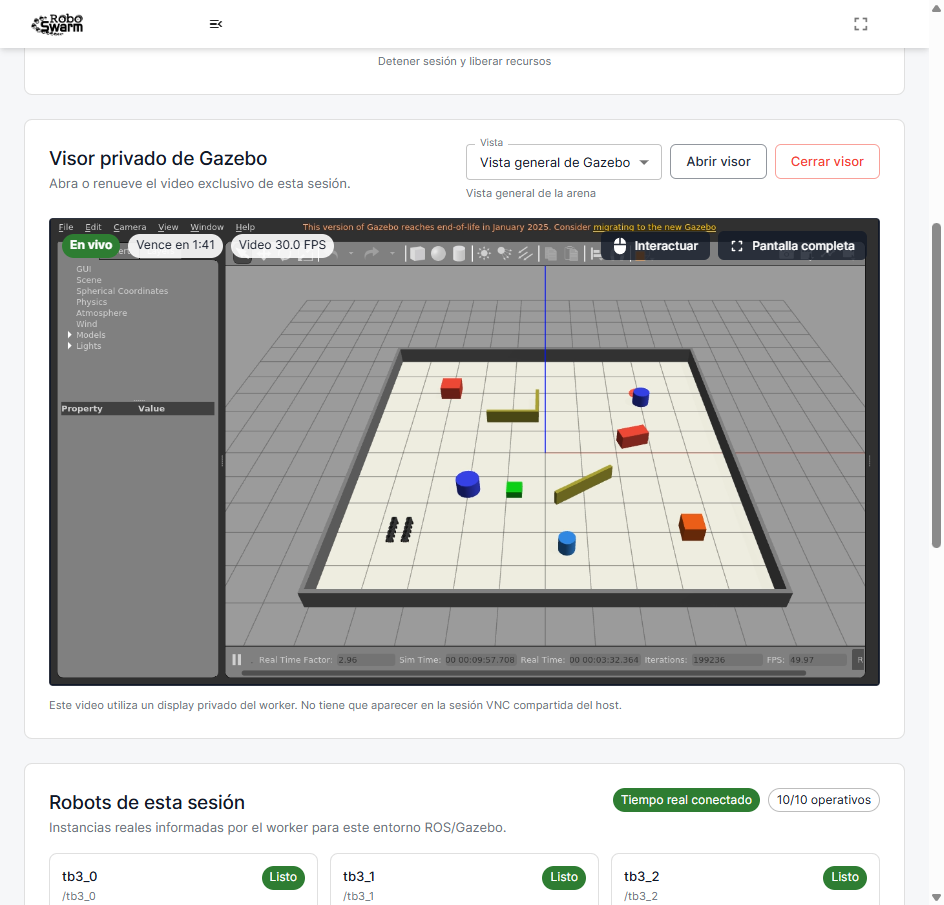

**Figura 27a.** Escena anterior, sin indicación gráfica del destino.

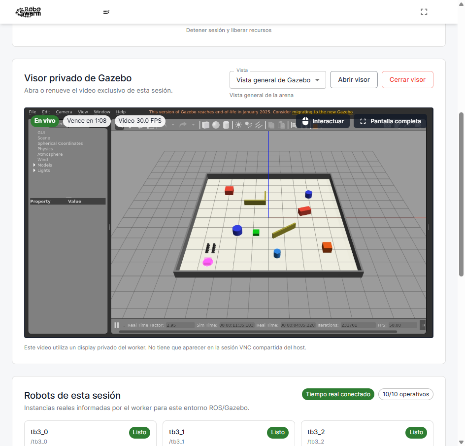

**Figura 27b.** Escena productiva `1448a31` con la huella magenta visible en el
destino. El modelo no tiene colisión, gravedad ni fuerzas y por ello no altera
la física del transporte.

### I-136. La planificación dentro del callback volvía obsoleta la odometría

**Síntoma.** Las seis formaciones móviles de la matriz productiva terminaron
antes del gate activo. Una repetición N=3 sobre la imagen exacta informó
`Odometry became stale or unavailable for: tb3_2`; sin volver a crear la flota,
el mismo caso podía aprobar. La diferencia descartó una geometría imposible y
orientó el diagnóstico hacia el orden de arranque.

**Localización.** La última primera muestra de odometría llamaba de manera
sincrónica al solver de asignación, rutas y órbita. En la reproducción, ese
cálculo ocupó aproximadamente 4,13 s dentro del callback, mientras el timeout
normal de frescura era 0,75 s. La muestra que habilitaba la planificación
bloqueaba sus propias actualizaciones posteriores y luego aparecía vencida.

**Corrección.** Un único worker coalescente calcula las asignaciones fuera de
los callbacks. Cada solicitud lleva una generación: un cambio de tarea, forma,
flota, parada o emergencia invalida cualquier resultado anterior. El comienzo
de cada tarea exige además una muestra nueva por robot; existe una gracia de
inicialización de 10 s, pero, una vez confirmado el flujo, se conserva el
timeout estricto de 0,75 s. El apagado cierra la entrada del worker, invalida el
plan, publica cero a toda la flota y espera la terminación acotada del solver.

### I-137. Evasión y formación utilizaban límites angulares diferentes

**Síntoma.** Después de retirar el bloqueo del callback, una prueba N=10 avanzó
hasta el gate de comandos y rechazó `tb3_8` por superar 1,5 rad/s. No se habían
observado odometrías vencidas ni robots en espera.

**Causa y corrección.** Formación limitaba el giro a 1,5 rad/s, pero una
instancia privada de evasión conservaba su valor predeterminado de 2,84 rad/s.
En una maniobra densa, `apply_avoidance()` podía devolver un comando válido para
el hardware Burger pero inválido para el propietario. La solución intersecta
ambas envolventes con los límites físicos de 0,22 m/s y 2,84 rad/s. Un parámetro
NaN, infinito o negativo bloquea los dos ejes y hace fallar la tarea de forma
explícita; no se amplió el validador final para aceptar el pulso observado.

### I-138. Los robots podían asentarse mientras el solver usaba una foto antigua

**Síntoma.** La siguiente N=10 ya no falló por odometría ni velocidad, pero el
commit rechazó la ruta viva. La primera lectura agregada sugería un margen unos
milímetros inferior a 0,30 m. La instrumentación por etapa demostró después que
el rechazo ocurría al confirmar la asignación, no al publicar movimiento: los
robots recién creados habían cambiado hasta 0,139 m mientras se calculaba el
plan. Por ejemplo, la ruta de `tb3_3` ya no correspondía a su pose junto a
`wall_3`. No hubo colisión; el plan era simplemente obsoleto.

**Corrección.** La instantánea incluye ahora posición y yaw de cada robot. En
el commit se correlacionan de nuevo ambas magnitudes y la escena de obstáculos.
Si la geometría permanece estable, todas las poses son finitas y ningún Burger
está en contacto, el controlador mantiene `Twist=0` y permite como máximo dos
replanificaciones desde la foto viva. Una escena móvil, un dato corrupto, un
contacto o un tercer cambio persistente terminan en fallo cerrado. El margen de
planificación de 0,30 m no se redujo.

**Verificación.** Cinco regresiones focales cubren desplazamiento de 0,139 m,
correlación posición/yaw, coalescencia, contacto y churn persistente. La suite de
formación aprobó 65/65 en ese punto. Una reproducción N=10 con un replan aprobó 10/10
asignaciones, error final 0,0985 m, 15,0067 s de ventana activa, RTF 2,9929,
aceleración máxima 0,7965 m/s² y cero colisiones. La separación mínima entre
robots fue 0,3974 m y la distancia mínima observada a obstáculos, 0,2504 m,
superior al criterio físico de 0,13 m. La correlación explícita final quedó
cubierta después por pruebas. La repetición sobre la imagen exacta candidata,
sin montajes de fuente, aprobó tanto N=3 como N=10: el error máximo independiente
fue 0,0921/0,0974 m, el comportamiento reportó 0,0925/0,0981 m, el RTF del
algoritmo fue 2,9965/2,9875 y la sonda gráfica midió 58,493/57,507 FPS con
renderer D3D12 de la RTX 3080. Queda pendiente repetirla sobre el SHA desplegado.

### I-139. El TTL del visor podía borrar un informe N=1 válido

**Síntoma.** Transporte N=1 completó ROS, desplazamiento, HLS y limpieza, pero
la matriz lo marcó fallido porque `matrix-active-gui-report.json` ya no existía.
El caso duró lo suficiente para que venciera el lease de cinco minutos; el
publicador retiró correctamente el runtime privado antes de que el padre leyera
el archivo. No fue un fallo del renderer ni del algoritmo.

**Corrección.** El arnés valida PID, tiempo de inicio, display y SHA-256 y copia
el informe a un artefacto `0600` inmediatamente después de terminar la sonda
gráfica, antes de esperar ROS. Si el caso termina después del TTL, solo abre un
lease nuevo cuando la UI termina la transición `closing` → hueco transitorio →
botón de apertura, mantiene el visor privado desmontado y el runtime anterior ya
desapareció. Conserva el mismo ID de sesión y exige un directorio nuevo con HLS
interactivo. El estado mutable registra la renovación desde el clic: si fallan
el lookup o HLS, `finally` recupera de forma acotada el binding y sigue siendo
responsable de cerrarlo. Un runtime viejo persistente o un binding que continúa
desconocido se rechazan; no se declara limpieza completa. Los metadatos
distinguen gate fallido, gate aprobado con fallo funcional posterior y caso
completo. Los contratos de matriz aprobaron 73/73. La repetición N=1 productiva
con el arnés corregido terminó `DONE`, avanzó 0,5013 m, sostuvo RTF 2,9962,
58,711 FPS en la sonda activa y 30,164 FPS HLS, sin colisiones y con cleanup
completo. El lease no llegó a vencer; el ensayo confirma la copia temprana y no
se usa para fingir una renovación que no ocurrió.

### I-140. Varias rutas ignoraban un fallo al publicar la parada

**Síntoma.** La revisión independiente hizo fallar de forma controlada uno de
los publishers `cmd_vel`. El worker de asignación ya registraba el robot
afectado, pero pausa, parada, emergencia, cambio de flota y algunos fallos del
ciclo descartaban el resultado de `_stop_all_robots()`. El caso más grave
solicitaba `Twist=0` antes de un replan y lo encolaba aunque esa publicación no
hubiera sido aceptada. Por tanto, el estado podía afirmar `STOPPED` o trabajar
desde poses supuestamente inmóviles sin demostrar siquiera la aceptación local
de todos los `publish()`. Una segunda reproducción retiró `tb3_1` después de su
fallo: el publisher se desregistraba, un stop posterior sobre la flota reducida
sobrescribía la deuda y un start nuevo era aceptado. También se comprobó que el
timeout de shutdown empezaba después de adquirir `command_lock`; un planner que
retuviera ese lock podía impedir incluso el intento de cero.

**Corrección.** El helper sigue visitando todos los publishers aunque uno falle
y produce un resultado JSON acotado: tarea, número de intento, motivo,
cantidades solicitada/aceptada, robots fallidos y `publication_confirmed`. Este
último campo significa que cada `rospy.Publisher.publish(Twist())` retornó en el
proceso local; no se presenta como acuse físico de Gazebo ni del TurtleBot. La
confirmación inversa al supervisor se publica solamente después de observar
ese retorno para toda la flota y comprobar que el supervisor continúa activo.

Cada publisher crítico dispone de un `SafetyPublishLane` prearrancado. La
transición submit/cierre es atómica, por lo que un callback no puede quedar
detrás del sentinel. Si fallan dos intentos de crear un hilo de emergencia, la
parada usa ese lane existente. El fan-out normal y de shutdown reserva trabajos
independientes por destino: un socket bloqueado no oculta los publishers sanos.
La deuda se conserva por instancia y generación, no solo por nombre; retirar o
reingresar el robot no borra una parada sin confirmar.

El orquestador reserva el estado de emergencia antes de cualquier publicación
bloqueante y vuelve a comprobar shutdown antes de comprometer `COMPLETED`,
`STOPPED`, roster o recursos nuevos. La instalación dinámica de robots tiene
una fase provisional y otra de commit; si shutdown gana la carrera, publisher,
subscriber y evitación provisionales se limpian. El roster se cancela según los
robots realmente instalados, no según los anunciados. Finalmente, formación,
seguimiento y transporte exigen `task_id` y guardan tombstones acotados: un stop
que llegue primero por otro topic impide que el start tardío de la misma tarea
reactive movimiento.

**Cómo se verificó.** Las regresiones cubren fallo del worker, replan bloqueado,
stop y retry, pausa, emergencia, start posterior, shutdown acotado, fallo de
control, flota vacía, cambio parcial de roster, reingreso del mismo ID, ambos
locks retenidos, publishers bloqueados, agotamiento de `Thread.start`, ACK
inverso bloqueado, retorno real del cero, setup concurrente y reordenamiento
stop/start en los tres comportamientos. El status observa
`publication_confirmed=false` y el robot exacto cuando corresponde. Aprobaron
formación 96/96, ciclo de vida 205/205, seguimiento 47/47 y la suite global
576/576, además de Python 3.8, 253/253 contratos y `git diff --check`. Una
revisión independiente cerró P0=0/P1=0. La imagen exacta aprobó N=3/N=10
visibles con cero colisiones; el postdeploy del SHA correctivo permanece
pendiente.

### I-141. La planificación grande se confundía con un heartbeat perdido

**Síntoma y reproducción anterior.** Después de los aprobados N=3, N=6 y N=4,
una ejecución visible y secuencial cambió la flota a diez robots y solicitó una
`S` móvil. El orquestador inició correctamente la tarea a las 21:37:23, pero la
marcó fallida por heartbeat obsoleto a las 21:37:32. El controlador terminó el
cálculo y registró `STARTED` a las 21:37:34. El nodo seguía vivo y todos los
topics existían; no hubo colisión ni comando positivo. El problema era que el
solver seguro tardaba unos once segundos mientras el timeout general era tres.

**Primera corrección y segundo hallazgo.** Formación publica ahora un status
correlacionado `forming`, sin asignaciones y con velocidad cero antes del
solver. El orquestador admite en ese estado un plazo de `5 + 1,5N` segundos,
limitado por un máximo configurable de 30 s. Desde la primera asignación vuelve
al timeout normal de 3 s. Esta variante eliminó el falso fallo, pero la corrida
todavía se rechazó: Gazebo asentó robots recién creados 0,057456 m y 0,067711
rad durante el primer cálculo, y 0,019426 m/0,050031 rad durante el segundo.
Ambos cambios superaban tolerancias de 0,02 m/0,05 rad, agotaban dos replans y
dejaban solo parte de la ventana para formar la `S`.

**Corrección final.** La tolerancia de correlación predeterminada se ajustó a
0,08 m y 0,10 rad, con topes configurables de 0,15 m y 0,20 rad. No se redujo el
margen de obstáculos, no se retiró la correlación posición/yaw y la geometría
completa vuelve a validarse antes de liberar un solo `Twist` positivo. El
desplazamiento histórico de 1,830611 m permanece muy por encima del límite y
continúa fallando cerrado.

**Verificación después.** Las regresiones focales aprobaron formación 103/103 y
ciclo de vida 235/235. La suite ROS completa aprobó 624/624 en 118,539 s. La
imagen inmutable local `sha256:3394046…b5f48`, sin montaje de fuente, aprobó
`formation_S_n10` en Gazebo visible: 10/10 asignaciones, 75,0004 s activos,
error máximo independiente 0,0952 m, aceleración filtrada 0,7039 m/s²,
separación mínima 0,4025 m, distancia a obstáculo 0,2491 m, RTF 2,9851 y cero
colisiones. La [evidencia saneada](assets/commissioning-2026-07/corrective-i141/README.md)
conserva hashes de los dos intentos rechazados, del aprobado y de la sonda GPU.
El resultado todavía es local y requiere repetición sobre el SHA desplegado.

### I-142. El instrumento web confundía transiciones válidas con fallos

**Primer intento.** El gate API aprobó autenticación, sesiones N=3/N=7,
rosters, aislamiento 401/404, playlists privadas y revocación de un lease. Se
rechazó antes del navegador porque no observó solapamiento temporal: el
triángulo estático con separación 0,7 m podía estar satisfecho por el spawn y
terminar antes de que el worker registrara FollowLeader. La limpieza de ambas
sesiones fue completa. El caso del arnés usa ahora 1,3 m para exigir
reposicionamiento; no cambió ningún valor predeterminado del producto.

**Segundo intento.** El gate API ya aprobó tareas solapadas, carrera Start/Stop,
aislamiento de parada y cleanup. Dos Chrome visibles probaron interacción,
fullscreen, letra A, FollowLeader y cierre/reapertura del visor B. El recorrido
se rechazó al medir video porque cada fragmento restaba
`currentTime_final-currentTime_inicial`. Un ajuste hacia atrás del borde vivo
HLS cancelaba segundos presentados antes, aunque el visor seguía `En vivo`,
`readyState=4` y mostraba 31,2 FPS. El instrumento limita a cero la contribución
negativa, informa por separado `mediaTimeRegressedSeconds` y continúa exigiendo
frames decodificados, callbacks, FPS, drops y al menos 70 % de avance.

**Tercer intento.** Chrome salió de fullscreen y el DOM dejó de tener
`fullscreenElement`, pero React todavía no había repintado el texto ordinario
cuando se inspeccionó inmediatamente. El intento se rechazó y limpió. La
corrección espera como máximo 5 s y exige simultáneamente estado `En vivo` y el
control `Pantalla completa`; no da por bueno solamente que Chrome haya salido.

**Verificación final.** Responsive aprobó 360/768/1366/1920 px. El gate API
aprobó y el recorrido final en dos ventanas normales comprobó entrada
`isTrusted`, clic, arrastre, rueda, teclado, fullscreen y flujos privados. Los
inicios tuvieron 0,198 ms de skew y ambos paneles aparecieron `Running` en la
misma ronda. A completó letra A mientras B siguió en FollowLeader; B cerró y
reabrió su visor sin detener ROS. Los videos midieron 30,033 y 29,982 FPS, cero
drops y más de 10 s de avance. Después de detener A, B conservó tarea y video
otros 10 s. La limpieza aprobó. Los contratos quedaron API 17/17 y visible
41/41. La [evidencia saneada I-142](assets/commissioning-2026-07/corrective-i142/README.md)
conserva los hashes de los reportes externos `0600`.

### I-143. Un robot seguro retenía los lotes de rutas posteriores

**Síntoma.** La reconstrucción final correlacionó correctamente el `task_id` y
el orquestador mantuvo viva la planificación, pero S/N=10 agotó 85,39 s. Seis
robots convergieron y cuatro apenas se desplazaron del spawn. No hubo
colisiones; `/clock`, Gazebo y los publishers `cmd_vel` seguían disponibles.

**Diagnóstico.** El primer lote no avanzaba porque uno de sus robots terminó a
0,1246 m del slot. Esa distancia estaba dentro de la banda de retención segura
de 0,14 m, pero el cambio de lote consultaba la marca de llegada estricta de
0,09 m. La evasión podía estabilizar legítimamente el robot dentro de esa
histéresis sin cruzar el radio menor, dejando el resto del plan detenido. WSL
tenía cerca de 12 GiB disponibles y el contenedor usaba alrededor de 1 GiB; no
se atribuyó el síntoma al consumo de RAM ni al visor.

**Corrección y verificación.** El secuenciador libera el corredor cuando su
miembro está dentro de la histéresis segura, pero no lo declara convergido. La
formación completa conserva la precisión máxima de 0,12 m y toda la
revalidación geométrica viva. Una regresión coloca el primer robot entre ambos
umbrales, exige que siga sin converger y comprueba movimiento del segundo lote.
La suite completa aprobó 625/625 en 117,379 s y los contratos 253/253. La imagen
`sha256:4caa2ea97dc55e3f0e4929568e255fcbea0d6969318522e34f889a6df72691e9`
aprobó S/N=10 durante 15,0061 s activos: error máximo 0,0936 m, separación
mínima 0,4013 m, despeje 0,2498 m, aceleración filtrada 0,8874 m/s², RTF
2,9912 y cero colisiones. La
[evidencia saneada](assets/commissioning-2026-07/corrective-i143/README.md)
conserva el antes y después.

### I-144. Tres presupuestos no cubrían el ensamblaje válido postdeploy

**Resultado productivo rechazado.** Sobre `1d497d4`, triángulo N=3, A/N=7 y
S/N=10 aprobaron. Cuadrado N=5, V/N=8 y diamante N=9 terminaron exactamente a
40,38, 55,31 y 50,31 s, todavía en `forming`. Mantuvieron RTF
2,9922–2,9962, cero colisiones y cleanup completo. La matriz global quedó 3/6
y se rechazó.

**Diagnóstico.** Los casos aprobados necesitaron 87,06–140,10 s totales porque
incluyen 75 s activos. Los límites fallidos detenían la observación antes de
que rutas válidas terminaran. Una repetición V mostró además yaw de
asentamiento 0,104–0,133 rad con solo 2–4 mm de traslación y ningún comando
positivo. El umbral 0,10 rad agotó dos replans aunque la huella circular del
Burger y la escena permanecían seguras.

**Corrección.** Cuadrado, V y diamante reciben 90 s de ensamblaje. El yaw
predeterminado de correlación pasa a 0,15 rad, debajo del tope 0,20 rad. Se
conservan posición 0,08 m, gate final 0,12 m, dos replans, límites cinemáticos
y revalidación viva.

**Verificación local.** La imagen `56b82f5…be9f` aprobó cuadrado, V y diamante
en 62,64/78,43/86,34 s, con error máximo
0,0945/0,0937/0,0960 m, separación mínima 0,4222/0,3613/0,3878 m, RTF ≥2,90
y cero colisiones. Un intento V previo se descartó porque `gzserver` sufrió
`Segmentation fault` durante el spawn; la memoria disponible era cercana a
12 GiB y la repetición fresca aprobó. La
[evidencia saneada](assets/commissioning-2026-07/corrective-i144/README.md)
conserva hashes y clasificación.

**Freeze del delta.** La suite ROS completa aprobó 626/626 en 111,472 s. Los
253 contratos de aceptación aprobaron en 5,581 s al ejecutarlos en aislamiento.
Una pasada paralela anterior había agotado 5 s en dos pruebas de supervisión;
no quedaron procesos del fixture y la repetición aislada fue verde. Se
clasificó como interferencia temporal del arnés y no se modificó el producto
para ocultarla.

### I-145. La adquisición del lease no toleraba una intermitencia DNS

**Síntoma.** Los despliegues GPU `30054706834` y `30054818947` del corte
`ea25434` fallaron al resolver `robot.zerav.la` durante los 5 s permitidos. Los
dos terminaron antes de adquirir el lease, hacer checkout o cambiar el release;
`1d497d4-30051789195-1` permaneció activo.

**Diagnóstico.** Cinco sondas ordinarias resolvieron en 0,064–0,130 s. Tres
sondas con el entorno de `Runner.Listener` resolvieron en 0,106–0,112 s, sin
proxy y con HTTP 200. La consulta posterior de estado ya tenía reintentos,
pero el POST inicial de adquisición se ejecutaba una sola vez.

**Corrección.** El POST inicial admite tres intentos únicamente ante errores
de transporte, separados por 5 s. Conserva los límites de conexión y total,
la revisión objetivo, la autenticación y el gate HTTP 200. Una respuesta HTTP
no se reintenta; tres errores de transporte hacen fallar cerrado el job. La
[evidencia saneada](assets/commissioning-2026-07/corrective-i145/README.md)
registra los runs y confirma que no hubo mutación parcial.

### I-146. El margen de arranque HLS era menor que la variación productiva

**Síntoma.** Una matriz sobre `2445a37` aprobó triángulo N=3 y rechazó las
cinco filas posteriores antes de ROS por ausencia de un visor interactivo.
MediaMTX había recibido H.264 y creado los muxers HLS. Un cuadrado fresco
también agotó la espera. Todas las filas liberaron sus recursos.

**Cómo se encontró.** La secuencia real desde la orden de visor hasta el primer
acceso HLS consumía aproximadamente 28 s. El reproductor React abandonaba a los
30 s, de modo que una variación pequeña convertía un publicador sano en un
fallo aparente. El arnés tampoco guardaba el último estado de la interfaz en
esa frontera y esperaba solo 10 s por el protocolo del hijo cuando ROS ya era
terminal.

**Corrección local.** HLS dispone de 60 s para arranque o recuperación. El TTL
del lease, sus autorizaciones y el cleanup no cambian. La matriz conserva el
estado saneado del frontend al fallar y concede al teardown del hijo hasta
60 s, sin superar el timeout del escenario, solo para recuperar sus dos
documentos terminales. Una regresión verifica la evidencia del fallo.

**Control visible.** Una repetición limpia de cuadrado N=5 aprobó antes del
cambio: 58,203 FPS de Gazebo, 29,960 FPS decodificados, RTF 2,9959, error
máximo 0,0888 m, separación mínima 0,4277 m y cero colisiones durante
75,0451 s activos. La limpieza fue completa. Las dos ventanas observadas
durante el ensayo correspondían al `gzclient` principal del lease y al cliente
temporal de la sonda oficial; ambos compartían masters, no existía un segundo
`gzserver`. Después del cierre se comprobaron cero procesos o contenedores ROS
residuales.

**Verificación postdeploy.** La corrección se integró mediante la PR #110 como
`e3dc7ad`. CI, despliegue de backend y despliegue GPU aprobaron. Las seis filas
alcanzaron un visor HLS decodificable: 29,981–30,124 FPS en las cinco
formaciones aceptadas y 31 FPS de arranque en la S rechazada posteriormente
por ROS. Gazebo mantuvo 57,542–58,478 FPS y RTF 2,9908–2,9965 en esas cinco
filas. Esto cierra el defecto de arranque HLS sin usar una captura aislada como
prueba del algoritmo.

Frontend aprobó 164/164 y su build; el visor focal 37/37 y la matriz contractual
74/74. La
[evidencia saneada](assets/commissioning-2026-07/corrective-i146/README.md)
conserva métricas y hashes. El cierre de I-146 no implica el cierre global: la
misma matriz reveló después el estancamiento independiente I-147.

### I-147. Un lote de rutas podía permanecer detenido sin recuperación

**Síntoma postdeploy.** Sobre `e3dc7ad`, las primeras cinco formaciones de la
matriz aprobaron. S/N=10 agotó 85,4005 s todavía en `forming`: ocho robots se
desplazaron, `tb3_3` quedó a 0,4616 m de su slot y dos robots de lotes
posteriores recorrieron apenas 0,14 m. RTF fue 2,988, la separación mínima
0,3944 m, el despeje 0,2274 m y no hubo colisiones. Una repetición fresca sí
aprobó 75,0317 s activos con error 0,0951 m y RTF 2,9846. Por ello se clasificó
como liveness intermitente y no como geometría imposible.

**Cómo se encontró.** El reporte ROS preservado mostró tarea y controlador
vivos, odometría completa, asignaciones 10/10 y cero fallos geométricos. La
diferencia de recorrido separó a los robots liberados de los dos lotes todavía
retenidos. Aumentar el presupuesto habría permitido esperar más, pero no
ofrecía una transición que liberase el corredor bloqueado.

**Primer candidato refutado.** Cada miembro del lote activo acumulaba progreso
contra su waypoint. La PR #111 se integró como `917b06b`; CI, backend y GPU
aprobaron. Sin embargo, S/N=10 volvió a terminar en `forming` a los 85,3957 s:
dos robots recorrieron 0,14 m, el error fue 3,7228 m, RTF 2,9855 y hubo cero
colisiones. El umbral de 0,01 m cada 20 s aceptaba avances microscópicos que no
podían liberar el corredor dentro del presupuesto. El resultado se conservó y
el candidato no se declaró correcto.

**Segundo candidato refutado.** La tasa mínima pasó a 0,10 m por 20 s, o
0,005 m/s. El controlador omitía el siguiente lote positivo, publicaba cero y
usaba el replan vivo ya limitado a dos intentos. La PR #112 se integró como
`2193c3d`; CI, backend y GPU aprobaron. Sin embargo, dos S/N=10 productivas
agotaron 85,3905 y 85,3781 s con errores 2,3958 y 3,6117 m. Ambas conservaron
RTF ≥2,9908, seis lotes, un replan, video visible, cero colisiones y cleanup
completo. Por tanto, el resultado no se atribuyó al entorno ni se ocultó con
otro aumento del presupuesto.

**Causa restante.** Los corredores calculados eran seguros, pero el índice
solo adelantaba cuando todos los miembros del lote llegaban a la banda del
slot. El robot que cruzaba primero podía haber despejado físicamente la ruta
del siguiente lote y, aun así, este permanecía detenido. Ordenar también por
slots futuros y elevar de forma aislada la tasa a 0,20 m/20 s volvió a fallar
en local; ese experimento se descartó porque no corregía la condición de
liberación.

**Tercer candidato.** El controlador reconstruye el tramo restante desde cada
pose viva, por los waypoints pendientes y hasta el slot. Adelanta el lote
siguiente únicamente si ninguna de esas rutas cruza los corredores todavía
activos con el despeje del plan. Los lotes ya liberados siguen recibiendo
control al adelantar el índice. Una pose ausente, un valor no finito o un plan
incompleto conserva el lote detenido. El umbral de 0,20 m/20 s permanece como
recuperación secundaria, no como sustituto de la prueba geométrica.

Tres S/N=10 visibles locales aprobaron 75 s activos con error máximo
0,0938–0,0963 m, RTF 2,9887–2,9895, separación mínima 0,4025 m, despeje mínimo
0,2537 m, aceleración filtrada máxima 0,7801 m/s² y cero colisiones. Las tres
usaron dos lotes solapados sin replan. La suite aprobó 631/631 y los siete
arneses contractuales 254/254.

**Instrumento API.** El gate paralelo de `e3dc7ad` aprobó aislamiento y dos
visores privados, pero el triángulo estático terminó antes del `startedAt` de
FollowLeader y los intervalos persistidos no se solaparon. El gate se mantiene
estricto y ahora usa la letra A/N=3 del recorrido visible, sin esperas
artificiales. Sobre `917b06b` aprobó con 6,902 s de solapamiento; el recorrido
en dos Chrome visibles midió 30,089/30,069 FPS, cero drops, entrada,
fullscreen, reapertura del visor B y continuidad de ROS. La
[evidencia saneada](assets/commissioning-2026-07/corrective-i147/README.md)
registra los tres rechazos, la repetición S aprobada, hashes y resultados web.
El cierre algorítmico requiere todavía integrar y probar el tercer candidato
sobre su SHA productivo exacto.

### I-148. El presupuesto S/N=10 no cubría una colocación segura más larga

**Hallazgo.** La PR #113 integró el solapamiento como `ec4980b`; CI, backend y
GPU aprobaron en el primer intento. La primera aceptación productiva liberó
nueve robots, llegó al quinto de seis lotes y no informó estancamiento ni
replan. A los 85,3957 s todavía quedaban un robot avanzando y el último
retenido por su corredor. La física acumuló 252,816 s con RTF 2,9605, HLS
31,2 FPS, aceleración 0,7427 m/s², separación 0,3897 m, despeje 0,2288 m y
cero colisiones; el cleanup fue completo.

**Diagnóstico.** El límite de 85 s procedía de una convergencia medida en
208,75 s simulados y solo cubría 229,5 s al RTF de dimensionamiento 2,7. La
nueva colocación había superado ese borde mientras continuaba progresando.
No se clasificó como el estancamiento de I-147 y no se ejecutó un rerun para
buscar una colocación más favorable.

**Corrección acotada.** S/N=10 dispone de 120 s de pared, equivalentes a
324 s simulados al piso 2,7 y 71,184 s por encima del último progreso
observado. No cambian el controlador, la precisión de 0,12 m, los 75 s activos,
el RTF mínimo, la aceleración ni las distancias de seguridad. La ampliación se
considerará válida solo si la corrida exacta posterior alcanza `moving` y
aprueba todos esos gates.

## 5. Registro cronológico de cambios y pruebas

Esta sección ofrece un índice cronológico resumido. Los SHA, el entorno, las entradas y los criterios se desarrollan en la incidencia o evidencia citada; la hora se conserva únicamente cuando fue material para el diagnóstico.

| Fecha local (UTC−04:00) | Actividad | Resultado | Evidencia |
| --- | --- | --- | --- |
| 2026-07-19 | Creación del punto de reversión | Etiqueta remota creada sobre `3fcc80a` | Git remoto |
| 2026-07-19 | Verificación pública inicial | Frontend HTTP 200; backend `Healthy` | Consulta HTTP |
| 2026-07-19 | Inicio del informe | Documento creado antes de las modificaciones funcionales | Este archivo |
| 2026-07-19 | Transporte visible con diez robots | Aprobado; diez robots asignados y físicamente vinculados | Figuras 5–7 y reporte JSON |
| 2026-07-19 | Búsqueda distante N=10, escenario inicial | La búsqueda aprobó; la geometría posterior de empuje fue rechazada como inviable. El crudo no se retuvo | Incidencia I-009 |
| 2026-07-19 | Búsqueda y aviso N=10, escenario corregido | Aprobado; 10/10 buscaron, 9/9 respondieron al aviso y no hubo colisiones | Figuras 9–10 |
| 2026-07-19 | Endurecimiento del acceso VNC | Puertos 5901 y 6080 limitados a loopback; token retirado de los argumentos del proceso | Figura 8 y verificación de servicios |
| 2026-07-19 | Sonda HLS con H.264 real, primer intento | Rechazada por redirección de sesión, límite de lectores y número de segmentos | Incidencias I-011 e I-012 |
| 2026-07-19 | Sonda HLS con credencial CDN interna | Aprobada localmente: lista principal, lista de video y partes MP4 sin cookies ni redirecciones | Prueba reproducible de CI |
| 2026-07-19 | Pruebas de concurrencia del plano de control | Aprobadas las carreras de claim, cancelación, resultado y drenaje | Incidencias I-013 a I-015 |
| 2026-07-19 | Revisión de despliegues | Lock compartido, revalidación de `main` y rollback inmutable incorporados | Incidencias I-016 e I-017 |
| 2026-07-19 | Suite local histórica previa al primer despliegue | Backend 124/124; trabajador 99/99; ROS 351/351; frontend 21/21, lint y build | Antecedente del [corte histórico previo a CI #33](assets/commissioning-2026-07/predeploy-validation-summary.txt) |
| 2026-07-19 | Verificación histórica del paquete de evidencia | 16/16 hashes correctos en el paquete de ese momento | Incidencia I-019; el manifiesto final se regenera después de las capturas públicas |
| 2026-07-19 | PR 94, dos primeras ejecuciones de CI | Se hizo visible que `ubuntu-latest` no incluía FFmpeg; dependencia añadida de forma explícita | Incidencia I-023 |
| 2026-07-19 | Tercera ejecución de CI y merge del PR 94 | CI aprobó sobre `c138935`; el squash produjo `0fd6043` | PR 94 y ejecución `29690215489` de `main` |
| 2026-07-19 | Despliegue de backend y medios de `0fd6043` | Aprobado en 36 s; backend sano y migración de resultados/drenaje aplicada | Ejecución `29690335453` |
| 2026-07-19 | Primer despliegue GPU de `0fd6043` | Switch evitado por fecha sin zona; lease liberado y servicio anterior preservado | Incidencia I-024 |
| 2026-07-19 | PR 95 y despliegue de `b2431d1` | CI del PR, CI de `main` y backend aprobaron; producción respondió `Healthy` con el SHA exacto | Ejecuciones `29690663823`, `29690781402` y `29690899275` |
| 2026-07-19 | Segundo despliegue GPU de `b2431d1` | Imagen y sonda GPU aprobadas; cierre doble detectado, rollback correcto y lease liberado manualmente | Ejecución `29690942535` e incidencia I-025 |
| 2026-07-19 | Despliegue GPU de `797c7ea` | Aprobado; release, imagen inmutable, readiness y liberación del drenaje verificados | Ejecución `29692249904` |
| 2026-07-19 | Repetición de cierre del release corregido | El switch no inició: un GET de drenaje sufrió un timeout DNS; cleanup aprobado | Ejecución `29692426789` e incidencia I-026 |
| 2026-07-19 | PR 97 y CI de `62a136a` | Reintento de red y cierre idempotente integrados; CI de `main` aprobado | PR 97 y ejecución `29692758663` |
| 2026-07-19 | Despliegue de backend y activación de gates | Backend y MediaMTX sanos; evidencia de transporte, proxy HLS y publicación del trabajador habilitados en la tercera ejecución | Ejecución `29692862930`, intento 3 |
| 2026-07-19 | Despliegue GPU final de `62a136a` | Los 39 pasos aprobaron; apagado limpio, nuevo release activo, imagen ROS inmutable y `NRestarts=0` | Ejecución `29692887445`; incidencias I-025 e I-026 cerradas |
| 2026-07-19 | Primera creación concurrente desde producción | Rechazada: A recibió 202 y B recibió 409 por cancelación SSI; limpieza posterior completada | Incidencia I-027 y artefacto sanitizado `ec59796…a72d` |
| 2026-07-19 | PR 98 y despliegue de `d33eed4` | Backend 128/128; CI del PR y de `main` aprobado; contenedor sano y sin reinicios | Ejecuciones `29693955661`, `29694125778` y `29694250759` |
| 2026-07-19 | Repetición concurrente sobre `d33eed4` | La creación de sesiones avanzó; el ensayo fue rechazado al no aparecer la lista del visor | Incidencias I-027 e I-030 |
| 2026-07-19 | Concurrencia de leases contra PostgreSQL | 10 rondas normales y 3 inducidas; las 26 solicitudes devolvieron 201, con 26 leases y 26 comandos únicos pese a 19 conflictos internos | Incidencia I-028 |
| 2026-07-19 | Compatibilidad de caducidad .NET→Python 3.8 | Parser normalizado a microsegundos, zona obligatoria y regresiones aprobadas | Incidencia I-029 |
| 2026-07-19 | Sondas del visor por TCP | Rechazadas: FFmpeg produjo tres fotogramas y no apareció una lista HLS estable | Incidencia I-030 |
| 2026-07-19 | Hotfix de captura X11 local | Sonda individual aprobada; estabilidad de 35 s con 16 listas, 16 segmentos, 30 FPS y cero reinicios del worker | Incidencia I-030 |
| 2026-07-19 | Revisión de experiencia de usuario | Login, cuentas, visor, espacio de simulación y panel de tareas reorganizados; captura comparativa pendiente | Incidencia I-031 |
| 2026-07-19 | Limpieza de identidades temporales | Purga controlada de 21 cuentas de prueba, sin incorporar sus datos al informe | Incidencia I-032 |
| 2026-07-19 | Diagnóstico del error «worker has not published» | `gzserver` murió al cargar N=10 por el límite de 512 tareas, aunque el roster latched ya estaba completo | Incidencia I-033 |
| 2026-07-19 | Repetición N=10 con 1024 tareas | Flota completa, `/clock` activo y margen hasta unas 599 tareas; 105/105 pruebas del worker | Incidencia I-033 |
| 2026-07-19 | Primera matriz ROS completa en una sesión | Rechazada después de doce escenarios: 3 GiB agotados, `gzserver` terminó con código 137 | Incidencia I-034 |
| 2026-07-19 | Repetición aislada de formación S, N=10 | Aprobada con visor privado activo: RTF 2.9247, velocidad máxima 0.2001 m/s, aceleración máxima 0.8259 m/s² y cero colisiones | Resultado estructurado provisional |
| 2026-07-19 | Repetición aislada de seguimiento en ocho, N=10 | Aprobada con visor privado activo: una vuelta, RTF 2.9410, error máximo de separación 0.0525 m y cero colisiones | Resultado estructurado provisional |
| 2026-07-19 | Chrome visible sobre una sesión N=10 nueva | 20.02 s de video, 30.02 FPS decodificados, dos capturas diferentes y Gazebo con RTF 3.00 | Incidencia I-035; aceptación de un conducto |
| 2026-07-19 | Endurecimiento del marcador `READY` | 2xx de ANNOUNCE/SETUP/RECORD, RTP progresivo y watchdog; rechazo, silencio y detención cubiertos | Incidencia I-036 |
| 2026-07-19 | Control interactivo y fullscreen | Layout amplio, pantalla completa, autorización renovable y eventos XTest ligados al lease privado; frontend publicado, operación completa pendiente | Incidencia I-037 |
| 2026-07-19 | Transporte N=10 bajo carga concurrente | Funcionalmente aprobado con 10/10 y cero colisiones; RTF 2.6014 rechazado como gate por dos simulaciones, dos visores y compilación simultáneos | Incidencia I-038 |
| 2026-07-19 | Recuperación de caché WSL | Caché 8.0→1.0 GiB y libre 1.7→8.2 GiB sin detener ROS/Docker | Incidencia I-039 |
| 2026-07-19 | Transporte N=10 aislado previo a la corrección | Rechazado: 220.35 s, aproximación tardía y solo 0.055 m de avance | Incidencia I-040 |
| 2026-07-19 | Sonda del renderer dentro del sidecar | Rechazada: HLS emitía 30 FPS, pero Gazebo dibujaba 3.684 FPS con `llvmpipe` | Incidencia I-041 |
| 2026-07-19 | Sonda `gzclient` directa en WSL | D3D12 RTX 3080; con límite 50, 49.964 FPS y RTF 2.939 | Incidencia I-041; validación local provisional |
| 2026-07-19 | Recursos gráficos del cliente host | Diez mallas, D3D12/RTX, 49.961 FPS y RTF 2.968 en una medición limpia | Incidencia I-042; aprobación local |
| 2026-07-19 | Primer inicio «distante» de la repetición N=10 | Descartado: el objeto estaba a 1.1 m de un robot, dentro del sensado de 2.0 m | Incidencia I-043 |
| 2026-07-19 | Segundo inicio «distante» de la repetición N=10 | Rechazado en 0.10 s: `target_y=-4.2` excedía el contrato [-4, 4]; ningún robot se movió | Incidencia I-043 |
| 2026-07-19 | Tercera repetición distante N=10 | Funcionalmente completa con 10/10, RTF 2.9666 y cero colisiones; rechazada solo por 0.5254<0.55 m en una ruta con tolerancia 0.5 m | Incidencia I-044 |
| 2026-07-19 | Corrección del gate de progreso | El mínimo se deriva del contrato de llegada para rutas cortas y conserva 0.55 m en rutas largas; 20/20 regresiones de métricas | Incidencia I-044 |
| 2026-07-19 | Cuarta repetición distante N=10 | Búsqueda, aviso y empuje 10/10; carga a 0.325 m de la meta, pero falso fallo de contacto por umbral fijo de 0.015 m/s | Incidencia I-045 |
| 2026-07-19 | Umbral de aporte durante la marcha calmada | Se liga a la referencia coordinada sin cambiar tolerancia ni timeout; ciclo de vida 150/150, métricas 20/20 y preflight 8/8 | Incidencia I-045; cerrado después por la repetición final v6 |
| 2026-07-19 | Quinta repetición distante N=10 | `DONE`, 10/10 confirmados, 49.882 FPS, RTF 2.9789 y cero contactos inesperados; harness rechazó 0.4998<0.5000 m y 45.56%<50% | Incidencia I-046 |
| 2026-07-19 | Alineación semántica del harness | Progreso referido al inicio de PUSH y umbral de tracking acotado por la referencia publicada, sin bajar gates; métricas 22/22 | Incidencia I-046; verificada físicamente en la repetición final v6 |
| 2026-07-19 | Smoke del publicador GPU aislado | Aprobado: D3D12/RTX 3080, 49.785 FPS de render, RTF 2.975, 10/10 robots, H.264 e interacción XTest; hard-kill sin residuos | Incidencia I-047 y [resumen local](assets/commissioning-2026-07/smoke-publicador-gpu-local.json) |
| 2026-07-19 | Repetición final de transporte N=10 | Aprobada sin reintento: `DONE`, búsqueda 10/10, aviso 1+9, empuje útil 10/10, 59.14 % de lotes, RTF 2.9672, 49.960 FPS y cero contactos inesperados | Incidencia I-046 y [resumen local](assets/commissioning-2026-07/transporte-n10-final-v6.json) |
| 2026-07-19 | Fail-safe de entrada del visor | Cola acotada, una invocación en vuelo, `releaseAll` exacto, reaping independiente y reintento coalescido; frontend focal 32/32 y worker focal 21/21 | Incidencia I-048 |
| 2026-07-19 | Controlador exclusivo y cuota por lease | Control único, tombstone de desconexión, release durable, valla precommit, timeout con liberación tardía y cuatro drenajes paralelos como máximo | Incidencia I-049; backend focal 42/42 |
| 2026-07-19 | Repetición con toolchains explícitos | Primer intento rechazado por `npm` de Windows y `PYTHONPATH` incompleto; repetición con el entorno de CI aprobada | Incidencia I-050 |
| 2026-07-19 | Suite local completa del candidato | Backend 179/179; trabajador 119/119; ROS 362/362; frontend 79/79; publicador, despliegue/rollback, migración, Compose, Actionlint, lint modificado y build aprobados | [Resumen local previo al despliegue](assets/commissioning-2026-07/predeploy-validation-summary.txt) |
| 2026-07-19 | Primera publicación en PR #99 | Único fallo observado antes de cancelar CI #31: el runner no incluía `xdpyinfo`; el build de la imagen ROS se detuvo para ahorrar minutos | Incidencia I-051; ejecución `29707253612` |
| 2026-07-19 | Corrección de dependencias X11 | CI #32 aprobó backend, frontend, worker, publicador, ROS y la imagen ROS | Incidencia I-051; ejecución `29707495002` |
| 2026-07-19 | Revisión del check externo | GitGuardian clasificó un nombre de variable como contraseña; no había secreto y se preparó un historial limpio con el nombre corregido | Incidencia I-052 |
| 2026-07-19 | Validación del historial limpio | CI #33 y GitGuardian aprobaron `9c0dc05`; todos los checks automatizados requeridos del PR aprobaron | Incidencia I-052; ejecución `29707715766` |
| 2026-07-19 | Integración del PR #99 | Merge `bbc7c46` y CI #34 de `main` aprobados; Cloudflare publicó el frontend | PR #99; ejecución `29707829707` |
| 2026-07-19 | Inicio del despliegue del backend | La ejecución #171 (run ID `29707925944`) quedó en cola; el release anterior y `/health` continuaron sanos | Incidencia I-053 |
| 2026-07-19 | Diagnóstico del canal autohospedado | Certificado TLS externo vencido reproducido desde VM y WSL; se rechazaron bypasses y se conservó el reintento del job original | Incidencia I-053 |
| 2026-07-19 | Incidente reconocido por el proveedor | GitHub Status pasó de operativo a interrupción parcial de Actions; se mantuvo la ejecución original en espera | Incidencia I-053; [incidente `8vfyvq16hzh9`](https://www.githubstatus.com/incidents/8vfyvq16hzh9) |
| 2026-07-19 | Auditoría del instrumento visible final | Contrato post-stop imposible y desplazamiento incorrecto de paneles detectados antes de producción | Incidencia I-054 |
| 2026-07-19 | Endurecimiento del enlace API↔visual | Modos de captura separados, cancelación interrumpible y HMAC con clave independiente `0600`; auditoría final sin P0/P1/P2 | Incidencia I-054 |
| 2026-07-20 | Auditoría de secciones restantes | Historial y Plantillas todavía usaban contratos heredados; Robots, Grupos y visor presentaban funciones incompletas o engañosas | Incidencias I-055–I-060 |
| 2026-07-20 | Historial y plantillas alineados | `TaskRun` por propietario; `TaskLog` administrativo; catálogo `GET`/`PUT` de administrador sin acciones falsas | Incidencias I-055 e I-056; candidato local |
| 2026-07-20 | Registro y grupos de robots corregidos | Propiedad protegida, inventario administrable y membresía real; ruta falsa de asignación ROS retirada | Incidencias I-057 e I-058; candidato local |
| 2026-07-20 | Ciclo de vida del visor y monitor runtime | `StopViewer` por lease, roster visible, reintento inicial SignalR y confirmación antes de detener la sesión | Incidencias I-059 e I-060; candidato local |
| 2026-07-20 | Validación focal del delta posterior al PR #99 | Backend 31/31, worker 19/19 y frontend 39/39; lint focal y compilación administrativa aprobados | Incidencia I-061; ejecución local, sin Actions |
| 2026-07-20 | Recuperación del canal Actions original | Certificado vigente, mismo job completado sin rerun y backend base sano | Incidencia I-053; evidencia TLS de recuperación |
| 2026-07-20 | Auditoría final del delta | Se corrigieron estado observable de `StopViewer`, redirect User y cobertura ESLint | Incidencia I-062; ejecución local, sin Actions |
| 2026-07-20 | Suites integrales disponibles del árbol local | Backend 213/213, worker 121/121, ROS 362/362, frontend 132/132 en 22 suites y auxiliar del publicador aprobados; lint modificado y build frontend correctos | Incidencias I-061 e I-062; ejecución local, sin Actions |
| 2026-07-20 | Integración del plano de control completo | PR #100, CI de `main`, Cloudflare y backend aprobaron; `/health` respondió 200 | PR #100; ejecuciones `29712509667`, `29712652005` y `29712778446` |
| 2026-07-20 | Primer despliegue GPU de `baba2c1` | Pruebas, imagen y smoke NVIDIA aprobaron; el preflight `xprop` falló sin `DISPLAY`, rollback y reanudación correctos | Ejecución `29712833482`; incidencia I-063 |
| 2026-07-20 | Hotfix headless de `xprop` | Dependencias verificadas con `ldd`; regresión sin `DISPLAY`, rechazo de biblioteca ausente y suites locales aprobadas | Incidencia I-063; candidato local |
| 2026-07-20 | Integración y despliegue del PR #101 | CI del PR y de `main`, Cloudflare, backend y un solo workflow GPU aprobaron sobre `538ba066`; las tres capas quedaron alineadas | Ejecuciones `29713447119`, `29713584472`, `29713716434` y `29713763763`; I-063 cerrada |
| 2026-07-20 | Primera aceptación concurrente de `538ba066` | Roster N=3/N=7 e aislamiento API aprobaron; ambas listas HLS quedaron en 404 porque `gzclient` no creó ventana | Incidencia I-064; ensayo rechazado y limpiado |
| 2026-07-20 | Prueba controlada de AF_NETLINK | `socket.if_nameindex()` falló bajo el sandbox original y aprobó al añadir AF_NETLINK; una sesión publicó HLS | Incidencia I-064; sobrescritura diagnóstica no versionada |
| 2026-07-20 | Segunda aceptación concurrente bajo diagnóstico | Dos listas HLS, rotación y denegación cruzada aprobaron; inicio paralelo de tareas terminó 202/409 | Incidencia I-065; reporte rechazado SHA-256 `362142de…ab5` |
| 2026-07-20 | Endurecimiento de la aceptación visible | Origen fijado, PII oculta, cleanup resistente a señales, lease listo verificable, rol contrastado, unión de hilos y reconciliación de creación incierta | Incidencia I-066; contratos API 3/3, visor 10/10 y secciones 14/14 |
| 2026-07-20 | Recorrido visible de las demás secciones con User | Historial y diálogo aprobaron; endpoints Admin devolvieron 403; cuatro rutas restringidas redirigieron; Chrome/perfil quedaron limpios | Incidencia I-066; aceptación parcial sobre `538ba066` |
| 2026-07-20 | Búsqueda sostenida y cleanup de carga | Cada robot debe recorrer 0.05 m en SEARCH; APPROACH queda separado; stop correlacionado antes de restaurar payload | Incidencia I-067; ROS 373/373 local |
| 2026-07-20 | Unificación visual de las seis secciones | Capitalización normal, foco visible, encabezado común, inventario tabular, paneles sobrios y controles responsive | Incidencia I-068; frontend 141/141, lint y build local |
| 2026-07-20 | Causalidad de parada y borrado en aceptación | Baselines previos al comando, ACK con `request_id` y robots restantes, estado hijo fresco y cleanup fail-closed | Incidencia I-069; focales 20/20 y ROS 391/391 local |
| 2026-07-20 | Reconciliación tardía de creación incierta | El cleanup vuelve a listar hasta su plazo, exige una lectura final, detiene todo ocupante recuperado y falla cerrado sin observabilidad | Incidencia I-070; contrato API 8/8 local |
| 2026-07-20 | Diagnóstico visible del transporte N=1 | Dos falsos stops LiDAR y una corrida con `PUSH` limitado a 35,2856 s fueron rechazados; se mantuvo el gate de 0,50 m | Incidencia I-084; ensayos locales rechazados |
| 2026-07-20 | Repetición visible final del transporte N=1 | Aprobada localmente: `DONE`, 0,5005 m, empuje útil 1/1 al 100 %, RTF 2,9964, 61,888/62,498 FPS y cero colisiones | Incidencia I-084; todavía no desplegada |
| 2026-07-20 | Primer presupuesto visible de transporte N=3 | Rechazado al alcanzar 190 s: 3/3 útiles y 0,3422 m, pero `PUSH` solo dispuso de 18,5605 s | Incidencia I-085; ensayo local rechazado |
| 2026-07-20 | Segundo presupuesto visible de transporte N=3 | Rechazado en `APPROACH` a los 100,2932 s; el último giro seguía incompleto a unos 0,012 m del staging | Incidencia I-085; ensayo local rechazado |
| 2026-07-20 | Repetición visible final del transporte N=3 | Aprobada localmente: aviso 1+2, 3/3 conectados y útiles, 274 lotes, avance total aproximado 0,5005 m, RTF ≈2,996, 57,907/58,887 FPS y cero colisiones | Incidencia I-085; todavía no desplegada |
| 2026-07-20 | Primer recorrido GRF con caja cargada N=4 | Rechazado por el tope de 180 s: durante 70 s de `PUSH` avanzó 0,2335 m, con 752 muestras y utilidad 4/4 | Incidencia I-086; los gates físicos se conservaron |
| 2026-07-20 | Endurecimiento del instrumento cargado | Reintento acotado de `SetModelState`, visor externo verificado en modo fail-closed, eco dinámico separado del mínimo físico y presupuestos 60/100/190 bajo tope 355 | Incidencia I-086; regresiones focales aprobadas |
| 2026-07-20 | Corrida cargada v10 | Capacidad 0,0070/0,0351/1,0523 m y GRF físicamente `DONE`: 0,5003 m, 4/4, 99,88 %, RTF 2,996, 58,822 FPS y cero colisiones; aceptación integral rechazada por incluir ≈0,52 s de parada en la duración | Incidencia I-086; medición corregida |
| 2026-07-20 | Repetición cargada v11 | Capacidad y GRF aprobaron físicamente; el validador exterior rechazó primero la asignación fresca `tb3_0`, `tb3_1`–`tb3_2`, `tb3_3`–`tb3_6` por suponer reutilización desde cero | Incidencia I-086; falso rechazo instrumental |
| 2026-07-20 | Cierre local de la carga N=4 | Aprobado después de validar bloques canónicos, contiguos, distintos y monotónicos: 0,0070/0,0340/1,0424 m, ganancia 148,9143×; GRF `DONE`, 0,5002 m, 1598/1598 lotes útiles, RTF 2,9756 y 58,816/58,831 FPS | Incidencia I-086; arnés 37/37, ROS 415/415; falta release productivo |
| 2026-07-20 | Reproducción del snapshot serializable de cuenta | Rechazada la primera exclusión: una cuenta quedó deshabilitada y, aun así, se insertó una sesión desde el snapshot anterior | Incidencia I-087; hallazgo P1 contra PostgreSQL real |
| 2026-07-20 | Bloqueo de fila y revalidación del principal | `SELECT ... FOR SHARE` convirtió el snapshot viejo en `40001`; el intento nuevo terminó en 401 y cero sesiones | Incidencia I-087; prueba PostgreSQL opt-in |
| 2026-07-20 | Revocación del actor durante una mutación Admin | La quinta carrera devolvió 401 y conservó intacta la cuenta objetivo mediante actor compartido, objetivo exclusivo y orden por ID | Incidencia I-087; hallazgo P2 contra PostgreSQL real |
| 2026-07-20 | Endurecimiento P2 de fullscreen y captura `PUSH` | Escape perdido/repetido queda local al navegador y la captura exige ≥`MATRIX.MINIMUM_BROWSER_VIDEO_FPS`=27,0 antes y después | Incidencia I-087; regresiones frontend y carga |
| 2026-07-20 | Freeze local previo al PR | Backend 227 PASS + 5 SKIP ordinarios, PostgreSQL 17.10 5/5 opt-in, worker 124/124, ROS 416/416, frontend 149/149 y contratos 191/191 | Incidencia I-087; todavía no desplegado |
| 2026-07-20 | Endurecimiento post-freeze de transporte | El smoke exige ≥0,015 m por robot; `ObstacleAvoidance` origina el flanco y transporte publica contexto causal v2 en el mismo status terminal | Incidencia I-088; sin corrida postdeploy |
| 2026-07-20 | Incorporación contractual de N=2 | Matriz ampliada a catorce escenarios; N=2 exige dos raíces, cero compañeros y dos empujadores útiles | Incidencia I-088; contrato aprobado, sin corrida física N=2 |
| 2026-07-20 | Validación local post-I-088 | Regresiones de fuente, stream terminal, consumo idempotente y contacto filtrado aprobadas; N=2 incorporado al catálogo | Incidencia I-088; integrada después en el freeze final |
| 2026-07-20 | Alineación del arnés de secciones | Rótulos corregidos a Plantillas/Historial/Control/Robots/Grupos/Usuarios y contrato enlazado a la configuración React real | Incidencia I-089; secciones 15 contratos, sin recorrido Admin postdeploy |
| 2026-07-20 | Invariante de cuentas en backend | Validador común Create/PUT/PATCH, unicidad canónica, locks ordenados, migración fail-safe y preflight read-only sin PII | Incidencia I-090; producción observada sin mutaciones, despliegue pendiente |
| 2026-07-20 | Equivalencia de correo C#→PostgreSQL y freeze final | `Trim`/`btrim` sustituidos por el mismo conjunto ASCII; backend 250 PASS + 8 SKIP, PostgreSQL 8/8, worker 124/124, ROS 427/427, frontend 149/149 y contratos 193/193 | Incidencia I-091; verificación local, sin CI ni postdeploy |
| 2026-07-21 | Revisión de la anotación «pipeline local completo» | Se conservan las pruebas individuales, pero no se usa la anotación como una ejecución CI consolidada porque no existe un artefacto único que selle árbol y salidas | Incidencia I-091; el próximo PR debe aportar el CI autoritativo |
| 2026-07-21 | Integración de los PR #102–#104 | `1182dec`→`f14776b`→`fbef23e`; frontend, backend, worker e imagen ROS observados sobre el último SHA | Incidencia I-092; base productiva de ese corte, no el estado actual |
| 2026-07-21 | API, dos ventanas y recorrido Admin sobre `fbef23e` | N=3/N=7, aislamiento, dos HLS, tareas independientes, interacción/fullscreen y seis secciones aprobaron con limpieza | Incidencia I-092; reportes temporales sanitizados |
| 2026-07-21 | Compatibilidad del arnés con Python 3.8 | Retirados `Popen(umask=)` y `str.removesuffix`; máscara mediante shell fijo y nombres por corte condicionado | Incidencia I-093; cambio local pendiente de PR |
| 2026-07-21 | Timeout HLS antes de MediaSource | Intento rechazado; RTSP/H.264 activo, Chrome sin solicitud HLS y binding tardío del lease | Incidencia I-094; reporte SHA-256 `541c0dff…39d` |
| 2026-07-21 | Separación de marcadores vivos | Escritura atómica menor a 4.096 bytes, canal dedicado y rechazo de líneas ajenas/incompletas | Incidencia I-095; el intento intercalado `87134ff8…de1` permanece rechazado |
| 2026-07-21 | Gate cargado N=4 sobre `fbef23e` | Aprobado: cuatro buscadores, aviso, 4/4 en rendezvous/empuje, dos raíces y dos compañeros, 0,5001 m, RTF 2,9942, NVIDIA 58,469/62,489 FPS y HLS ≈30 FPS | Incidencia I-096; reporte SHA-256 `8ed754cd…10a` y capturas versionadas bajo `final-fbef23e/` |
| 2026-07-21 | Límites y cierre del observador de transporte | Límites de línea/bytes/documentos, identidad PID+PGID+SID+tick, ausencia remota y escalamiento acotado | Incidencia I-097; cambio local pendiente de smoke postdeploy |
| 2026-07-21 | Recorrido responsive productivo | Aprobados 360, 768, 1366 y 1920 px sin overflow horizontal y con panel visible | Incidencia I-098; reporte SHA-256 `4e587e4d…9a74` |
| 2026-07-21 | Desfase visible del vencimiento del visor | Producción mostró ≈244 min para un lease de 5 min; fecha .NET sin zona interpretada como local UTC−04 | Incidencia I-099; parser UTC y pruebas locales, despliegue pendiente |
| 2026-07-21 | Smoke React N=4 y carrera de estados | Rechazado: ROS informó `Running` dos segundos antes del `Accepted` inmediato; limpieza completa | Incidencia I-100; corrección local y worker 129/129, repetición postdeploy pendiente |
| 2026-07-21 | Atestación del reporte gráfico | SHA-256, PID y tick de inicio ligados al `gzclient` vivo; replay y multiplicidad rechazados | Incidencia I-101; ROS 429/429 y repetición física pendiente |
| 2026-07-21 | Auditoría del monitor N=4 | Estado real de `wait`, salida prematura y cleanup por jobspec comprobados | Incidencia I-102; carga 47/47 contratos |
| 2026-07-21 | Aislamiento del clic físico | Evidencia `isTrusted` trasladada a un mundo CDP aislado del JavaScript de React | Incidencia I-103; visor 41/41 y transporte UI 44/44 |
| 2026-07-21 | Eliminación de la carrera al señalizar | `pidfd_open` → revalidación → `pidfd_send_signal`, sin fallback numérico | Incidencia I-104; matriz 60/60 contratos |
| 2026-07-21 | Restauración de la marca PNG | Wordmark anterior visible en acceso, splash y barra autenticada; 1366/360 sin overflow | Incidencia I-105; frontend 159/159 y build local |
| 2026-07-21 | Rechazo de las seis formaciones móviles | El centro avanzaba durante el ensamblaje y el gate recibía `task_terminal_before_activity` | Incidencia I-106; protocolo preservado y centro inmóvil hasta asentamiento |
| 2026-07-21 | Revisión geométrica de formación | Primera pose segura insuficiente y ventana entre snapshot vivo y publicación | Incidencia I-107; órbita rígida completa, rutas por lotes y revalidación fail-closed |
| 2026-07-21 | Dimensionamiento de timeouts | Límites recalculados con RTF 2,7; márgenes simulados explícitos para N=3/5/7/8/9/10 | Incidencia I-108; wrapper global de 900 s conservado |
| 2026-07-21 | Carrera de colocación cargada | El reintento N=4 falló antes de física por el entrelazado delete/spawn/set pose | Incidencia I-109; generaciones, ausencia fresca y dos presencias estables |
| 2026-07-21 | Acotación de diagnóstico de carga | Máximo 16 eventos saneados, conteo y truncamiento; sin respuesta cruda | Incidencia I-110; timeout estable clasificado |
| 2026-07-21 | Marcador fantasma y tolerancia de llegada | Huella y caja magenta sin colisión; margen UI 0,25 m sin cambiar 0,75 kg ni `mu=0.25` | Incidencia I-111; evidencia visual posterior pendiente del despliegue |
| 2026-07-21 | Retiro de rutas de tareas antiguas | Dos URLs redirigen a Plantillas e Historial y dejan de montar endpoints inexistentes | Incidencia I-112; contratos frontend/secciones |
| 2026-07-21 | Freeze local provisional del candidato | Frontend 164/164, backend 253/253 + 8 opt-in omitidas, worker 129/129, PostgreSQL 8/8, ROS 461/461, aceptación 241/241 y build frontend verde | Incidencia I-113; sin GitHub Actions |
| 2026-07-21 | Revisión final del marcador | El modelo estático movía `ModelStates` pero no el render; la variante cinemática aprobó la sonda visible a 58,206/62,512 FPS y RTF 2,996 | Incidencia I-114; reporte local con SHA-256 y captura limpia pendiente |
| 2026-07-21 | Retiro de procesos diagnósticos obsoletos | Observador falso y SSH antiguo correlacionados y cerrados; worker y CDP activos preservados | Incidencia I-114; limpieza selectiva |
| 2026-07-21 | Formación fail-closed ante datos no finitos | Odometría y modelos `NaN`/`Inf` rechazados, validación continua, stop global y cancelación de solver; 6/6 + 50/50 + 1/1 | Incidencia I-115; ejecución visible postdeploy pendiente |
| 2026-07-21 | Cierre de recuperación cargada durante shutdown | Ningún delete/spawn/set/reintento tras `stop_requested` o cierre ROS; 81/81 loaded y 170/170 ROS/mundo | Incidencia I-116; carga visible postdeploy pendiente |
| 2026-07-21 | Build ROS intermedio | `robotswarm-ros:local-final-candidate`, catkin 100 %, 4.231.139.487 bytes | ID `db8ffda3…33be14`; descartado tras nuevos P1, no release productivo |
| 2026-07-21 | Cierre de formación posterior al build | Objetivo adaptive efectivo, planes lineal/waypoints y lote finito; 99/99 focales y 469/469 ROS aisladas | `511e47c`; incidencias I-117–I-119 |
| 2026-07-21 | Cierre de datos vivos y lotes follow/transport | Timestamp atómico, terminal correlacionado, lotes SEARCH/APPROACH/PUSH, snapshot completo, cuaternión crudo y cleanup `finally`; 206/206 y 473/473 aisladas | `377a0e3`; incidencias I-119–I-125 |
| 2026-07-21 | Compatibilidad del cierre P1 | Sintaxis Python 3.8 y `git diff --check` aprobados | Evidencia local; suite combinada, imagen y postdeploy pendientes |
| 2026-07-22 | Revalidación del plan asíncrono de seguimiento | `moving_box` cambió durante el solver; vuelta y ruta se revalidan con doble correlación; 40/40 y 483/483 | `568979d` (verificado antes como `bd85755`); incidencia I-126 |
| 2026-07-22 | Gate temporal atómico de transporte | Revalidación final de ModelStates+odom, lock hasta último Twist/commit OA y cero stale permitido; 172/172 y 487/487 | `4450c13`; incidencia I-127 |
| 2026-07-22 | Odometría obsoleta durante el plan de seguimiento | Líder `(0; 0)`→`(3; 3)` mientras el solver esperaba; doble correlación de cadena y replan en cero | `07da8f4`; incidencia I-128 |
| 2026-07-22 | Frescura final de formación y seguimiento | Reloj 10→11 con timeout 0,75; gates literales antes del lote, stop correlacionado | `07da8f4`; incidencias I-129–I-130 |
| 2026-07-22 | Snapshot truncado de formación | `name=['moving_box']`, `pose=[]`; invalidación persistente y filtro por mundo activo | `07da8f4`; incidencia I-131 |
| 2026-07-22 | Cuaternión no finito de formación | Cuatro componentes crudos validados en modelo y odometría antes del yaw | `07da8f4`; incidencia I-132 |
| 2026-07-22 | Ejes no holonómicos de formación | `linear.y/z` y `angular.x/y` se rechazan aunque sean finitos y pequeños | `07da8f4`; incidencia I-133 |
| 2026-07-22 | Nombres duplicados en ModelStates | Duplicados fail-closed en formación, seguimiento y transporte; recuperación unívoca | `07da8f4`; incidencia I-134 |
| 2026-07-22 | Verificación aislada del grupo final | 95/95 follow+formation antes del último ajuste; final 6/6 focales y 497/497 globales en 109,067 s | `07da8f4`; Python 3.8.10 y diff-check, corte anterior al build y sin CI/deploy |
| 2026-07-22 | Freeze local combinado anterior a la cámara | ROS 497/497 en 109,460 s; aceptación 241/241; física 8/8; todos RC=0 | Python 3.8.10, diff-check, 3 workflows, 4 Compose y escaneo de secretos; trazabilidad pre-cámara, sin CI |
| 2026-07-22 | Primer build ROS local seguro | Catkin 100 %, 4.231.381.324 bytes; aceptado para las corridas funcionales y supersedido después solo por el encuadre | `robotswarm-ros:local-final-safe`; ID `02fbd5c2…27f4864`, no release ni deploy |
| 2026-07-22 | Transporte N=4 con tolerancia legada 0,50 m | PASS/RC=0; avance 0,5022 m, distancia final 0,4978 m, RTF 2,9965, 4/4 útiles y cero colisiones | Evidencia local visible sobre `02fbd5c2…27f4864` |
| 2026-07-22 | Transporte N=4 con tolerancia UI 0,25 m | PASS/RC=0; parámetro inyectado solo en memoria, avance 0,7535 m, distancia final 0,2465 m, RTF 2,9963, 4/4 útiles y cero colisiones | Finder `tb3_1`; cuatro buscadores y cuatro en rendezvous; marcador sincronizado en `(-3.5,-4.0)` |
| 2026-07-22 | Revisión visual del borde sur | Las capturas iniciales recortaron el marcador; `zoomout2` aisló la causa en la pose de cámara | Incidencia I-135; no fue un fallo de sincronización ni del transporte |
| 2026-07-22 | Rebuild y cierre local de cámara | Catkin 100 %, 4.231.381.706 bytes; marcador completo en NE/NW/SE/SW, 8/8 mundo y diff-check | ID `e17579ed…ae0d`; D3D12/RTX 3080, 57,279 FPS, RTF 2,997; no release ni deploy |
| 2026-07-22 | Freeze posterior a cámara y rebuild de PR #106 | ROS 497/497 en 109,592 s, `OK`, RC=0 | Corte histórico previo a I-136–I-140; reemplazó al de 109,460 s en su etapa |
| 2026-07-22 | Repetición N=4 sobre la imagen corregida | PASS/RC=0; avance 0,7523 m, distancia final 0,2477 m, RTF 2,9962, 4/4 útiles, fracción simultánea 0,9355 y cero colisiones | ID `e17579ed…ae0d`; captura `search` y log saneado; `push`/`done` excluidas por carrera de cleanup |
| 2026-07-22 | Freeze correctivo I-136–I-140 | ROS 576/576, contratos 253/253, formación 96/96, lifecycle 205/205 y follow 47/47 | Python 3.8, diff-check y revisión independiente P0=0/P1=0; no se utilizó Actions |
| 2026-07-22 | Imagen exacta y formaciones visibles | N=3/N=10 aprobaron 75 s activos, errores 0,0921/0,0974 m, RTF 2,9965/2,9875 y cero colisiones | ID `6f1af927…4cb5`; D3D12/RTX 3080 a 58,493/57,507 FPS; sin bind de fuentes |
| 2026-07-22 | Repetición productiva N=1 con I-139 | `DONE`, 0,5013 m, RTF 2,9962, 58,711 FPS, HLS 30,164 FPS y limpieza completa | Prueba contra `1448a31`; el lease no necesitó renovación |
| 2026-07-23 | Diagnóstico y repetición visible I-141 | Primer intento: heartbeat falso; segundo: dos replans por asentamiento; final: S N=10 aprobada 75,0004 s, error 0,0952 m, RTF 2,9851 y cero colisiones | Imagen local `3394046…b5f48`; ROS 624/624; evidencia saneada I-141 |
| 2026-07-23 | Cierre web I-142 | Responsive 4/4 y dos Chrome visibles aprobaron entrada, fullscreen, tareas concurrentes, reapertura, ~30 FPS y continuidad tras detener A | API 17/17, visible 41/41, limpieza completa; evidencia saneada I-142 |
| 2026-07-23 | Bloqueo de lotes I-143 y freeze final | Primer intento rechazado con cuatro robots retenidos; después S/N=10 aprobó con error 0,0936 m, RTF 2,9912 y cero colisiones | Imagen `4caa2ea…91e9`; ROS 625/625 en 117,379 s, contratos 253/253 |
| 2026-07-23 | Postdeploy PR #107 e I-144 | Matriz productiva 3/6 rechazada por límites de ensamblaje; cuadrado/V/diamante locales aprobaron tras calibración acotada | SHA desplegado `1d497d4`; imagen local `56b82f5…be9f`; ROS 626/626 y contratos 253/253 |
| 2026-07-23 | Despliegue PR #108 e I-145 | Gate y backend verdes; dos dispatches GPU fallaron por timeout DNS antes del lease, sin mutación parcial | SHA `ea25434`; runs `30054706834` y `30054818947`; release anterior activo |
| 2026-07-23 | Despliegue PR #109 | CI, backend y GPU aprobaron; release exacto activo con NVIDIA disponible | SHA `2445a37`; run GPU `30055847809` |
| 2026-07-23 | Diagnóstico visible I-146 | Cuadrado N=5 aprobó a 58,203 FPS, HLS 29,960 FPS, RTF 2,9959 y cero colisiones; el margen HLS de 30 s quedó identificado como intermitente | Reporte `f739be7…ce60d`; frontend 164/164, matriz contractual 74/74 |
| 2026-07-24 | Despliegue PR #110 y cierre I-146 | CI, backend, GPU y bundle Cloudflare quedaron en `e3dc7ad`; seis visores HLS arrancaron y las cinco primeras formaciones aprobaron | Runs `30059408258`, `30059673420`, `30059924664` y `30060062277`; HLS ≈30 FPS |
| 2026-07-24 | Diagnóstico I-147 | S/N=10 retenida en lotes: 8 robots liberados, 2 esperando, RTF 2,988 y cero colisiones; repetición fresca aprobada | Reportes `7e41dd3…75419` y `8b79c44…7a4e0`, ambos `0600` |
| 2026-07-24 | Corrección local I-147 | Replan acotado después de 20 s simulados sin progreso al waypoint; gate API alineado con letra A | ROS 628/628 en 112,130 s, contratos 254/254 y focal final 3/3; postdeploy pendiente |
| 2026-07-24 | PR #111 y prueba productiva I-147 | CI/backend/GPU aprobaron `917b06b`; API y dos Chrome visibles aprobaron, pero S/N=10 repitió el bloqueo porque 0,01 m/20 s era demasiado permisivo | Runs `30064290013`, `30064564159`, `30064779456`, `30064823558`; reporte S `15bb0ae…f48b96` |
| 2026-07-24 | Segundo candidato I-147 | Tasa útil mínima 0,10 m/20 s y telemetría explícita de lote/replan | S/N=10 local aprobó 75,026 s activos, error 0,0943 m, RTF 2,9882 y cero colisiones; ROS 628/628 en 111,465 s y contratos 254/254; CI/postdeploy pendientes |
| 2026-07-24 | PR #112 y refutación productiva I-147 | El detector se desplegó correctamente, pero la llegada casi completa de cada lote continuó serializando la flota | SHA `2193c3d`; dos S/N=10 rechazadas con RTF ≥2,9908, un replan y cero colisiones |
| 2026-07-24 | Tercer candidato I-147 | Liberación por corredores vivos sin cruce y continuidad de todos los lotes ya liberados | Tres S/N=10 visibles aprobadas; error ≤0,0963 m, RTF ≥2,9887, cero colisiones; ROS 631/631 y contratos 254/254 |
| 2026-07-24 | PR #113 e I-148 | `ec4980b` liberó 9/10 sin estancamiento, pero el límite histórico terminó a 252,816 s simulados | RTF 2,9605, HLS 31,2 FPS, cero colisiones y cleanup completo; presupuesto S/N=10 calibrado a 120 s |

## 6. Resultados previos y cortes históricos

Los datos de 6.1–6.3 se capturaron durante la intervención sobre la revisión base `3fcc80a`; `source-sha.txt` conserva esa referencia. Sirven como aceptación visible del algoritmo y como línea base de rendimiento, pero no se presentan como evidencia de producción actual. Las secciones 6.5 y 6.6 distinguen el inventario histórico y la base del PR #99. La sección 6.8 conserva la fotografía anterior a I-063, cuando frontend y backend ejecutaban `baba2c1` y el worker GPU permanecía en `62a136a`; 6.9 registra la transición desde el PR #101, 6.10 conserva el corte `fbef23e` y 6.11 documenta la transición histórica desde `9f49e17` hacia la PR #106. La aceptación vigente de `1448a31` y el delta local I-136–I-143 se resumen en las secciones 7–9.

### 6.1 Transporte colaborativo con diez robots

La evidencia cruda anterior no respaldaba la afirmación de aprobación. El registro más reciente permanecía en `APPROACH`, no declaraba roles para los diez robots, no contenía muestras GRF y mostraba desplazamiento cero. La nueva ejecución se realizó con `gzclient` visible, renderizado D3D12 en la RTX 3080 y física configurada a un factor 3.0.

El resultado fue `DONE/completed` y cumplió los criterios siguientes:

- 10 de 10 robots asignados y físicamente vinculados a la estructura de empuje;
- 175 lotes GRF coherentes;
- 0.922 m de avance hacia la meta;
- eficiencia de trayectoria 0.9997;
- 64.0 % de lotes con contribución útil de todo el enjambre, frente a un mínimo exigido de 50 %;
- intervalo máximo de empuje útil simultáneo de 4.2 segundos simulados;
- cero episodios de colisión y cero contactos inesperados;
- RTF 2.9505 durante la carga y 2.996 en la prueba gráfica previa.

El resultado contiene tres advertencias que no deben omitirse: ninguno de los robots mantuvo individualmente el ritmo nominal fijo de 0.015 m/s, la flota completa no lo sostuvo durante una ventana simultánea y la referencia nominal de empuje se siguió en menos del 50 % de los lotes. La aceptación se produjo por el criterio adaptativo: hubo contribución útil del roster completo en el 64 % de los lotes, un intervalo simultáneo de 4.2 s y avance casi rectilíneo. Por tanto, este ensayo demuestra coordinación y contribución, pero no una velocidad nominal constante.

La caja verde de 0.25 kg es una carga de práctica que un solo Burger puede mover. Un ensayo histórico separado con la [caja cargada de 0.75 kg](loaded-transport-acceptance.md) produjo 0.0072 m con un robot, 0.0336 m con los dos robots raíz y 1.1796 m cuando dos compañeros empujaron a través de esas raíces. Su salida cruda no quedó incluida en este paquete y no se infiere únicamente de las Figuras 5–7. La repetición local v11 de I-086 cerró después el reparto físico; I-096 registra la nueva aceptación cargada sobre la base productiva `fbef23e`.

Las mediciones estructuradas, el registro del caso anterior y sus hashes se conservan en [`datos-transporte-n10`](assets/commissioning-2026-07/datos-transporte-n10/README.md).
El conjunto completo de capturas y resúmenes previos puede comprobarse desde su directorio con `sha256sum -c checksums.sha256`.

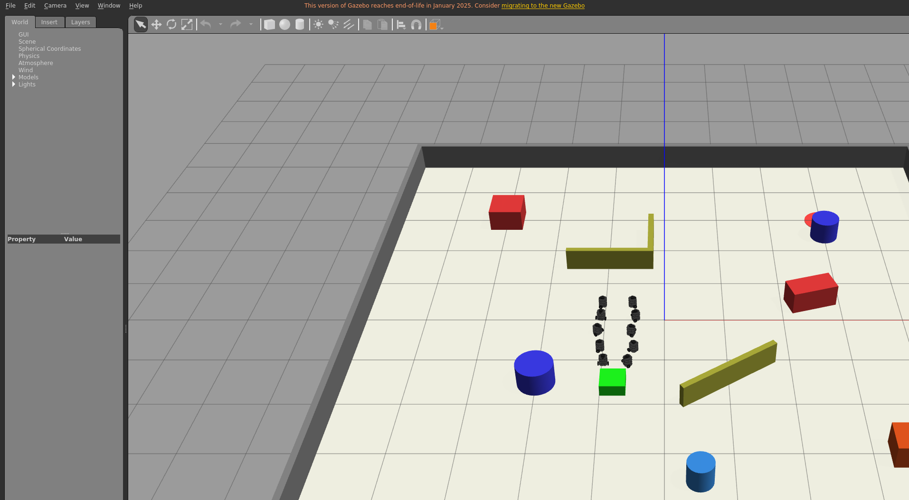

**Figura 5.** Los diez robots se aproximan al objeto y a sus posiciones de colaboración.

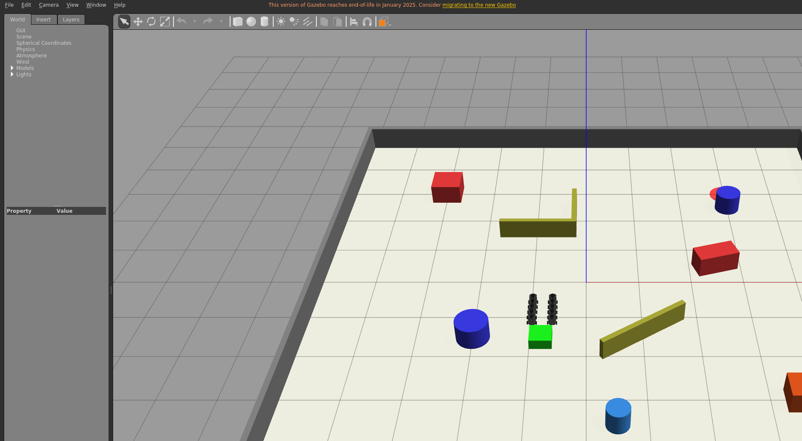

**Figura 6.** Dos robots mantienen contacto directo con la caja y ocho compañeros forman dos cadenas balanceadas. Los diez aportan fuerza en el mismo intervalo.

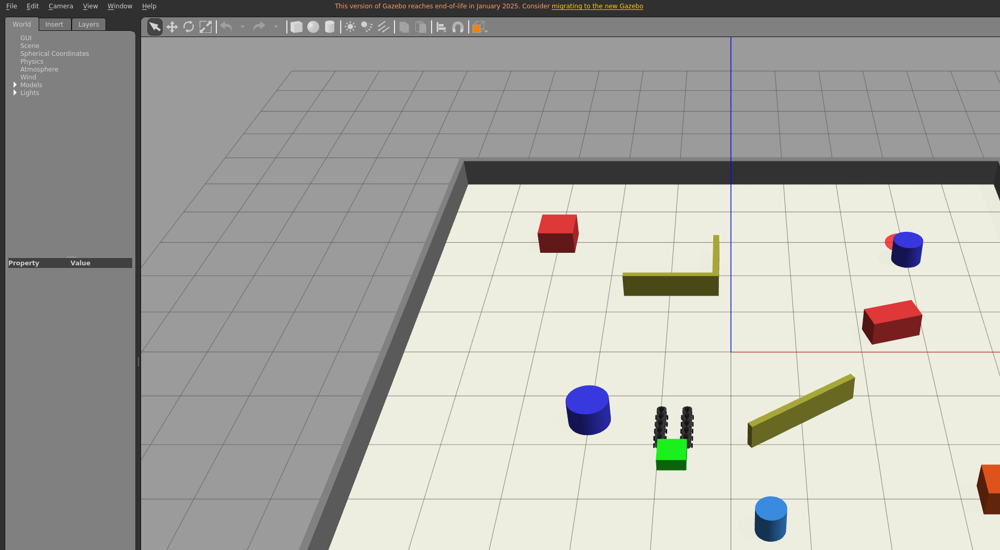

**Figura 7.** Instantánea posterior del mismo empuje. La continuidad no se deduce de una sola imagen: se contrasta con la serie temporal y los 175 lotes GRF del resultado estructurado.

### 6.2 Reducción de la superficie administrativa

El servicio VNC se conserva únicamente para administración y diagnóstico del host. Los sockets 5901 y 6080 pasaron de escuchar en la LAN a escuchar solamente en `127.0.0.1`. El túnel de Cloudflare continuó operativo, mientras que su token dejó de aparecer en la línea de comandos del proceso y se trasladó a un archivo de entorno propiedad de `root`, con permisos `0600`.

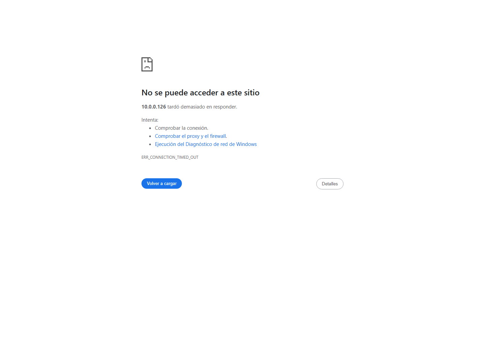

**Figura 8.** Intento desde la LAN a `http://10.0.0.126:6080` después del cambio: el puerto ya no acepta una conexión directa. El acceso administrativo exige el canal autorizado. La [salida `ss` conservada](assets/commissioning-2026-07/vnc-bind-after.txt) confirma que 5901 y 6080 escuchan en loopback; la captura documenta el efecto observado desde otro equipo.

### 6.3 Búsqueda distribuida, descubrimiento y aviso

La búsqueda distante se ensayó por separado para obtener suficientes muestras antes del descubrimiento. Así se evitó aceptar la propiedad «todos buscan» a partir de un caso donde el objeto apareciera demasiado cerca del despliegue inicial.

En la ejecución aceptada se registraron 905 muestras. Los diez robots mantuvieron comandos de movimiento en el 100 % de sus muestras y recorrieron individualmente entre 6.7981 m y 10.1385 m. `tb3_1` encontró el objeto y emitió un único evento `payload_found`; la notificación incluyó a los otros nueve robots, se recibieron diez confirmaciones totales y los nueve compañeros iniciaron la maniobra `APPROACH`. Cuatro de ellos giraron o se alejaron brevemente mientras actuaba el evitador, por lo que no se afirma progreso radial inmediato para cada robot. Después del aviso se observaron 16 muestras de movimiento por compañero y el contador de colisiones no aumentó.

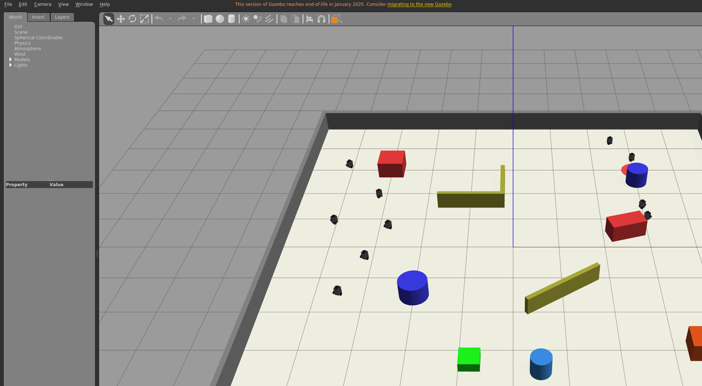

**Figura 9.** Los diez TurtleBot3 Burger recorren regiones distintas del entorno durante la fase `SEARCH`.

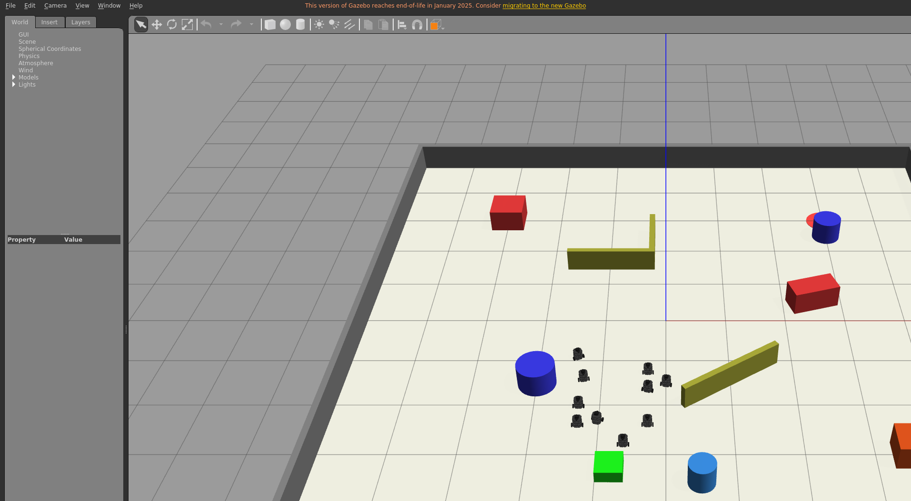

**Figura 10.** Tras el evento del robot descubridor, los nueve compañeros responden y cambian simultáneamente de `SEARCH` a la maniobra `APPROACH`; el evitador determina su giro inicial.

### 6.4 Verificación del plano de control y del visor antes del despliegue

La revisión local del candidato cerró con 179 pruebas de backend, 119 del trabajador, 362 del paquete ROS y 79 de frontend. También aprobaron la migración idempotente, Docker Compose v2.6.0, Actionlint sin integrar ShellCheck, la unicidad estricta de claves YAML, la sintaxis Bash y Python, el publicador, el despliegue/rollback y `git diff --check`. Los 27 archivos JavaScript modificados no presentan errores de lint y el build de producción compiló. El lint indiscriminado de todo `src` conserva 211 errores heredados en módulos fuera del alcance; se registra como deuda previa y no se transforma en un falso resultado positivo. La comprobación global de formato .NET también conserva deuda heredada, mientras los seis archivos C# de la última corrección están limpios. Se conserva un [corte local previo a CI #33](assets/commissioning-2026-07/predeploy-validation-summary.txt); GitHub Actions fue la fuente autoritativa sobre los SHA publicados y CI #33/#34 aprobaron.

La sonda multimedia utilizó el mismo digest de MediaMTX 1.18.2 previsto para producción. Publicó una señal H.264 por RTSP, leyó el flujo autorizado, rechazó tanto el token de publicación usado como lector como un lease aplicado a otra sesión, y descargó la lista principal, la lista de video, el MP4 de inicialización y una parte LL-HLS. Estos resultados justificaron el primer despliegue con los gates apagados. Los tres gates se activaron después de comprobar el orden backend→worker como una ventana de comisionamiento supervisada, no como habilitación general ni aceptación concluida. Permanecieron activos para localizar I-027–I-030 y continuar la prueba pública; si la aceptación de la sección 7 vuelve a rechazarse o se abandona la ventana, deberán regresar juntos a `false`. Su estado activo, por sí solo, no demuestra la experiencia de dos usuarios.

### 6.5 Último despliegue inmutable antes del candidato actual

La revisión del backend no coincidía deliberadamente con la del trabajador GPU. El cambio `d33eed4` afectaba únicamente la creación concurrente de sesiones en el backend; por ello no se reconstruyó una imagen ROS idéntica en contenido. Antes de preparar el candidato local, el último inventario completamente asociado a CI era el siguiente:

| Componente | Artefacto activo | Comprobación |
| --- | --- | --- |
| Backend | `swarmbackend:d33eed4351a0f407527536c2a62165cd3cfc13b5` | `healthy`, cero reinicios; despliegue `29694250759` |
| Trabajador GPU | Release `62a136a08b4955ea45a58447a87b6518301418fe` | `systemd --user` activo, cero reinicios y publicador de escena disponible |
| ROS/Gazebo | `sha256:8005ae446fa925d961120ce3470ff0c459075fae9749e498e879f77d0a25905a` | Imagen inmutable aceptada por sonda NVIDIA en `29692887445` |
| MediaMTX | Imagen fijada por digest y contenedor `media_prod` | Contenedor sano; origen accesible únicamente por la ruta prevista |

Las variables efectivas del backend mostraban activos `Tasks__RequireCollaborativeTransportEvidence`, `Viewer__HlsProxyEnabled` y `Viewer__WorkerPublishingEnabled`. La consulta de capacidades informaba soporte GPU, fuente `Scene`, publicación H.264 y un máximo de diez robots y tres sesiones concurrentes. Estas comprobaciones demuestran configuración y disponibilidad, pero no sustituyen la repetición visible y concurrente de la sección 7.

La ruta pública `/health` responde correctamente. En cambio, `/swagger/index.html` responde HTTP 404 de forma intencional: Swagger es el explorador interactivo de la API para desarrollo y no se expone en producción. El 404 no representa un fallo del backend ni impide que el frontend utilice sus rutas autenticadas.

### 6.6 Base integrada por el PR #99 y worker pendiente del candidato definitivo

Las correcciones posteriores se publicaron inicialmente como `f3929bb8da7601264be51b84bf706babe86b7940` en el PR #99, basado en `d33eed4351a0f407527536c2a62165cd3cfc13b5`. Después de I-051 e I-052, el contenido quedó en el SHA limpio `9c0dc0598cd225278e71f924cf30fc1748697370`. CI #33 aprobó ese SHA, el merge produjo `bbc7c4611d6d3284c08da1fd2b713afafe641f40` y CI #34 volvió a aprobar backend, frontend, worker, publicador, ROS e imagen ROS sobre `main`. Cloudflare publicó el frontend y, tras recuperarse I-053, la ejecución autohospedada original desplegó el backend de esa misma base. El worker GPU conserva el release `62a136a`; no se lo actualizó de manera intermedia porque el siguiente despliegue debe utilizar el SHA definitivo del delta y mantener el orden backend→worker.

| Aspecto | Antes del hotfix | Después observado | Alcance de la evidencia |
| --- | --- | --- | --- |
| Lease concurrente | Una cancelación `40001` anidada podía terminar en 409 | 26/26 solicitudes concurrentes terminaron en 201; 26 leases y 26 comandos únicos | PostgreSQL real; 13 rondas |
| Caducidad | La fracción de siete dígitos de .NET era incompatible con Python 3.8 | La fecha se normaliza a microsegundos y conserva la zona UTC | Pruebas dirigidas del parser |
| Captura de escena | FFmpeg por TCP produjo tres fotogramas y se detuvo | `gzclient` corre en el host, aislado por `bubblewrap`, y X11 acepta solo Unix | Smoke del publicador: H.264 1280×720@30 |
| Render visible | El sidecar dibujaba 3.684 FPS con `llvmpipe` | D3D12/RTX 3080, 49.785 FPS de render y RTF 2.975 | Sonda física local con límite 50 |
| Entrada interactiva | Una pérdida de foco o de Hub podía dejar estado XTest | Cola fail-closed, gate por publicador, reintento coalescido y reaping del grupo | I-048; worker 119/119 y frontend 79/79 |
| Control backend | Dos conexiones multiplicaban la cuota y un grant revocado sobrevivía | Control único, cuota compartida, valla transaccional y liberación recuperable | I-049; backend 179/179 |
| Recursos de Gazebo | 512 tareas permitían un roster completo seguido de la muerte de `gzserver` | 1024 tareas y comprobación nueva de modelos más reloj antes de `Ready` | Sesión N=10 y suite completa del trabajador |

El frontend de esta base ya fue confirmado por el check de Cloudflare y el backend terminó sano mediante la ejecución original recuperada en I-053. Aun así, esas publicaciones no demuestran dos visores visibles a la vez ni aislamiento cruzado desde Chrome. Además, la auditoría posterior produjo el delta descrito en 6.8. En consecuencia, el worker no debe recibir de forma intermedia `bbc7c46`: debe saltar directamente al SHA definitivo del delta, después de desplegar primero ese mismo SHA en el backend.

### 6.7 Resumen de cambios por capa

| Capa | Cambio principal | Forma de verificación previa |
| --- | --- | --- |
| Frontend | Reproductor privado amplio, fullscreen, interacción recuperable, flujo guiado de sesión/tareas y administración comprensible de cuentas | 79/79 pruebas, lint de 27 archivos, build, CI #33/#34 y bundle público; captura visible pendiente |
| Backend | Proxy LL-HLS, control exclusivo por lease, cuota compartida, vallas precommit, reconciliación DB, monitor de resultados y reintento serializable | 179/179 pruebas y 13 rondas previas contra PostgreSQL real |
| Trabajador GPU | Publicador por display privado del host, parser compatible, entrada fail-closed, anuncio de capacidades y comprobación de Gazebo | 119/119 pruebas, smoke GPU completo y limpieza sin residuos |
| ROS | Búsqueda distribuida, aviso, roster y contribución útil adaptativos para transporte, además de formación y líder | 362/362 pruebas y simulaciones visibles N=10 |
| Infraestructura | MediaMTX por digest, X11 Unix, despliegues serializados, revalidación de SHA, `KillMode` y rollback inmutable | Compose, Actionlint, YAML, publicador y despliegue/rollback locales |

### 6.8 Delta integrado por el PR #100 y brecha histórica del worker

El commit `efdec9786fd4d5d4825704188e3eece4fc551250` añadió la parte administrativa y operacional de I-055–I-062 sobre `bbc7c46`; PR #100 lo integró como `baba2c1fb4bc73dcd96254a7ab63a16175e6bce9`. GitHub Actions, Cloudflare y el backend aprobaron esa revisión. La siguiente tabla conserva la comprobación funcional disponible y separa lo que todavía debe observarse desde el navegador. El worker no activó `baba2c1`: I-063 bloqueó el cambio antes del switch y restauró `62a136a`.

| Área | Cambio local | Comprobación disponible | Comprobación que falta |
| --- | --- | --- | --- |
| Historial | `TaskRun` paginado y filtrado por propietario; `TaskLog` queda fuera de la navegación y limitado al administrador | Backend 3/3, autorización heredada 1/1 y frontend 5/5 | Dos usuarios reales, datos de producción y captura sanitizada |
| Plantillas | Catálogo administrativo limitado a `GET`/`PUT` y campos reales | Backend 9/9 y frontend 5/5 | Edición visible con cuenta administradora desplegada |
| Robots | Registro usable y mutación limitada a propietario/administrador | Backend 8/8 y frontend 7/7 | Alta/edición/desactivación pública y denegación cruzada |
| Grupos | CRUD y membresía administrativos; transferencia explícita; asignación ROS falsa retirada | Backend 5/5 y frontend 9/9 | Datos reales, confirmaciones visibles y captura |
| Visor | Revocación propia e idempotente mediante `StopViewer`, sin detener la sesión; el frontend espera el estado `Completed` | Backend 11/11, worker focal 19/19 y frontend espacio/servicio 19/19 | Worker final compatible, HLS real y verificación de que ROS continúa |
| Sesión | Monitor de robots runtime, reintento inicial SignalR y confirmación de parada | `SimulationWorkspace` 12/12 | Proxy SignalR real, estados del worker y captura visible |
| Navegación | Nombres coherentes, sección Grupos y «Usuarios» | Lint focal y compilación administrativa aprobados | Revisión visual adaptable a distintos tamaños y accesibilidad en el paquete final |

Los grupos de pruebas se solapan: por ejemplo, los 12 casos iniciales de `SimulationWorkspace` están incluidos dentro de los 39 del frontend. Por eso no se suman las filas como si fueran ensayos independientes. El corte focal agregado anterior a I-062 fue backend 31/31, worker 19/19 y frontend 39/39; la auditoría de secciones administrativas aprobó 48/48 en su propio alcance, y el cierre observable aprobó después 11/11 backend y 19/19 frontend. En la repetición integral de aquel corte aprobaron backend 213/213, worker 121/121, ROS 362/362, frontend 132/132 en 22 suites y el auxiliar del publicador. CI del PR #100 y CI sobre `main` aprobaron; la corrección I-063, entonces pendiente, se integró y desplegó después como se registra en 6.9.

### 6.9 Base histórica del PR #101 y candidato que siguió a su aceptación

En el cierre de I-063 dejó de existir la brecha de versiones: frontend, backend y worker ejecutaban `538ba0660c3a070cd600d1b224dc89ec1dd1dbe7`. El worker activo anunció la imagen `538ba066…+9ff6fa1349e6`, el contenedor de backend quedó `healthy` con el mismo SHA y `rs.zerav.la` respondió HTTP 200. Esta alineación permitió ensayar la cadena real y encontrar I-064 e I-065, problemas que no aparecían en las pruebas directas del shell ni en las suites unitarias. El preflight read-only posterior de I-090 observó `1182dec` en backend; como no inspeccionó las tres capas, el documento no extrapola de esa consulta una alineación actual.

El candidato posterior reunió la unidad versionada con AF_NETLINK; el reintento y el orden causal de las mutaciones; los arneses visibles de Control y de las demás secciones; el endurecimiento de búsqueda/carga; la unificación visual; la limpieza fail-closed; y el invariante de cuentas. La suite completa de backend sin PostgreSQL configurado aprobó 250 pruebas y omitió las 8 opt-in, para 258 casos descubiertos; el filtro no-PostgreSQL confirmó 250/250, las focales de cuentas 23/23 y PostgreSQL 17.10 aprobó 8/8. Worker aprobó 124/124, ROS 427/427 y frontend 149/149 en 28 suites. Los siete arneses offline aprobaron entonces 193/193 contratos, desglosados como 16+38+13+44+37+30+15. También aprobaron `py_compile` sobre 14 módulos, sintaxis Bash, lint sobre 75 archivos, build de producción y `git diff --check`. El snapshot de Entity Framework conservó `SimulationSession.Revision` como token de concurrencia y el probe no generó una migración efectiva. I-087 conserva su corte histórico de 191 contratos y ROS 416. Estos datos describen el predeploy de aquel momento; el código se integró después mediante los PR #102 y #103. El recuento 193/193 no representa el árbol local actual.

I-088 añadió entonces el mínimo de 0,015 m por robot durante la búsqueda del smoke web, la atribución temporal fail-closed de cada contacto y el caso contractual N=2. El flanco nace en `ObstacleAvoidance` durante la evaluación filtrada y `CollaborativeTransport` lo publica como stream v2 causal dentro del mismo `/transport/status`, incluido el terminal. El orquestador valida y copia novedades sin producir ni reinterpretar el origen. Como la carga y la cadena declarada ya se excluyen por máscara, todo contacto restante es inesperado; el atraque se acredita de forma independiente con ground-truth y GRF. En ese corte N=2 solo era contractual; I-092 registra el subresultado físico posterior y su límite gráfico.

I-089 alinea el recorrido visible con los seis rótulos canónicos y vincula su contrato a `navigationGTSConfig.js`. I-090 aplica una política común de cuentas en Create, PUT y PATCH, ordena la exclusión de recursos y lleva la unicidad canónica al esquema. I-091 fija una única frontera ASCII en C# y PostgreSQL y rechaza de forma transaccional datos históricos no soportados. El preflight de cuentas de producción fue de solo lectura y no sustituye la migración ni las pruebas postdeploy.

Sobre aquel candidato todavía no publicado, los transportes visibles N=1 y N=3 completaron las cuatro fases. N=1 avanzó la caja 0,5005 m con RTF 2,9964 y cero colisiones; su escena exacta rindió 61,888 FPS de cámara y 62,498 eventos de posrenderizado por segundo. N=3 notificó a los dos compañeros, reunió y acopló 3/3 robots y completó aproximadamente 0,5005 m a RTF ≈2,996, también sin colisiones; su sonda exacta midió 57,907/58,887 FPS. I-084 e I-085 conservan por separado los intentos descartados y los presupuestos finales. La carga N=4 v11 también quedó aceptada localmente: capacidad 0,0070/0,0340/1,0424 m, ganancia exterior 148,9143×, GRF `DONE` con 0,5002 m, 1598/1598 lotes útiles, RTF 2,9756 y 58,816/58,831 FPS concurrentes. I-086 conserva tanto los rechazos instrumentales como su corrección; I-096 aporta la atribución productiva posterior a `fbef23e`.

En ese corte, el recorrido User ya había observado Historial, permiso y navegación en el sitio público, mientras Plantillas, Robots, Grupos y Usuarios seguían pendientes de un perfil Admin temporal. I-092 registra la repetición posterior sobre `fbef23e`, que completó las seis secciones y eliminó en `finally` el único grupo efímero creado por el arnés.

### 6.10 Base productiva `fbef23e` y delta local posterior

Los PR #102–#104 llevaron el candidato anterior hasta `fbef23eaae2b1b1d5be51ad3fa03e0298239289a`. La aceptación pública ya no depende de la sobrescritura AF_NETLINK: el worker utiliza la unidad versionada. API multiusuario, dos ventanas visibles, administración y responsive aprobaron sobre esa revisión. El gate N=4 cargado también unió el mismo contenedor, masters ROS/Gazebo, display privado, lease y navegador a la ejecución física descrita en I-096.

El estado no es final porque la aceptación encontró defectos en sus propios instrumentos, un error visible de zona horaria y una carrera causal del worker. El árbol local posterior a `fbef23e` agrega compatibilidad Python 3.8, canal atómico de marcadores, diagnóstico MSE, límites y cierre demostrable del observador, clic confiable, parser UTC del frontend y el gate que preserva `Accepted → Running` mientras `StartTask` permanece activo. La política de ahorro de CI consiste en consolidar todo ese delta en un solo PR y usar un solo ciclo de Actions. Hasta entonces, los éxitos sobre `fbef23e` siguen siendo válidos como evidencia de esa base, pero no se trasladan automáticamente al próximo SHA.

El corte local previo al PR aprobó 250 pruebas de backend, con 8 casos PostgreSQL opt-in omitidos por diseño; 159 pruebas de frontend; 429 de ROS; 129 del worker; y 237 contratos distribuidos entre los siete arneses de aceptación (17 API, 47 carga N=4, 13 responsive, 60 matriz ROS, 15 secciones, 44 transporte desde la interfaz y 41 visor multiusuario). También aprobaron los builds de frontend y backend, la imagen ROS, la migración idempotente, la configuración Compose y el publicador. Esas cifras corresponden al candidato que terminó integrado por el PR #105; la sección siguiente registra el delta correctivo posterior.

### 6.11 Base productiva `9f49e17` y candidato de formación/destino

El PR #105 produjo `9f49e17435a1ddd6b93b7834b2896d57059616fe`. Frontend, backend y worker GPU anunciaron esa revisión y la aceptación base volvió a comprobar las secciones web y el visor. Antes de modificar el árbol se creó la etiqueta local anotada `rollback/pre-formation-ghost-9f49e17`, que apunta exactamente a ese commit. También permanece disponible el respaldo previo de la intervención; ninguno de los dos se utiliza como evidencia de que el candidato nuevo ya esté desplegado.

Sobre esta base se integró el delta correctivo de destino/tolerancia, telemetría del marcador, estabilización de colocación cargada, límites de diagnóstico, clasificación del timeout estable, redirecciones legacy y formación móvil. La revisión posterior incorporó fronteras fail-closed para odometría/modelos no finitos, apagado de carga, objetivos adaptativos, planes no circulares, lotes completos, estado terminal correlacionado, revalidación de escena/cadena, frescura final, snapshots unívocos y ejes Burger. El candidato de código queda integrado hasta `07da8f4`; el SHA definitivo incluirá también la documentación y los ajustes cinemático y de encuadre del marcador, y será el que deba aprobar CI. Esta descripción evita depender del número de commits, que cambia legítimamente al incorporar revisiones.

El freeze provisional anterior a I-117–I-125 aprobó frontend 164/164 en 30 suites, backend 253/253 con 8 opt-in omitidas en la ejecución ordinaria, PostgreSQL 8/8, worker 129/129, ROS 461/461 y 241/241 contratos de aceptación (17+49+13+61+44+41+16). El cierre previo de formación aprobó además 6/6 focales, 50/50 de formación/rutas/live y 1/1 de evitación; el cierre de apagado cargado obtuvo 81/81 loaded, 170/170 ROS/mundo, 16/16 frontend focales y 53/53 backend focales. Quedaron verdes el lint focal, el build de producción frontend, el publicador del visor y las pruebas de despliegue/rollback GPU. El primer build frontend terminó en `EACCES` por residuos ignorados de `build/` con otro propietario; después de corregir solo esa propiedad, la misma compilación aprobó. Un build intermedio etiquetado `robotswarm-ros:local-final-candidate` completó catkin al 100 %, con ID `sha256:db8ffda30d79e5e22e1bbfe66978faedb118bb9c43b3e25dedd161807833be14`, tamaño 4.231.139.487 bytes y fecha 2026-07-22T03:10:23Z. La revisión posterior lo descartó; aunque los P1 cerrados quedaron corregidos hasta `07da8f4`, esa imagen continúa siendo anterior y no se reutiliza.

La validación posterior se mantiene separada para no presentar una suma artificial. `511e47c` aprobó 99/99 pruebas focales de formación y 469/469 en su ejecución ROS aislada. `377a0e3` aprobó 206/206 de seguimiento+lifecycle y 473/473 en la ejecución global aislada. También aprobaron sintaxis Python 3.8 y `git diff --check`. En ese corte todavía no se habían ejecutado el freeze combinado ni la imagen nueva; ambos se describen abajo. El costo medido del planificador de formación sin ROS fue 52,39 s para 27.000 ticks, alrededor de 1,94 ms por tick; a RTF 3 se estima en 11,6 % de un núcleo. Estas cifras son evidencia local de regresión y capacidad, no comportamiento físico ni aceptación visible posterior al despliegue.

La revisión continuó después de ese corte. I-126 se verificó aislada como
`bd8575593aa24c2d3ac0a878641d0d235fbf6bbe` y se integró como `568979d`, con
40/40 pruebas de follow y 483/483 globales. I-127 se integró como `4450c13`, con
172/172 pruebas de lifecycle y 487/487 globales, además de la comprobación de
Python 3.8 y `git diff --check`. Estos son cortes aislados, no una suite
combinada. La revisión abrió después I-128–I-134 por falta de correlación de la
odometría del planificador, ventanas finales de frescura y validación incompleta
de `ModelStates`, cuaterniones y ejes de formación. El grupo quedó integrado en
`07da8f4`: la primera iteración aprobó 95/95 de seguimiento+formación y el delta
final aprobó 6/6 focales y 497/497 globales aisladas en 109,067 s, además de
Python 3.8.10 y `git diff --check`.

El freeze combinado anterior al ajuste de cámara aprobó 497/497 pruebas ROS en 109,460 s,
241/241 contratos de aceptación —17 producción, 49 carga N=4, 13 responsive, 61
matriz ROS, 44 transporte UI, 41 visor y 16 secciones— y 8/8 pruebas de física
del mundo, todos con RC=0. También quedaron verdes `py_compile` con Python
3.8.10 sobre tres controladores y sus tres tests, `git diff --check`, tres
workflows YAML, las cuatro configuraciones Compose y el escaneo de secretos. La
única coincidencia del escáner fue la URL deliberadamente inválida del fixture
negativo `WorkerOptionsValidatorTests.cs:44`; no era un secreto.

La primera imagen `robotswarm-ros:local-final-safe` completó catkin al 100 %,
con ID
`sha256:02fbd5c2302d3af0eb9e543af04bb4507292786b7155b39b54e9d294b27f4864`,
tamaño 4.231.381.324 bytes y fecha
`2026-07-22T04:42:49.782807841Z`. Este fue el artefacto exacto visible durante
las dos corridas N=4 descritas abajo. La revisión visual posterior encontró
I-135, por lo que ese ID quedó supersedido solamente por la pose de la cámara;
no se invalida la evidencia algorítmica, física o de sincronización producida
con él.

La reconstrucción posterior al ajuste conserva la etiqueta, completó catkin al
100 % y tiene ID
`sha256:e17579ed83e0c37a9ff9b03817652aeb935573b307801ddc5863d29f2a92ae0d`,
tamaño 4.231.381.706 bytes y fecha
`2026-07-22T04:53:51.679721236Z`. Esta fue la imagen local vigente de
I-128–I-135 y ahora es un antecedente. Ninguno de los dos ID constituye release,
CI, despliegue ni aceptación postdeploy.

Sobre el árbol exacto posterior a la cámara y al rebuild se repitió la suite
ROS completa: 497/497 pruebas aprobaron en 109,592 s, con `OK` y RC=0. Este es
el freeze local exacto histórico de aquella etapa; los 109,460 s permanecen
únicamente como trazabilidad del corte previo. El freeze vigente posterior se
documenta en I-140 y suma 576/576.

Las dos aceptaciones visibles N=4 terminaron `PASS` con RC=0. El perfil legado
omitió `arrival_tolerance` y aplicó 0,50 m: el objeto avanzó 0,5022 m, quedó a
0,4978 m de la meta, el RTF fue 2,9965, los cuatro robots realizaron trabajo
útil y no se registraron colisiones. Para reproducir el parámetro actual de la
interfaz sin modificar archivos del repositorio, la segunda corrida inyectó
0,25 m solamente en memoria dentro del arnés. El objeto avanzó 0,7535 m y
terminó a 0,2465 m, con RTF 2,9963, 4/4 robots útiles, fracción de contribución
simultánea 0,8707, velocidad máxima 0,1664 m/s, aceleración máxima en ventana
0,6281 m/s² y cero colisiones. `tb3_1` descubrió la carga y avisó a `tb3_0`,
`tb3_2` y `tb3_3`; el instrumento observó picos de cuatro buscadores y cuatro
robots en reunión. El marcador se publicó y confirmó en `x=-3.5`, `y=-4.0`.

El cliente visible identificó `D3D12 (NVIDIA GeForce RTX 3080)`, midió 57,182
FPS de cámara, 58,795 eventos de posrenderizado por segundo y RTF 2,997, con
viewport 990×334. La evidencia está en
`/tmp/robotswarm-local-final-visible-20260722T0444Z/`. Los SHA-256 de
`approach`, `search`, `done` y `zoomout2` son
`fa356ca8b084ee62e093f5993b1134a5b65ac2a857e492096e1906a0677c19d6`,
`d27774ed3560056919728b83dce8386a28187ba4f0e9d7234ac8959e706aff7b`,
`044573e7ca9a43d347947e51e2db6560e364006b737f4242f7c49c445ca049b4` y
`9e88ce8444111379ce740c2c7ae4fb01e20c516dcc585f5da4c4c12fe6e1e6c7`.
Estas rutas son temporales y no se presentan como evidencia productiva.

La corrida física se repitió después sobre la imagen reconstruida exacta
`e17579ed…ae0d`, sin borrar la flota durante el caso y con la misma inyección
temporal de 0,25 m. Terminó `PASS` con RC=0. El objeto avanzó 0,7523 m y quedó
a 0,2477 m del destino; el RTF fue 2,9962. Los 4/4 robots aportaron trabajo
útil y la fracción simultánea fue 0,9355. `tb3_1` encontró la carga y avisó a
`tb3_0`, `tb3_2` y `tb3_3`; el instrumento observó un máximo de cuatro robots
en búsqueda y cuatro en reunión. No hubo colisiones. La velocidad máxima fue
0,1649 m/s y la aceleración máxima en ventana fue 0,7883 m/s², inferior al
límite de 1,0 m/s². En tiempo de pared, las transiciones se observaron a
0,278 s para `SEARCH`, 39,191 s para `APPROACH`, 107,725 s para `PUSH` y
131,991 s para `DONE`. El marcador quedó publicado y sincronizado en
`x=-3.5`, `y=-4.0`.

La evidencia correlacionada vive en
`/tmp/robotswarm-local-final-camera-20260722T0454Z/`. La captura
`final-n4-search.png`, SHA-256
`d036d9814b893441f2c57be52a4ab58415339f85bfeba6055177820417211f11`,
muestra el objeto, el marcador completo y los cuatro robots buscando. El log
saneado `transport-n4-tolerance-025-final.log`, SHA-256
`3ad8ad2b65b7589f34d52f716990d8675e57cef9474d9679af9407a81612ac43`,
respalda las fases y métricas terminales. Las capturas
`final-n4-push.png` y `final-n4-done.png` se excluyeron deliberadamente: una
carrera con el `cleanup/reset` puede mostrar una escena posterior y la segunda
no conserva la pose final porque el arnés restaura la caja. No se las usa como
prueba de `PUSH`, `DONE` ni de la posición terminal.

La política conservadora se aplicó a la PR #106: los arreglos y documentos
entraron en un solo PR, los diagnósticos se resolvieron localmente y el workflow
GPU se despachó una sola vez para el SHA exacto. Antes de ese despliegue se
habían conservado dos capturas en rutas temporales:

- `/tmp/robotswarm-acceptance/ros-matrix-evidence-20260722T002735Z-3697395/14-transport_grf_n10-browser.png`, 152.356 bytes, SHA-256 `4f27a3112d536da9a734a0b4d4d1a7b10117edded00c7451a723e1ff96018ed9`, escena de transporte anterior al marcador fantasma;
- `/tmp/robotswarm-acceptance/loaded-n4-evidence-20260722T011035Z-3918620/before-loaded-probe-browser.png`, 132.964 bytes, SHA-256 `1905bea5683a3e75be4a06ef1838954389016b02004860c4c6e403125f489308`, escena previa al probe cargado correctivo.

La primera se copió después, sin modificarla, como
`final-1448a31/marcador-antes-9f49e17.png` y se emparejó con una captura
productiva real de `1448a31`. La segunda permanece temporal porque el gate
cargado todavía no se ha repetido sobre ese SHA. Ninguna imagen local se presenta
como si fuera posterior al despliegue.

La sonda cinemática inicial produjo evidencia técnica local en `/tmp/robotswarm-acceptance/corrective-local-20260722T023855Z`. Informó D3D12/RTX 3080, 58,206 FPS de cámara, 62,512 eventos de posrenderizado por segundo, RTF 2,996 y viewport 990×351; su reporte `robotswarm-corrected-ghost-gui-report.json` se conserva con permisos `0600` y SHA-256 `98a4651069f1ea8199d26d278da0b7a4df273b54b93ffaa0a9b65bfd12e1f5d5`. Sus capturas Windows/WSLg tomadas con `CopyFromScreen` quedaron congeladas o recortadas y se rechazaron. La captura local limpia N=4 se versionó con esa clasificación, y la captura productiva N=10 posterior cierra I-135 sobre el SHA público sin reutilizar la imagen local como sustituto.

## 7. Aceptación final en producción

La PR #106 y su despliegue exacto cerraron el primer bloque pendiente, pero esta
sección permanece abierta por los hallazgos I-136–I-143. Los ensayos rechazados
se conservan como diagnóstico y no se reutilizan como resultados aprobados.
`1448a31` ya demuestra API concurrente, visor privado, navegación User,
responsive, seguimiento, transporte normal y marcador. Las seis formaciones
fallaron en ese release. N=1 perdió su artefacto en el primer intento, pero la
repetición con el arnés corregido ya aprobó contra la misma imagen productiva.
Las correcciones ROS solo han aprobado localmente. Falta publicarlas en un único
SHA, desplegar exactamente su imagen y repetir las formaciones, además del gate
cargado N=4.

| Grupo de aceptación | Criterio pendiente | Estado actual |
| --- | --- | --- |
| API multiusuario | Crear simultáneamente rosters 3/7, ejecutar tareas paralelas, negar acceso cruzado, detener A sin afectar B y limpiar | **Aprobado en `1448a31`**; dos cuentas, rosters exactos, aislamiento y limpieza completa |
| Interfaz visible | Operar dos Chrome no headless, interacción, pantalla completa, cierre aislado y tareas concurrentes | **Aprobado en `1448a31`**; dos HLS privados ≈30 FPS, cero drops y ROS B sobrevivió al cierre/reapertura de su visor |
| Administración web | Probar Historial, Plantillas, Robots, Grupos y Usuarios según rol | Recorrido User y denegaciones 403 aprobados en `1448a31`. Admin no se repitió: no existe credencial bootstrap autorizada y no se creó ni elevó ninguna cuenta |
| Video privado | Comprobar flujos separados, FPS y renovación sin compartir display | Aprobado en `1448a31`; N=1 volvió a aprobar con I-139 en el arnés, 58,711 FPS NVIDIA, 30,164 FPS HLS y cleanup completo. No necesitó renovación; esa rama conserva cobertura contractual |
| Formaciones | Triángulo N=3, cuadrado N=5, A N=7, V N=8, rombo N=9 y S N=10 | Las seis filas de `1448a31` fallaron antes del gate activo. El candidato inmutable aprobó N=3/N=10 visibles, 96/96 focales y 576/576 globales; falta postdeploy de las seis |
| Seguimiento de líder | Trayectorias circular N=3, cuadrada N=6 y figura de ocho N=10 | **3/3 aprobadas en `1448a31`**, con RTF 2,9963/2,9959/2,9740 y limpieza completa |
| Transporte | GRF N=1, N=2, N=3, N=4 y N=10; para N>1, búsqueda, aviso y contribución completa | **N=1/N=2/N=3/N=4/N=10 aprobados contra `1448a31`**. N=1 utilizó I-139 en el arnés local; se repetirá sobre el SHA correctivo para no mezclar artefactos |
| Carga física y rendimiento | Mantener 0,75 kg, `mu=0.25`, RTF ≥2,90, Gazebo visible ≥45 FPS y HLS ≥27 FPS durante la carga | Aprobado sobre `fbef23e`: capacidad 0,0070/0,0354/1,0836 m, GRF 0,5001 m a RTF 2,9942, NVIDIA 58,469/62,489 FPS y HLS ≈30 FPS. El intento posterior encontró la carrera de colocación; el gate corregido debe repetirse sobre el próximo SHA |
| Limpieza | Eliminar sesiones, leases, contenedores, redes, perfiles y procesos creados por aceptación | Cada una de las catorce filas de la matriz `1448a31`, incluidas las rechazadas, informó cleanup completo; la entrega correctiva debe conservarlo |

Los valores se incorporarán con el SHA del componente, hora de ejecución, criterios de aceptación, capturas y hashes de los artefactos sanitizados. Una fila solo cambiará a «Aprobada» cuando el resultado observado y el estado estructurado coincidan.

### 7.1 Evidencias versionadas y capturas «antes y después»

Las evidencias de carga N=4 y responsive obtenidas sobre `fbef23e` están
versionadas bajo [`final-fbef23e/`](assets/commissioning-2026-07/final-fbef23e/).
La comparación del marcador anterior y productivo está bajo
[`final-1448a31/`](assets/commissioning-2026-07/final-1448a31/). Sus hashes constan
en el [manifiesto general](assets/commissioning-2026-07/checksums.sha256). El
[resumen saneado I-136–I-140](assets/commissioning-2026-07/corrective-i136-i140/README.md)
separa la imagen local exacta de la repetición N=1 contra `1448a31` y conserva
los hashes de sus reportes crudos. No se crean archivos vacíos ni montajes para
aparentar la evidencia todavía pendiente.

Antes de reservar las imágenes conviene separar la evidencia técnica que sí existe de la evidencia visual que todavía falta:

| Incidencia | Antes reproducido | Después comprobado localmente | Evidencia pendiente |
| --- | --- | --- | --- |
| I-088 | El contador agregado o una instantánea tomada por callbacks podía perder el origen temporal | Flanco sincrónico en `ObstacleAvoidance`, contexto causal de transporte, stream v2 terminal e ingestión idempotente fail-closed | Corrida y captura postdeploy; N=2 conserva solo un subresultado físico parcial |
| I-089 | El arnés esperaba rótulos anteriores | Seis nombres canónicos y contrato que lee `navigationGTSConfig.js` real | Recorrido Admin y captura responsive del bundle postdeploy |
| I-090 | React era la única frontera coherente de validación de cuenta | Validador común en Create/PUT/PATCH, exclusión ordenada e invariante `NormalizedEmail` único | Migración y CRUD visible sobre el SHA desplegado |
| I-091 | `Trim()` y `btrim()` eliminaban conjuntos distintos | Seis caracteres ASCII explícitos en C#, SQL, migración y snapshot, con regresión PostgreSQL | Repetición postdeploy de creación/duplicado sin exponer PII |
| I-094 | Chrome no llegó a solicitar HLS y el lease se vinculaba tarde | Diagnóstico MSE/SourceBuffer/AVC, estado de video y binding antes de esperar frame | Versionar una captura de startup solo si el fallo vuelve a reproducirse sobre el SHA final |
| I-095 | Dos callbacks intercalaron un marcador JSON | Escritura atómica y canal estricto separado del protocolo oficial | No requiere captura visual; conservar contratos y reporte estructurado |
| I-096 | El chequeo final rechazó un token correctamente vencido | Video correlacionado durante carga y `PUSH`; N=4 productivo aprobado; reporte y tres PNG de `fbef23e` ya versionados | Repetir el gate sobre el SHA final y conservar su nuevo reporte/capturas por separado |
| I-098 | Responsive se había verificado solo de forma local | Cuatro viewports aprobaron sobre `fbef23e`; reporte y PNG de 360/768/1366/1920 px ya versionados | Repetir los cuatro viewports si cambia el bundle y guardar la evidencia del SHA final |
| I-099 | El contador mostraba ≈244 min para un lease de 5 min | Parser UTC probado localmente | Captura «después» postdeploy con contador cercano a cinco minutos y caducidad efectiva coherente |
| I-100 | El sondeo ROS podía persistir `Running` antes del `Accepted` del comando | Gate vivo antes/después de la lectura y regresión concurrente discovery/tracked | Repetir el smoke React N=4 sobre el worker final y observar `Accepted → Running → Completed` |
| I-101 | Un JSON gráfico antiguo podía conservar un PID aparente | Hash, PID y tick atestados por el preflight y ligados al `gzclient` vivo | Repetir la sonda NVIDIA sobre el SHA final y conservar su atestación saneada |
| I-102 | `wait ... || true` ocultaba el estado o salida prematura del monitor N=4 | Estado real, jobspec estable y cleanup privado cubiertos por contratos | Ejercer el supervisor corregido en el gate cargado postdeploy |
| I-103 | La aplicación compartía el global que guardaba la prueba `isTrusted` | Listener y evidencia en un mundo CDP aislado, con una sola entrada física | Repetir el clic de transporte desde React sobre el bundle final |
| I-104 | Un PID podía reciclarse entre la revalidación y `os.kill` | Señalización por `pidfd`, segunda validación y fallo cerrado sin fallback | Confirmar cleanup completo durante la matriz final del host GPU |
| I-105 | La marca visible todavía mezclaba FUSE/React y el símbolo SVG nuevo | PNG histórico exacto, splash con contraste, barra autenticada y 159/159 pruebas | Desplegado y visible en `1448a31`; derivados PWA cuadrados quedan como mejora separada |
| I-106 | Las formaciones terminaban antes de la muestra activa | Centro anclado y detenido hasta asentamiento; protocolo del fallo conservado | Seis corridas visibles postdeploy en N=3/5/7/8/9/10 |
| I-107 | Solo se validaba la pose inicial y el snapshot podía quedar obsoleto | Órbita rígida completa, rutas por lotes y doble revalidación de modelos vivos | Captura y reporte de cada órbita sobre el SHA desplegado |
| I-108 | Algunos límites de pared eran menores que el tiempo simulado necesario | Presupuestos por caso calculados a RTF 2,7 con al menos 15 s simulados de margen | Confirmar RTF ≥2,90 y terminación dentro del presupuesto postdeploy |
| I-109 | Gazebo entrelazaba borrar, crear y posicionar la carga | Generaciones, ausencia fresca, dos presencias estables y hasta tres reemplazos justificados | Repetir carga N=4 visible sobre el candidato desplegado |
| I-110 | El diagnóstico de colocación crecía y retenía respuestas crudas | Máximo 16 eventos saneados, conteo y truncamiento | No requiere captura; conservar el reporte estructurado si vuelve a fallar |
| I-111 | El espectador no veía la meta y 0,50 m parecía un límite físico | Marcador magenta sin colisión, telemetría permitida y tolerancia UI 0,25 m | Cerrada en `1448a31`: comparación antes/después versionada y N=4 local recorrió 0,7523 m sin cambiar física |
| I-112 | Dos URLs abrían pantallas ligadas a APIs inexistentes | Redirecciones a Plantillas e Historial, sin montar componentes legacy | Redirecciones y seis secciones User recorridas en el bundle `1448a31` |
| I-113 | Cachés y residuos locales produjeron falsos fallos de herramientas | Cachés temporales controladas y propiedad corregida solo en `build/` ignorado | Freeze, CI único de PR #106 y CI de main aprobados |
| I-114 | `ModelStates` movía un marcador estático sin refrescar el render | Modelo cinemático sin gravedad/colisión y preflight D3D12 visible | Captura productiva limpia versionada; `CopyFromScreen` congelado/recortado permanece descartado |
| I-115 | `NaN`/`Inf` podía atravesar la formación en `MOVING` | Validación total continua, fallo terminal, cancelación de solver y velocidad cero | Repetir las seis formaciones visibles sobre el SHA desplegado |
| I-116 | La recuperación cargada podía tocar Gazebo durante shutdown | Guardas antes y entre delete/spawn/set/clasificación; sin reintento al cerrar | Repetir N=4 cargado visible y comprobar limpieza sin modelo tardío |
| I-117 | Adaptive comprobaba el slot previo y no siempre el objetivo deformado | Objetivo efectivo revalidado antes del lote; `511e47c`, formación 99/99 y 469/469 aisladas | Repetir adaptive visible sobre el SHA desplegado |
| I-118 | Lineal/waypoints podía llegar con `placement_plan=None` | Plan vivo para caminos abiertos y espera sin plan limitada a stop sin asignaciones | Repetir ambos caminos en la matriz final |
| I-119 | Formación/seguimiento/transporte no compartían una guarda finita final | Seis componentes, ejes y límites Burger validados antes del lote | Freeze e imagen local aprobados; falta inyección visible/estructurada postdeploy |
| I-120 | Seguimiento refrescaba timestamp con odometría no finita | Pose, cuaternión y tiempo se actualizan atómicamente; `377a0e3`, 206/206 y 473/473 aisladas | Repetir seguimiento visible sobre el SHA desplegado |
| I-121 | Una excepción podía omitir el terminal correlacionado | Stop y `FAILED` conservan tarea/época; parada normal sigue separada | Comprobar terminal exterior en la matriz final |
| I-122 | Un comando válido podía escapar antes del miembro inválido | Barrera de lote completa en SEARCH/APPROACH/PUSH | Confirmar cero movimiento parcial ante fallo inducido |
| I-123 | `ModelStates` truncado mezclaba pose vieja y timestamp fresco | Instantánea atómica, frescura invalidada y terminal correlacionado | Regresión local aprobada; falta carga visible postdeploy |
| I-124 | Cuaternión crudo `Inf` podía convertirse en yaw finito | Cuatro componentes validados antes de conversión y commit | Regresión incluida en el freeze 497/497 |
| I-125 | Buffer temporal de APPROACH sobrevivía a una excepción | Limpieza mediante `finally` y finalizador de emergencia conservado | Verificar cleanup completo postdeploy |
| I-126 | Follow podía confirmar un plan calculado sobre obstáculos ya movidos | `568979d`: revalidación optimista de vuelta+ruta, doble correlación y tolerancia a jitter; 40/40 y 483/483 | Seguimiento visible 3/3 aprobado en `1448a31` |
| I-127 | Transporte comprobaba frescura al entrar, no antes del publish | `4450c13`: gate final ModelStates+odom, lote bajo lock, directos protegidos y ceros stale permitidos; 172/172 y 487/487 | Transporte visible N=2/N=3/N=4/N=10 aprobado en `1448a31` |
| I-128 | Follow correlacionaba obstáculos, no la odometría usada por el planner | `07da8f4`: doble correlación de positions+yaws y descarte/replan en cero | Freeze 497/497 aprobado; repetir seguimiento visible |
| I-129 | Formación podía agotar frescura tras el preflight | `07da8f4`: gate literal después de geometría, terminal correlacionado | Freeze 497/497 aprobado; repetir formación visible |
| I-130 | Follow podía publicar después del timeout | `07da8f4`: gate final de escena+odom y lote atómico | Freeze 497/497 aprobado; repetir seguimiento visible |
| I-131 | ModelStates truncado podía convertirse en escena vacía | `07da8f4`: invalidación persistente, filtro por mundo activo y recuperación completa | Freeze aprobado; repetir formación visible |
| I-132 | Cuaternión crudo Inf producía yaw finito | `07da8f4`: cuatro componentes validados antes de conversión/commit en modelo y odom | Regresión incluida en el freeze 497/497 |
| I-133 | Formación aceptaba ejes no holonómicos | `07da8f4`: rechazo explícito de `linear.y/z` y `angular.x/y` | Regresión incluida en el freeze 497/497 |
| I-134 | ModelStates admitía nombres configurados duplicados | `07da8f4`: duplicado fail-closed en formation/follow/transport y recuperación unívoca | Freeze e imagen local aprobados; falta postdeploy |
| I-135 | La cámara predeterminada recortaba el marcador cerca de `y=-4` | Pose ampliada a `0 -14.4 12 0 0.72 1.5708` y contrato fijado en el test del mundo | Cerrada en `1448a31`: cuatro esquinas locales y captura productiva N=10 con marcador completo |
| 2026-07-22 | PR #106, CI y despliegue coordinado | Merge `1448a31…d9dda`; frontend, backend e imagen GPU exacta publicados | Marcador productivo y servicios públicos comprobados; tag de retorno `rollback/pre-formation-ghost-9f49e17` conservado |
| 2026-07-22 | Aceptación posterior a PR #106 | API y dos Chrome visibles aprobaron; follow 3/3 y transporte 4/5 filas en el primer corte | Las seis formaciones y la primera evidencia N=1 se rechazaron y abrieron I-136–I-139; toda limpieza terminó |
| I-136 | Solver ejecutado dentro del último callback de odometría | Worker coalescente, generaciones y primera muestra posterior al inicio | Formación 96/96, ROS global 576/576 y N=3/N=10 exactos; falta postdeploy |
| I-137 | Evasión podía superar la envolvente angular del controlador | Límites OA/propietario/Burger intersectados; parámetros inválidos bloquean ambos ejes | Regresiones focales y N=10 local sin rechazo de comando |
| I-138 | Poses cambiaban hasta 0,139 m durante el solver | Correlación posición/yaw y hasta dos replans en cero; churn/contacto fallan cerrados | Imagen exacta: N=3/N=10, errores 0,0921/0,0974 m, RTF 2,9965/2,9875 y cero colisiones |
| I-139 | El lease N=1 retiraba el render-report antes de su lectura tardía | Preservación inmediata atestada, polling de cierre y ownership fail-closed de la renovación | Contratos 73/73 y repetición productiva N=1 `DONE`, 0,5013 m, 58,711 FPS, HLS 30,164 FPS y cleanup completo; no necesitó renovación |
| I-140 | Las rutas de parada podían ignorar publishers bloqueados o carreras start/stop | Lanes prearrancados por publisher, ACK después del retorno real de cero, fan-out acotado, commit post-shutdown y tombstones de cancelación en los tres comportamientos | Formación 96/96, lifecycle 205/205, follow 47/47, global 576/576 y revisión independiente sin P0/P1; falta postdeploy |
| I-141 | La planificación N=10 se confundía con un heartbeat perdido y el asentamiento normal agotaba replans | Status `forming` previo, gracia proporcional solo sin asignaciones y tolerancia acotada 0,08 m/0,10 rad con revalidación completa | Formación 103/103, lifecycle 235/235, global 624/624; S N=10 visible 75,0004 s, error 0,0952 m, RTF 2,9851 y cero colisiones; falta postdeploy |
| I-142 | El arnés confundía una figura ya satisfecha, un seek HLS y el repintado post-fullscreen con fallos | Separación de aceptación 1,3 m, regresión HLS informada sin restar avance y espera de toolbar acotada a 5 s | API y responsive aprobados; dos Chrome visibles ~30 FPS, entrada, fullscreen, concurrencia, reapertura y aislamiento de parada; cleanup completo |
| I-143 | Un robot podía quedar dentro de la histéresis segura pero fuera del umbral estricto y retener indefinidamente los lotes siguientes | Liberación de corredor separada de la convergencia final; la primera usa 0,14 m y la aceptación conserva 0,12 m | Antes rechazado: 4 robots esperando y error 3,7458 m; después aprobado: S/N=10, 0,0936 m, RTF 2,9912, cero colisiones |
| I-144 | Tres presupuestos históricos terminaban rutas sanas antes de su ventana activa | Presupuesto de ensamblaje 90 s para cuadrado, V y diamante; yaw de asentamiento 0,15 rad para la huella circular | PR #108; las seis filas postdeploy de `e3dc7ad` superaron el gate de arranque y cinco aprobaron ROS |
| I-145 | Una intermitencia DNS agotaba el POST inicial de adquisición del lease | Tres intentos solo ante error de transporte, sin reintentar respuestas HTTP ni mutar antes del lease | PR #109 y despliegue GPU `30055847809` aprobados |
| I-146 | El frontend esperaba 30 s frente a un arranque HLS real cercano a 28 s | Ventana acotada de 60 s y preservación del protocolo ROS al fallar antes del muestreo | PR #110; seis inicios HLS postdeploy y cinco filas aceptadas a ≈30 FPS |
| I-147 | Un miembro fuera de la histéresis podía dejar lotes posteriores detenidos aun después de despejar el corredor | Grafo por spawns/slots, corredores restantes desde poses vivas, liberación concurrente sin cruces y fallback 0,20 m/20 s | Rechazos `e3dc7ad`, `917b06b` y `2193c3d` preservados; tercer candidato 3/3 visible y 631/631 local, pendiente de integración y postdeploy |
| I-148 | El presupuesto S/N=10 cubría 229,5 s simulados, menos que una colocación productiva todavía sana a 252,816 s | Envolvente exclusiva S/N=10 de 120 s; todos los gates físicos permanecen iguales | Rechazo `ec4980b` preservado; repetición exacta pendiente |
| 2026-07-22 | Freeze correctivo exacto | Imagen `6f1af927…4cb5` sin fuentes montadas, N=3/N=10 visibles con D3D12/NVIDIA | 58,493/57,507 FPS, 75 s activos, cero colisiones; resumen saneado versionado |

El preflight textual de I-090 es una evidencia «antes» de solo lectura sobre la base existente; no se presenta como captura ni como sustituto del CRUD visible. No se generó una PNG dedicada para I-088–I-091. Las capturas históricas de las Figuras 1–10 permanecen sin cambios.

| Figura reservada | Estado «antes» que debe mostrar | Estado «después» que debe mostrar | Situación |
| --- | --- | --- | --- |
| Figura 11 | Error del visor observado por el usuario, con datos privados recortados | La misma vista con estado «En vivo» y FPS | La escena visible de carga ya está versionada; falta la comparación final del visor posterior al despliegue |
| Figura 12 | Formulario de acceso heredado | Nuevo login de RobotSwarm, error legible y control para mostrar contraseña | Frontend desplegado; captura pendiente |
| Figura 13 | Lista de cuentas sin estado ni acciones claras | Filtros, cuentas activas/inactivas y diálogo de creación/edición | Frontend desplegado; captura pendiente |
| Figura 14 | Espacio de simulación sin jerarquía operacional | Etapas sesión→visor→tarea y resultado terminal visible | Flujo integral observado sobre `fbef23e`; falta seleccionar y versionar la captura |
| Figura 15 | Una sola vista o un escritorio compartido | Dos ventanas Chrome reales con sesiones y flujos privados diferentes | Aceptación concurrente aprobada; PNG temporal pendiente de saneamiento y versionado |
| Figuras 16–18 | Escena previa a cada tarea | Formación, seguimiento y transporte final ejecutados desde el frontend | Pendientes de la matriz ROS |
| Figura 19 | Historial heredado vacío o basado en `TaskLog`, sin exponer datos privados | Historial `TaskRun` del propietario, con filtros, resultado y diálogo de detalle | Capturado durante los recorridos User/Admin; falta versión permanente |
| Figura 20 | «Tareas» con crear/eliminar o campos que no corresponden al backend | «Plantillas de tareas» con catálogo real y edición `GET`/`PUT` de administrador | Captura Admin temporal sobre `fbef23e`; falta versionarla |
| Figura 21 | Lista heredada de robots sin estados de carga/error ni separación de runtime | Registro persistente con búsqueda, estados, alta, edición y desactivación | Captura Admin temporal sobre `fbef23e`; falta versionarla |
| Figura 22 | Ausencia de una gestión clara de grupos o acción que aparentaba iniciar ROS | Grupos administrativos con membresía, transferencia confirmada y aviso de alcance | Capturas Admin y grupo efímero temporales; falta versionarlas |
| Figura 23 | Sesión sin detalle individual de las instancias `tb3_*` | Monitor runtime con rol, namespace, estado, actualización y resumen operativo | Observado en Control; falta seleccionar la captura final |
| Figura 24 | Visor sin cierre independiente y parada de sesión inmediata | Botón «Cerrar visor», estado posterior sin stream y evidencia de que ROS continúa | Operación aprobada en la corrida concurrente; PNG temporal pendiente |
| Figura 25 | Menú con nombres heredados «Tareas»/«Cuentas» y sin Grupos | Navegación completa y adaptación a 360/768/1366/1920 px | Las cuatro capturas responsive de `fbef23e` ya están versionadas; falta la repetición del bundle final |
| Figura 26 | Contador productivo de ≈244 min para un lease de 5 min | Contador corregido cercano a cinco minutos y expiración efectiva | «Antes» disponible en captura temporal; «después» pendiente del próximo despliegue |
| Figura 27 | Transporte sin indicación gráfica del destino | Huella y caja fantasma magenta visibles, con estado sincronizado en el panel | Comparación saneada y permanente bajo `assets/commissioning-2026-07/final-1448a31/`; la imagen «después» pertenece al postdeploy `1448a31`. Las capturas `CopyFromScreen` y las PNG ambiguas de push/done permanecen rechazadas |

La base cargada histórica se conserva en
`docs/assets/commissioning-2026-07/final-fbef23e/` y la comparación productiva
del marcador en `docs/assets/commissioning-2026-07/final-1448a31/`. Cada archivo
nuevo se inspecciona para retirar correos, UUID, tokens, rutas personales y URL
internas, y se añade al manifiesto de hashes. El texto indica SHA y criterio;
una captura aislada no sustituye las series temporales de movimiento.

## 8. Limitaciones y trabajo futuro

- ROS Noetic llegó al final de soporte el 31 de mayo de 2025 y Gazebo Classic en enero de 2025. El contenedor fija el entorno actual para reproducibilidad, pero la migración a ROS 2 y Gazebo moderno sigue siendo necesaria.
- El TurtleBot3 Burger utilizado no incorpora una cámara compatible en su modelo actual; el visor entrega la escena privada de Gazebo, no una cámara a bordo del robot.
- LL-HLS evita exponer ICE/UDP y TURN, pero añade latencia y hace pasar el video por el backend. Dos flujos concurrentes aprobaron; la capacidad para más sesiones y el costo de ancho de banda todavía no se han caracterizado.
- `npm audit` informa 99 avisos heredados de la revisión base. El cambio de visor no incrementó esa cifra ni añadió un hallazgo para `hls.js`, pero la actualización de dependencias antiguas requiere un trabajo separado y pruebas de regresión de la interfaz.
- Las matrices de figuras, trayectorias y cantidades son muestras representativas; no constituyen una prueba exhaustiva de toda combinación posible de mapa y parámetros.
- El gate de modelos y reloj evita aceptar una muerte durante aprovisionamiento o cambio de flota. Una muerte posterior a `Ready` todavía necesita un monitor periódico con umbral, gracia de arranque y exclusión mutua con las operaciones de sesión; implementarlo sin esa coordinación introduciría carreras de limpieza.
- `538ba066`, `1182dec`, `fbef23e` y `9f49e17` son cortes históricos. La base
  productiva observada es `1448a31`, resultado de la PR #106. Las correcciones
  I-136–I-143 todavía requieren PR, CI, despliegue y aceptación sobre su SHA.
- El PNG histórico restaurado es un wordmark rectangular. Es adecuado para las superficies web verificadas, pero el manifiesto PWA todavía carece de derivados cuadrados 192×192 y 512×512; algunos sistemas pueden encuadrarlo o recortarlo al instalar. Esta mejora debe preservar el original y validarse por separado.
- La exclusividad del controlador vive en la única instancia de backend desplegada. Un despliegue horizontal necesitaría coordinación distribuida o una generación monotónica compartida antes de permitir takeover entre réplicas.
- El lint completo de la aplicación conserva 211 errores heredados en módulos no modificados. Los archivos de esta intervención están limpios, pero sanear toda la base frontend sigue siendo trabajo futuro independiente.
- El registro persistente y los grupos administrativos no son una selección de los modelos runtime. No se debe inferir que pertenecer a un grupo hará que ese robot aparezca con el mismo identificador en Gazebo; el roster de sesión informado por el worker sigue siendo la fuente viva.
- El monitor runtime muestra estado, rol, namespace y tiempo de actualización, pero el contrato todavía no transporta pose, velocidad ni diagnóstico de sensores. Tampoco aplica por sí solo una política de parada ante una muerte tardía.
- La aceptación pública de `1448a31` demuestra concurrencia, HLS, plano web,
  marcador, seguimiento y cinco tamaños de transporte normal. No demuestra
  todavía las seis formaciones corregidas ni la carga de 0,75 kg sobre el
  release final. N=1 sí aprobó después con el arnés nuevo contra esa base.
- El grafo ROS se ejecuta dentro de una red privada y se considera confiable.
  Un proceso ya comprometido en el mismo contenedor podría emitir infinitos
  IDs de solicitud de ACK mientras el publisher inverso permanece bloqueado y
  acumular callbacks de baja prioridad. No existe una ruta directa desde el
  navegador o el backend para producir esos mensajes; el endurecimiento futuro
  puede coalescer todos los ACK en un único job global.

## 9. Conclusiones

La base `1448a31` demuestra que el plano web controla sesiones ROS aisladas y
visualiza Gazebo con aceleración NVIDIA: aprobaron dos usuarios concurrentes,
cuatro anchuras responsive, dos visores privados cercanos a 30 FPS, seguimiento
N=3/N=6/N=10 y transporte N=2/N=3/N=4/N=10. El destino ya es visible mediante
la huella y la caja fantasma magenta. El recorrido normal mayor no se obtuvo
aligerando otra vez el objeto: se conservaron 0,25 kg y `mu=mu2=0.05`, y se
redujo la tolerancia de llegada a 0,25 m. El perfil académico permanece separado
en 0,75 kg y `mu=mu2=0.25`.

El cierre sigue abierto porque la aceptación posterior al despliegue encontró
defectos adicionales reales. I-136–I-138 corrigen la planificación bloqueante,
la envolvente angular y la correlación de poses; I-139 corrige la carrera entre
el TTL y el informe gráfico; I-140 hace fail-closed la publicación local de
paradas y evita reactivaciones por reordenamiento start/stop. I-141 protege la
planificación larga, I-142 endurece el arnés web e I-143 elimina un bloqueo
entre lotes sin relajar el gate final. El árbol local final aprobó 625/625
pruebas ROS y 253/253 contratos. La imagen exacta posterior
aprobó S/N=10 con RTF 2,9912, error 0,0936 m y cero colisiones; las corridas
anteriores N=3/N=10 midieron 58,493/57,507 FPS NVIDIA.
N=1 volvió a aprobar en producción con el arnés corregido: 0,5013 m, RTF 2,9962,
58,711 FPS de Gazebo, HLS 30,164 FPS y limpieza completa. La política
conservadora mantiene un solo PR correctivo y un solo despliegue GPU. Después se
repetirán las seis formaciones, N=1 sobre el nuevo artefacto, el transporte UI
normal y la carga N=4 sobre el SHA exacto. Hasta entonces, esta conclusión es
provisional y no sustituye el acta de aceptación final.

## 10. Referencias

1. P. Rezeck, R. M. Assunção y L. Chaimowicz, «Cooperative Object Transportation using Gibbs Random Fields», *IROS*, 2021. [Artículo y preprint](https://arxiv.org/abs/2109.13734); [implementación de referencia](https://github.com/rezeck/grf_transport), revisión consultada `7e89a67e88a49dfadbf1f11b342791fd3ebd4cf0`.
2. MediaMTX, [documentación oficial de HLS](https://mediamtx.org/docs/read/hls) y [autenticación mediante servidor HTTP](https://mediamtx.org/docs/features/authentication).
3. MediaMTX, [uso de `hlsCDNSecret` frente a un origen HLS](https://mediamtx.org/docs/features/scalability) y [release v1.18.2](https://github.com/bluenviron/mediamtx/releases/tag/v1.18.2).
4. Open Robotics, [fin de soporte de ROS Noetic](https://ros.org/blog/noetic-eol/) y [fin de soporte de Gazebo Classic](https://classic.gazebosim.org/).
5. GitHub, [incidente de Actions del 19–20 de julio de 2026](https://www.githubstatus.com/incidents/8vfyvq16hzh9), consultado durante la incidencia I-053.
